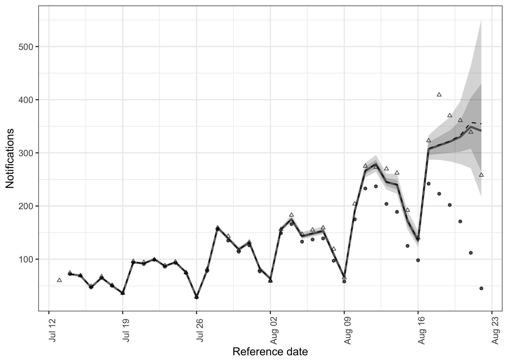
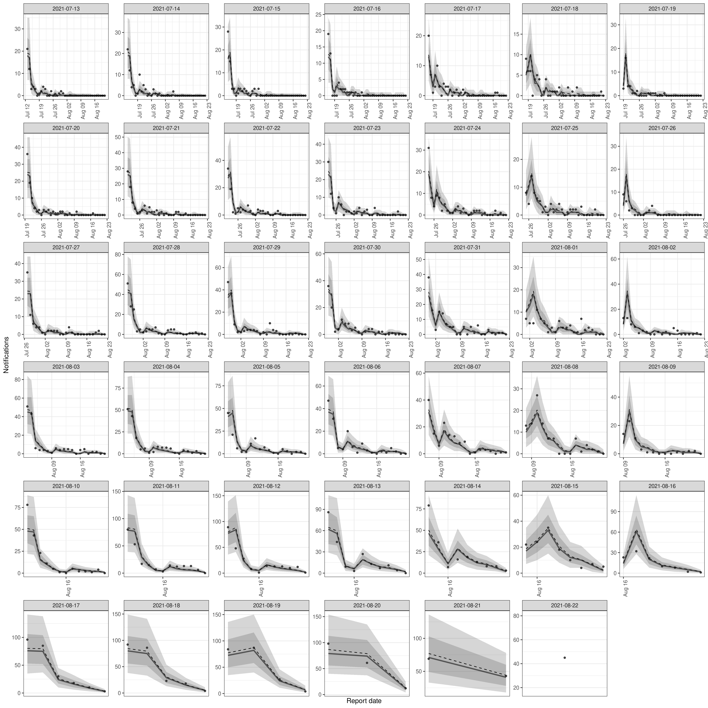
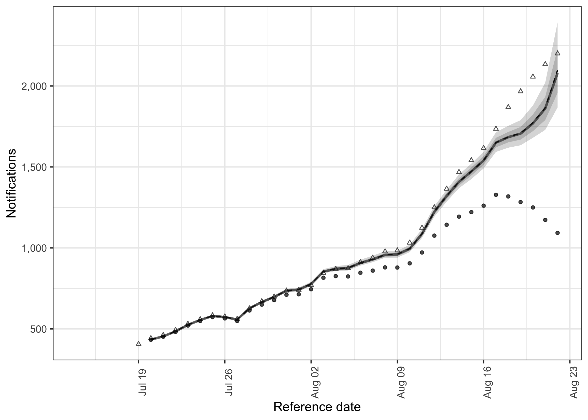

<!-- README.md is generated from README.Rmd. Please edit that file -->

# Flexible hierarchical nowcasting <a href='https://epiforecasts.io/epinowcast'></a>

[](https://www.tidyverse.org/lifecycle/#experimental)
[](https://github.com/epiforecasts/epinowcast/actions/workflows/R-CMD-check.yaml)
[](https://app.codecov.io/gh/epiforecasts/epinowcast)

[](https://epiforecasts.r-universe.dev/)
[](https://github.com/epiforecasts/epinowcast/blob/master/LICENSE.md/)
[](https://github.com/epiforecasts/epinowcast/graphs/contributors)

[](https://zenodo.org/badge/latestdoi/422611952)

Tools to enable flexible and efficient hierarchical nowcasting of
right-truncated epidemiological time-series using a semi-mechanistic
Bayesian model with support for a range of reporting and generative
processes. Nowcasting, in this context, is gaining situational awareness
using currently available observations and the reporting patterns of
historical observations. This can be useful when tracking the spread of
infectious disease in real-time: without nowcasting, changes in trends
can be obfuscated by partial reporting or their detection may be delayed
due to the use of simpler methods like truncation. While the package has
been designed with epidemiological applications in mind, it could be
applied to any set of right-truncated time-series count data.

## Installation

### Installing the package

Install the stable development version of the package with:

``` r
install.packages("epinowcast", repos = "https://epiforecasts.r-universe.dev")
```

Alternatively, install the stable development from GitHub using the
following,

``` r
remotes::install_github("epiforecasts/epinowcast", dependencies = TRUE)
```

The unstable development version can also be installed from GitHub using
the following,

``` r
remotes::install_github("epiforecasts/epinowcast@develop", dependencies = TRUE)
```

### Installing CmdStan

If you don’t already have CmdStan installed then, in addition to
installing `epinowcast`, it is also necessary to install CmdStan using
CmdStanR’s `install_cmdstan()` function to enable model fitting in
`epinowcast`. A suitable C++ toolchain is also required. Instructions
are provided in the [*Getting started with
CmdStanR*](https://mc-stan.org/cmdstanr/articles/cmdstanr.html)
vignette. See the [CmdStanR
documentation](https://mc-stan.org/cmdstanr/) for further details and
support.

``` r
cmdstanr::install_cmdstan()
```

## Quick start

In this quick start we use COVID-19 hospitalisations by date of positive
test in Germany available up to the 1st of October 2021 to demonstrate
the specification and fitting of a simple nowcasting model using
`epinowcast`. Examples using more complex models are available in the
package vignettes and in the papers linked to in the literature
vignette.

### Package

As well as `epinowcast` this quick start makes use of `data.table` and
`ggplot2` which are both installed when `epinowcast` is installed.

``` r
library(epinowcast)
library(data.table)
library(ggplot2)
```

### Data

Nowcasting is effectively the estimation of reporting patterns for
recently reported data. This requires data on these patterns for
previous observations and typically this means the time series of data
as reported on multiple consecutive days (in theory non-consecutive days
could be used but this is not yet supported in `epinowcast`). For this
quick start these data are sourced from the [Robert Koch Institute via
the Germany Nowcasting
hub](https://github.com/KITmetricslab/hospitalization-nowcast-hub/wiki/Truth-data#role-an-definition-of-the-seven-day-hospitalization-incidence)
where they are deconvolved from weekly data and days with negative
reported hospitalisations are adjusted.

Below we first filter for a snapshot of retrospective data available 40
days before the 1st of October that contains 40 days of data and then
produce the nowcast target based on the latest available
hospitalisations by date of positive test.

``` r
nat_germany_hosp <-
  germany_covid19_hosp[location == "DE"][age_group %in% "00+"] |>
  enw_filter_report_dates(latest_date = "2021-10-01")

retro_nat_germany <- nat_germany_hosp |>
  enw_filter_report_dates(remove_days = 40) |>
  enw_filter_reference_dates(include_days = 40)
retro_nat_germany
#>      reference_date location age_group confirm report_date
#>   1:     2021-07-13       DE       00+      21  2021-07-13
#>   2:     2021-07-14       DE       00+      22  2021-07-14
#>   3:     2021-07-15       DE       00+      28  2021-07-15
#>   4:     2021-07-16       DE       00+      19  2021-07-16
#>   5:     2021-07-17       DE       00+      20  2021-07-17
#>  ---                                                      
#> 857:     2021-07-14       DE       00+      72  2021-08-21
#> 858:     2021-07-15       DE       00+      69  2021-08-22
#> 859:     2021-07-13       DE       00+      59  2021-08-21
#> 860:     2021-07-14       DE       00+      72  2021-08-22
#> 861:     2021-07-13       DE       00+      59  2021-08-22
```

``` r
latest_germany_hosp <- nat_germany_hosp |>
  enw_latest_data() |>
  enw_filter_reference_dates(remove_days = 40, include_days = 40)
head(latest_germany_hosp, n = 10)
#>     reference_date location age_group confirm report_date
#>  1:     2021-07-13       DE       00+      60  2021-10-01
#>  2:     2021-07-14       DE       00+      74  2021-10-01
#>  3:     2021-07-15       DE       00+      69  2021-10-01
#>  4:     2021-07-16       DE       00+      49  2021-10-01
#>  5:     2021-07-17       DE       00+      67  2021-10-01
#>  6:     2021-07-18       DE       00+      51  2021-10-01
#>  7:     2021-07-19       DE       00+      36  2021-10-01
#>  8:     2021-07-20       DE       00+      96  2021-10-01
#>  9:     2021-07-21       DE       00+      94  2021-10-01
#> 10:     2021-07-22       DE       00+      99  2021-10-01
```

### Data preprocessing and model specification

Process reported data into format required for `epinowcast` and return
in a `data.table`. At this stage specify grouping (i.e age, location) if
any. It can be useful to check this output before beginning to model to
make sure everything is as expected.

``` r
pobs <- enw_preprocess_data(retro_nat_germany, max_delay = 40)
pobs
#>                    obs          new_confirm              latest
#> 1: <data.table[860x9]> <data.table[860x11]> <data.table[41x10]>
#>    missing_reference  reporting_triangle      metareference          metareport
#> 1: <data.table[0x6]> <data.table[41x42]> <data.table[41x9]> <data.table[80x12]>
#>             metadelay time snapshots by groups max_delay   max_date
#> 1: <data.table[40x4]>   41        41         1        40 2021-08-22
```

Construct a parametric lognormal intercept only model for the date of
reference using the metadata produced by `enw_preprocess_data()`. Note
that `epinowcast` uses a sparse design matrix for parametric delay
distributions to reduce runtimes so the design matrix shows only unique
rows with `index` containing the mapping to the full design matrix.

``` r
reference_module <- enw_reference(~1, distribution = "lognormal", data = pobs)
```

Construct a model with a random effect for the day of report using the
metadata produced by `enw_preprocess_data()`.

``` r
report_module <- enw_report(~ (1 | day_of_week), data = pobs)
```

### Model fitting

First compile the model. This step can be left to `epinowcast` but here
we want to use multiple cores per chain to speed up model fitting and so
need to compile the model with this feature turned on.

``` r
model <- enw_model(threads = TRUE)
```

We now fit the model and produce a nowcast using this fit. Note that
here we use two chains each using two threads as a demonstration but in
general using 4 chains is recommended. Also note that warm-up and
sampling iterations have been set below default values to reduce compute
requirements but this may not be sufficient for many real world use
cases. Finally, note that here we have silenced fitting progress and
potential warning messages for the purposes of keeping this quick start
short but in general this should not be done.

``` r
options(mc.cores = 2)
nowcast <- epinowcast(pobs,
  reference = reference_module,
  report = report_module,
  fit = enw_fit_opts(,
    save_warmup = FALSE, pp = TRUE,
    chains = 2, threads_per_chain = 2,
    iter_sampling = 500, iter_warmup = 500,
    show_messages = FALSE, refresh = 0
  ),
  model = model
)
#> Running MCMC with 2 parallel chains, with 2 thread(s) per chain...
#> 
#> Chain 2 finished in 76.1 seconds.
#> Chain 1 finished in 79.9 seconds.
#> 
#> Both chains finished successfully.
#> Mean chain execution time: 78.0 seconds.
#> Total execution time: 80.1 seconds.
```

### Results

Print the output from `epinowcast` which includes diagnostic
information, the data used for fitting, and the `cmdstanr` object.

``` r
nowcast
#>                    obs          new_confirm              latest
#> 1: <data.table[860x9]> <data.table[860x11]> <data.table[41x10]>
#>    missing_reference  reporting_triangle      metareference          metareport
#> 1: <data.table[0x6]> <data.table[41x42]> <data.table[41x9]> <data.table[80x12]>
#>             metadelay time snapshots by groups max_delay   max_date
#> 1: <data.table[40x4]>   41        41         1        40 2021-08-22
#>                  fit       data  fit_args samples max_rhat
#> 1: <CmdStanMCMC[32]> <list[52]> <list[8]>    1000     1.01
#>    divergent_transitions per_divergent_transitions max_treedepth
#> 1:                     0                         0             7
#>    no_at_max_treedepth per_at_max_treedepth run_time
#> 1:                 968                0.968     80.1
```

Summarise the nowcast for the latest snapshot of data.

``` r
nowcast |>
  summary(probs = c(0.05, 0.95)) |>
  head(n = 10)
#>     reference_date report_date .group max_confirm location age_group confirm
#>  1:     2021-07-14  2021-08-22      1          72       DE       00+      72
#>  2:     2021-07-15  2021-08-22      1          69       DE       00+      69
#>  3:     2021-07-16  2021-08-22      1          47       DE       00+      47
#>  4:     2021-07-17  2021-08-22      1          65       DE       00+      65
#>  5:     2021-07-18  2021-08-22      1          50       DE       00+      50
#>  6:     2021-07-19  2021-08-22      1          36       DE       00+      36
#>  7:     2021-07-20  2021-08-22      1          94       DE       00+      94
#>  8:     2021-07-21  2021-08-22      1          91       DE       00+      91
#>  9:     2021-07-22  2021-08-22      1          99       DE       00+      99
#> 10:     2021-07-23  2021-08-22      1          86       DE       00+      86
#>     cum_prop_reported delay prop_reported    mean median        sd    mad q5
#>  1:                 1    39             0  72.000     72 0.0000000 0.0000 72
#>  2:                 1    38             0  69.060     69 0.2499249 0.0000 69
#>  3:                 1    37             0  47.072     47 0.2699794 0.0000 47
#>  4:                 1    36             0  65.212     65 0.4767424 0.0000 65
#>  5:                 1    35             0  50.255     50 0.5217732 0.0000 50
#>  6:                 1    34             0  36.241     36 0.4890380 0.0000 36
#>  7:                 1    33             0  94.498     94 0.6873634 0.0000 94
#>  8:                 1    32             0  91.708     91 0.8657283 0.0000 91
#>  9:                 1    31             0 100.091    100 1.0853096 1.4826 99
#> 10:                 1    30             0  87.202     87 1.1621302 1.4826 86
#>     q95      rhat  ess_bulk ess_tail
#>  1:  72        NA        NA       NA
#>  2:  70 1.0001916  887.1297 878.6145
#>  3:  48 0.9989947  852.6048 881.5218
#>  4:  66 1.0040932  727.8670 773.4448
#>  5:  51 0.9992945  794.5394 812.8905
#>  6:  37 1.0018199  880.2086 837.2029
#>  7:  96 0.9986311  933.5750 896.4009
#>  8:  93 0.9999975  998.0723 991.7604
#>  9: 102 1.0051181  985.6098 990.8187
#> 10:  89 0.9994909 1062.5351 954.6900
```

Plot the summarised nowcast against currently observed data (or
optionally more recent data for comparison purposes).

``` r
plot(nowcast, latest_obs = latest_germany_hosp)
```



Plot posterior predictions for observed notifications by date of report
as a check of how well the model reproduces the observed data.

``` r
plot(nowcast, type = "posterior") +
  facet_wrap(vars(reference_date), scale = "free")
```



Rather than using the methods supplied for `epinowcast` directly,
package functions can also be used to extract nowcast posterior samples,
summarise them, and then plot them. This is demonstrated here by
plotting the 7 day incidence for hospitalisations.

``` r
# extract samples
samples <- summary(nowcast, type = "nowcast_samples")

# Take a 7 day rolling sum of both samples and observations
cols <- c("confirm", "sample")
samples[, (cols) := lapply(.SD, frollsum, n = 7),
  .SDcols = cols, by = ".draw"
][!is.na(sample)]
#>        reference_date report_date .group max_confirm location age_group confirm
#>     1:     2021-07-20  2021-08-22      1          94       DE       00+     433
#>     2:     2021-07-20  2021-08-22      1          94       DE       00+     433
#>     3:     2021-07-20  2021-08-22      1          94       DE       00+     433
#>     4:     2021-07-20  2021-08-22      1          94       DE       00+     433
#>     5:     2021-07-20  2021-08-22      1          94       DE       00+     433
#>    ---                                                                         
#> 33996:     2021-08-22  2021-08-22      1          45       DE       00+    1093
#> 33997:     2021-08-22  2021-08-22      1          45       DE       00+    1093
#> 33998:     2021-08-22  2021-08-22      1          45       DE       00+    1093
#> 33999:     2021-08-22  2021-08-22      1          45       DE       00+    1093
#> 34000:     2021-08-22  2021-08-22      1          45       DE       00+    1093
#>        cum_prop_reported delay prop_reported .chain .iteration .draw sample
#>     1:                 1    33             0      1          1     1    433
#>     2:                 1    33             0      1          2     2    433
#>     3:                 1    33             0      1          3     3    434
#>     4:                 1    33             0      1          4     4    434
#>     5:                 1    33             0      1          5     5    434
#>    ---                                                                     
#> 33996:                 1     0             1      2        496   996   2246
#> 33997:                 1     0             1      2        497   997   1884
#> 33998:                 1     0             1      2        498   998   2197
#> 33999:                 1     0             1      2        499   999   2126
#> 34000:                 1     0             1      2        500  1000   2113
latest_germany_hosp_7day <- copy(latest_germany_hosp)[
  ,
  confirm := frollsum(confirm, n = 7)
][!is.na(confirm)]

# Summarise samples
sum_across_last_7_days <- enw_summarise_samples(samples)

# Plot samples
enw_plot_nowcast_quantiles(sum_across_last_7_days, latest_germany_hosp_7day)
```



## Learning more

The package has extensive documentation as well as vignettes describing
the underlying methodology, and several case studies. Please see [the
package site](https://epiforecasts.io/epinowcast) for details. Note that
the development version of the package also has supporting documentation
which are available [here](https://epiforecasts.io/epinowcast/dev).

## Citation

If using `epinowcast` in your work please consider citing it using the
following,

    #> 
    #> To cite epinowcast in publications use:
    #> 
    #>   Sam Abbott, Adrian Lison, and Sebastian Funk (2021). epinowcast:
    #>   Flexible hierarchical nowcasting, DOI: 10.5281/zenodo.5637165
    #> 
    #> A BibTeX entry for LaTeX users is
    #> 
    #>   @Article{,
    #>     title = {epinowcast: Flexible hierarchical nowcasting},
    #>     author = {Sam Abbott and Adrian Lison and Sebastian Funk},
    #>     journal = {Zenodo},
    #>     year = {2021},
    #>     doi = {10.5281/zenodo.5637165},
    #>   }

## How to make a bug report or feature request

Please briefly describe your problem and what output you expect in an
[issue](https://github.com/epiforecasts/epinowcast/issues). If you have
a question, please don’t open an issue. Instead, ask on our [Q and A
page](https://github.com/epiforecasts/epinowcast/discussions/categories/q-a).
See our [contributing
guide](https://github.com/epiforecasts/epinowcast/blob/main/CONTRIBUTING.md)
for more information.

## Contributing

We welcome contributions and new contributors\! We particularly
appreciate help on priority problems in the
[issues](https://github.com/epiforecasts/epinowcast/issues). Please
check and add to the issues, and/or add a [pull
request](https://github.com/epiforecasts/epinowcast/pulls). See our
[contributing
guide](https://github.com/epiforecasts/epinowcast/blob/main/CONTRIBUTING.md)
for more information.

If interested in expanding the functionality of the underlying model
note that `epinowcast` allows users to pass in their own models meaning
that alternative parameterisations, for example altering the forecast
model used for inferring expected observations, may be easily tested
within the package infrastructure. Once this testing has been done
alterations that increase the flexibility of the package model and
improves its defaults are very welcome via pull request or other
communication with the package authors. Even if not wanting to add your
updated model to the package please do reach out as we would love to
hear about your use case.

## Code of Conduct

Please note that the `epinowcast` project is released with a
[Contributor Code of
Conduct](https://epiforecasts.io/epinowcast/CODE_OF_CONDUCT.html). By
contributing to this project, you agree to abide by its terms.
