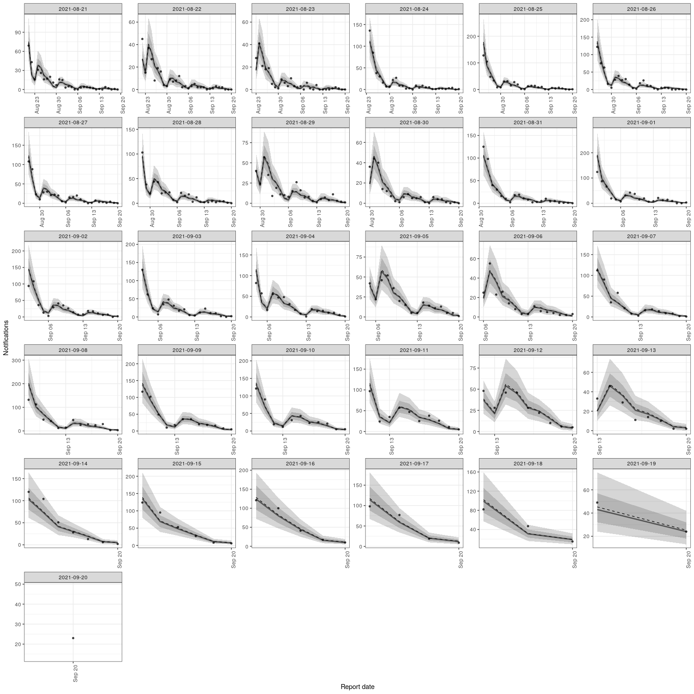

<!-- README.md is generated from README.Rmd. Please edit that file -->

# Nowcast right censored epidemological counts

[](https://github.com/seabbs/epinowcast/actions/workflows/R-CMD-check.yaml)
[](https://app.codecov.io/gh/seabbs/epinowcast)

[](https://github.com/seabbs/epinowcast/graphs/contributors)

This package contains tools to enable flexible and efficient nowcasting
of right censored epidemiological counts using a semi-mechanistic method
with adjustment available for both day of reference and day of report
effects.

## Installation

### Installing the package

Install the unstable development from GitHub using the following,

``` r
remotes::install_github("seabbs/epinowcast", dependencies = TRUE)
```

### Installing CmdStan

If you don’t already have CmdStan installed then, in addition to
installing `epinowcast`, it is also necessary to install CmdStan using
CmdStanR’s `install_cmdstan()` function to enable model fitting in
`epinowcast`. A suitable C++ toolchain is also required. Instructions
are provided in the [*Getting started with
CmdStanR*](https://mc-stan.org/cmdstanr/articles/cmdstanr.html)
vignette. See the [CmdStanR
documentation](https://mc-stan.org/cmdstanr/) for further details and
support.

``` r
cmdstanr::install_cmdstan()
```

## Quick start

### Example data

``` r
library(epinowcast)
library(ggplot2)

nat_germany_hosp <- germany_covid19_hosp[location == "DE"][age_group %in% "00+"]

retro_nat_germany <- enw_retrospective_data(
  nat_germany_hosp,
  rep_days = 30, ref_days = 30
)
retro_nat_germany
#>      reference_date location age_group confirm report_date
#>   1:     2021-08-21       DE       00+      69  2021-08-21
#>   2:     2021-08-22       DE       00+      45  2021-08-22
#>   3:     2021-08-23       DE       00+      28  2021-08-23
#>   4:     2021-08-24       DE       00+     136  2021-08-24
#>   5:     2021-08-25       DE       00+     128  2021-08-25
#>  ---                                                      
#> 492:     2021-08-22       DE       00+     239  2021-09-19
#> 493:     2021-08-23       DE       00+     186  2021-09-20
#> 494:     2021-08-21       DE       00+     323  2021-09-19
#> 495:     2021-08-22       DE       00+     239  2021-09-20
#> 496:     2021-08-21       DE       00+     323  2021-09-20
```

``` r
latest_germany_hosp <- enw_latest_data(nat_germany_hosp, ref_window = c(60, 30))
latest_germany_hosp
#>     reference_date location age_group confirm
#>  1:     2021-08-21       DE       00+     345
#>  2:     2021-08-22       DE       00+     267
#>  3:     2021-08-23       DE       00+     206
#>  4:     2021-08-24       DE       00+     468
#>  5:     2021-08-25       DE       00+     592
#>  6:     2021-08-26       DE       00+     543
#>  7:     2021-08-27       DE       00+     479
#>  8:     2021-08-28       DE       00+     464
#>  9:     2021-08-29       DE       00+     374
#> 10:     2021-08-30       DE       00+     227
#> 11:     2021-08-31       DE       00+     445
#> 12:     2021-09-01       DE       00+     628
#> 13:     2021-09-02       DE       00+     541
#> 14:     2021-09-03       DE       00+     501
#> 15:     2021-09-04       DE       00+     484
#> 16:     2021-09-05       DE       00+     360
#> 17:     2021-09-06       DE       00+     214
#> 18:     2021-09-07       DE       00+     455
#> 19:     2021-09-08       DE       00+     615
#> 20:     2021-09-09       DE       00+     540
#> 21:     2021-09-10       DE       00+     515
#> 22:     2021-09-11       DE       00+     482
#> 23:     2021-09-12       DE       00+     330
#> 24:     2021-09-13       DE       00+     204
#> 25:     2021-09-14       DE       00+     431
#> 26:     2021-09-15       DE       00+     515
#> 27:     2021-09-16       DE       00+     481
#> 28:     2021-09-17       DE       00+     412
#> 29:     2021-09-18       DE       00+     385
#> 30:     2021-09-19       DE       00+     275
#> 31:     2021-09-20       DE       00+     146
#>     reference_date location age_group confirm
```

### Data preprocessing and model specification

Process reported data into format required for `{epinowcast}` and return
in a `{data.table}`. At this stage specify grouping (i.e age, location)
if any.

``` r
pobs <- enw_preprocess_data(retro_nat_germany, max_delay = 30)
pobs
#>                    obs         new_confirm             latest
#> 1: <data.table[495x6]> <data.table[495x8]> <data.table[31x5]>
#>                   diff  reporting_triangle      metareference
#> 1: <data.table[495x8]> <data.table[31x32]> <data.table[31x7]>
#>            metareport time snapshots groups max_delay   max_date
#> 1: <data.table[60x8]>   31        31      1        30 2021-09-20
```

Construct an intercept only model for the date of reference.

``` r
reference_effects <- enw_formula(pobs$metareference[[1]])
reference_effects
#> $fixed
#> $fixed$formula
#> ~1
#> <environment: 0x5636c8b22330>
#> 
#> $fixed$design
#>   (Intercept)
#> 1           1
#> 
#> $fixed$index
#>  [1] 1 1 1 1 1 1 1 1 1 1 1 1 1 1 1 1 1 1 1 1 1 1 1 1 1 1 1 1 1 1 1
#> 
#> 
#> $random
#> $random$formula
#> ~1
#> <environment: 0x5636c8b22330>
#> 
#> $random$design
#>      (Intercept)
#> attr(,"assign")
#> [1] 0
#> 
#> $random$index
#> integer(0)
```

Construct a model with a random effect for the day of report.

``` r
report_effects <- enw_formula(pobs$metareport[[1]], random = "day_of_week")
report_effects
#> $fixed
#> $fixed$formula
#> ~1 + day_of_week
#> <environment: 0x5636c8fe2888>
#> 
#> $fixed$design
#>   (Intercept) day_of_weekFriday day_of_weekMonday day_of_weekSaturday
#> 1           1                 0                 0                   1
#> 2           1                 0                 0                   0
#> 3           1                 0                 1                   0
#> 4           1                 0                 0                   0
#> 5           1                 0                 0                   0
#> 6           1                 0                 0                   0
#> 7           1                 1                 0                   0
#>   day_of_weekSunday day_of_weekThursday day_of_weekTuesday day_of_weekWednesday
#> 1                 0                   0                  0                    0
#> 2                 1                   0                  0                    0
#> 3                 0                   0                  0                    0
#> 4                 0                   0                  1                    0
#> 5                 0                   0                  0                    1
#> 6                 0                   1                  0                    0
#> 7                 0                   0                  0                    0
#> 
#> $fixed$index
#>  [1] 1 2 3 4 5 6 7 1 2 3 4 5 6 7 1 2 3 4 5 6 7 1 2 3 4 5 6 7 1 2 3 4 5 6 7 1 2 3
#> [39] 4 5 6 7 1 2 3 4 5 6 7 1 2 3 4 5 6 7 1 2 3 4
#> 
#> 
#> $random
#> $random$formula
#> ~0 + fixed + day_of_week
#> <environment: 0x5636c8fe2888>
#> 
#> $random$design
#>   fixed day_of_week
#> 1     0           1
#> 2     0           1
#> 3     0           1
#> 4     0           1
#> 5     0           1
#> 6     0           1
#> 7     0           1
#> attr(,"assign")
#> [1] 1 2
#> 
#> $random$index
#> [1] 1 2 3 4 5 6 7
```

### Model fitting

First compile the model. This step can be left to `epinowcast` but here
we want to use multiple cores per chain to speed up model fitting and so
need to compile the model with this feature turned on.

``` r
model <- enw_model(threads = TRUE)
```

We now fit the model and produce a nowcast using this fit. Note that
here we use two chains each using two threads as a demonstration but in
general using 4 chains is recommended. Also note that here we have
silenced fitting progress and potential warning messages for the
purposes of keeping this quick start short but in general this should
not be done.

``` r
options(mc.cores = 2)
nowcast <- epinowcast(pobs,
  model = model,
  report_effects = report_effects,
  reference_effects = reference_effects,
  save_warmup = FALSE, pp = TRUE,
  chains = 2, threads_per_chain = 2,
  refresh = 0, show_messages = FALSE
)
#> Init values were only set for a subset of parameters. 
#> Missing init values for the following parameters:
#>  - chain 1: logmean_eff, logsd_eff, logmean_sd, logsd_sd
#>  - chain 2: logmean_eff, logsd_eff, logmean_sd, logsd_sd
#> Running MCMC with 2 parallel chains, with 2 thread(s) per chain...
#> 
#> Chain 1 finished in 47.2 seconds.
#> Chain 2 finished in 49.0 seconds.
#> 
#> Both chains finished successfully.
#> Mean chain execution time: 48.1 seconds.
#> Total execution time: 49.1 seconds.
```

### Results

Print the output from `{epinowcast}` which includes diagnostic
information, the data used for fitting, and the `{cmdstanr`} object.

``` r
nowcast
#>                    obs         new_confirm             latest
#> 1: <data.table[495x6]> <data.table[495x8]> <data.table[31x5]>
#>                   diff  reporting_triangle      metareference
#> 1: <data.table[495x8]> <data.table[31x32]> <data.table[31x7]>
#>            metareport time snapshots groups max_delay   max_date
#> 1: <data.table[60x8]>   31        31      1        30 2021-09-20
#>                  fit       data  fit_args samples max_rhat
#> 1: <CmdStanMCMC[31]> <list[29]> <list[6]>    2000     1.01
#>    divergent_transitions per_divergent_transitions max_treedepth
#> 1:                     0                         0             7
#>    no_at_max_treedepth per_at_max_treedepth time
#> 1:                1404                0.702 49.1
```

Summarise the nowcast for the latest snapshot of data.

``` r
summary(nowcast, probs = c(0.05, 0.95))
#>     reference_date location age_group confirm group     mean median        sd
#>  1:     2021-08-22       DE       00+     239     1 239.0000  239.0  0.000000
#>  2:     2021-08-23       DE       00+     186     1 186.6070  186.0  0.804285
#>  3:     2021-08-24       DE       00+     437     1 439.1015  439.0  1.515370
#>  4:     2021-08-25       DE       00+     539     1 543.7040  544.0  2.453037
#>  5:     2021-08-26       DE       00+     509     1 515.9320  516.0  3.029846
#>  6:     2021-08-27       DE       00+     442     1 450.3945  450.0  3.426330
#>  7:     2021-08-28       DE       00+     412     1 422.8745  423.0  3.907222
#>  8:     2021-08-29       DE       00+     322     1 333.9350  334.0  3.937833
#>  9:     2021-08-30       DE       00+     204     1 212.1185  212.0  3.205245
#> 10:     2021-08-31       DE       00+     409     1 423.3190  423.0  4.613229
#> 11:     2021-09-01       DE       00+     535     1 563.3735  563.0  6.863859
#> 12:     2021-09-02       DE       00+     475     1 506.9210  507.0  7.378210
#> 13:     2021-09-03       DE       00+     444     1 478.9190  479.0  7.566708
#> 14:     2021-09-04       DE       00+     437     1 481.9245  481.0  8.951585
#> 15:     2021-09-05       DE       00+     310     1 348.8855  348.0  8.068825
#> 16:     2021-09-06       DE       00+     190     1 215.8630  216.0  6.247539
#> 17:     2021-09-07       DE       00+     395     1 440.9735  440.0  8.934859
#> 18:     2021-09-08       DE       00+     518     1 600.9535  601.0 14.073712
#> 19:     2021-09-09       DE       00+     433     1 519.3140  519.0 14.257315
#> 20:     2021-09-10       DE       00+     395     1 490.4955  490.0 15.426664
#> 21:     2021-09-11       DE       00+     365     1 483.4360  482.0 18.170333
#> 22:     2021-09-12       DE       00+     239     1 333.3345  332.0 15.306102
#> 23:     2021-09-13       DE       00+     147     1 211.5815  210.0 12.547114
#> 24:     2021-09-14       DE       00+     324     1 428.5625  427.0 16.967470
#> 25:     2021-09-15       DE       00+     313     1 458.7030  457.0 23.863162
#> 26:     2021-09-16       DE       00+     289     1 489.1450  487.0 32.881675
#> 27:     2021-09-17       DE       00+     203     1 423.1680  422.0 37.583614
#> 28:     2021-09-18       DE       00+     144     1 434.5000  431.0 52.268949
#> 29:     2021-09-19       DE       00+      73     1 400.5890  394.5 68.217035
#> 30:     2021-09-20       DE       00+      23     1 320.4465  311.0 84.260489
#>     reference_date location age_group confirm group     mean median        sd
#>         mad     q5 q95      rhat ess_bulk ess_tail
#>  1:  0.0000 239.00 239        NA       NA       NA
#>  2:  0.0000 186.00 188 0.9998997 1991.451 1990.694
#>  3:  1.4826 437.00 442 1.0004082 1886.699 1819.764
#>  4:  2.9652 540.00 548 1.0012989 1990.724 2006.796
#>  5:  2.9652 512.00 521 1.0000881 1990.783 1834.990
#>  6:  2.9652 445.00 456 1.0009059 1849.842 1881.846
#>  7:  4.4478 417.00 430 0.9998122 1902.360 1825.133
#>  8:  4.4478 328.00 341 1.0019168 1835.565 1843.948
#>  9:  2.9652 207.00 218 1.0010884 2012.899 1988.055
#> 10:  4.4478 416.00 431 1.0012412 1832.168 1941.217
#> 11:  5.9304 553.00 575 0.9991213 1953.945 1622.363
#> 12:  7.4130 495.00 520 0.9998708 1964.198 1940.738
#> 13:  7.4130 467.00 492 1.0001788 2151.360 1919.471
#> 14:  8.8956 468.00 497 0.9994166 2083.164 1892.861
#> 15:  7.4130 337.00 363 0.9991616 2107.119 1895.720
#> 16:  5.9304 207.00 227 1.0001842 2063.413 1943.725
#> 17:  8.8956 427.00 456 1.0004109 1903.735 1950.256
#> 18: 13.3434 579.00 625 0.9993403 2101.880 1636.199
#> 19: 13.3434 497.95 544 0.9995069 2031.071 1883.559
#> 20: 15.5673 467.00 517 1.0006880 2274.326 2014.406
#> 21: 17.7912 456.00 515 0.9996880 2254.597 1966.273
#> 22: 14.8260 310.00 360 1.0005996 1951.200 1718.108
#> 23: 11.8608 192.00 234 1.0016423 2247.400 1878.546
#> 24: 16.3086 402.00 458 1.0001294 2267.076 2001.008
#> 25: 23.7216 422.95 500 0.9992912 2414.257 1925.716
#> 26: 32.6172 440.00 548 0.9997276 2202.189 1895.179
#> 27: 37.0650 367.00 490 0.9998232 2255.426 1871.758
#> 28: 50.4084 354.95 525 0.9998916 2366.723 1697.076
#> 29: 67.4583 302.00 520 0.9998075 2345.991 1845.622
#> 30: 78.5778 201.95 475 1.0021797 2548.407 1783.790
#>         mad     q5 q95      rhat ess_bulk ess_tail
```

Plot the summarised nowcast against currently observed data (or
optionally more recent data for comparison purposes).

``` r
plot(nowcast, obs = latest_germany_hosp)
```


Plot posterior predictions for observed notifications by date of report
as a check of how well the model reproduces the observed data.

``` r
plot(nowcast, type = "posterior") +
  facet_wrap(vars(reference_date), scale = "free")
```



## Citation

If using `epinowccast` in your work please consider citing it using the
following,

    #> 
    #> To cite epinowcast in publications use:
    #> 
    #>   Sam Abbott (2021). epinowcast: Nowcast right censored epidemiological
    #>   count data,
    #> 
    #> A BibTeX entry for LaTeX users is
    #> 
    #>   @Article{,
    #>     title = {epinowcast: Nowcast right censored epidemiological count data},
    #>     author = {Sam Abbott},
    #>     journal = {Zenodo},
    #>     year = {2021},
    #>   }

## How to make a bug report or feature request

Please briefly describe your problem and what output you expect in an
[issue](https://github.com/seabbs/epinowcast/issues). If you have a
question, please don’t open an issue. Instead, ask on our [Q and A
page](https://github.com/seabbs/epinowcast/discussions/categories/q-a).

## Contributing

We welcome contributions and new contributors\! We particularly
appreciate help on priority problems in the
[issues](https://github.com/seabbs/epinowcast/issues). Please check and
add to the issues, and/or add a [pull
request](https://github.com/seabbs/epinowcast/pulls).

## Code of Conduct

Please note that the `forecast.vocs` project is released with a
[Contributor Code of
Conduct](samabbott.co.uk/epinowcast/CODE_OF_CONDUCT.html). By
contributing to this project, you agree to abide by its terms.
