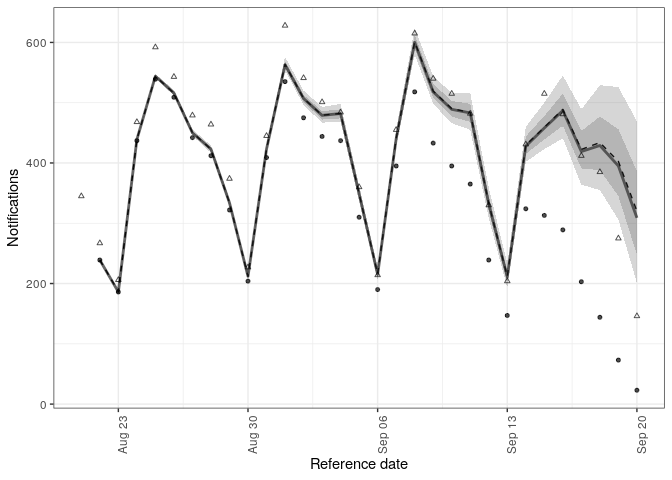

<!-- README.md is generated from README.Rmd. Please edit that file -->

# Nowcast right censored epidemological counts

[](https://github.com/seabbs/epinowcast/actions/workflows/R-CMD-check.yaml)
[](https://app.codecov.io/gh/seabbs/epinowcast)

[](https://github.com/seabbs/epinowcast/graphs/contributors)

This package contains tools to enable flexible and efficient nowcasting
of right censored epidemiological counts using a semi-mechanistic method
with adjustment available for both day of reference and day of report
effects.

## Installation

### Installing the package

Install the unstable development from GitHub using the following,

``` r
remotes::install_github("seabbs/epinowcast", dependencies = TRUE)
```

### Installing CmdStan

If you don’t already have CmdStan installed then, in addition to
installing `epinowcast`, it is also necessary to install CmdStan using
CmdStanR’s `install_cmdstan()` function to enable model fitting in
`epinowcast`. A suitable C++ toolchain is also required. Instructions
are provided in the [*Getting started with
CmdStanR*](https://mc-stan.org/cmdstanr/articles/cmdstanr.html)
vignette. See the [CmdStanR
documentation](https://mc-stan.org/cmdstanr/) for further details and
support.

``` r
cmdstanr::install_cmdstan()
```

## Quick start

### Example data

``` r
library(epinowcast)

national_germany_hosp <- germany_covid19_hosp
national_germany_hosp <- national_germany_hosp[location == "DE"]
national_germany_hosp <- national_germany_hosp[age_group %in% "00+"]

nat_germany_30_days_ago <-
  national_germany_hosp[report_date <= max(report_date) - 30]
nat_germany_30_days_ago <-
  nat_germany_30_days_ago[reference_date >= (max(reference_date) - 30)]
nat_germany_30_days_ago[]
#>      reference_date location age_group confirm report_date
#>   1:     2021-08-21       DE       00+      69  2021-08-21
#>   2:     2021-08-22       DE       00+      45  2021-08-22
#>   3:     2021-08-23       DE       00+      28  2021-08-23
#>   4:     2021-08-24       DE       00+     136  2021-08-24
#>   5:     2021-08-25       DE       00+     128  2021-08-25
#>  ---                                                      
#> 492:     2021-08-22       DE       00+     239  2021-09-19
#> 493:     2021-08-23       DE       00+     186  2021-09-20
#> 494:     2021-08-21       DE       00+     323  2021-09-19
#> 495:     2021-08-22       DE       00+     239  2021-09-20
#> 496:     2021-08-21       DE       00+     323  2021-09-20
```

``` r
latest_germany_hosp <- national_germany_hosp[report_date == max(report_date)]
                  
latest_germany_hosp <-
  latest_germany_hosp[reference_date >= (max(reference_date) - 60)]
latest_germany_hosp <-
  latest_germany_hosp[reference_date <= (max(reference_date) - 30)]
latest_germany_hosp[]
#>     reference_date location age_group confirm report_date
#>  1:     2021-09-20       DE       00+     146  2021-10-20
#>  2:     2021-09-19       DE       00+     275  2021-10-20
#>  3:     2021-09-18       DE       00+     385  2021-10-20
#>  4:     2021-09-17       DE       00+     412  2021-10-20
#>  5:     2021-09-16       DE       00+     481  2021-10-20
#>  6:     2021-09-15       DE       00+     515  2021-10-20
#>  7:     2021-09-14       DE       00+     431  2021-10-20
#>  8:     2021-09-13       DE       00+     204  2021-10-20
#>  9:     2021-09-12       DE       00+     330  2021-10-20
#> 10:     2021-09-11       DE       00+     482  2021-10-20
#> 11:     2021-09-10       DE       00+     515  2021-10-20
#> 12:     2021-09-09       DE       00+     540  2021-10-20
#> 13:     2021-09-08       DE       00+     615  2021-10-20
#> 14:     2021-09-07       DE       00+     455  2021-10-20
#> 15:     2021-09-06       DE       00+     214  2021-10-20
#> 16:     2021-09-05       DE       00+     360  2021-10-20
#> 17:     2021-09-04       DE       00+     484  2021-10-20
#> 18:     2021-09-03       DE       00+     501  2021-10-20
#> 19:     2021-09-02       DE       00+     541  2021-10-20
#> 20:     2021-09-01       DE       00+     628  2021-10-20
#> 21:     2021-08-31       DE       00+     445  2021-10-20
#> 22:     2021-08-30       DE       00+     227  2021-10-20
#> 23:     2021-08-29       DE       00+     374  2021-10-20
#> 24:     2021-08-28       DE       00+     464  2021-10-20
#> 25:     2021-08-27       DE       00+     479  2021-10-20
#> 26:     2021-08-26       DE       00+     543  2021-10-20
#> 27:     2021-08-25       DE       00+     592  2021-10-20
#> 28:     2021-08-24       DE       00+     468  2021-10-20
#> 29:     2021-08-23       DE       00+     206  2021-10-20
#> 30:     2021-08-22       DE       00+     267  2021-10-20
#> 31:     2021-08-21       DE       00+     345  2021-10-20
#>     reference_date location age_group confirm report_date
```

### Data preprocessing and model specification

Process reported data into format required for `{epinowcast}` and return
in a `{data.table}`. At this stage specify grouping (i.e age, location)
if any.

``` r
pobs <- enw_preprocess_data(nat_germany_30_days_ago, max_delay = 30)
pobs
#>                    obs         new_confirm             latest
#> 1: <data.table[495x6]> <data.table[495x8]> <data.table[31x5]>
#>                   diff  reporting_triangle      metareference
#> 1: <data.table[495x8]> <data.table[31x32]> <data.table[31x4]>
#>            metareport time snapshots groups max_delay   max_date
#> 1: <data.table[60x5]>   31        31      1        30 2021-09-20
```

Construct an intercept only model for the date of reference.

``` r
reference_effects <- enw_intercept_model(pobs$metareference[[1]])
reference_effects
#> $fixed
#> $fixed$design
#>   (Intercept)
#> 1           1
#> 
#> $fixed$index
#>  [1] 1 1 1 1 1 1 1 1 1 1 1 1 1 1 1 1 1 1 1 1 1 1 1 1 1 1 1 1 1 1 1
#> 
#> 
#> $random
#> $random$design
#>      (Intercept)
#> attr(,"assign")
#> [1] 0
#> 
#> $random$index
#> integer(0)
```

Construct a model with a random effect for the day of report.

``` r
report_effects <- enw_day_of_week_model(pobs$metareport[[1]])
report_effects
#> $fixed
#> $fixed$design
#>   (Intercept) day_of_weekFriday day_of_weekMonday day_of_weekSaturday
#> 1           1                 0                 0                   1
#> 2           1                 0                 0                   0
#> 3           1                 0                 1                   0
#> 4           1                 0                 0                   0
#> 5           1                 0                 0                   0
#> 6           1                 0                 0                   0
#> 7           1                 1                 0                   0
#>   day_of_weekSunday day_of_weekThursday day_of_weekTuesday day_of_weekWednesday
#> 1                 0                   0                  0                    0
#> 2                 1                   0                  0                    0
#> 3                 0                   0                  0                    0
#> 4                 0                   0                  1                    0
#> 5                 0                   0                  0                    1
#> 6                 0                   1                  0                    0
#> 7                 0                   0                  0                    0
#> 
#> $fixed$index
#>  [1] 1 2 3 4 5 6 7 1 2 3 4 5 6 7 1 2 3 4 5 6 7 1 2 3 4 5 6 7 1 2 3 4 5 6 7 1 2 3
#> [39] 4 5 6 7 1 2 3 4 5 6 7 1 2 3 4 5 6 7 1 2 3 4
#> 
#> 
#> $random
#> $random$design
#>   fixed sd
#> 1     0  1
#> 2     0  1
#> 3     0  1
#> 4     0  1
#> 5     0  1
#> 6     0  1
#> 7     0  1
#> attr(,"assign")
#> [1] 1 2
#> 
#> $random$index
#> [1] 1 2 3 4 5 6 7
```

### Model fitting

``` r
options(mc.cores = 4)
nowcast <- epinowcast(pobs,
  report_effects = report_effects,
  reference_effects = reference_effects,
  save_warmup = FALSE, pp = TRUE
)
#> Init values were only set for a subset of parameters. 
#> Missing init values for the following parameters:
#>  - chain 1: leobs_init, leobs_resids, logmean_eff, logsd_eff, logmean_sd, logsd_sd, rd_eff_sd
#>  - chain 2: leobs_init, leobs_resids, logmean_eff, logsd_eff, logmean_sd, logsd_sd, rd_eff_sd
#>  - chain 3: leobs_init, leobs_resids, logmean_eff, logsd_eff, logmean_sd, logsd_sd, rd_eff_sd
#>  - chain 4: leobs_init, leobs_resids, logmean_eff, logsd_eff, logmean_sd, logsd_sd, rd_eff_sd
#> Running MCMC with 4 parallel chains...
#> 
#> Chain 1 Iteration:    1 / 2000 [  0%]  (Warmup)
#> Chain 1 Informational Message: The current Metropolis proposal is about to be rejected because of the following issue:
#> Chain 1 Exception: neg_binomial_2_lpmf: Location parameter[1] is inf, but must be positive finite! (in '/tmp/RtmpBBHbGH/model-17f64226d848a.stan', line 156, column 6 to column 53)
#> Chain 1 If this warning occurs sporadically, such as for highly constrained variable types like covariance matrices, then the sampler is fine,
#> Chain 1 but if this warning occurs often then your model may be either severely ill-conditioned or misspecified.
#> Chain 1
#> Chain 1 Informational Message: The current Metropolis proposal is about to be rejected because of the following issue:
#> Chain 1 Exception: neg_binomial_2_lpmf: Location parameter[1] is inf, but must be positive finite! (in '/tmp/RtmpBBHbGH/model-17f64226d848a.stan', line 156, column 6 to column 53)
#> Chain 1 If this warning occurs sporadically, such as for highly constrained variable types like covariance matrices, then the sampler is fine,
#> Chain 1 but if this warning occurs often then your model may be either severely ill-conditioned or misspecified.
#> Chain 1
#> Chain 1 Informational Message: The current Metropolis proposal is about to be rejected because of the following issue:
#> Chain 1 Exception: neg_binomial_2_lpmf: Location parameter[1] is inf, but must be positive finite! (in '/tmp/RtmpBBHbGH/model-17f64226d848a.stan', line 156, column 6 to column 53)
#> Chain 1 If this warning occurs sporadically, such as for highly constrained variable types like covariance matrices, then the sampler is fine,
#> Chain 1 but if this warning occurs often then your model may be either severely ill-conditioned or misspecified.
#> Chain 1
#> Chain 1 Informational Message: The current Metropolis proposal is about to be rejected because of the following issue:
#> Chain 1 Exception: neg_binomial_2_lpmf: Location parameter[1] is inf, but must be positive finite! (in '/tmp/RtmpBBHbGH/model-17f64226d848a.stan', line 156, column 6 to column 53)
#> Chain 1 If this warning occurs sporadically, such as for highly constrained variable types like covariance matrices, then the sampler is fine,
#> Chain 1 but if this warning occurs often then your model may be either severely ill-conditioned or misspecified.
#> Chain 1
#> Chain 1 Informational Message: The current Metropolis proposal is about to be rejected because of the following issue:
#> Chain 1 Exception: neg_binomial_2_lpmf: Location parameter[1] is nan, but must be positive finite! (in '/tmp/RtmpBBHbGH/model-17f64226d848a.stan', line 156, column 6 to column 53)
#> Chain 1 If this warning occurs sporadically, such as for highly constrained variable types like covariance matrices, then the sampler is fine,
#> Chain 1 but if this warning occurs often then your model may be either severely ill-conditioned or misspecified.
#> Chain 1
#> Chain 1 Informational Message: The current Metropolis proposal is about to be rejected because of the following issue:
#> Chain 1 Exception: neg_binomial_2_lpmf: Location parameter[1] is -nan, but must be positive finite! (in '/tmp/RtmpBBHbGH/model-17f64226d848a.stan', line 156, column 6 to column 53)
#> Chain 1 If this warning occurs sporadically, such as for highly constrained variable types like covariance matrices, then the sampler is fine,
#> Chain 1 but if this warning occurs often then your model may be either severely ill-conditioned or misspecified.
#> Chain 1
#> Chain 2 Iteration:    1 / 2000 [  0%]  (Warmup)
#> Chain 2 Informational Message: The current Metropolis proposal is about to be rejected because of the following issue:
#> Chain 2 Exception: neg_binomial_2_lpmf: Location parameter[1] is inf, but must be positive finite! (in '/tmp/RtmpBBHbGH/model-17f64226d848a.stan', line 156, column 6 to column 53)
#> Chain 2 If this warning occurs sporadically, such as for highly constrained variable types like covariance matrices, then the sampler is fine,
#> Chain 2 but if this warning occurs often then your model may be either severely ill-conditioned or misspecified.
#> Chain 2
#> Chain 2 Informational Message: The current Metropolis proposal is about to be rejected because of the following issue:
#> Chain 2 Exception: neg_binomial_2_lpmf: Location parameter[1] is inf, but must be positive finite! (in '/tmp/RtmpBBHbGH/model-17f64226d848a.stan', line 156, column 6 to column 53)
#> Chain 2 If this warning occurs sporadically, such as for highly constrained variable types like covariance matrices, then the sampler is fine,
#> Chain 2 but if this warning occurs often then your model may be either severely ill-conditioned or misspecified.
#> Chain 2
#> Chain 2 Informational Message: The current Metropolis proposal is about to be rejected because of the following issue:
#> Chain 2 Exception: neg_binomial_2_lpmf: Location parameter[1] is inf, but must be positive finite! (in '/tmp/RtmpBBHbGH/model-17f64226d848a.stan', line 156, column 6 to column 53)
#> Chain 2 If this warning occurs sporadically, such as for highly constrained variable types like covariance matrices, then the sampler is fine,
#> Chain 2 but if this warning occurs often then your model may be either severely ill-conditioned or misspecified.
#> Chain 2
#> Chain 2 Informational Message: The current Metropolis proposal is about to be rejected because of the following issue:
#> Chain 2 Exception: neg_binomial_2_lpmf: Location parameter[1] is inf, but must be positive finite! (in '/tmp/RtmpBBHbGH/model-17f64226d848a.stan', line 156, column 6 to column 53)
#> Chain 2 If this warning occurs sporadically, such as for highly constrained variable types like covariance matrices, then the sampler is fine,
#> Chain 2 but if this warning occurs often then your model may be either severely ill-conditioned or misspecified.
#> Chain 2
#> Chain 2 Informational Message: The current Metropolis proposal is about to be rejected because of the following issue:
#> Chain 2 Exception: neg_binomial_2_lpmf: Location parameter[1] is inf, but must be positive finite! (in '/tmp/RtmpBBHbGH/model-17f64226d848a.stan', line 156, column 6 to column 53)
#> Chain 2 If this warning occurs sporadically, such as for highly constrained variable types like covariance matrices, then the sampler is fine,
#> Chain 2 but if this warning occurs often then your model may be either severely ill-conditioned or misspecified.
#> Chain 2
#> Chain 3 Iteration:    1 / 2000 [  0%]  (Warmup)
#> Chain 3 Informational Message: The current Metropolis proposal is about to be rejected because of the following issue:
#> Chain 3 Exception: neg_binomial_2_lpmf: Location parameter[1] is inf, but must be positive finite! (in '/tmp/RtmpBBHbGH/model-17f64226d848a.stan', line 156, column 6 to column 53)
#> Chain 3 If this warning occurs sporadically, such as for highly constrained variable types like covariance matrices, then the sampler is fine,
#> Chain 3 but if this warning occurs often then your model may be either severely ill-conditioned or misspecified.
#> Chain 3
#> Chain 3 Informational Message: The current Metropolis proposal is about to be rejected because of the following issue:
#> Chain 3 Exception: neg_binomial_2_lpmf: Location parameter[1] is inf, but must be positive finite! (in '/tmp/RtmpBBHbGH/model-17f64226d848a.stan', line 156, column 6 to column 53)
#> Chain 3 If this warning occurs sporadically, such as for highly constrained variable types like covariance matrices, then the sampler is fine,
#> Chain 3 but if this warning occurs often then your model may be either severely ill-conditioned or misspecified.
#> Chain 3
#> Chain 3 Informational Message: The current Metropolis proposal is about to be rejected because of the following issue:
#> Chain 3 Exception: neg_binomial_2_lpmf: Location parameter[1] is inf, but must be positive finite! (in '/tmp/RtmpBBHbGH/model-17f64226d848a.stan', line 156, column 6 to column 53)
#> Chain 3 If this warning occurs sporadically, such as for highly constrained variable types like covariance matrices, then the sampler is fine,
#> Chain 3 but if this warning occurs often then your model may be either severely ill-conditioned or misspecified.
#> Chain 3
#> Chain 3 Informational Message: The current Metropolis proposal is about to be rejected because of the following issue:
#> Chain 3 Exception: neg_binomial_2_lpmf: Location parameter[21] is nan, but must be positive finite! (in '/tmp/RtmpBBHbGH/model-17f64226d848a.stan', line 156, column 6 to column 53)
#> Chain 3 If this warning occurs sporadically, such as for highly constrained variable types like covariance matrices, then the sampler is fine,
#> Chain 3 but if this warning occurs often then your model may be either severely ill-conditioned or misspecified.
#> Chain 3
#> Chain 3 Informational Message: The current Metropolis proposal is about to be rejected because of the following issue:
#> Chain 3 Exception: neg_binomial_2_lpmf: Location parameter[24] is nan, but must be positive finite! (in '/tmp/RtmpBBHbGH/model-17f64226d848a.stan', line 156, column 6 to column 53)
#> Chain 3 If this warning occurs sporadically, such as for highly constrained variable types like covariance matrices, then the sampler is fine,
#> Chain 3 but if this warning occurs often then your model may be either severely ill-conditioned or misspecified.
#> Chain 3
#> Chain 3 Informational Message: The current Metropolis proposal is about to be rejected because of the following issue:
#> Chain 3 Exception: neg_binomial_2_lpmf: Location parameter[1] is inf, but must be positive finite! (in '/tmp/RtmpBBHbGH/model-17f64226d848a.stan', line 156, column 6 to column 53)
#> Chain 3 If this warning occurs sporadically, such as for highly constrained variable types like covariance matrices, then the sampler is fine,
#> Chain 3 but if this warning occurs often then your model may be either severely ill-conditioned or misspecified.
#> Chain 3
#> Chain 3 Informational Message: The current Metropolis proposal is about to be rejected because of the following issue:
#> Chain 3 Exception: neg_binomial_2_lpmf: Location parameter[1] is inf, but must be positive finite! (in '/tmp/RtmpBBHbGH/model-17f64226d848a.stan', line 156, column 6 to column 53)
#> Chain 3 If this warning occurs sporadically, such as for highly constrained variable types like covariance matrices, then the sampler is fine,
#> Chain 3 but if this warning occurs often then your model may be either severely ill-conditioned or misspecified.
#> Chain 3
#> Chain 3 Informational Message: The current Metropolis proposal is about to be rejected because of the following issue:
#> Chain 3 Exception: neg_binomial_2_lpmf: Location parameter[29] is nan, but must be positive finite! (in '/tmp/RtmpBBHbGH/model-17f64226d848a.stan', line 156, column 6 to column 53)
#> Chain 3 If this warning occurs sporadically, such as for highly constrained variable types like covariance matrices, then the sampler is fine,
#> Chain 3 but if this warning occurs often then your model may be either severely ill-conditioned or misspecified.
#> Chain 3
#> Chain 4 Iteration:    1 / 2000 [  0%]  (Warmup)
#> Chain 4 Informational Message: The current Metropolis proposal is about to be rejected because of the following issue:
#> Chain 4 Exception: neg_binomial_2_lpmf: Location parameter[1] is inf, but must be positive finite! (in '/tmp/RtmpBBHbGH/model-17f64226d848a.stan', line 156, column 6 to column 53)
#> Chain 4 If this warning occurs sporadically, such as for highly constrained variable types like covariance matrices, then the sampler is fine,
#> Chain 4 but if this warning occurs often then your model may be either severely ill-conditioned or misspecified.
#> Chain 4
#> Chain 4 Informational Message: The current Metropolis proposal is about to be rejected because of the following issue:
#> Chain 4 Exception: neg_binomial_2_lpmf: Location parameter[1] is inf, but must be positive finite! (in '/tmp/RtmpBBHbGH/model-17f64226d848a.stan', line 156, column 6 to column 53)
#> Chain 4 If this warning occurs sporadically, such as for highly constrained variable types like covariance matrices, then the sampler is fine,
#> Chain 4 but if this warning occurs often then your model may be either severely ill-conditioned or misspecified.
#> Chain 4
#> Chain 4 Informational Message: The current Metropolis proposal is about to be rejected because of the following issue:
#> Chain 4 Exception: neg_binomial_2_lpmf: Location parameter[1] is inf, but must be positive finite! (in '/tmp/RtmpBBHbGH/model-17f64226d848a.stan', line 156, column 6 to column 53)
#> Chain 4 If this warning occurs sporadically, such as for highly constrained variable types like covariance matrices, then the sampler is fine,
#> Chain 4 but if this warning occurs often then your model may be either severely ill-conditioned or misspecified.
#> Chain 4
#> Chain 4 Informational Message: The current Metropolis proposal is about to be rejected because of the following issue:
#> Chain 4 Exception: neg_binomial_2_lpmf: Location parameter[1] is inf, but must be positive finite! (in '/tmp/RtmpBBHbGH/model-17f64226d848a.stan', line 156, column 6 to column 53)
#> Chain 4 If this warning occurs sporadically, such as for highly constrained variable types like covariance matrices, then the sampler is fine,
#> Chain 4 but if this warning occurs often then your model may be either severely ill-conditioned or misspecified.
#> Chain 4
#> Chain 4 Informational Message: The current Metropolis proposal is about to be rejected because of the following issue:
#> Chain 4 Exception: neg_binomial_2_lpmf: Location parameter[1] is inf, but must be positive finite! (in '/tmp/RtmpBBHbGH/model-17f64226d848a.stan', line 156, column 6 to column 53)
#> Chain 4 If this warning occurs sporadically, such as for highly constrained variable types like covariance matrices, then the sampler is fine,
#> Chain 4 but if this warning occurs often then your model may be either severely ill-conditioned or misspecified.
#> Chain 4
#> Chain 3 Iteration:  100 / 2000 [  5%]  (Warmup) 
#> Chain 1 Iteration:  100 / 2000 [  5%]  (Warmup) 
#> Chain 4 Iteration:  100 / 2000 [  5%]  (Warmup) 
#> Chain 2 Iteration:  100 / 2000 [  5%]  (Warmup) 
#> Chain 1 Iteration:  200 / 2000 [ 10%]  (Warmup) 
#> Chain 3 Iteration:  200 / 2000 [ 10%]  (Warmup) 
#> Chain 4 Iteration:  200 / 2000 [ 10%]  (Warmup) 
#> Chain 2 Iteration:  200 / 2000 [ 10%]  (Warmup) 
#> Chain 1 Iteration:  300 / 2000 [ 15%]  (Warmup) 
#> Chain 3 Iteration:  300 / 2000 [ 15%]  (Warmup) 
#> Chain 4 Iteration:  300 / 2000 [ 15%]  (Warmup) 
#> Chain 2 Iteration:  300 / 2000 [ 15%]  (Warmup) 
#> Chain 1 Iteration:  400 / 2000 [ 20%]  (Warmup) 
#> Chain 3 Iteration:  400 / 2000 [ 20%]  (Warmup) 
#> Chain 4 Iteration:  400 / 2000 [ 20%]  (Warmup) 
#> Chain 2 Iteration:  400 / 2000 [ 20%]  (Warmup) 
#> Chain 1 Iteration:  500 / 2000 [ 25%]  (Warmup) 
#> Chain 3 Iteration:  500 / 2000 [ 25%]  (Warmup) 
#> Chain 4 Iteration:  500 / 2000 [ 25%]  (Warmup) 
#> Chain 2 Iteration:  500 / 2000 [ 25%]  (Warmup) 
#> Chain 1 Iteration:  600 / 2000 [ 30%]  (Warmup) 
#> Chain 3 Iteration:  600 / 2000 [ 30%]  (Warmup) 
#> Chain 4 Iteration:  600 / 2000 [ 30%]  (Warmup) 
#> Chain 2 Iteration:  600 / 2000 [ 30%]  (Warmup) 
#> Chain 1 Iteration:  700 / 2000 [ 35%]  (Warmup) 
#> Chain 3 Iteration:  700 / 2000 [ 35%]  (Warmup) 
#> Chain 4 Iteration:  700 / 2000 [ 35%]  (Warmup) 
#> Chain 2 Iteration:  700 / 2000 [ 35%]  (Warmup) 
#> Chain 1 Iteration:  800 / 2000 [ 40%]  (Warmup) 
#> Chain 3 Iteration:  800 / 2000 [ 40%]  (Warmup) 
#> Chain 4 Iteration:  800 / 2000 [ 40%]  (Warmup) 
#> Chain 2 Iteration:  800 / 2000 [ 40%]  (Warmup) 
#> Chain 1 Iteration:  900 / 2000 [ 45%]  (Warmup) 
#> Chain 3 Iteration:  900 / 2000 [ 45%]  (Warmup) 
#> Chain 4 Iteration:  900 / 2000 [ 45%]  (Warmup) 
#> Chain 2 Iteration:  900 / 2000 [ 45%]  (Warmup) 
#> Chain 1 Iteration: 1000 / 2000 [ 50%]  (Warmup) 
#> Chain 1 Iteration: 1001 / 2000 [ 50%]  (Sampling) 
#> Chain 3 Iteration: 1000 / 2000 [ 50%]  (Warmup) 
#> Chain 3 Iteration: 1001 / 2000 [ 50%]  (Sampling) 
#> Chain 4 Iteration: 1000 / 2000 [ 50%]  (Warmup) 
#> Chain 4 Iteration: 1001 / 2000 [ 50%]  (Sampling) 
#> Chain 2 Iteration: 1000 / 2000 [ 50%]  (Warmup) 
#> Chain 2 Iteration: 1001 / 2000 [ 50%]  (Sampling) 
#> Chain 1 Iteration: 1100 / 2000 [ 55%]  (Sampling) 
#> Chain 3 Iteration: 1100 / 2000 [ 55%]  (Sampling) 
#> Chain 4 Iteration: 1100 / 2000 [ 55%]  (Sampling) 
#> Chain 2 Iteration: 1100 / 2000 [ 55%]  (Sampling) 
#> Chain 1 Iteration: 1200 / 2000 [ 60%]  (Sampling) 
#> Chain 3 Iteration: 1200 / 2000 [ 60%]  (Sampling) 
#> Chain 4 Iteration: 1200 / 2000 [ 60%]  (Sampling) 
#> Chain 2 Iteration: 1200 / 2000 [ 60%]  (Sampling) 
#> Chain 1 Iteration: 1300 / 2000 [ 65%]  (Sampling) 
#> Chain 4 Iteration: 1300 / 2000 [ 65%]  (Sampling) 
#> Chain 3 Iteration: 1300 / 2000 [ 65%]  (Sampling) 
#> Chain 2 Iteration: 1300 / 2000 [ 65%]  (Sampling) 
#> Chain 4 Iteration: 1400 / 2000 [ 70%]  (Sampling) 
#> Chain 1 Iteration: 1400 / 2000 [ 70%]  (Sampling) 
#> Chain 3 Iteration: 1400 / 2000 [ 70%]  (Sampling) 
#> Chain 2 Iteration: 1400 / 2000 [ 70%]  (Sampling) 
#> Chain 4 Iteration: 1500 / 2000 [ 75%]  (Sampling) 
#> Chain 1 Iteration: 1500 / 2000 [ 75%]  (Sampling) 
#> Chain 3 Iteration: 1500 / 2000 [ 75%]  (Sampling) 
#> Chain 2 Iteration: 1500 / 2000 [ 75%]  (Sampling) 
#> Chain 4 Iteration: 1600 / 2000 [ 80%]  (Sampling) 
#> Chain 1 Iteration: 1600 / 2000 [ 80%]  (Sampling) 
#> Chain 3 Iteration: 1600 / 2000 [ 80%]  (Sampling) 
#> Chain 2 Iteration: 1600 / 2000 [ 80%]  (Sampling) 
#> Chain 4 Iteration: 1700 / 2000 [ 85%]  (Sampling) 
#> Chain 1 Iteration: 1700 / 2000 [ 85%]  (Sampling) 
#> Chain 3 Iteration: 1700 / 2000 [ 85%]  (Sampling) 
#> Chain 2 Iteration: 1700 / 2000 [ 85%]  (Sampling) 
#> Chain 4 Iteration: 1800 / 2000 [ 90%]  (Sampling) 
#> Chain 1 Iteration: 1800 / 2000 [ 90%]  (Sampling) 
#> Chain 3 Iteration: 1800 / 2000 [ 90%]  (Sampling) 
#> Chain 2 Iteration: 1800 / 2000 [ 90%]  (Sampling) 
#> Chain 4 Iteration: 1900 / 2000 [ 95%]  (Sampling) 
#> Chain 1 Iteration: 1900 / 2000 [ 95%]  (Sampling) 
#> Chain 3 Iteration: 1900 / 2000 [ 95%]  (Sampling) 
#> Chain 2 Iteration: 1900 / 2000 [ 95%]  (Sampling) 
#> Chain 4 Iteration: 2000 / 2000 [100%]  (Sampling) 
#> Chain 4 finished in 56.7 seconds.
#> Chain 1 Iteration: 2000 / 2000 [100%]  (Sampling) 
#> Chain 1 finished in 57.6 seconds.
#> Chain 3 Iteration: 2000 / 2000 [100%]  (Sampling) 
#> Chain 3 finished in 58.2 seconds.
#> Chain 2 Iteration: 2000 / 2000 [100%]  (Sampling) 
#> Chain 2 finished in 59.3 seconds.
#> 
#> All 4 chains finished successfully.
#> Mean chain execution time: 57.9 seconds.
#> Total execution time: 59.4 seconds.
```

### Results

Print the output from `{epinowcast}` which includes diagnostic
information, the data used for fitting, and the `{cmdstanr`} object.

``` r
nowcast
#>                    obs         new_confirm             latest
#> 1: <data.table[495x6]> <data.table[495x8]> <data.table[31x5]>
#>                   diff  reporting_triangle      metareference
#> 1: <data.table[495x8]> <data.table[31x32]> <data.table[31x4]>
#>            metareport time snapshots groups max_delay   max_date
#> 1: <data.table[60x5]>   31        31      1        30 2021-09-20
#>                  fit       data  fit_args samples max_rhat
#> 1: <CmdStanMCMC[31]> <list[29]> <list[2]>    4000        1
#>    divergent_transitions per_divergent_transitions max_treedepth
#> 1:                     0                         0             7
#>    no_at_max_treedepth per_at_max_treedepth time
#> 1:                3201              0.80025 59.4
```

Summarise the nowcast for the latest snapshot of data.

``` r
summary(nowcast)
#>     reference_date group location age_group confirm     mean median         sd
#>  1:     2021-08-22     1       DE       00+     239 239.0000    239  0.0000000
#>  2:     2021-08-23     1       DE       00+     186 186.6085    186  0.8039834
#>  3:     2021-08-24     1       DE       00+     437 439.1180    439  1.5754988
#>  4:     2021-08-25     1       DE       00+     539 543.8100    544  2.5243798
#>  5:     2021-08-26     1       DE       00+     509 515.9407    516  3.0417187
#>  6:     2021-08-27     1       DE       00+     442 450.4220    450  3.3925349
#>  7:     2021-08-28     1       DE       00+     412 422.8603    423  3.8081945
#>  8:     2021-08-29     1       DE       00+     322 333.9688    334  3.9962815
#>  9:     2021-08-30     1       DE       00+     204 212.1047    212  3.1768381
#> 10:     2021-08-31     1       DE       00+     409 423.2842    423  4.3780411
#> 11:     2021-09-01     1       DE       00+     535 563.6680    563  6.7576766
#> 12:     2021-09-02     1       DE       00+     475 507.0697    507  7.2276168
#> 13:     2021-09-03     1       DE       00+     444 479.2435    479  7.8597488
#> 14:     2021-09-04     1       DE       00+     437 482.1678    482  9.0468819
#> 15:     2021-09-05     1       DE       00+     310 348.9733    349  8.1113490
#> 16:     2021-09-06     1       DE       00+     190 215.7240    215  6.3542835
#> 17:     2021-09-07     1       DE       00+     395 440.6355    440  8.8994629
#> 18:     2021-09-08     1       DE       00+     518 600.9025    600 13.4988166
#> 19:     2021-09-09     1       DE       00+     433 519.2392    518 13.9083381
#> 20:     2021-09-10     1       DE       00+     395 490.1393    489 15.3756939
#> 21:     2021-09-11     1       DE       00+     365 483.7532    483 18.5615731
#> 22:     2021-09-12     1       DE       00+     239 332.5013    332 15.2740408
#> 23:     2021-09-13     1       DE       00+     147 211.6585    211 12.0662246
#> 24:     2021-09-14     1       DE       00+     324 429.6467    428 17.7670026
#> 25:     2021-09-15     1       DE       00+     313 459.0930    458 23.5432245
#> 26:     2021-09-16     1       DE       00+     289 488.9340    487 32.1973805
#> 27:     2021-09-17     1       DE       00+     203 422.4830    419 37.9803546
#> 28:     2021-09-18     1       DE       00+     144 433.8562    429 52.8565137
#> 29:     2021-09-19     1       DE       00+      73 402.4815    395 68.2205773
#> 30:     2021-09-20     1       DE       00+      23 319.9647    309 83.9976869
#>     reference_date group location age_group confirm     mean median         sd
#>         mad     q5 q20 q35 q50 q65 q80 q95      rhat ess_bulk ess_tail
#>  1:  0.0000 239.00 239 239 239 239 239 239        NA       NA       NA
#>  2:  0.0000 186.00 186 186 186 187 187 188 1.0003058 3963.298 3984.764
#>  3:  1.4826 437.00 438 438 439 440 440 442 1.0000644 3933.361 3534.597
#>  4:  2.9652 540.00 542 543 544 544 546 548 1.0000157 4024.752 4021.705
#>  5:  2.9652 512.00 513 515 516 517 518 521 1.0005820 3706.374 3784.917
#>  6:  2.9652 445.00 448 449 450 451 453 456 1.0010980 3923.257 4052.261
#>  7:  4.4478 417.00 420 421 423 424 426 429 1.0006836 3743.629 3466.127
#>  8:  4.4478 328.00 331 332 334 335 337 341 1.0009852 4094.906 4024.037
#>  9:  2.9652 207.00 209 211 212 213 215 218 1.0002365 4068.902 3875.059
#> 10:  4.4478 417.00 420 421 423 425 427 431 1.0005741 3766.858 3729.935
#> 11:  5.9304 554.00 558 561 563 566 569 576 0.9998609 4248.068 3961.904
#> 12:  7.4130 496.00 501 504 507 509 513 520 0.9996200 4236.251 3800.834
#> 13:  7.4130 467.00 472 476 479 482 486 493 0.9994629 3979.093 3507.419
#> 14:  8.8956 468.00 474 478 482 485 489 498 0.9999167 3959.568 3813.239
#> 15:  7.4130 336.00 342 346 349 352 356 363 1.0001986 4436.109 4077.990
#> 16:  5.9304 206.00 210 213 215 218 221 227 1.0007632 4161.274 3680.512
#> 17:  8.8956 427.00 433 437 440 444 448 456 0.9998055 4461.945 4074.851
#> 18: 13.3434 580.00 590 595 600 605 612 624 0.9999442 4218.373 3927.524
#> 19: 13.3434 497.95 508 514 518 524 531 544 0.9996752 4338.009 4079.307
#> 20: 14.8260 466.00 477 484 489 495 503 516 1.0005098 4192.483 4017.986
#> 21: 17.7912 455.00 468 476 483 489 498 516 1.0004409 4921.773 3818.284
#> 22: 14.8260 308.00 320 326 332 338 345 359 0.9996950 4543.923 4052.493
#> 23: 11.8608 193.00 201 207 211 216 221 233 1.0002635 4091.445 3322.759
#> 24: 17.7912 402.00 415 422 428 435 444 460 1.0014179 4267.902 3672.737
#> 25: 23.7216 422.95 439 449 458 467 478 500 1.0001595 4488.251 3825.997
#> 26: 31.1346 441.00 462 474 487 499 515 545 0.9998119 4478.372 3669.178
#> 27: 37.0650 364.00 391 405 419 435 453 489 1.0008798 4455.344 3903.182
#> 28: 50.4084 355.00 388 411 429 449 477 529 0.9997609 4770.492 3698.406
#> 29: 65.2344 305.95 345 370 395 423 456 526 1.0001344 4729.093 3739.025
#> 30: 81.5430 201.00 248 281 309 343 386 469 0.9996385 5569.028 3925.206
#>         mad     q5 q20 q35 q50 q65 q80 q95      rhat ess_bulk ess_tail
```

Plot the summarised nowcast against currently observed data (or
optionally more recent data for comparison purposes).

``` r
plot(nowcast, obs = latest_germany_hosp)
```



Plot posterior predictions for observed notifications by date of report
as a check of how well the model reproduces the observed data.

``` r
library(ggplot2)

plot(nowcast, type = "posterior") +
  facet_wrap(vars(reference_date), scales = "free")
#> geom_path: Each group consists of only one observation. Do you need to adjust
#> the group aesthetic?
#> geom_path: Each group consists of only one observation. Do you need to adjust
#> the group aesthetic?
```


## Citation

If using `epinowccast` in your work please consider citing it using the
following,

    #> 
    #> To cite epinowcast in publications use:
    #> 
    #>   Sam Abbott (2021). epinowcast: Nowcast right censored epidemiological
    #>   count data,
    #> 
    #> A BibTeX entry for LaTeX users is
    #> 
    #>   @Article{,
    #>     title = {epinowcast: Nowcast right censored epidemiological count data},
    #>     author = {Sam Abbott},
    #>     journal = {Zenodo},
    #>     year = {2021},
    #>   }

## How to make a bug report or feature request

Please briefly describe your problem and what output you expect in an
[issue](https://github.com/seabbs/epinowcast/issues). If you have a
question, please don’t open an issue. Instead, ask on our [Q and A
page](https://github.com/seabbs/epinowcast/discussions/categories/q-a).

## Contributing

We welcome contributions and new contributors\! We particularly
appreciate help on priority problems in the
[issues](https://github.com/seabbs/epinowcast/issues). Please check and
add to the issues, and/or add a [pull
request](https://github.com/seabbs/epinowcast/pulls).

## Code of Conduct

Please note that the `forecast.vocs` project is released with a
[Contributor Code of
Conduct](samabbott.co.uk/epinowcast/CODE_OF_CONDUCT.html). By
contributing to this project, you agree to abide by its terms.
