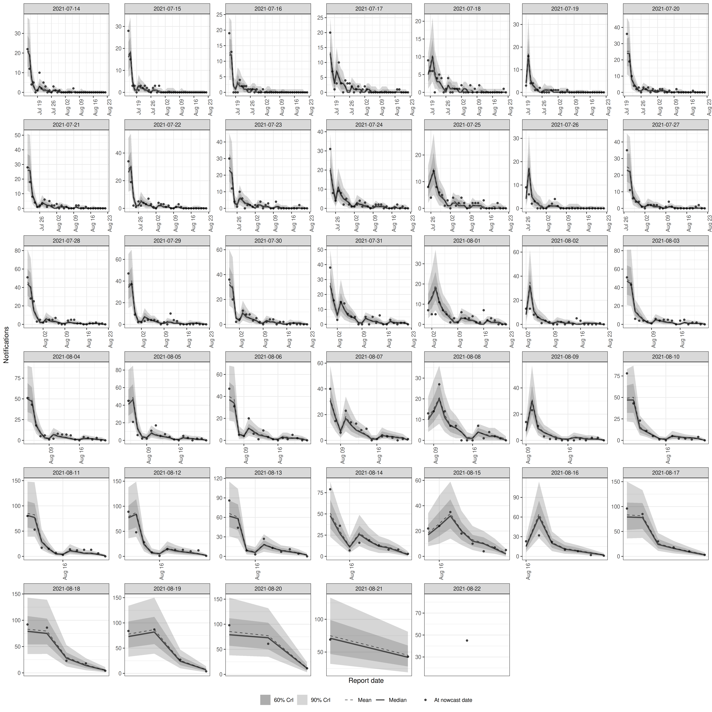

# Getting Started with Epinowcast: Nowcasting

## Quick start

In this quick start, we demonstrate using `epinowcast` to specify and
fit a minimal nowcasting model of COVID-19 hospitalisations in Germany.
Examples using more complex models are available in other package
vignettes and in the papers referenced in the literature vignette.

## Package

In this quick start, we also use `data.table` and `ggplot2` packages.
These are both installed as dependencies when `epinowcast` is installed.
Note that all output from `epinowcast` is readily useable with other
tools, including `tidyverse` packages (see
[here](https://mgimond.github.io/rug_2019_12/Index.html) for a
comparison).

Code

``` r
library(epinowcast)
library(data.table)
library(ggplot2)
```

## Data

Nowcasting of right-truncated case counts involves the estimation of
reporting delays for recently reported data. For this, we need case
counts both by when they were diagnosed (e.g. when someone tests
positive; often called “reference date”) and by when they were reported
(i.e. when administratively recorded via public health surveillance;
often called “report date”). The difference between the reference date
and the report date is the reporting delay. For this quick start, we use
data from the [Robert Koch Institute via the Germany Nowcasting
hub](https://github.com/KITmetricslab/hospitalization-nowcast-hub/wiki/Truth-data#role-an-definition-of-the-seven-day-hospitalization-incidence).
These data represent hospitalisation counts by date of positive test and
date of test report in Germany up to October 1, 2021.

### Filtering

We first filter to create a snapshot of retrospective data available 40
days before October 1, 2021 that contains 40 days of data. Then, we
create the nowcast target which is the latest available hospitalisations
by date of positive test. This will allow us to visualise how a nowcast
made at the time compares to what was ultimately reported.

Code

``` r
nat_germany_hosp <-
  germany_covid19_hosp[location == "DE"][age_group == "00+"] |>
  enw_filter_report_dates(latest_date = "2021-10-01")

retro_nat_germany <- nat_germany_hosp |>
  enw_filter_report_dates(remove_days = 40) |>
  enw_filter_reference_dates(include_days = 40)
retro_nat_germany
#>      reference_date location age_group confirm report_date
#>              <IDat>   <fctr>    <fctr>   <int>      <IDat>
#>   1:     2021-07-14       DE       00+      22  2021-07-14
#>   2:     2021-07-15       DE       00+      28  2021-07-15
#>   3:     2021-07-16       DE       00+      19  2021-07-16
#>   4:     2021-07-17       DE       00+      20  2021-07-17
#>   5:     2021-07-18       DE       00+       9  2021-07-18
#>  ---                                                      
#> 816:     2021-07-15       DE       00+      69  2021-08-21
#> 817:     2021-07-16       DE       00+      47  2021-08-22
#> 818:     2021-07-14       DE       00+      72  2021-08-21
#> 819:     2021-07-15       DE       00+      69  2021-08-22
#> 820:     2021-07-14       DE       00+      72  2021-08-22
```

This data is already in a format that can be used with `epinowcast`, as
it contains

- a reference date (column `reference_date`): the date of the
  observation, in this example the date of a positive test
- a report date (column `report_date`): the date of report for a given
  set of observations by reference date
- a count (column `confirm`): the total (i.e. cumulative) number of
  hospitalisations by reference date and report date.

The package also provides a range of tools to convert data from line
list, incidence, or other common formats into the required format (see
[Data
converters](https://package.epinowcast.org/dev/reference/index.html#data-converters)).

Code

``` r
latest_germany_hosp <- nat_germany_hosp |>
  enw_latest_data() |>
  enw_filter_reference_dates(remove_days = 40, include_days = 40)
head(latest_germany_hosp, n = 10)
#>     reference_date location age_group confirm report_date
#>             <IDat>   <fctr>    <fctr>   <int>      <IDat>
#>  1:     2021-07-14       DE       00+      74  2021-10-01
#>  2:     2021-07-15       DE       00+      69  2021-10-01
#>  3:     2021-07-16       DE       00+      49  2021-10-01
#>  4:     2021-07-17       DE       00+      67  2021-10-01
#>  5:     2021-07-18       DE       00+      51  2021-10-01
#>  6:     2021-07-19       DE       00+      36  2021-10-01
#>  7:     2021-07-20       DE       00+      96  2021-10-01
#>  8:     2021-07-21       DE       00+      94  2021-10-01
#>  9:     2021-07-22       DE       00+      99  2021-10-01
#> 10:     2021-07-23       DE       00+      88  2021-10-01
```

### Preprocessing

Before modelling, the input data needs to be converted into the
“reporting triangle” format (see [our model description for
details](https://package.epinowcast.org/articles/model)). We also need
to determine metadata to facilitate the model specification. This
includes the number of days of data to use for the reference and report
modules, the maximum delay to consider, and, optionally, a grouping
(i.e. age group, location, or both) of observations. We process reported
data into the format required for `epinowcast` and return it in a
`data.table`. At this stage, we need to specify a grouping (i.e age,
location) if any.

Code

``` r
pobs <- enw_preprocess_data(retro_nat_germany, max_delay = 40)
pobs
#>                    obs          new_confirm              latest
#>                 <list>               <list>              <list>
#> 1: <data.table[820x9]> <data.table[820x11]> <data.table[40x10]>
#>    missing_reference  reporting_triangle      metareference          metareport
#>               <list>              <list>             <list>              <list>
#> 1: <data.table[0x6]> <data.table[40x42]> <data.table[40x9]> <data.table[79x12]>
#>             metadelay max_delay  time snapshots     by groups   max_date
#>                <list>     <num> <int>     <int> <list>  <int>     <IDat>
#> 1: <data.table[40x5]>        40    40        40 [NULL]      1 2021-08-22
#>    timestep
#>      <char>
#> 1:      day
```

The returned output is in the form of a `data.table` with metadata
stored as variables. It can be useful to check this output before
specifying the model, just to make sure everything is as expected.

## Model specification

The `epinowcast` package is designed to provide users with a flexible
and customizable modelling framework. The package comes equipped with
several modules that users can utilize to construct models, and also
allows users to create their own modules. These ensures that models can
be tailored to the user’s specific data and context.

### Default nowcasting model

The default nowcasting model in `epinowcast` consists of three modules:

- A process (expectation) module that models the expected counts by date
  of reference (`reference_date`)
- A parametric reference reporting model which models the reporting
  delay distribution from the date of reference
- A non-parametric reporting model which models differences in the
  reporting delay distribution by date of report (`report_date`), for
  example, day-of-the-week effects on the reporting delay.

In the following sections, we specify simple models for each of these
modules. The appropriateness of these specifications will vary depending
on your context. See our vignettes for further details on model
specification and examples of more complex models.

### Process model

A commonly used process model in nowcasting is to model the expected
counts by date of reference via a geometric random walk as this acts as
a minimally informed smoothing prior and thus gives a lot of weight to
the observed data. This is the default process model in `epinowcast`.
Users may also specify this model for themselves using the
enw_expectation() function.

Code

``` r
expectation_module <- enw_expectation(
  ~ 0 + (1 | day), data = pobs
)
```

Here, `day` refers to the number of days from the start of the data.

As the underlying process model is an exponential growth rate model
(\\C_t = C\_{t-1} \exp^{r_t}\\), specifying a random effect
(i.e. `(1 | day)`) on the growth rate is equivalent to a geometric
random walk on expected counts by reference date.

### Reporting model by reference date

Our baseline assumption for the reporting delay is that it is
log-normally distributed, and static over time and strata. We can
specify this model using the
[`enw_reference()`](https://package.epinowcast.org/reference/enw_reference.md)
function,

Code

``` r
reference_module <- enw_reference(~1, distribution = "lognormal", data = pobs)
```

Note that the default distribution is log-normal, hence the distribution
argument could be omitted here. Alternatively we could model the
reporting delay non-parametrically using a hazard model (see [our model
description for
details](https://package.epinowcast.org/articles/model)). The following
is equivalent to a cox proportional hazards model with a single baseline
hazard function.

Code

``` r
np_reference_module <- enw_reference(
  parametric = ~0, non_parametric = ~ 0 + delay, data = pobs
)
```

Advanced users may wish to combine parametric and non-parametric
reference date reporting models. For example, we could model the
reporting delay as log-normal for delays up to 10 days and then use a
hazard model for longer delays.

### Reporting effects by report date

Even where there is evidence that reporting processes can be
approximated by a single distribution, there may be additional reporting
effects that are not captured by the reference model. For example,
reporting may be lower on weekends or holidays. We can specify a model
for these effects using a hazard formulation (which captures the
conditional relationship between different reporting delays, see [our
model description for
details](https://package.epinowcast.org/articles/model)) using the
[`enw_report()`](https://package.epinowcast.org/reference/enw_report.md)
function. Here we specify a model with a random effect for the day of
the week to capture weekly seasonality in the reporting delay.

Code

``` r
report_module <- enw_report(~ (1 | day_of_week), data = pobs)
```

## Precompiling the model

As `epinowcast` uses `cmdstan` to fit its models, it is necessary to
first compile the model. This can be done using the
[`enw_model()`](https://package.epinowcast.org/reference/enw_model.md)
function. Note that this step can be left to `epinowcast`, but here we
want to use multiple cores per chain to speed up model fitting and
therefore compile the model with this feature turned on.

Code

``` r
model <- enw_model(threads = TRUE)
```

## Bringing it all together: Fitting the model

We can now fit the model using the [“No-U-Turn Sampler Markov chain
Monte Carlo”
method](https://mc-stan.org/docs/reference-manual/hamiltonian-monte-carlo.html).
This is a type of Hamiltonian Monte Carlo (HMC) algorithm and is the
core fitting method used by `cmdstan`. The NUTS MCMC method is
efficient, automatically tunes its own parameters and is robust to
correlations between parameters, making it fast and effective at
generating samples from the posterior distribution. We specify fitting
options using
[`enw_fit_opts()`](https://package.epinowcast.org/reference/enw_fit_opts.md)
(note that the settings shown here are tuned for speed and may not be
appropriate for many real world use cases). We also pass our
preprocessed data (`pobs`), our pre-compiled model (`model`), and our
model modules (`expectation_module`, `reference_module`, and
`report_module`) to `epinowcast`, where they are combined and used to
fit the model.

Code

``` r
options(mc.cores = 2)
nowcast <- epinowcast(data = pobs,
  expectation = expectation_module,
  reference = reference_module,
  report = report_module,
  fit = enw_fit_opts(
    save_warmup = FALSE, pp = TRUE,
    chains = 2, threads_per_chain = 2,
    iter_sampling = 500, iter_warmup = 500,
    show_messages = interactive()
  ),
  model = model
)
```

## The `epinowcast` object

The
[`epinowcast()`](https://package.epinowcast.org/reference/epinowcast.md)
function returns an `epinowcast` object which includes diagnostic
information, the data used for fitting, and the underlying
[`CmdStanModel`
object](https://mc-stan.org/cmdstanr/reference/CmdStanModel.html).

Code

``` r
nowcast
#>                    obs          new_confirm              latest
#>                 <list>               <list>              <list>
#> 1: <data.table[820x9]> <data.table[820x11]> <data.table[40x10]>
#>    missing_reference  reporting_triangle      metareference          metareport
#>               <list>              <list>             <list>              <list>
#> 1: <data.table[0x6]> <data.table[40x42]> <data.table[40x9]> <data.table[79x12]>
#>             metadelay max_delay  time snapshots     by groups   max_date
#>                <list>     <num> <int>     <int> <list>  <int>     <IDat>
#> 1: <data.table[40x5]>        40    40        40 [NULL]      1 2021-08-22
#>    timestep             priors
#>      <char>             <list>
#> 1:      day <data.table[14x6]>
#>                                                                                                                                                                                                                                                                                                                                                                                                                                                                                                                                                                                                                                                                                                                                                                                                                                                                                                                                                                                                                                                                                                                                                                                                                                                                                                                                                                                                                                                                                                                                                                                                                                                                                                                                                                                                                                                                                                                                                                                                                                                                                                                                                                                                                                                                                                                                                                                                                                                                                                                                                                                                                                                                                                                                                                                                                                                                                                                                                                                                                                                                                                                                                                                                                                                                                                                                                                                                                                                             fit
#>                                                                                                                                                                                                                                                                                                                                                                                                                                                                                                                                                                                                                                                                                                                                                                                                                                                                                                                                                                                                                                                                                                                                                                                                                                                                                                                                                                                                                                                                                                                                                                                                                                                                                                                                                                                                                                                                                                                                                                                                                                                                                                                                                                                                                                                                                                                                                                                                                                                                                                                                                                                                                                                                                                                                                                                                                                                                                                                                                                                                                                                                                                                                                                                                                                                                                                                                                                                                                                                          <list>
#> 1: <CmdStanMCMC>\n  Inherits from: <CmdStanFit>\n  Public:\n    clone: function (deep = FALSE) \n    cmdstan_diagnose: function () \n    cmdstan_summary: function (flags = NULL) \n    code: function () \n    config_files: function (include_failed = FALSE) \n    constrain_variables: function (unconstrained_variables, transformed_parameters = TRUE, \n    data_file: function () \n    diagnostic_summary: function (diagnostics = c("divergences", "treedepth", "ebfmi"), \n    draws: function (variables = NULL, inc_warmup = FALSE, format = getOption("cmdstanr_draws_format", \n    expose_functions: function (global = FALSE, verbose = FALSE) \n    functions: environment\n    grad_log_prob: function (unconstrained_variables, jacobian = TRUE, jacobian_adjustment = NULL) \n    hessian: function (unconstrained_variables, jacobian = TRUE, jacobian_adjustment = NULL) \n    init: function () \n    init_model_methods: function (seed = 1, verbose = FALSE, hessian = FALSE) \n    initialize: function (runset) \n    inv_metric: function (matrix = TRUE) \n    latent_dynamics_files: function (include_failed = FALSE) \n    log_prob: function (unconstrained_variables, jacobian = TRUE, jacobian_adjustment = NULL) \n    loo: function (variables = "log_lik", r_eff = TRUE, moment_match = FALSE, \n    lp: function () \n    metadata: function () \n    metric_files: function (include_failed = FALSE) \n    num_chains: function () \n    num_procs: function () \n    output: function (id = NULL) \n    output_files: function (include_failed = FALSE) \n    print: function (variables = NULL, ..., digits = 2, max_rows = getOption("cmdstanr_max_rows", \n    profile_files: function (include_failed = FALSE) \n    profiles: function () \n    return_codes: function () \n    runset: CmdStanRun, R6\n    sampler_diagnostics: function (inc_warmup = FALSE, format = getOption("cmdstanr_draws_format", \n    save_config_files: function (dir = ".", basename = NULL, timestamp = TRUE, random = TRUE) \n    save_data_file: function (dir = ".", basename = NULL, timestamp = TRUE, random = TRUE) \n    save_latent_dynamics_files: function (dir = ".", basename = NULL, timestamp = TRUE, random = TRUE) \n    save_metric_files: function (dir = ".", basename = NULL, timestamp = TRUE, random = TRUE) \n    save_object: function (file, ...) \n    save_output_files: function (dir = ".", basename = NULL, timestamp = TRUE, random = TRUE) \n    save_profile_files: function (dir = ".", basename = NULL, timestamp = TRUE, random = TRUE) \n    summary: function (variables = NULL, ...) \n    time: function () \n    unconstrain_draws: function (files = NULL, draws = NULL, format = getOption("cmdstanr_draws_format", \n    unconstrain_variables: function (variables) \n    variable_skeleton: function (transformed_parameters = TRUE, generated_quantities = TRUE) \n  Private:\n    draws_: -1456.8448 -1455.6517 -1453.0445 -1445.7829 -1436.804 -1 ...\n    init_: NULL\n    inv_metric_: list\n    metadata_: list\n    model_methods_env_: environment\n    profiles_: NULL\n    read_csv_: function (variables = NULL, sampler_diagnostics = NULL, format = getOption("cmdstanr_draws_format", \n    return_codes_: 0 0\n    sampler_diagnostics_: 7 7 7 7 7 7 7 7 7 7 7 7 7 7 7 7 7 7 7 7 7 7 8 8 7 7 7 7  ...\n    warmup_draws_: NULL\n    warmup_sampler_diagnostics_: NULL
#>           data  fit_args init_method_output samples max_rhat
#>         <list>    <list>             <list>   <int>    <num>
#> 1: <list[112]> <list[6]>             [NULL]    1000     1.01
#>    divergent_transitions per_divergent_transitions max_treedepth
#>                    <num>                     <num>         <num>
#> 1:                     0                         0             8
#>    no_at_max_treedepth per_at_max_treedepth run_time
#>                  <int>                <num>    <num>
#> 1:                  20                 0.02     44.6
```

## Summarising and plotting the nowcast

The nowcast (the combination of currently observed and predicted
unobserved data) can then be summarised using

Code

``` r
nowcast |>
  summary(probs = c(0.05, 0.95)) |>
  head(n = 10)
#>     reference_date report_date .group max_confirm location age_group confirm
#>             <IDat>      <IDat>  <num>       <int>   <fctr>    <fctr>   <int>
#>  1:     2021-07-14  2021-08-22      1          72       DE       00+      72
#>  2:     2021-07-15  2021-08-22      1          69       DE       00+      69
#>  3:     2021-07-16  2021-08-22      1          47       DE       00+      47
#>  4:     2021-07-17  2021-08-22      1          65       DE       00+      65
#>  5:     2021-07-18  2021-08-22      1          50       DE       00+      50
#>  6:     2021-07-19  2021-08-22      1          36       DE       00+      36
#>  7:     2021-07-20  2021-08-22      1          94       DE       00+      94
#>  8:     2021-07-21  2021-08-22      1          91       DE       00+      91
#>  9:     2021-07-22  2021-08-22      1          99       DE       00+      99
#> 10:     2021-07-23  2021-08-22      1          86       DE       00+      86
#>     cum_prop_reported delay prop_reported    mean median        sd    mad    q5
#>                 <num> <num>         <num>   <num>  <num>     <num>  <num> <num>
#>  1:                 1    39             0  72.000     72 0.0000000 0.0000    72
#>  2:                 1    38             0  69.054     69 0.2305149 0.0000    69
#>  3:                 1    37             0  47.109     47 0.3394617 0.0000    47
#>  4:                 1    36             0  65.236     65 0.5005542 0.0000    65
#>  5:                 1    35             0  50.300     50 0.5782165 0.0000    50
#>  6:                 1    34             0  36.250     36 0.5289421 0.0000    36
#>  7:                 1    33             0  94.563     94 0.7473885 0.0000    94
#>  8:                 1    32             0  91.872     92 0.9656855 1.4826    91
#>  9:                 1    31             0 100.226    100 1.1850436 1.4826    99
#> 10:                 1    30             0  87.436     87 1.2559783 1.4826    86
#>       q95      rhat  ess_bulk  ess_tail
#>     <num>     <num>     <num>     <num>
#>  1:    72        NA        NA        NA
#>  2:    70 0.9985141 1032.0960 1008.0970
#>  3:    48 0.9990624  794.8951  837.0237
#>  4:    66 1.0007253  860.8058  910.5574
#>  5:    51 0.9991079  974.5339  967.9402
#>  6:    37 0.9993738 1018.5578 1010.6937
#>  7:    96 1.0002582  994.3402  933.8959
#>  8:    94 0.9999147 1119.8280 1024.3509
#>  9:   102 1.0015045 1066.8986 1026.4201
#> 10:    90 0.9993389 1003.7220  873.2440
```

Similarly, the summarised nowcast can be plotted against the latest
observed data using

Code

``` r
plot(nowcast, latest_obs = latest_germany_hosp)
```


plot of chunk nowcast

### Plotting posterior predictions

Plotting posterior predictions can be a useful way of assessing
performance and checking that the model is capturing the underlying data
generation process adequately. We can do this directly on the output of
[`epinowcast()`](https://package.epinowcast.org/reference/epinowcast.md)
using

Code

``` r
plot(nowcast, type = "posterior") +
  facet_wrap(vars(reference_date), scale = "free")
```



plot of chunk pp

### Using package functions rather than S3 methods

Rather than using S3 methods supplied for
[`epinowcast()`](https://package.epinowcast.org/reference/epinowcast.md)
directly, package functions can also be used to extract nowcast
posterior samples, summarise them, and then plot them. This is
demonstrated here by plotting the 7 day incidence for hospitalisations.

Code

``` r
# extract samples
samples <- summary(nowcast, type = "nowcast_samples")

# Take a 7 day rolling sum of both samples and observations
cols <- c("confirm", "sample")
samples[, (cols) := lapply(.SD, frollsum, n = 7),
  .SDcols = cols, by = ".draw"
][!is.na(sample)]
#>        reference_date report_date .group max_confirm location age_group confirm
#>                <IDat>      <IDat>  <num>       <int>   <fctr>    <fctr>   <int>
#>     1:     2021-07-20  2021-08-22      1          94       DE       00+     433
#>     2:     2021-07-20  2021-08-22      1          94       DE       00+     433
#>     3:     2021-07-20  2021-08-22      1          94       DE       00+     433
#>     4:     2021-07-20  2021-08-22      1          94       DE       00+     433
#>     5:     2021-07-20  2021-08-22      1          94       DE       00+     433
#>    ---                                                                         
#> 33996:     2021-08-22  2021-08-22      1          45       DE       00+    1093
#> 33997:     2021-08-22  2021-08-22      1          45       DE       00+    1093
#> 33998:     2021-08-22  2021-08-22      1          45       DE       00+    1093
#> 33999:     2021-08-22  2021-08-22      1          45       DE       00+    1093
#> 34000:     2021-08-22  2021-08-22      1          45       DE       00+    1093
#>        cum_prop_reported delay prop_reported .chain .iteration .draw sample
#>                    <num> <num>         <num>  <int>      <int> <int>  <num>
#>     1:                 1    33             0      1          1     1    435
#>     2:                 1    33             0      1          2     2    433
#>     3:                 1    33             0      1          3     3    434
#>     4:                 1    33             0      1          4     4    434
#>     5:                 1    33             0      1          5     5    433
#>    ---                                                                     
#> 33996:                 1     0             1      2        496   996   2338
#> 33997:                 1     0             1      2        497   997   1872
#> 33998:                 1     0             1      2        498   998   2438
#> 33999:                 1     0             1      2        499   999   1841
#> 34000:                 1     0             1      2        500  1000   2229
latest_germany_hosp_7day <- copy(latest_germany_hosp)[
  ,
  confirm := frollsum(confirm, n = 7)
][!is.na(confirm)]

# Summarise samples
sum_across_last_7_days <- enw_summarise_samples(samples)

# Plot samples
enw_plot_nowcast_quantiles(sum_across_last_7_days, latest_germany_hosp_7day)
```


plot of chunk week_nowcast

Here we see that the model is underestimating the incidence of
hospitalisations that were ultimately reported. There are a range of
potential reasons for this, the first being that the process model does
not fully capture the trend or day of the week periodicity present in
the data. See our case study vignettes for ideas on how deal with such
issues.
