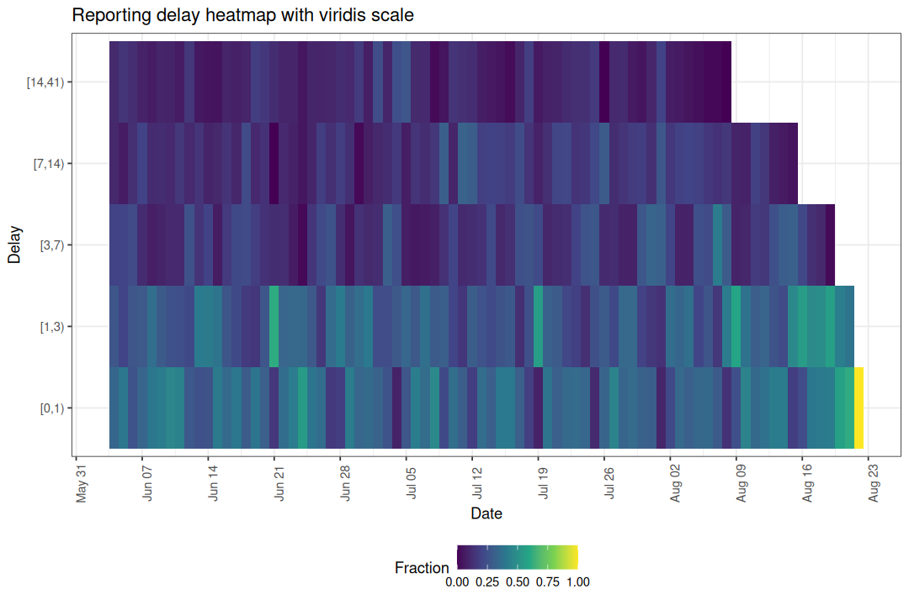

# Visualising Preprocessed Data

Before fitting a nowcasting model it is useful to explore the reporting
data to understand the delay structure, identify anomalies, and check
that preprocessing has worked as expected. This vignette walks through
the plot types available for `enw_preprocess_data` objects.

## Setup

Code

``` r
library(epinowcast)
library(data.table)
library(ggplot2)
```

## Data

We use the COVID-19 hospitalisation data included in the package,
filtered to national-level counts in Germany. We create a retrospective
snapshot as if we were standing on 1 October 2021 with 80 days of
reference dates and a maximum reporting delay of 40 days.

Code

``` r
nat_germany_hosp <-
  germany_covid19_hosp[location == "DE"][age_group == "00+"] |>
  enw_filter_report_dates(latest_date = "2021-10-01")

retro_nat_germany <- nat_germany_hosp |>
  enw_filter_report_dates(remove_days = 40) |>
  enw_filter_reference_dates(include_days = 80)
```

## Preprocessing

Code

``` r
pobs <- enw_preprocess_data(retro_nat_germany, max_delay = 40)
pobs
#> ── Preprocessed nowcast data ─────────────────────────────────────────────────── 
#> Groups: 1 | Timestep: day | Max delay: 40 
#> Observations: 80 timepoints x 80 snapshots 
#> Max date: 2021-08-22 
#> 
#> Datasets (access with `enw_get_data(x, "<name>")`): 
#>   obs                :   2,420 x 9 
#>   new_confirm        :   2,420 x 11 
#>   latest             :      80 x 10 
#>   missing_reference  :       0 x 6 
#>   reporting_triangle :      80 x 42 
#>   metareference      :      80 x 9 
#>   metareport         :     119 x 12 
#>   metadelay          :      40 x 5
```

The preprocessed object bundles several data tables together. We can now
visualise these data using the `plot` method, which dispatches to
specialised plot functions depending on the `type` argument.

All delay-based plots below are affected by right truncation: the most
recent reference dates have not yet had enough time for all reports to
arrive, so their delay distributions will appear to be shorter than the
true distribution. Keep this in mind when interpreting the rightmost
portion of each plot.

## Latest observations

The default plot type (`"obs"`) shows the latest cumulative case counts
by reference date. This is the data the model will attempt to nowcast.

Code

``` r
plot(pobs, type = "obs")
```


Figure 1: Latest reported hospitalisations by date of positive test.

The apparent drop in counts at the right edge of the series is a
hallmark of right truncation: reports for recent reference dates have
simply not had enough time to arrive. This is precisely the signal that
nowcasting aims to correct.

## Cumulative reporting delay

The `"delay_cumulative"` type shows the cumulative fraction of cases
reported by each delay group over time. Reference dates where a large
fraction is reported quickly appear as ribbons that reach the top of the
plot early. Dates where reporting is slow show wider gaps between
ribbons.

Code

``` r
plot(pobs, type = "delay_cumulative")
```


Figure 2: Cumulative fraction reported by delay group.

When no `delay_group_thresh` is supplied the thresholds are generated
automatically from `max_delay`. Custom thresholds can highlight specific
delay windows of interest.

Code

``` r
plot(
  pobs, type = "delay_cumulative",
  delay_group_thresh = c(0, 1, 3, 7, 14, 41)
)
```


Figure 3: Cumulative reporting with custom delay thresholds.

If the ribbons are stable across reference dates the delay distribution
is roughly stationary, which may justify a simpler model without
time-varying delay components. Drift or shifts in the ribbons indicate
the delay structure is changing and should be modelled.

## Reporting delay heatmap

The `"delay_fraction"` type shows the fraction of cases reported in each
delay group as a tile plot.

Code

``` r
plot(pobs, type = "delay_fraction")
```


Figure 4: Fraction of cases reported by delay group and reference date.

Here we can see changes in colour across columns that line up with day
of the week, which indicates the delay distribution depends on the
reference weekday. The cumulative plot shows how fast reports accumulate
overall, while the heatmap isolates where within the delay distribution
a change is happening.

## Reporting delay quantiles

The `"delay_quantiles"` type plots empirical quantiles of the reporting
delay distribution for each reference date. By default the 10th, 50th,
and 90th percentiles are shown.

Code

``` r
plot(pobs, type = "delay_quantiles")
```


Figure 5: Empirical delay quantiles over time.

Lower quantiles (e.g. the 10th percentile) are less affected by right
truncation because early reports have had time to arrive. Higher
quantiles (e.g. the 90th percentile) are more heavily truncated because
they depend on late-arriving reports that may not yet have been observed
for recent reference dates. A sudden drop in the higher quantiles at the
right edge is therefore expected and does not necessarily indicate a
real change in reporting speed.

Quantile lines summarise the delay distribution as a single number per
reference date, which makes small temporal trends easier to read than
from the heatmap but hides the full shape. Use the quantile plot to
check whether the median and tails drift over time; fall back to the
heatmap when you need to see which delays are responsible for a change.

Custom quantiles can be specified.

Code

``` r
plot(pobs, type = "delay_quantiles", quantiles = c(0.25, 0.5, 0.75))
```


Figure 6: Median and interquartile range of reporting delays.

## Notifications by delay group

The `"delay_counts"` type produces a stacked bar plot showing the number
of notifications by reference date, coloured by how long they took to be
reported. This combines the volume of reports with their timeliness in a
single view.

Code

``` r
plot(pobs, type = "delay_counts")
```


Figure 7: Notifications by reference date coloured by reporting delay.

Compared to the cumulative and heatmap plots, which show proportions,
this plot puts absolute counts on the y-axis. Use it when you care about
the size of each delay group in context with the overall reporting
volume, for example when deciding whether a noisy-looking right edge is
supported by many notifications or by only a handful.

## Using the individual plot functions

Each plot type corresponds to an exported function that can be called
directly for more control.

| Plot type            | Function                                                                                               |
|:---------------------|:-------------------------------------------------------------------------------------------------------|
| `"obs"`              | [`enw_plot_obs()`](https://package.epinowcast.org/reference/enw_plot_obs.md)                           |
| `"delay_cumulative"` | [`enw_plot_delay_cumulative()`](https://package.epinowcast.org/reference/enw_plot_delay_cumulative.md) |
| `"delay_fraction"`   | [`enw_plot_delay_fraction()`](https://package.epinowcast.org/reference/enw_plot_delay_fraction.md)     |
| `"delay_quantiles"`  | [`enw_plot_delay_quantiles()`](https://package.epinowcast.org/reference/enw_plot_delay_quantiles.md)   |
| `"delay_counts"`     | [`enw_plot_delay_counts()`](https://package.epinowcast.org/reference/enw_plot_delay_counts.md)         |

These return standard `ggplot2` objects so layers, facets, and themes
can be added freely. Grouped data are auto-faceted by `.group`; pass
`facet = FALSE` to disable and supply your own layout.

Code

``` r
enw_plot_delay_fraction(
  pobs, delay_group_thresh = c(0, 1, 3, 7, 14, 41)
) +
  scale_fill_viridis_c() +
  ggtitle("Reporting delay heatmap with viridis scale")
```



## Helper functions

Two helper functions underpin the delay-based plots and can be used
independently for custom analyses.

[`enw_delay_categories()`](https://package.epinowcast.org/reference/enw_delay_categories.md)
categorises notifications into delay groups and computes empirical
reporting proportions.

Code

``` r
nc <- enw_delay_categories(
  pobs, delay_group_thresh = c(0, 1, 3, 7, 14, 41)
)
head(nc)
#> Key: <.group>
#>    .group reference_date delay_group confirm new_confirm max_confirm
#>     <num>         <IDat>      <fctr>   <int>       <int>       <int>
#> 1:      1     2021-06-04       [0,1)      47          47         142
#> 2:      1     2021-06-04       [1,3)      85          38         142
#> 3:      1     2021-06-04       [3,7)     113          28         142
#> 4:      1     2021-06-04      [7,14)     127          14         142
#> 5:      1     2021-06-04     [14,41)     142          15         142
#> 6:      1     2021-06-05       [0,1)      49          49         125
#>    prop_reported cum_prop_reported
#>            <num>             <num>
#> 1:    0.33098592         0.3309859
#> 2:    0.26760563         0.5985915
#> 3:    0.19718310         0.7957746
#> 4:    0.09859155         0.8943662
#> 5:    0.10563380         1.0000000
#> 6:    0.39200000         0.3920000
```

[`enw_delay_quantiles()`](https://package.epinowcast.org/reference/enw_delay_quantiles.md)
computes empirical delay quantiles by reference date.

Code

``` r
eq <- enw_delay_quantiles(pobs)
head(eq)
#> Key: <.group>
#>    .group reference_date   0.1   0.5   0.9
#>     <num>         <IDat> <num> <num> <num>
#> 1:      1     2021-06-04     0     1    14
#> 2:      1     2021-06-05     0     1    17
#> 3:      1     2021-06-06     0     2    16
#> 4:      1     2021-06-07     0     1    13
#> 5:      1     2021-06-08     0     1    11
#> 6:      1     2021-06-09     0     1    13
```
