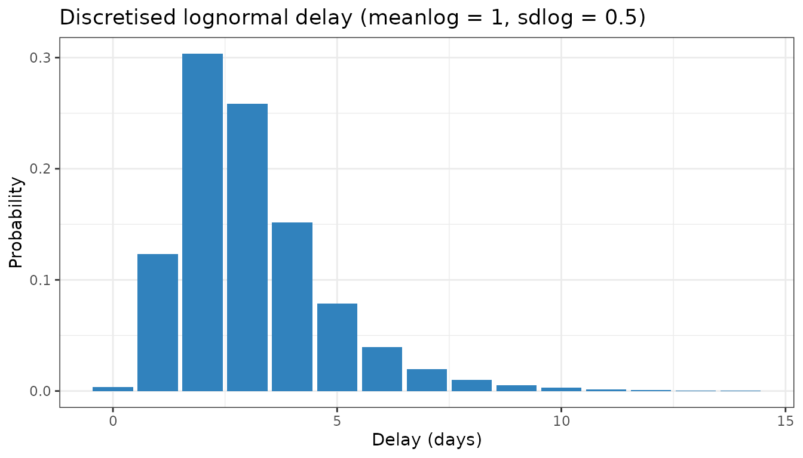

# Discretised distributions

This vignette describes the parametric delay distributions that are
currently available in `epinowcast` and explains how they are internally
discretised.

``` r

library(data.table)
```

    ## 
    ## Attaching package: 'data.table'

    ## The following object is masked from 'package:base':
    ## 
    ##     %notin%

``` r

library(ggplot2)
```

## Available distributions

The currently available parametric delay distributions are continuous
probability distributions with (up to) two parameters \\\mu\_{g,t}\\ and
\\\upsilon\_{g,t}\\. The table below provides a link to the definition
of each distribution, specifies how the parameters \\\mu\_{g,t}\\ and
\\\upsilon\_{g,t}\\ are mapped to the parameters of the distribution
(according to the referenced definition), and states the resulting mean
of the distribution (before discretization and adjustment for the
assumed maximum delay).

| Distribution | Parametrization | Mean |
|:--:|:--:|:--:|
| [Log-normal](https://mc-stan.org/docs/functions-reference/lognormal.html) | \\\mu=\mu\_{g,t}\\, \\\sigma = \upsilon\_{g,t}\\ | \\\exp(\mu\_{g,t}+\frac{\upsilon\_{g,t}^2}{2})\\ |
| [Exponential](https://mc-stan.org/docs/functions-reference/exponential-distribution.html) | \\\beta = \exp(-\mu\_{g,t})\\ | \\\exp(\mu\_{g,t})\\ |
| [Gamma](https://mc-stan.org/docs/functions-reference/gamma-distribution.html) | \\\alpha = \exp(\mu\_{g,t})\\, \\\beta = \upsilon\_{g,t}\\ | \\\exp(\mu\_{g,t})/\upsilon\_{g,t}\\ |

The log-logistic distribution was previously available but has been
dropped pending log-logistic support in `primarycensored`
([epinowcast/primarycensored#321](https://github.com/epinowcast/primarycensored/issues/321)).

## Discretisation and adjustment for maximum delay

In `epinowcast`, delays are modelled in discrete time and with an
assumed maximum delay (specified via the `max_delay` argument). The
continuous delay distributions must therefore be discretised and
adjusted for the maximum delay.

It is helpful to separate two distinct adjustments. The first is
discretisation: turning the continuous delay into a probability mass
over integer delays \\d = 0, 1, 2, \dots\\, with each \\p_d\\ defined
for an infinite maximum delay so that \\\sum\_{d=0}^{\infty} p_d = 1\\.
The second is conditioning on the maximum delay \\D\\: restricting
attention to delays \\d \le D\\ and renormalising so that the truncated
probabilities sum to 1, i.e. \\p^{\prime}\_{d} = p_d / \sum\_{j=0}^{D}
p_j\\. The first step is about how a continuous distribution becomes
discrete; the second is about right truncation at \\D\\.

### Double interval censoring with `primarycensored`

`epinowcast` discretises the parametric reference delay using the double
interval censoring approach from the
[primarycensored](https://primarycensored.epinowcast.org)
package^(\[1\]). This accounts for the primary event window, the
secondary (reporting) interval, and right truncation at the maximum
delay \\D\\.

Let \\F^{\mu\_{g,t}, \upsilon\_{g,t}}\\ be the cumulative distribution
function of the continuous delay distribution. The primary event
(e.g. infection) is not observed exactly but is assumed uniform over a
window of width 1 day. Censoring the continuous delay by this primary
window gives \\Q(t) = \int_0^1 F^{\mu\_{g,t}, \upsilon\_{g,t}}(t - s) \\
\mathrm{d}s,\\ the cumulative probability that the delay, measured from
the start of the primary window, is at most \\t\\. The secondary event
is observed in a daily reporting interval, so the mass on an integer
delay \\d\\ is the increment of \\Q\\ over that interval, conditioned on
the maximum delay \\D\\, \\p\_{g,t,d} = \frac{Q(d + 1) - Q(d)}{Q(D)},
\qquad d = 0, 1, \dots, D - 1.\\ The denominator \\Q(D)\\ applies the
right truncation, so the discretised probabilities sum to 1.

`primarycensored` evaluates \\Q\\ with analytical solutions for the
supported distributions (the exponential is handled as a gamma with
shape one), and the Stan implementation is vendored directly from the
package. This is applied automatically to all available parametric
distributions (lognormal, gamma and exponential); no argument is needed.
See the [`primarycensored`
documentation](https://primarycensored.epinowcast.org) for the full
derivation, including arbitrary primary and secondary window widths.

The discretised mass function for a lognormal delay (`meanlog = 1`,
`sdlog = 0.5`) truncated at a maximum delay of 15 days, obtained
directly from
[`primarycensored::dprimarycensored()`](https://primarycensored.epinowcast.org/reference/dprimarycensored.html):

``` r

dmax <- 15
pmf <- data.table(
  delay = 0:(dmax - 1),
  probability = primarycensored::dprimarycensored(
    0:(dmax - 1), plnorm, pwindow = 1, swindow = 1, D = dmax,
    meanlog = 1, sdlog = 0.5
  )
)

ggplot(pmf, aes(x = delay, y = probability)) +
  geom_col(fill = "#3182bd") +
  labs(
    x = "Delay (days)", y = "Probability",
    title = "Discretised lognormal delay (meanlog = 1, sdlog = 0.5)"
  ) +
  theme_bw()
```



The same `primarycensored` machinery underpins delay handling elsewhere
in the ecosystem. [`epidist`](https://epidist.epinowcast.org) estimates
delay distributions from individual line-list data, and
[`EpiNow2::estimate_dist()`](https://epiforecasts.io/EpiNow2/) fits them
from aggregated count data; both are powered by `primarycensored`, with
the main difference being the data structure they expect. Estimating a
delay with one of those tools and then passing it to
[`enw_reference()`](https://package.epinowcast.org/dev/reference/enw_reference.md)
keeps the censoring assumptions consistent across the workflow.

1\.

Abbott, S., Brand, S., Azam, J. M., Pearson, C., Funk, S., & Charniga,
K. (2024). *Primarycensored: Primary event censored distributions*.
<https://doi.org/10.5281/zenodo.13632839>
