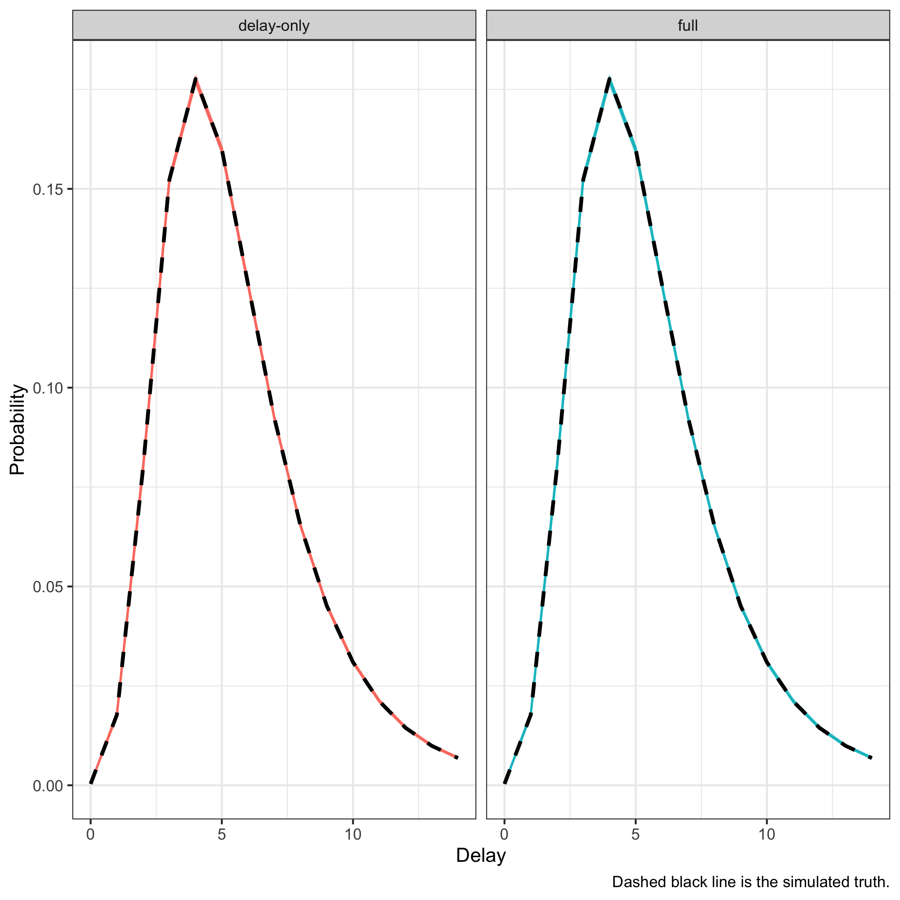

In this case study we estimate a reporting delay distribution two ways and compare them.
The first is the full `epinowcast` nowcasting model, which jointly estimates the latent process and the delay.
The second is the *delay-only* model, which conditions on known per-reference-date totals and fits only the delay.
For more on the `epinowcast` package see the [documentation](https://package.epinowcast.org/).

::: {.alert .alert-primary}
## Use case {-}

We have a reporting triangle and we want the reporting-delay distribution.
We are not (here) interested in the latent process or a nowcast.
We either know the final totals per reference date or are willing to treat the latest running totals as fixed.
:::

## Other tools for delay estimation

This vignette estimates delays from *aggregate* reporting triangles.
If you have *individual* (line list) data, [`epidist`](https://epidist.epinowcast.org/) estimates delay distributions directly from primary and secondary event times.
Both `epidist` and the delay-only model here build on [`primarycensored`](https://primarycensored.epinowcast.org/), which provides the primary-event-censored, truncated distributions that underpin correct delay estimation; the main difference between the approaches is the data structure they expect (aggregate counts here versus individual event times in `epidist`).
The [`EpiNow2::estimate_dist()`](https://epiforecasts.io/EpiNow2/) function fills a similar role for delay estimation in that ecosystem.

## Two ways to estimate a delay

The full model treats each cell of the reporting triangle as a noisy observation of an expected value built from a latent process and the delay distribution.
The delay is identified jointly with the latent process, and for recent reference dates uncertainty in the latent process propagates into the delay.

The delay-only model takes the total for each reference date as fixed truth and models only how that total is split across delays.
For a reference date with total $N_t$ and delay probabilities $p_d$ the observed cells $n_{t,d}$ follow a multinomial,
$$ n_{t, 0:D} \mid N_t \sim \mathrm{Multinomial}(N_t, p_{0:D}), $$
which is the standard conditional delay likelihood [@kalbfleisch1989; @hohle].
When only delays up to some horizon are observed the probabilities are renormalised over the observed range, giving a truncated multinomial.
This removes the latent-process identification burden and gives tighter delay estimates at recent dates, at the cost of assuming the totals are correct.

The delay-only model cannot be combined with the missing reference date module (`enw_missing()`): it conditions on the known totals of fully referenced cells, so there is no separate missing-reference stream to model.

## Getting set up


``` r
library(epinowcast)
library(ggplot2)
library(data.table)
```


## Simulating a reporting triangle

We simulate hospitalisations with a known lognormal reporting delay so we can check that each model recovers the truth.
Each reference date has a known total split across delays by the delay PMF.


``` r
set.seed(890)

meanlog <- 1.6
sdlog <- 0.5
max_delay <- 15
n_dates <- 60
total <- 2000

# The true delay PMF under the package's double-censored discretisation.
# (This is the same scheme epinowcast uses internally; we reproduce it here
# so the simulated truth matches the model's parameterisation.)
discretise_lognormal <- function(meanlog, sdlog, dmax) {
  lcdf <- plnorm(1:dmax, meanlog, sdlog, log.p = TRUE)
  m <- max(lcdf[dmax], lcdf[dmax - 1])
  lcdf <- lcdf - (m + log(sum(exp(c(lcdf[dmax], lcdf[dmax - 1]) - m))))
  p <- numeric(dmax)
  p[1] <- exp(lcdf[1])
  p[2] <- exp(lcdf[2])
  p[3:dmax] <- exp(lcdf[3:dmax]) - exp(lcdf[1:(dmax - 2)])
  p
}
delay_pmf <- discretise_lognormal(meanlog, sdlog, max_delay)

dates <- as.Date("2021-01-01") + 0:(n_dates - 1)
delays <- 0:(max_delay - 1)
counts <- round(total * delay_pmf)

obs <- rbindlist(lapply(seq_along(dates), function(i) {
  data.table(
    reference_date = dates[i],
    report_date = dates[i] + delays,
    confirm = cumsum(counts)
  )
}))

pobs <- enw_preprocess_data(obs, max_delay = max_delay)
```

## Fitting the full model


``` r
full_fit <- epinowcast(
  pobs,
  reference = enw_reference(~1, distribution = "lognormal", data = pobs),
  obs = enw_obs(family = "poisson", data = pobs),
  fit = enw_fit_opts(
    save_warmup = FALSE, chains = 2,
    iter_warmup = 500, iter_sampling = 500,
    show_messages = FALSE, refresh = 0
  )
)
```

## Fitting the delay-only model

The delay-only model uses the same reference-delay specification but sets `delay_only = TRUE` in `enw_obs()`.
The expectation module is supplied but inert (its expected observations are overridden by the known totals), so we pass a minimal `~1` expectation.


``` r
delay_fit <- epinowcast(
  pobs,
  expectation = enw_expectation(~1, data = pobs),
  reference = enw_reference(~1, distribution = "lognormal", data = pobs),
  obs = enw_obs(family = "poisson", delay_only = TRUE, data = pobs),
  fit = enw_fit_opts(
    nowcast = FALSE, save_warmup = FALSE, chains = 2,
    iter_warmup = 500, iter_sampling = 500,
    show_messages = FALSE, refresh = 0
  )
)
```

## Comparing the recovered delay parameters

Both models should recover the simulated lognormal parameters (`meanlog` = 1.6, `sdlog` = 0.5).
We compare the posterior of the actual distribution parameters against the truth.


``` r
pars <- c("refp_mean_int", "refp_sd_int")
truth <- data.table(
  variable = c("refp_mean_int[1]", "refp_sd_int[1]"),
  truth = c(meanlog, sdlog)
)

param_summary <- rbind(
  data.table(model = "full", full_fit$fit[[1]]$summary(pars)),
  data.table(model = "delay-only", delay_fit$fit[[1]]$summary(pars))
)
param_summary <- merge(
  param_summary, truth, by = "variable"
)[, .(model, variable, truth, mean, q5, q95)]
param_summary[]
#> Key: <variable>
#>         model         variable truth      mean        q5       q95
#>        <char>           <char> <num>     <num>     <num>     <num>
#> 1:       full refp_mean_int[1]   1.6 1.5999981 1.5975230 1.6025561
#> 2: delay-only refp_mean_int[1]   1.6 1.6000279 1.5974073 1.6026692
#> 3:       full   refp_sd_int[1]   0.5 0.5006905 0.4986731 0.5029385
#> 4: delay-only   refp_sd_int[1]   0.5 0.5007245 0.4985879 0.5028382
```

The posterior means sit on the simulated truth for both models, demonstrating recovery.

## Comparing the recovered delay distribution

We use `enw_posterior_delay()` to extract posterior *samples* of the delay PMF from each fit and plot them against the truth, rather than only the posterior mean.


``` r
full_pmf <- enw_posterior_delay(
  full_fit$fit[[1]], max_delay = max_delay, draws = 100
)[, model := "full"]
delay_pmf_draws <- enw_posterior_delay(
  delay_fit$fit[[1]], max_delay = max_delay, draws = 100
)[, model := "delay-only"]

truth_dt <- data.table(delay = delays, pmf = delay_pmf)

ggplot() +
  geom_line(
    data = rbind(full_pmf, delay_pmf_draws),
    aes(x = delay, y = pmf, group = interaction(model, .draw), colour = model),
    alpha = 0.1
  ) +
  geom_line(
    data = truth_dt, aes(x = delay, y = pmf), colour = "black",
    linewidth = 1, linetype = "dashed"
  ) +
  facet_wrap(vars(model)) +
  labs(
    x = "Delay", y = "Probability", colour = NULL,
    caption = "Dashed black line is the simulated truth."
  ) +
  theme_bw() +
  theme(legend.position = "none")
```

<div class="figure">

<p class="caption">Posterior samples of the delay distribution from each model against the truth</p>
</div>

The posterior samples (coloured) bracket the simulated truth (dashed), so both models recover the delay; the delay-only posterior is the tighter of the two because it does not carry latent-process uncertainty.

## Using the delay-only estimate to set priors

A delay-only fit is a fast way to get a delay estimate that can then *inform a full nowcast*.
The posterior delay parameters can be passed as priors to a subsequent full model via `enw_reference()` (see `?enw_reference` for the `..._p` prior arguments) and `enw_replace_priors()`, so the full model starts from a data-driven delay rather than the package defaults.
This is useful when the delay is well identified from historical (fully reported) data but the latent process at recent dates is not.

## When to use the delay-only model

The delay-only model is the right tool when the totals are trustworthy and a delay estimate, rather than a nowcast, is the goal.
It is faster and gives tighter delay estimates at recent reference dates because it does not have to identify the latent process.
It does not produce a nowcast; for that, use the full model.
If the totals are themselves uncertain (subject to later revision) the full model is preferable, since the delay-only model treats them as fixed and will be overconfident.

The delay-only model also supports an observation indicator (gaps in the reporting triangle) and running totals observed only up to a horizon.
In both cases the multinomial renormalises over all delays up to the observation cutoff, so interior cells that are unobserved but before the cutoff still contribute.

## References
