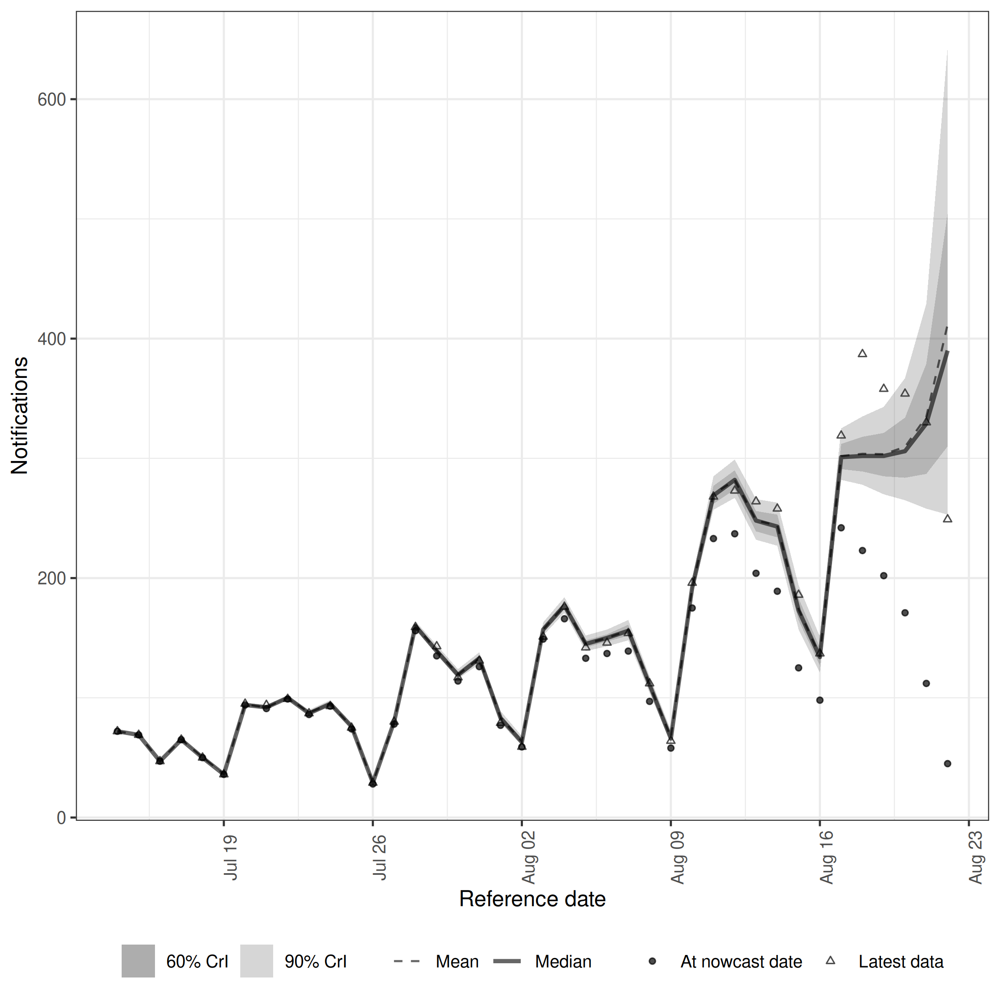
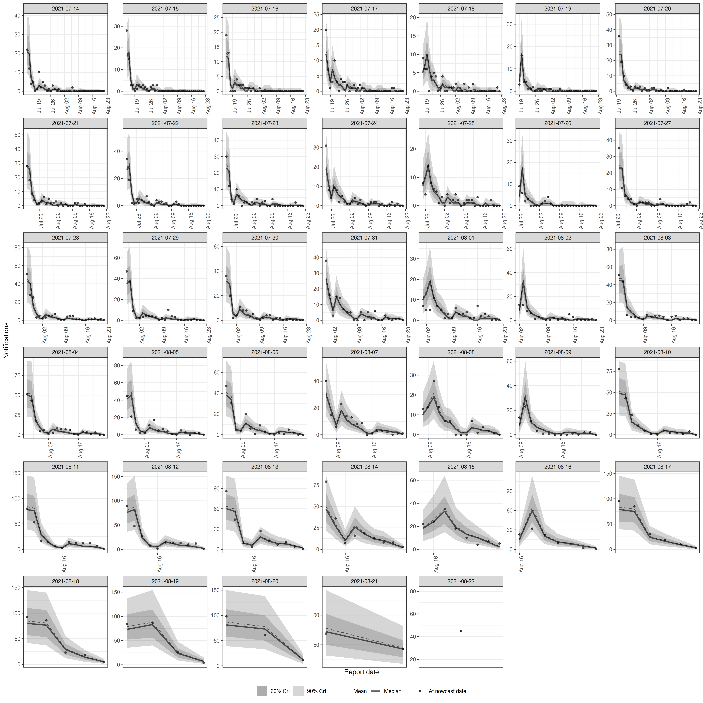
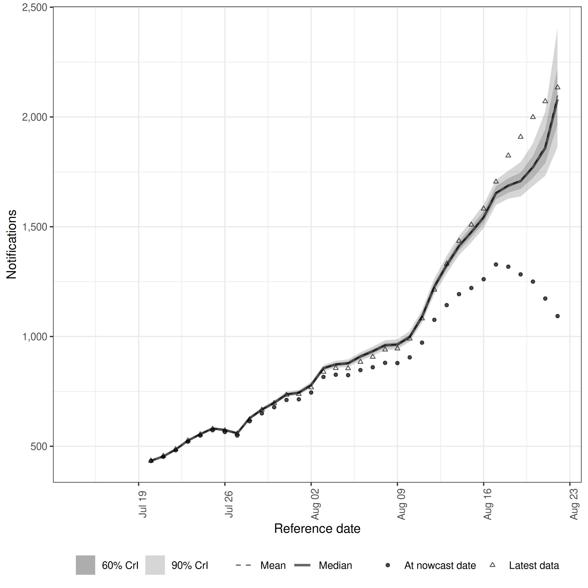

# Quick start

In this quick start, we demonstrate using `epinowcast` to specify and fit a minimal nowcasting model of COVID-19 hospitalisations in Germany. Examples using more complex models are available in other package vignettes and in the papers referenced in the literature vignette.

# Package

In this quick start, we also use `data.table` and `ggplot2` packages. These are both installed as dependencies when `epinowcast` is installed. Note that all output from `epinowcast` is readily useable with  other tools, including `tidyverse` packages (see [here](https://mgimond.github.io/rug_2019_12/Index.html) for a comparison).


``` r
library(epinowcast)
library(data.table)
library(ggplot2)
```

# Data

Nowcasting of right-truncated case counts involves the estimation of reporting delays for recently reported data. For this, we need case counts both by when they were diagnosed (e.g. when someone tests positive; often called "reference date") and by when they were reported (i.e. when administratively recorded via public health surveillance; often called "report date"). The difference between the reference date and the report date is the reporting delay. For this quick start, we use data from the [Robert Koch Institute via the Germany Nowcasting hub](https://github.com/KITmetricslab/hospitalization-nowcast-hub/wiki/Truth-data#role-an-definition-of-the-seven-day-hospitalization-incidence). These data represent hospitalisation counts by date of positive test and date of test report in Germany up to October 1, 2021.

## Filtering

We first filter to create a snapshot of retrospective data available 40 days before October 1, 2021 that contains 40 days of data. Then, we create the nowcast target which is the latest available hospitalisations by date of positive test. This will allow us to visualise how a nowcast made at the time compares to what was ultimately reported.


``` r
nat_germany_hosp <-
  germany_covid19_hosp[location == "DE"][age_group == "00+"] |>
  enw_filter_report_dates(latest_date = "2021-10-01")

retro_nat_germany <- nat_germany_hosp |>
  enw_filter_report_dates(remove_days = 40) |>
  enw_filter_reference_dates(include_days = 40)
retro_nat_germany
#>      reference_date location age_group confirm report_date
#>              <IDat>   <fctr>    <fctr>   <int>      <IDat>
#>   1:     2021-07-14       DE       00+      22  2021-07-14
#>   2:     2021-07-15       DE       00+      28  2021-07-15
#>   3:     2021-07-16       DE       00+      19  2021-07-16
#>   4:     2021-07-17       DE       00+      20  2021-07-17
#>   5:     2021-07-18       DE       00+       9  2021-07-18
#>  ---                                                      
#> 816:     2021-07-15       DE       00+      69  2021-08-21
#> 817:     2021-07-16       DE       00+      47  2021-08-22
#> 818:     2021-07-14       DE       00+      72  2021-08-21
#> 819:     2021-07-15       DE       00+      69  2021-08-22
#> 820:     2021-07-14       DE       00+      72  2021-08-22
```

This data is already in a format that can be used with `epinowcast`, as it contains

- a reference date (column `reference_date`): the date of the observation, in this example the date of a positive test
- a report date (column `report_date`): the date of report for a given set of observations by reference date
- a count (column `confirm`): the total (i.e. cumulative) number of hospitalisations by reference date and report date.

The package also provides a range of tools to convert data from line list, incidence, or other common formats into the required format (see [Data converters](https://package.epinowcast.org/dev/reference/index.html#data-converters)).


``` r
latest_germany_hosp <- nat_germany_hosp |>
  enw_obs_at_delay(max_delay = 40) |>
  enw_filter_reference_dates(remove_days = 40, include_days = 40)
head(latest_germany_hosp, n = 10)
#>     reference_date .group location age_group confirm report_date
#>             <IDat>  <num>   <fctr>    <fctr>   <int>      <IDat>
#>  1:     2021-07-14      1       DE       00+      72  2021-08-22
#>  2:     2021-07-15      1       DE       00+      69  2021-08-23
#>  3:     2021-07-16      1       DE       00+      47  2021-08-24
#>  4:     2021-07-17      1       DE       00+      65  2021-08-25
#>  5:     2021-07-18      1       DE       00+      50  2021-08-26
#>  6:     2021-07-19      1       DE       00+      36  2021-08-27
#>  7:     2021-07-20      1       DE       00+      95  2021-08-28
#>  8:     2021-07-21      1       DE       00+      94  2021-08-29
#>  9:     2021-07-22      1       DE       00+      99  2021-08-30
#> 10:     2021-07-23      1       DE       00+      87  2021-08-31
```

## Preprocessing

Before modelling, the input data needs to be converted into the "reporting triangle" format (see [our model description for details](https://package.epinowcast.org/articles/model)). We also need to determine metadata to facilitate the model specification. This includes the number of days of data to use for the reference and report modules, the maximum delay to consider, and, optionally, a grouping (i.e. age group, location, or both) of observations.
We process reported data into the format required for `epinowcast` and return it in a `data.table`. At this stage, we need to specify a grouping (i.e age, location) if any. 


``` r
pobs <- enw_preprocess_data(retro_nat_germany, max_delay = 40)
pobs
#> ── Preprocessed nowcast data ─────────────────────────────────────────────────── 
#> Groups: 1 | Timestep: day | Max delay: 40 
#> Observations: 40 timepoints x 40 snapshots 
#> Max date: 2021-08-22 
#> 
#> Datasets (access with `enw_get_data(x, "<name>")`): 
#>   obs                :     820 x 9 
#>   new_confirm        :     820 x 11 
#>   latest             :      40 x 10 
#>   missing_reference  :       0 x 6 
#>   reporting_triangle :      40 x 42 
#>   metareference      :      40 x 9 
#>   metareport         :      79 x 12 
#>   metadelay          :      40 x 5
```

The returned output is an `enw_preprocess_data` object.
Printing it shows the key metadata and dimensions of each nested dataset.
To extract a specific dataset, use `enw_get_data()`:


``` r
enw_get_data(pobs, "latest") |> head()
#>    reference_date report_date .group max_confirm location age_group confirm
#>            <IDat>      <IDat>  <num>       <int>   <fctr>    <fctr>   <int>
#> 1:     2021-07-14  2021-08-22      1          72       DE       00+      72
#> 2:     2021-07-15  2021-08-22      1          69       DE       00+      69
#> 3:     2021-07-16  2021-08-22      1          47       DE       00+      47
#> 4:     2021-07-17  2021-08-22      1          65       DE       00+      65
#> 5:     2021-07-18  2021-08-22      1          50       DE       00+      50
#> 6:     2021-07-19  2021-08-22      1          36       DE       00+      36
#>    cum_prop_reported delay prop_reported
#>                <num> <num>         <num>
#> 1:                 1    39             0
#> 2:                 1    38             0
#> 3:                 1    37             0
#> 4:                 1    36             0
#> 5:                 1    35             0
#> 6:                 1    34             0
```

For a more detailed overview including a preview of the reporting triangle, use `summary()`:


``` r
summary(pobs)
#> ── Preprocessed nowcast data summary ─────────────────────────────────────────── 
#> Groups: 1 | Timestep: day | Max delay: 40 
#> Date range: 2021-07-14 to 2021-08-22 (39 days) 
#> Observations: 40 timepoints x 40 snapshots 
#> 
#> Latest observations (first 6 rows): 
#>    reference_date report_date .group max_confirm location age_group confirm
#>            <IDat>      <IDat>  <num>       <int>   <fctr>    <fctr>   <int>
#> 1:     2021-07-14  2021-08-22      1          72       DE       00+      72
#> 2:     2021-07-15  2021-08-22      1          69       DE       00+      69
#> 3:     2021-07-16  2021-08-22      1          47       DE       00+      47
#> 4:     2021-07-17  2021-08-22      1          65       DE       00+      65
#> 5:     2021-07-18  2021-08-22      1          50       DE       00+      50
#> 6:     2021-07-19  2021-08-22      1          36       DE       00+      36
#>    cum_prop_reported delay prop_reported
#>                <num> <num>         <num>
#> 1:                 1    39             0
#> 2:                 1    38             0
#> 3:                 1    37             0
#> 4:                 1    36             0
#> 5:                 1    35             0
#> 6:                 1    34             0
#> 
#> Reporting triangle corner (first 6 rows x 8 cols): 
#> Key: <.group, reference_date>
#>    .group reference_date     0     1     2     3     4     5
#>     <num>         <IDat> <int> <int> <int> <int> <int> <int>
#> 1:      1     2021-07-14    22    12     4     5     0     1
#> 2:      1     2021-07-15    28    15     3     3     0     1
#> 3:      1     2021-07-16    19    13     0     0     0     4
#> 4:      1     2021-07-17    20     7     1     3    10     3
#> 5:      1     2021-07-18     9     6     6     0     4     5
#> 6:      1     2021-07-19     3    16     4     4     1     1
#> ... (40 rows x 42 cols total)
```

It can be useful to check this output before specifying the model, just to make sure everything is as expected.

# Model specification

The `epinowcast` package is designed to provide users with a flexible and customizable modelling framework. The package comes equipped with several modules that users can utilize to construct models, and also allows users to create their own modules. These ensures that models can be tailored to the user's specific data and context.

## Default nowcasting model

The default nowcasting model in `epinowcast` consists of three modules: 

- A process (expectation) module that models the expected counts by date of reference (`reference_date`)
- A parametric reference reporting model which models the reporting delay distribution from the date of reference
- A non-parametric reporting model which models differences in the reporting delay distribution by date of report (`report_date`), for example, day-of-the-week effects on the reporting delay.

In the following sections, we specify simple models for each of these modules. The appropriateness of these specifications will vary depending on your context. See our vignettes for further details on model specification and examples of more complex models.

Each module defines its own default priors which can be inspected and customised.
See `?epinowcast` for details on inspecting and setting priors.

## Process model

A commonly used process model in nowcasting is to model the expected counts by date of reference via a geometric random walk as this acts as a minimally informed smoothing prior and thus gives a lot of weight to the observed data. This is the default process model in `epinowcast`. Users may also specify this model for themselves using the enw_expectation() function.


``` r
expectation_module <- enw_expectation(
  ~ 0 + (1 | day), data = pobs
)
```

Here, `day` refers to the number of days from the start of the data.

As the underlying process model is an exponential growth rate model ($C_t = C_{t-1} \exp^{r_t}$), specifying a random effect (i.e. `(1 | day)`) on the growth rate is equivalent to a geometric random walk on expected counts by reference date.

## Reporting model by reference date

Our baseline assumption for the reporting delay is that it is log-normally distributed, and static over time and strata. We can specify this model using the `enw_reference()` function,


``` r
reference_module <- enw_reference(~1, distribution = "lognormal", data = pobs)
```

Note that the default distribution is log-normal, hence the distribution argument could be omitted here. Alternatively we could model the reporting delay non-parametrically using a hazard model (see [our model description for details](https://package.epinowcast.org/articles/model)). The following is equivalent to a cox proportional hazards model with a single baseline hazard function.


``` r
np_reference_module <- enw_reference(
  parametric = ~0, non_parametric = ~ 0 + delay, data = pobs
)
```

Advanced users may wish to combine parametric and non-parametric reference date reporting models. For example, we could model the reporting delay as log-normal for delays up to 10 days and then use a hazard model for longer delays.

## Reporting effects by report date

Even where there is evidence that reporting processes can be approximated by a single distribution, there may be additional reporting effects that are not captured by the reference model. For example, reporting may be lower on weekends or holidays. We can specify a model for these effects using a hazard formulation (which captures the conditional relationship between different reporting delays, see [our model description for details](https://package.epinowcast.org/articles/model)) using the `enw_report()` function. Here we specify a model with a random effect for the day of the week to capture weekly seasonality in the reporting delay.


``` r
report_module <- enw_report(~ (1 | day_of_week), data = pobs)
```

# Precompiling the model

As `epinowcast` uses `cmdstan` to fit its models, it is necessary to first compile the model. This can be done using the `enw_model()` function. Note that this step can be left to `epinowcast`, but here we want to use multiple cores per chain to speed up model fitting and therefore compile the model with this feature turned on.


``` r
model <- enw_model(threads = TRUE)
```

# Bringing it all together: Fitting the model

We can now fit the model using the ["No-U-Turn Sampler Markov chain Monte Carlo" method](https://mc-stan.org/docs/reference-manual/hamiltonian-monte-carlo.html). This is a type of Hamiltonian Monte Carlo (HMC) algorithm and is the core fitting method used by `cmdstan`. The NUTS MCMC method is efficient, automatically tunes its own parameters and is robust to correlations between parameters, making it fast and effective at generating samples from the posterior distribution. We specify fitting options using `enw_fit_opts()` (note that the settings shown here are tuned for speed and may not be appropriate for many real world use cases). We also pass our preprocessed data (`pobs`), our pre-compiled model (`model`), and our model modules (`expectation_module`, `reference_module`, and `report_module`) to `epinowcast`, where they are combined and used to fit the model.


``` r
options(mc.cores = 2)
nowcast <- epinowcast(data = pobs,
  expectation = expectation_module,
  reference = reference_module,
  report = report_module,
  fit = enw_fit_opts(
    save_warmup = FALSE, pp = TRUE,
    chains = 2, threads_per_chain = 2,
    iter_sampling = 500, iter_warmup = 500,
    show_messages = interactive()
  ),
  model = model
)
```

# The `epinowcast` object

The `epinowcast()` function returns an `epinowcast` object which includes diagnostic information, the data used for fitting, and the underlying [`CmdStanModel` object](https://mc-stan.org/cmdstanr/reference/CmdStanModel.html).
Printing it shows key diagnostics including the number of samples, convergence (Rhat), and any divergent transitions.


``` r
nowcast
#> ── epinowcast model output ───────────────────────────────────────────────────── 
#> Groups: 1 | Timestep: day | Max delay: 40 
#> Observations: 40 timepoints x 40 snapshots 
#> Max date: 2021-08-22 
#> 
#> Datasets (access with `enw_get_data(x, "<name>")`): 
#>   obs                :     820 x 9 
#>   new_confirm        :     820 x 11 
#>   latest             :      40 x 10 
#>   missing_reference  :       0 x 6 
#>   reporting_triangle :      40 x 42 
#>   metareference      :      40 x 9 
#>   metareport         :      79 x 12 
#>   metadelay          :      40 x 5 
#> 
#> Priors: 14 parameters 
#>           variable          distribution  mean    sd
#>             <char>                <char> <num> <num>
#>         expr_r_int                Normal   0.0   0.2
#>       expr_beta_sd Zero truncated normal   0.0   1.0
#>  expr_lelatent_int                Normal   4.3   1.0
#>       expl_beta_sd Zero truncated normal   0.0   1.0
#>      refp_mean_int                Normal   1.0   1.0
#>        refp_sd_int Zero truncated normal   0.5   1.0
#>  refp_mean_beta_sd Zero truncated normal   0.0   1.0
#>    refp_sd_beta_sd Zero truncated normal   0.0   1.0
#>          refnp_int                Normal   0.0   1.0
#>      refnp_beta_sd Zero truncated normal   0.0   1.0
#>        rep_beta_sd Zero truncated normal   0.0   1.0
#>           miss_int                Normal   0.0   1.0
#>       miss_beta_sd Zero truncated normal   0.0   1.0
#>           sqrt_phi Zero truncated normal   0.0   0.5
#> Model fit: 
#> 
#>  Samples: 1,000 | Max Rhat: 1.01 
#> 
#>  Divergent transitions: 0 (0%) 
#>   Run time: 46.9 secs
```

# Summarising and plotting the nowcast

The nowcast (the combination of currently observed and predicted unobserved data) can then be summarised using


``` r
nowcast |>
  summary(probs = c(0.05, 0.95)) |>
  head(n = 10)
#>     reference_date report_date .group max_confirm location age_group confirm
#>             <IDat>      <IDat>  <num>       <int>   <fctr>    <fctr>   <int>
#>  1:     2021-07-14  2021-08-22      1          72       DE       00+      72
#>  2:     2021-07-15  2021-08-22      1          69       DE       00+      69
#>  3:     2021-07-16  2021-08-22      1          47       DE       00+      47
#>  4:     2021-07-17  2021-08-22      1          65       DE       00+      65
#>  5:     2021-07-18  2021-08-22      1          50       DE       00+      50
#>  6:     2021-07-19  2021-08-22      1          36       DE       00+      36
#>  7:     2021-07-20  2021-08-22      1          94       DE       00+      94
#>  8:     2021-07-21  2021-08-22      1          91       DE       00+      91
#>  9:     2021-07-22  2021-08-22      1          99       DE       00+      99
#> 10:     2021-07-23  2021-08-22      1          86       DE       00+      86
#>     cum_prop_reported delay prop_reported    mean median        sd    mad    q5
#>                 <num> <num>         <num>   <num>  <num>     <num>  <num> <num>
#>  1:                 1    39             0  72.000     72 0.0000000 0.0000    72
#>  2:                 1    38             0  69.040     69 0.2010981 0.0000    69
#>  3:                 1    37             0  47.087     47 0.2889888 0.0000    47
#>  4:                 1    36             0  65.208     65 0.4743005 0.0000    65
#>  5:                 1    35             0  50.301     50 0.5501833 0.0000    50
#>  6:                 1    34             0  36.286     36 0.5296079 0.0000    36
#>  7:                 1    33             0  94.535     94 0.7384581 0.0000    94
#>  8:                 1    32             0  91.847     92 0.9340575 1.4826    91
#>  9:                 1    31             0 100.253    100 1.1629030 1.4826    99
#> 10:                 1    30             0  87.526     87 1.2636934 1.4826    86
#>       q95      rhat  ess_bulk  ess_tail
#>     <num>     <num>     <num>     <num>
#>  1:    72        NA        NA        NA
#>  2:    69 1.0003139  983.9365  981.1326
#>  3:    48 1.0021584  979.9758  977.6302
#>  4:    66 1.0005204  955.7986  907.1965
#>  5:    51 1.0000757  976.5961  949.2374
#>  6:    37 1.0000964 1036.5215 1040.3540
#>  7:    96 0.9990985 1073.5699 1020.4026
#>  8:    94 0.9996165 1041.6871  998.1771
#>  9:   102 1.0007888  963.9358 1013.5921
#> 10:    90 0.9996792  849.5941  952.5477
```

Similarly, the summarised nowcast can be plotted against the latest observed data using


``` r
plot(nowcast, latest_obs = latest_germany_hosp)
```

<div class="figure">

<p class="caption">plot of chunk nowcast</p>
</div>

## Plotting posterior predictions

Plotting posterior predictions can be a useful way of assessing performance and checking that the model is capturing the underlying data generation process adequately. We can do this directly on the output of `epinowcast()` using


``` r
plot(nowcast, type = "posterior") +
  facet_wrap(vars(reference_date), scale = "free")
```

<div class="figure">

<p class="caption">plot of chunk pp</p>
</div>

## Using package functions rather than S3 methods

Rather than using S3 methods supplied for `epinowcast()` directly, package functions can also be used to extract nowcast posterior samples, summarise them, and then plot them. This is demonstrated here by plotting the 7 day incidence for hospitalisations.


``` r
# extract samples
samples <- summary(nowcast, type = "nowcast_samples")

# Take a 7 day rolling sum of both samples and observations
cols <- c("confirm", "sample")
samples[, (cols) := lapply(.SD, frollsum, n = 7),
  .SDcols = cols, by = ".draw"
][!is.na(sample)]
#>        reference_date report_date .group max_confirm location age_group confirm
#>                <IDat>      <IDat>  <num>       <int>   <fctr>    <fctr>   <int>
#>     1:     2021-07-20  2021-08-22      1          94       DE       00+     433
#>     2:     2021-07-20  2021-08-22      1          94       DE       00+     433
#>     3:     2021-07-20  2021-08-22      1          94       DE       00+     433
#>     4:     2021-07-20  2021-08-22      1          94       DE       00+     433
#>     5:     2021-07-20  2021-08-22      1          94       DE       00+     433
#>    ---                                                                         
#> 33996:     2021-08-22  2021-08-22      1          45       DE       00+    1093
#> 33997:     2021-08-22  2021-08-22      1          45       DE       00+    1093
#> 33998:     2021-08-22  2021-08-22      1          45       DE       00+    1093
#> 33999:     2021-08-22  2021-08-22      1          45       DE       00+    1093
#> 34000:     2021-08-22  2021-08-22      1          45       DE       00+    1093
#>        cum_prop_reported delay prop_reported .chain .iteration .draw sample
#>                    <num> <num>         <num>  <int>      <int> <int>  <num>
#>     1:                 1    33             0      1          1     1    434
#>     2:                 1    33             0      1          2     2    437
#>     3:                 1    33             0      1          3     3    433
#>     4:                 1    33             0      1          4     4    435
#>     5:                 1    33             0      1          5     5    434
#>    ---                                                                     
#> 33996:                 1     0             1      2        496   996   2036
#> 33997:                 1     0             1      2        497   997   2002
#> 33998:                 1     0             1      2        498   998   2012
#> 33999:                 1     0             1      2        499   999   2039
#> 34000:                 1     0             1      2        500  1000   2138
latest_germany_hosp_7day <- copy(latest_germany_hosp)[
  ,
  confirm := frollsum(confirm, n = 7)
][!is.na(confirm)]

# Summarise samples
sum_across_last_7_days <- enw_summarise_samples(samples)

# Plot samples
enw_plot_nowcast_quantiles(sum_across_last_7_days, latest_germany_hosp_7day)
```

<div class="figure">

<p class="caption">plot of chunk week_nowcast</p>
</div>

Here we see that the model is underestimating the incidence of hospitalisations that were ultimately reported. There are a range of potential reasons for this, the first being that the process model does not fully capture the trend or day of the week periodicity present in the data. See our case study vignettes for ideas on how deal with such issues.
