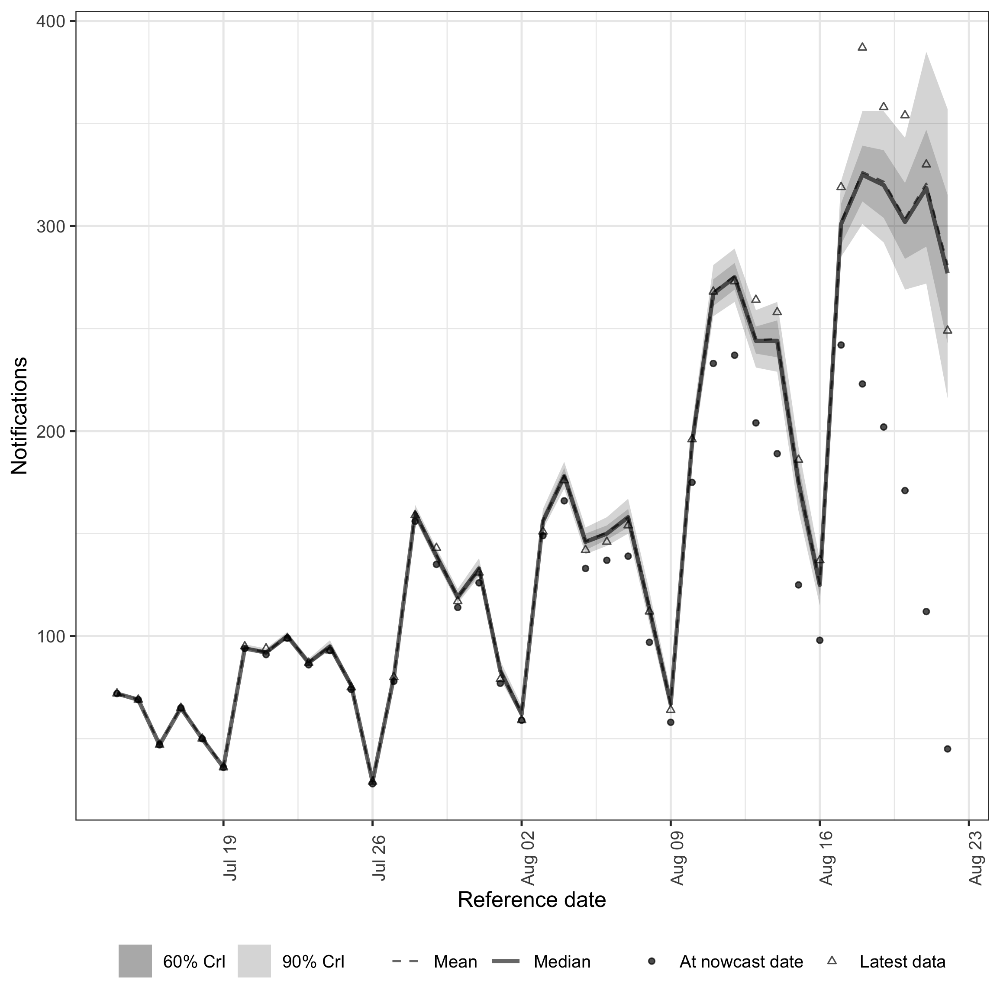
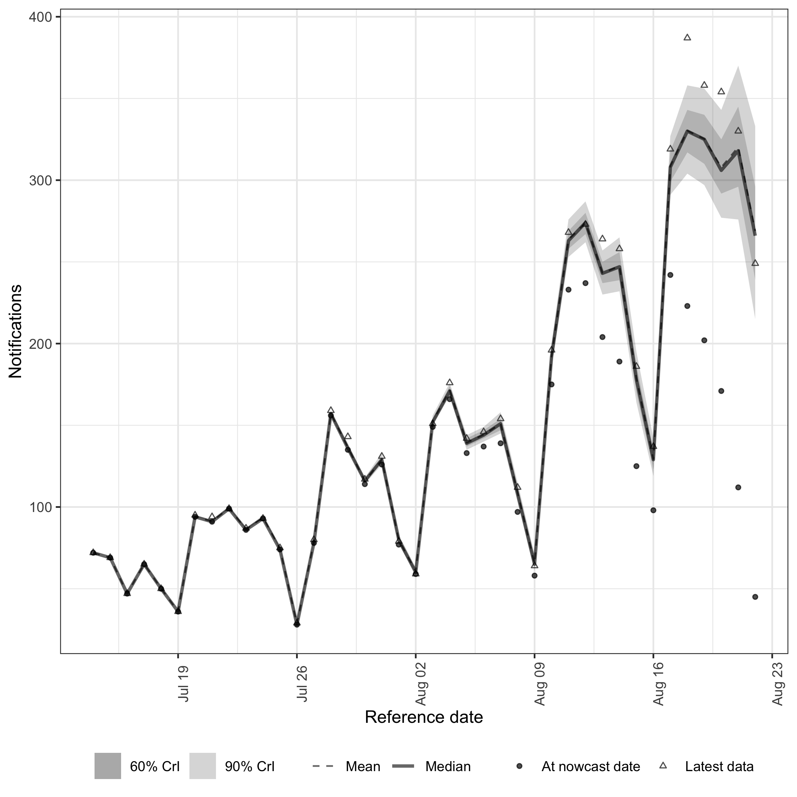
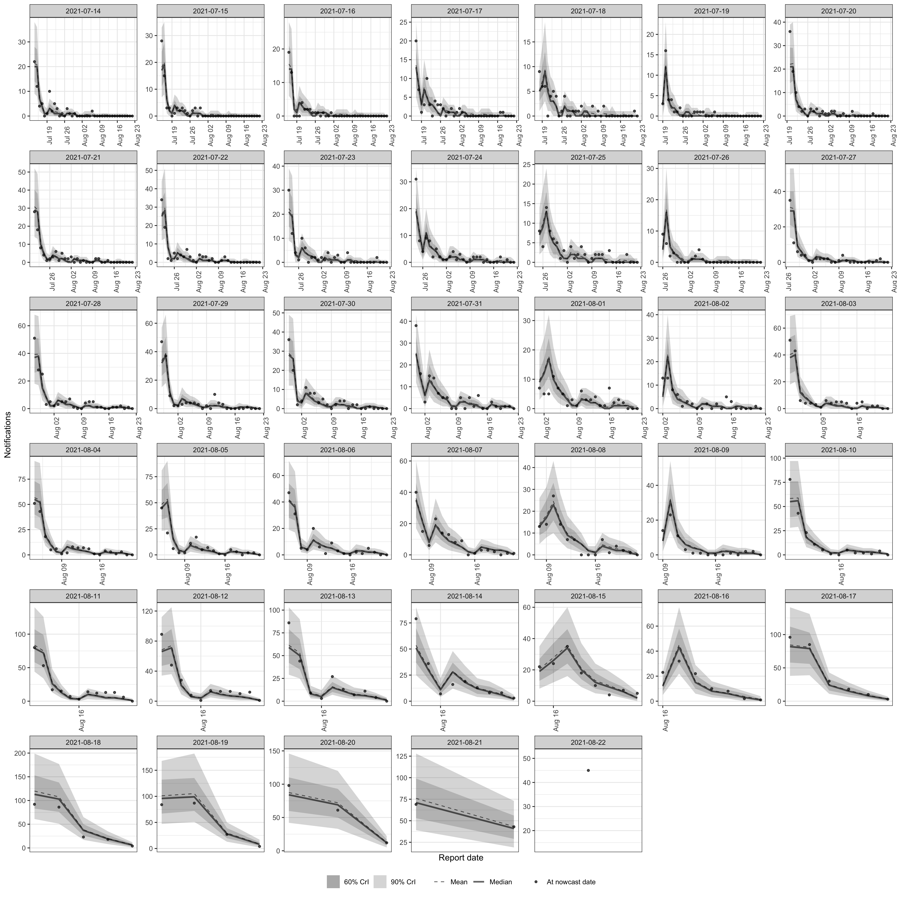

# Quick start

In this quick start, you will use `epinowcast` to specify and fit two nowcasting models of COVID-19 hospitalisations in Germany.
The first uses a parametric (lognormal) delay distribution and the second uses a non-parametric hazard model.
Comparing these two approaches demonstrates how `epinowcast` serves as a modelling toolkit rather than a single fixed model.
Examples using more complex models are available in other package vignettes and in the papers referenced in the literature vignette.

# Package

In this quick start, you will also use the `data.table` and `ggplot2` packages.
These are both installed as dependencies when `epinowcast` is installed.
Note that all output from `epinowcast` is readily useable with other tools, including `tidyverse` packages (see [here](https://mgimond.github.io/rug_2019_12/Index.html) for a comparison).


``` r
library(epinowcast)
library(data.table)
library(ggplot2)
```

# Data

Nowcasting of right-truncated case counts involves the estimation of reporting delays for recently reported data.
For this, you need case counts both by when they were diagnosed (e.g. when someone tests positive; often called "reference date") and by when they were reported (i.e. when administratively recorded via public health surveillance; often called "report date").
The difference between the reference date and the report date is the reporting delay.
For this quick start, you will use data from the [Robert Koch Institute via the Germany Nowcasting hub](https://github.com/KITmetricslab/hospitalization-nowcast-hub/wiki/Truth-data#role-an-definition-of-the-seven-day-hospitalization-incidence).
These data represent hospitalisation counts by date of positive test and date of test report in Germany up to October 1, 2021.

## Filtering

You first filter to create a snapshot of retrospective data available 40 days before October 1, 2021 that contains 40 days of data.
Then, you create the nowcast target which is the latest available hospitalisations by date of positive test.
This will allow you to visualise how a nowcast made at the time compares to what was ultimately reported.


``` r
nat_germany_hosp <-
  germany_covid19_hosp[location == "DE"][age_group == "00+"] |>
  enw_filter_report_dates(latest_date = "2021-10-01")

retro_nat_germany <- nat_germany_hosp |>
  enw_filter_report_dates(remove_days = 40) |>
  enw_filter_reference_dates(include_days = 40)
retro_nat_germany
#>      reference_date location age_group confirm report_date
#>              <IDat>   <fctr>    <fctr>   <int>      <IDat>
#>   1:     2021-07-14       DE       00+      22  2021-07-14
#>   2:     2021-07-15       DE       00+      28  2021-07-15
#>   3:     2021-07-16       DE       00+      19  2021-07-16
#>   4:     2021-07-17       DE       00+      20  2021-07-17
#>   5:     2021-07-18       DE       00+       9  2021-07-18
#>  ---                                                      
#> 816:     2021-07-15       DE       00+      69  2021-08-21
#> 817:     2021-07-16       DE       00+      47  2021-08-22
#> 818:     2021-07-14       DE       00+      72  2021-08-21
#> 819:     2021-07-15       DE       00+      69  2021-08-22
#> 820:     2021-07-14       DE       00+      72  2021-08-22
```

This data is already in a format that can be used with `epinowcast`, as it contains

- a reference date (column `reference_date`): the date of the observation, in this example the date of a positive test
- a report date (column `report_date`): the date of report for a given set of observations by reference date
- a count (column `confirm`): the total (i.e. cumulative) number of hospitalisations by reference date and report date.

The package also provides a range of tools to convert data from line list, incidence, or other common formats into the required format (see [Data converters](https://package.epinowcast.org/dev/reference/index.html#data-converters)).


``` r
latest_germany_hosp <- nat_germany_hosp |>
  enw_obs_at_delay(max_delay = 40) |>
  enw_filter_reference_dates(
    remove_days = 40, include_days = 40
  )
head(latest_germany_hosp, n = 10)
#>     reference_date .group location age_group confirm report_date
#>             <IDat>  <num>   <fctr>    <fctr>   <int>      <IDat>
#>  1:     2021-07-14      1       DE       00+      72  2021-08-22
#>  2:     2021-07-15      1       DE       00+      69  2021-08-23
#>  3:     2021-07-16      1       DE       00+      47  2021-08-24
#>  4:     2021-07-17      1       DE       00+      65  2021-08-25
#>  5:     2021-07-18      1       DE       00+      50  2021-08-26
#>  6:     2021-07-19      1       DE       00+      36  2021-08-27
#>  7:     2021-07-20      1       DE       00+      95  2021-08-28
#>  8:     2021-07-21      1       DE       00+      94  2021-08-29
#>  9:     2021-07-22      1       DE       00+      99  2021-08-30
#> 10:     2021-07-23      1       DE       00+      87  2021-08-31
```

## Visualising the data

Before fitting any model, it is useful to plot the data to identify patterns that should inform model specification.


``` r
ggplot(latest_germany_hosp) +
  aes(x = reference_date, y = confirm) +
  geom_col(alpha = 0.7) +
  labs(
    x = "Reference date",
    y = "Hospitalisations"
  ) +
  theme_bw()
```

<div class="figure">

<p class="caption">plot of chunk data-plot</p>
</div>

The plot shows a clear day-of-week periodicity in hospitalisations alongside an upward trend.
You will account for this weekly pattern by including a day-of-week effect in the expectation model.

## Preprocessing

Before modelling, the input data needs to be converted into the "reporting triangle" format (see [our model description for details](https://package.epinowcast.org/articles/model)).
You also need to determine metadata to facilitate the model specification.
This includes the number of days of data to use for the reference and report modules, the maximum delay to consider, and, optionally, a grouping (i.e. age group, location, or both) of observations.


``` r
pobs <- enw_preprocess_data(
  retro_nat_germany, max_delay = 40
)
pobs
#> ── Preprocessed nowcast data ─────────────────────────────────────────────────── 
#> Groups: 1 | Timestep: day | Max delay: 40 
#> Observations: 40 timepoints x 40 snapshots 
#> Max date: 2021-08-22 
#> 
#> Datasets (access with `enw_get_data(x, "<name>")`): 
#>   obs                :     820 x 9 
#>   new_confirm        :     820 x 11 
#>   latest             :      40 x 10 
#>   missing_reference  :       0 x 6 
#>   reporting_triangle :      40 x 42 
#>   metareference      :      40 x 9 
#>   metareport         :      79 x 12 
#>   metadelay          :      40 x 5
```

The returned output is an `enw_preprocess_data` object.
Printing it shows the key metadata and dimensions of each nested dataset.
You can extract a specific dataset using `enw_get_data()`:


``` r
enw_get_data(pobs, "latest") |> head()
#>    reference_date report_date .group max_confirm location age_group confirm
#>            <IDat>      <IDat>  <num>       <int>   <fctr>    <fctr>   <int>
#> 1:     2021-07-14  2021-08-22      1          72       DE       00+      72
#> 2:     2021-07-15  2021-08-22      1          69       DE       00+      69
#> 3:     2021-07-16  2021-08-22      1          47       DE       00+      47
#> 4:     2021-07-17  2021-08-22      1          65       DE       00+      65
#> 5:     2021-07-18  2021-08-22      1          50       DE       00+      50
#> 6:     2021-07-19  2021-08-22      1          36       DE       00+      36
#>    cum_prop_reported delay prop_reported
#>                <num> <num>         <num>
#> 1:                 1    39             0
#> 2:                 1    38             0
#> 3:                 1    37             0
#> 4:                 1    36             0
#> 5:                 1    35             0
#> 6:                 1    34             0
```

For a more detailed overview including a preview of the reporting triangle, use `summary()`:


``` r
summary(pobs)
#> ── Preprocessed nowcast data summary ─────────────────────────────────────────── 
#> Groups: 1 | Timestep: day | Max delay: 40 
#> Date range: 2021-07-14 to 2021-08-22 (39 days) 
#> Observations: 40 timepoints x 40 snapshots 
#> 
#> Latest observations (first 6 rows): 
#>    reference_date report_date .group max_confirm location age_group confirm
#>            <IDat>      <IDat>  <num>       <int>   <fctr>    <fctr>   <int>
#> 1:     2021-07-14  2021-08-22      1          72       DE       00+      72
#> 2:     2021-07-15  2021-08-22      1          69       DE       00+      69
#> 3:     2021-07-16  2021-08-22      1          47       DE       00+      47
#> 4:     2021-07-17  2021-08-22      1          65       DE       00+      65
#> 5:     2021-07-18  2021-08-22      1          50       DE       00+      50
#> 6:     2021-07-19  2021-08-22      1          36       DE       00+      36
#>    cum_prop_reported delay prop_reported
#>                <num> <num>         <num>
#> 1:                 1    39             0
#> 2:                 1    38             0
#> 3:                 1    37             0
#> 4:                 1    36             0
#> 5:                 1    35             0
#> 6:                 1    34             0
#> 
#> Reporting triangle corner (first 6 rows x 8 cols): 
#> Key: <.group, reference_date>
#>    .group reference_date     0     1     2     3     4     5
#>     <num>         <IDat> <int> <int> <int> <int> <int> <int>
#> 1:      1     2021-07-14    22    12     4     5     0     1
#> 2:      1     2021-07-15    28    15     3     3     0     1
#> 3:      1     2021-07-16    19    13     0     0     0     4
#> 4:      1     2021-07-17    20     7     1     3    10     3
#> 5:      1     2021-07-18     9     6     6     0     4     5
#> 6:      1     2021-07-19     3    16     4     4     1     1
#> ... (40 rows x 42 cols total)
```

It can be useful to check this output before specifying the model, just to make sure everything is as expected.
The preprocessed object also supports a `plot()` method for exploring the delay structure visually; see the [visualising preprocessed data](preprocess-visualisation.html) vignette for details.

# Model specification

The `epinowcast` package provides you with a modular modelling framework.
The package comes equipped with several modules that you can combine to construct models, and also allows you to create your own modules.
This ensures that models can be tailored to your specific data and context.

In the following sections, you will specify a shared process model and report model, then define two different reference (delay) models: one parametric and one non-parametric.

Each module defines its own default priors which can be inspected and customised.
See `?epinowcast` for details on inspecting and setting priors.

## Process model

A commonly used process model in nowcasting is to model the expected counts by date of reference via a geometric random walk, as this acts as a minimally informed smoothing prior and thus gives a lot of weight to the observed data.
As you observed in the data plot above, there is also a clear day-of-week pattern in hospitalisations.
You can capture both features by specifying a random effect for the daily growth rate and a random effect for day of the week.


``` r
expectation_module <- enw_expectation(
  ~ 0 + (1 | day) + (1 | day_of_week),
  data = pobs
)
```

Here, `day` refers to the number of days from the start of the data.
As the underlying process model is an exponential growth rate model ($C_t = C_{t-1} \exp^{r_t}$), specifying a random effect (i.e. `(1 | day)`) on the growth rate is equivalent to a geometric random walk on expected counts by reference date.
The `(1 | day_of_week)` term adds a weekly seasonal effect to account for the periodicity visible in the data.

## Reference model: reporting delays

The reference module models the reporting delay distribution from the date of reference.
You will define two alternative specifications.

The first assumes that the reporting delay follows a lognormal distribution, static over time.


``` r
lognormal_reference <- enw_reference(
  parametric = ~1,
  distribution = "lognormal",
  data = pobs
)
```

The second makes no distributional assumption.
Instead, it estimates a separate reporting hazard for each delay interval using random effects.
This is equivalent to a Cox proportional hazards baseline with partial pooling across delays.


``` r
np_reference <- enw_reference(
  parametric = ~0,
  non_parametric = ~0 + (1 | delay),
  data = pobs
)
```

The lognormal model is more parsimonious, requiring only two parameters (mean and standard deviation on the log scale).
The non-parametric model is more flexible and can capture multi-modal or irregular delay distributions, but estimates more parameters.

## Reporting effects by report date

Even where the reporting delay is well captured by the reference model, there may be additional effects related to the report date.
For example, reporting may be lower on weekends.
You can specify a model for these effects using the `enw_report()` function.
Here you specify a random effect for the day of the week.


``` r
report_module <- enw_report(
  ~ (1 | day_of_week), data = pobs
)
```

# Precompiling the model

As `epinowcast` uses `cmdstan` to fit its models, you first need to compile the model.
Here you compile with threading enabled to speed up model fitting.
Both models share the same compiled Stan code, so you only need to compile once.


``` r
model <- enw_model(threads = TRUE)
```

# Fitting the models

You can now fit both models using the ["No-U-Turn Sampler Markov chain Monte Carlo" method](https://mc-stan.org/docs/reference-manual/hamiltonian-monte-carlo.html).
You specify fitting options using `enw_fit_opts()` (note that the settings shown here are tuned for speed and may not be appropriate for many real world use cases).

## Parametric (lognormal) model


``` r
options(mc.cores = 2)
fit_opts <- enw_fit_opts(
  save_warmup = FALSE,
  pp = TRUE,
  chains = 2,
  threads_per_chain = 2,
  iter_sampling = 500,
  iter_warmup = 500,
  adapt_delta = 0.95,
  max_depth = 12,
  show_messages = interactive()
)
nowcast_lognormal <- epinowcast(
  data = pobs,
  expectation = expectation_module,
  reference = lognormal_reference,
  report = report_module,
  fit = fit_opts,
  model = model
)
```

## Non-parametric (hazard) model

The model is already compiled, so this second fit only requires sampling time.


``` r
nowcast_np <- epinowcast(
  data = pobs,
  expectation = expectation_module,
  reference = np_reference,
  report = report_module,
  fit = fit_opts,
  model = model
)
```

# Results

The `epinowcast()` function returns an `epinowcast` object which includes diagnostic information, the data used for fitting, and the underlying [`CmdStanModel` object](https://mc-stan.org/cmdstanr/reference/CmdStanModel.html).
Printing it shows key diagnostics including the number of samples, convergence (Rhat), and any divergent transitions.

## Lognormal model


``` r
nowcast_lognormal
#> ── epinowcast model output ───────────────────────────────────────────────────── 
#> Groups: 1 | Timestep: day | Max delay: 40 
#> Observations: 40 timepoints x 40 snapshots 
#> Max date: 2021-08-22 
#> 
#> Datasets (access with `enw_get_data(x, "<name>")`): 
#>   obs                :     820 x 9 
#>   new_confirm        :     820 x 11 
#>   latest             :      40 x 10 
#>   missing_reference  :       0 x 6 
#>   reporting_triangle :      40 x 42 
#>   metareference      :      40 x 9 
#>   metareport         :      79 x 12 
#>   metadelay          :      40 x 5 
#> 
#> Priors: 14 parameters 
#>           variable          distribution  mean    sd
#>             <char>                <char> <num> <num>
#>         expr_r_int                Normal   0.0   0.2
#>       expr_beta_sd Zero truncated normal   0.0   1.0
#>  expr_lelatent_int                Normal   4.3   1.0
#>       expl_beta_sd Zero truncated normal   0.0   1.0
#>      refp_mean_int                Normal   1.0   1.0
#>        refp_sd_int Zero truncated normal   0.5   1.0
#>  refp_mean_beta_sd Zero truncated normal   0.0   1.0
#>    refp_sd_beta_sd Zero truncated normal   0.0   1.0
#>          refnp_int                Normal   0.0   1.0
#>      refnp_beta_sd Zero truncated normal   0.0   1.0
#>        rep_beta_sd Zero truncated normal   0.0   1.0
#>           miss_int                Normal   0.0   1.0
#>       miss_beta_sd Zero truncated normal   0.0   1.0
#>           sqrt_phi Zero truncated normal   0.0   0.5
#> Model fit: 
#> 
#>  Samples: 1,000 | Max Rhat: 1.05 
#> 
#>  Divergent transitions: 2 (0.2%) 
#>   Run time: 52.8 secs
```


``` r
nowcast_lognormal |>
  summary(probs = c(0.05, 0.95)) |>
  head(n = 10)
#>     reference_date report_date .group max_confirm location age_group confirm
#>             <IDat>      <IDat>  <num>       <int>   <fctr>    <fctr>   <int>
#>  1:     2021-07-14  2021-08-22      1          72       DE       00+      72
#>  2:     2021-07-15  2021-08-22      1          69       DE       00+      69
#>  3:     2021-07-16  2021-08-22      1          47       DE       00+      47
#>  4:     2021-07-17  2021-08-22      1          65       DE       00+      65
#>  5:     2021-07-18  2021-08-22      1          50       DE       00+      50
#>  6:     2021-07-19  2021-08-22      1          36       DE       00+      36
#>  7:     2021-07-20  2021-08-22      1          94       DE       00+      94
#>  8:     2021-07-21  2021-08-22      1          91       DE       00+      91
#>  9:     2021-07-22  2021-08-22      1          99       DE       00+      99
#> 10:     2021-07-23  2021-08-22      1          86       DE       00+      86
#>     cum_prop_reported delay prop_reported    mean median        sd    mad    q5
#>                 <num> <num>         <num>   <num>  <num>     <num>  <num> <num>
#>  1:                 1    39             0  72.000     72 0.0000000 0.0000    72
#>  2:                 1    38             0  69.058     69 0.2543633 0.0000    69
#>  3:                 1    37             0  47.108     47 0.3293090 0.0000    47
#>  4:                 1    36             0  65.223     65 0.4832230 0.0000    65
#>  5:                 1    35             0  50.297     50 0.5559677 0.0000    50
#>  6:                 1    34             0  36.193     36 0.4471588 0.0000    36
#>  7:                 1    33             0  94.479     94 0.7141912 0.0000    94
#>  8:                 1    32             0  91.959     92 1.0130870 1.4826    91
#>  9:                 1    31             0 100.128    100 1.0746026 1.4826    99
#> 10:                 1    30             0  87.292     87 1.2362299 1.4826    86
#>       q95      rhat  ess_bulk  ess_tail
#>     <num>     <num>     <num>     <num>
#>  1:    72        NA        NA        NA
#>  2:    70 1.0010406 1027.6999 1016.9177
#>  3:    48 0.9983009 1053.1173 1016.3595
#>  4:    66 1.0008464 1055.7254 1017.0571
#>  5:    51 1.0006629 1083.6213 1045.2536
#>  6:    37 1.0025455 1005.6387  986.9200
#>  7:    96 0.9992180  862.5743  903.0011
#>  8:    94 1.0000080  720.3899  884.7781
#>  9:   102 0.9991932  967.8122  986.3872
#> 10:    89 1.0003450  999.5635  806.2574
```


``` r
plot(
  nowcast_lognormal,
  latest_obs = latest_germany_hosp
)
```

<div class="figure">

<p class="caption">plot of chunk nowcast-lognormal</p>
</div>

## Non-parametric model


``` r
nowcast_np
#> ── epinowcast model output ───────────────────────────────────────────────────── 
#> Groups: 1 | Timestep: day | Max delay: 40 
#> Observations: 40 timepoints x 40 snapshots 
#> Max date: 2021-08-22 
#> 
#> Datasets (access with `enw_get_data(x, "<name>")`): 
#>   obs                :     820 x 9 
#>   new_confirm        :     820 x 11 
#>   latest             :      40 x 10 
#>   missing_reference  :       0 x 6 
#>   reporting_triangle :      40 x 42 
#>   metareference      :      40 x 9 
#>   metareport         :      79 x 12 
#>   metadelay          :      40 x 5 
#> 
#> Priors: 14 parameters 
#>           variable          distribution  mean    sd
#>             <char>                <char> <num> <num>
#>         expr_r_int                Normal   0.0   0.2
#>       expr_beta_sd Zero truncated normal   0.0   1.0
#>  expr_lelatent_int                Normal   4.3   1.0
#>       expl_beta_sd Zero truncated normal   0.0   1.0
#>      refp_mean_int                Normal   1.0   1.0
#>        refp_sd_int Zero truncated normal   0.5   1.0
#>  refp_mean_beta_sd Zero truncated normal   0.0   1.0
#>    refp_sd_beta_sd Zero truncated normal   0.0   1.0
#>          refnp_int                Normal   0.0   1.0
#>      refnp_beta_sd Zero truncated normal   0.0   1.0
#>        rep_beta_sd Zero truncated normal   0.0   1.0
#>           miss_int                Normal   0.0   1.0
#>       miss_beta_sd Zero truncated normal   0.0   1.0
#>           sqrt_phi Zero truncated normal   0.0   0.5
#> Model fit: 
#> 
#>  Samples: 1,000 | Max Rhat: 1.02 
#> 
#>  Divergent transitions: 4 (0.4%) 
#>   Run time: 97.3 secs
```


``` r
nowcast_np |>
  summary(probs = c(0.05, 0.95)) |>
  head(n = 10)
#>     reference_date report_date .group max_confirm location age_group confirm
#>             <IDat>      <IDat>  <num>       <int>   <fctr>    <fctr>   <int>
#>  1:     2021-07-14  2021-08-22      1          72       DE       00+      72
#>  2:     2021-07-15  2021-08-22      1          69       DE       00+      69
#>  3:     2021-07-16  2021-08-22      1          47       DE       00+      47
#>  4:     2021-07-17  2021-08-22      1          65       DE       00+      65
#>  5:     2021-07-18  2021-08-22      1          50       DE       00+      50
#>  6:     2021-07-19  2021-08-22      1          36       DE       00+      36
#>  7:     2021-07-20  2021-08-22      1          94       DE       00+      94
#>  8:     2021-07-21  2021-08-22      1          91       DE       00+      91
#>  9:     2021-07-22  2021-08-22      1          99       DE       00+      99
#> 10:     2021-07-23  2021-08-22      1          86       DE       00+      86
#>     cum_prop_reported delay prop_reported   mean median        sd   mad    q5
#>                 <num> <num>         <num>  <num>  <num>     <num> <num> <num>
#>  1:                 1    39             0 72.000     72 0.0000000     0    72
#>  2:                 1    38             0 69.003     69 0.0547174     0    69
#>  3:                 1    37             0 47.033     47 0.1787259     0    47
#>  4:                 1    36             0 65.055     65 0.2324415     0    65
#>  5:                 1    35             0 50.070     50 0.2705054     0    50
#>  6:                 1    34             0 36.067     36 0.2656719     0    36
#>  7:                 1    33             0 94.136     94 0.3790088     0    94
#>  8:                 1    32             0 91.227     91 0.4513033     0    91
#>  9:                 1    31             0 99.304     99 0.5548801     0    99
#> 10:                 1    30             0 86.390     86 0.6101412     0    86
#>       q95      rhat  ess_bulk  ess_tail
#>     <num>     <num>     <num>     <num>
#>  1:    72        NA        NA        NA
#>  2:    69 1.0004509 1011.7444 1011.7444
#>  3:    47 0.9997315 1025.9286 1025.9286
#>  4:    66 1.0006652  899.0330  887.8463
#>  5:    51 0.9986147  997.6301  987.1402
#>  6:    37 0.9995602  953.9501  953.3180
#>  7:    95 0.9989431 1027.7285 1017.9178
#>  8:    92 0.9989919  953.1489  922.3643
#>  9:   100 0.9994452  963.6752  936.8944
#> 10:    88 1.0010470  868.6572  903.8179
```


``` r
plot(nowcast_np, latest_obs = latest_germany_hosp)
```

<div class="figure">

<p class="caption">plot of chunk nowcast-np</p>
</div>

## Comparing the two models

You can compare the two nowcasts by overlaying their posterior summaries.


``` r
lognormal_summary <- summary(
  nowcast_lognormal,
  probs = c(0.05, 0.2, 0.8, 0.95)
)
lognormal_summary[, model := "Lognormal"]

np_summary <- summary(
  nowcast_np,
  probs = c(0.05, 0.2, 0.8, 0.95)
)
np_summary[, model := "Non-parametric"]

combined <- rbindlist(
  list(lognormal_summary, np_summary),
  use.names = TRUE
)

ggplot(combined) +
  aes(x = reference_date) +
  geom_ribbon(
    aes(ymin = q5, ymax = q95, fill = model),
    alpha = 0.2
  ) +
  geom_ribbon(
    aes(ymin = q20, ymax = q80, fill = model),
    alpha = 0.3
  ) +
  geom_line(
    aes(y = median, colour = model),
    linewidth = 0.8
  ) +
  geom_point(
    data = latest_germany_hosp,
    aes(y = confirm),
    shape = 2,
    size = 1.1,
    alpha = 0.7
  ) +
  labs(
    x = "Reference date",
    y = "Hospitalisations",
    fill = "Model",
    colour = "Model"
  ) +
  theme_bw() +
  theme(legend.position = "bottom")
```

<div class="figure">

<p class="caption">plot of chunk comparison</p>
</div>

Both models produce similar median estimates and agree closely for older reference dates where the delay distribution is well estimated.
For recent dates, the non-parametric model shows slightly wider uncertainty, reflecting the additional flexibility of estimating a separate hazard per delay interval rather than assuming a lognormal form.

Both models underestimate the most recent hospitalisations relative to what was ultimately reported (the triangles above the credible intervals).
This suggests that the geometric random walk process model, while a good default, does not fully capture the strong exponential growth in this period.
Specifying an explicit growth rate model in `enw_expectation()` or using a renewal process could improve performance in settings with rapid trend changes.

## Posterior predictions

Plotting posterior predictions can be a useful way of assessing whether the model captures the underlying data generation process adequately.


``` r
plot(nowcast_lognormal, type = "posterior") +
  facet_wrap(vars(reference_date), scale = "free")
```

<div class="figure">

<p class="caption">plot of chunk pp-lognormal</p>
</div>

## Using package functions rather than S3 methods

Rather than using S3 methods supplied for `epinowcast()` directly, package functions can also be used to extract nowcast posterior samples, summarise them, and then plot them.
This is demonstrated here by plotting the 7 day incidence for hospitalisations using the lognormal model.


``` r
# extract samples
samples <- summary(
  nowcast_lognormal, type = "nowcast_samples"
)

# Take a 7 day rolling sum of both samples and observations
cols <- c("confirm", "sample")
samples[, (cols) := lapply(.SD, frollsum, n = 7),
  .SDcols = cols, by = ".draw"
][!is.na(sample)]
#>        reference_date report_date .group max_confirm location age_group confirm
#>                <IDat>      <IDat>  <num>       <int>   <fctr>    <fctr>   <int>
#>     1:     2021-07-20  2021-08-22      1          94       DE       00+     433
#>     2:     2021-07-20  2021-08-22      1          94       DE       00+     433
#>     3:     2021-07-20  2021-08-22      1          94       DE       00+     433
#>     4:     2021-07-20  2021-08-22      1          94       DE       00+     433
#>     5:     2021-07-20  2021-08-22      1          94       DE       00+     433
#>    ---                                                                         
#> 33996:     2021-08-22  2021-08-22      1          45       DE       00+    1093
#> 33997:     2021-08-22  2021-08-22      1          45       DE       00+    1093
#> 33998:     2021-08-22  2021-08-22      1          45       DE       00+    1093
#> 33999:     2021-08-22  2021-08-22      1          45       DE       00+    1093
#> 34000:     2021-08-22  2021-08-22      1          45       DE       00+    1093
#>        cum_prop_reported delay prop_reported .chain .iteration .draw sample
#>                    <num> <num>         <num>  <int>      <int> <int>  <num>
#>     1:                 1    33             0      1          1     1    433
#>     2:                 1    33             0      1          2     2    435
#>     3:                 1    33             0      1          3     3    434
#>     4:                 1    33             0      1          4     4    436
#>     5:                 1    33             0      1          5     5    435
#>    ---                                                                     
#> 33996:                 1     0             1      2        496   996   2005
#> 33997:                 1     0             1      2        497   997   2163
#> 33998:                 1     0             1      2        498   998   1860
#> 33999:                 1     0             1      2        499   999   2063
#> 34000:                 1     0             1      2        500  1000   2075
latest_germany_hosp_7day <- copy(latest_germany_hosp)[
  ,
  confirm := frollsum(confirm, n = 7)
][!is.na(confirm)]

# Summarise samples
sum_across_last_7_days <- enw_summarise_samples(samples)

# Plot samples
enw_plot_nowcast_quantiles(
  sum_across_last_7_days, latest_germany_hosp_7day
)
```

<div class="figure">

<p class="caption">plot of chunk week-nowcast</p>
</div>

# Next steps

The results above highlight several directions for improving these models.

The underestimation of recent hospitalisations during rapid growth suggests that an explicit growth rate or renewal process model in `enw_expectation()` could better capture strong trends than the geometric random walk used here.

The two reference models produced similar results for this dataset, where the delay distribution is approximately lognormal.
In settings where the delay distribution is multi-modal or irregular, the non-parametric approach would show a larger advantage.
You could also combine parametric and non-parametric components in a single reference model to balance flexibility with parsimony, or allow the delay distribution to vary over time if reporting processes change.

Other extensions to consider include:

- Stratifying by age group or location using hierarchical models.
- Formally comparing models using leave-one-out cross-validation or scoring rules.

See the [model description](https://package.epinowcast.org/articles/model) vignette for mathematical details, the [age-stratified nowcasting](https://package.epinowcast.org/articles/germany-age-stratified-nowcasting) vignette for hierarchical models and model comparison with LOO, and the [features](https://package.epinowcast.org/articles/features) vignette for a full overview of modelling options.
