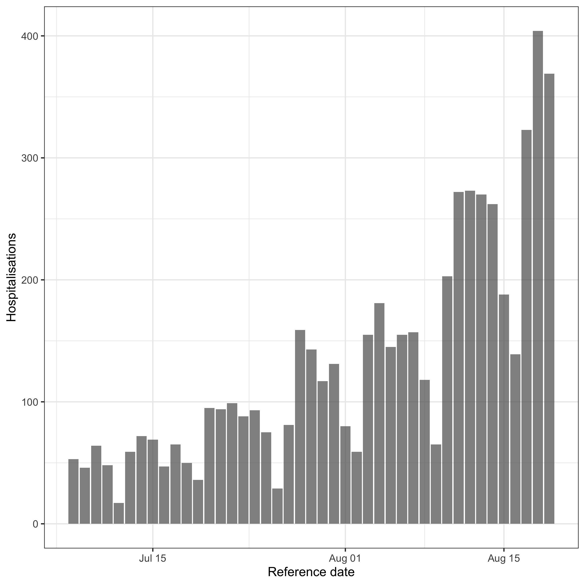
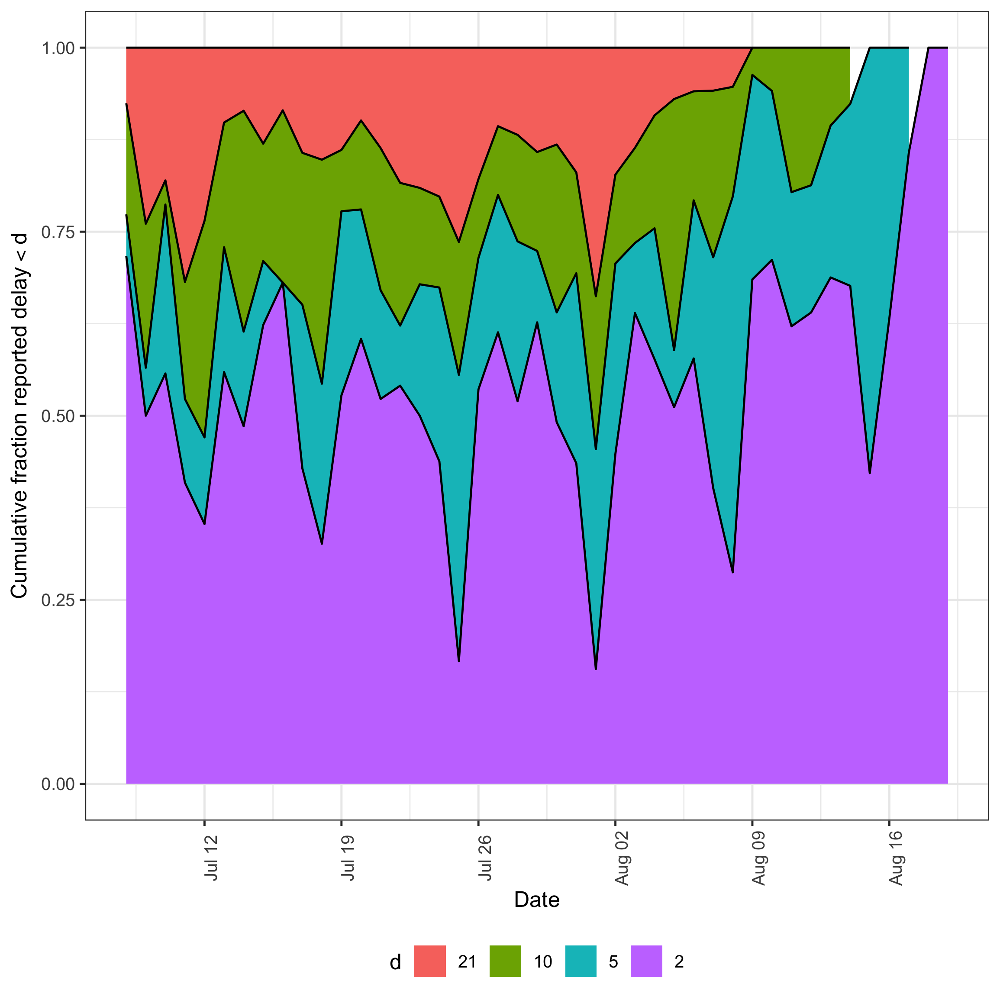
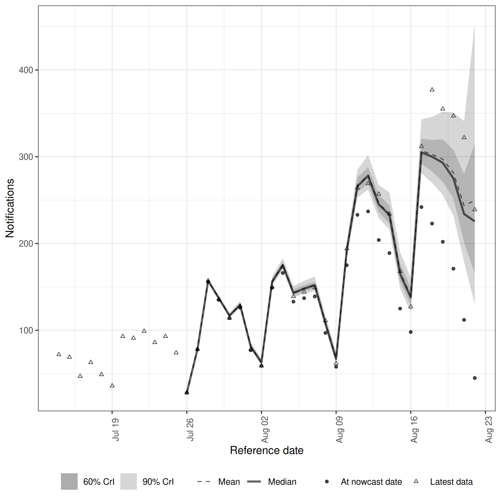
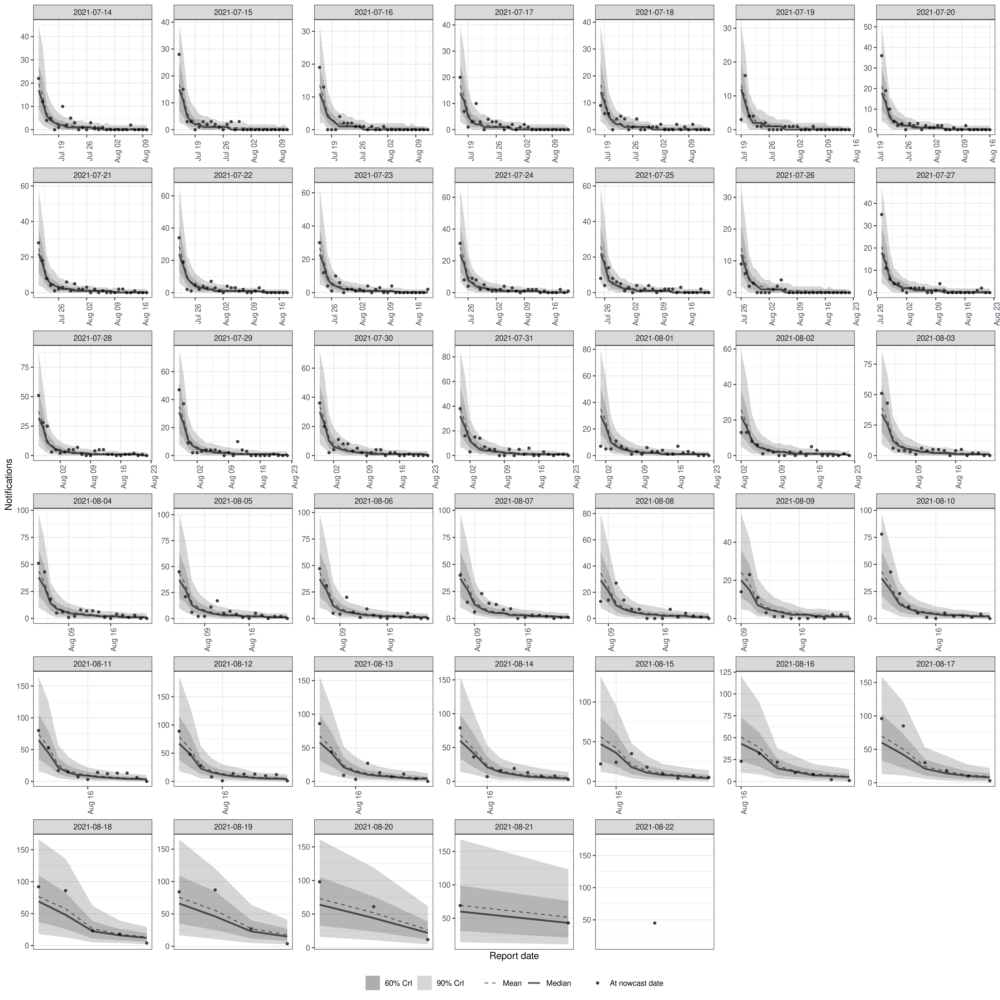
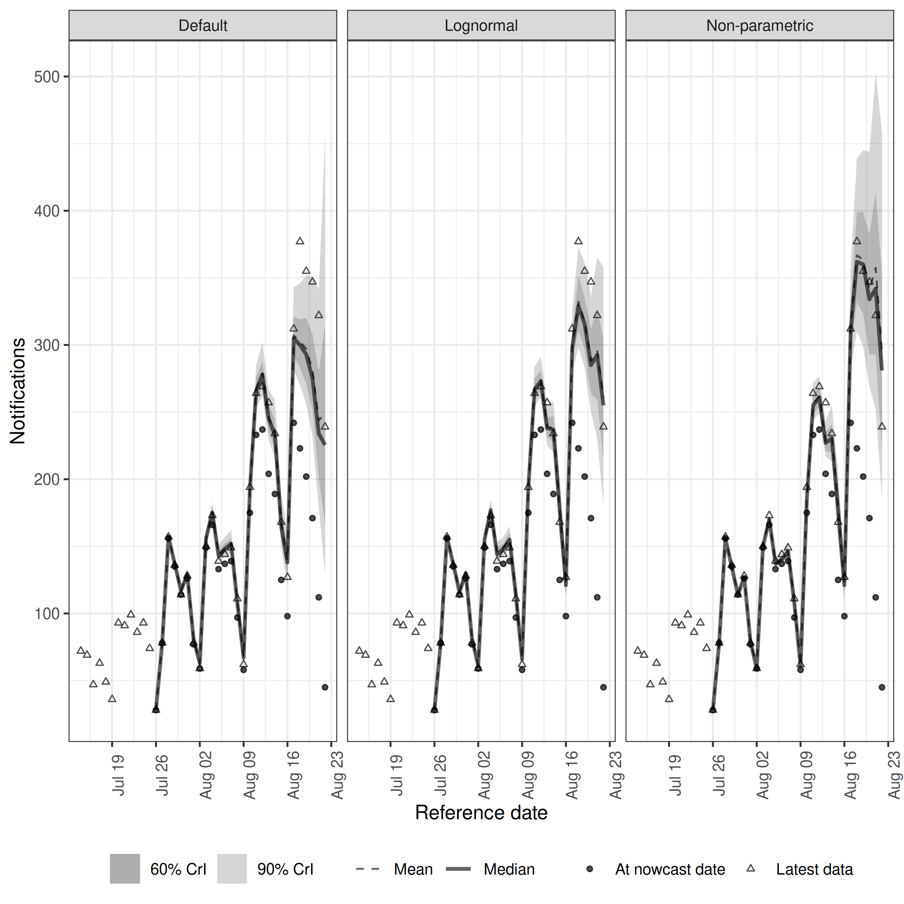
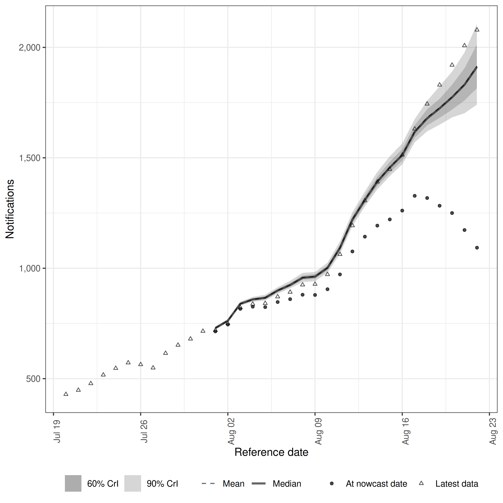

# Quick start

In this quick start, we use `epinowcast` to nowcast COVID-19 hospitalisations in Germany.
We start with the default model, identify where it falls short, and then build two alternative models with different delay assumptions.
This showcases `epinowcast` as a modelling toolkit rather than a model to be run without configuration.
Examples using more complex models are available in other package vignettes and in the papers referenced in the literature vignette.

# Package

In this quick start, we also use the `data.table` and `ggplot2` packages.
These are both installed as dependencies when `epinowcast` is installed.
Note that all output from `epinowcast` is readily useable with other tools, including `tidyverse` packages (see [here](https://mgimond.github.io/rug_2019_12/Index.html) for a comparison).


``` r
library(epinowcast)
library(data.table)
library(ggplot2)
```

# Data

Nowcasting of right-truncated case counts involves the estimation of reporting delays for recently reported data.
For this, we need case counts both by when they were diagnosed (e.g. when someone tests positive; often called "reference date") and by when they were reported (i.e. when administratively recorded via public health surveillance; often called "report date").
The difference between the reference date and the report date is the reporting delay.
For this quick start, we use data from the [Robert Koch Institute via the Germany Nowcasting hub](https://github.com/KITmetricslab/hospitalization-nowcast-hub/wiki/Truth-data#role-an-definition-of-the-seven-day-hospitalization-incidence).
These data represent hospitalisation counts by date of positive test and date of test report in Germany up to October 1, 2021.

## Filtering

We first filter to create a snapshot of retrospective data available 40 days before October 1, 2021 that contains 40 days of data.
This retrospective approach allows us to evaluate nowcast performance by comparing against what was ultimately reported [@placeholder].


``` r
nat_germany_hosp <-
  germany_covid19_hosp[location == "DE"][age_group == "00+"] |>
  enw_filter_report_dates(latest_date = "2021-10-01")

retro_nat_germany <- nat_germany_hosp |>
  enw_filter_report_dates(remove_days = 40) |>
  enw_filter_reference_dates(include_days = 40)
retro_nat_germany
#>      reference_date location age_group confirm report_date
#>              <IDat>   <fctr>    <fctr>   <int>      <IDat>
#>   1:     2021-07-14       DE       00+      22  2021-07-14
#>   2:     2021-07-15       DE       00+      28  2021-07-15
#>   3:     2021-07-16       DE       00+      19  2021-07-16
#>   4:     2021-07-17       DE       00+      20  2021-07-17
#>   5:     2021-07-18       DE       00+       9  2021-07-18
#>  ---                                                      
#> 816:     2021-07-15       DE       00+      69  2021-08-21
#> 817:     2021-07-16       DE       00+      47  2021-08-22
#> 818:     2021-07-14       DE       00+      72  2021-08-21
#> 819:     2021-07-15       DE       00+      69  2021-08-22
#> 820:     2021-07-14       DE       00+      72  2021-08-22
```

This data is already in a format that can be used with `epinowcast`, as it contains

- a reference date (column `reference_date`): the date of the observation, in this example the date of a positive test
- a report date (column `report_date`): the date of report for a given set of observations by reference date
- a count (column `confirm`): the total (i.e. cumulative) number of hospitalisations by reference date and report date.

The package also provides a range of tools to convert data from line list, incidence, or other common formats into the required format (see [Data converters](https://package.epinowcast.org/dev/reference/index.html#data-converters)).

## Preprocessing

Before modelling, the input data needs to be converted into the "reporting triangle" format (see [our model description for details](https://package.epinowcast.org/articles/model)).
We also need to determine metadata to facilitate the model specification.
This includes the number of days of data to use for the reference and report modules, the maximum delay to consider, and, optionally, a grouping (i.e. age group, location, or both) of observations.

We start with a generous `max_delay = 40` to retain the full reporting history of each reference date for inspection before choosing a tighter nowcast horizon.


``` r
pobs_full <- enw_preprocess_data(
  retro_nat_germany, max_delay = 40
)
pobs_full
#> ── Preprocessed nowcast data ─────────────────────────────────────────────────── 
#> Groups: 1 | Timestep: day | Max delay: 40 
#> Observations: 40 timepoints x 40 snapshots 
#> Max date: 2021-08-22 
#> 
#> Datasets (access with `enw_get_data(x, "<name>")`): 
#>   obs                :     820 x 9 
#>   new_confirm        :     820 x 11 
#>   latest             :      40 x 10 
#>   missing_reference  :       0 x 6 
#>   reporting_triangle :      40 x 42 
#>   metareference      :      40 x 9 
#>   metareport         :      79 x 12 
#>   metadelay          :      40 x 5
```

The returned `enw_preprocess_data` object prints the key metadata and dimensions of each nested dataset.
For a more detailed overview, including a preview of the reporting triangle, use `summary()`:


``` r
summary(pobs_full)
#> ── Preprocessed nowcast data summary ─────────────────────────────────────────── 
#> Groups: 1 | Timestep: day | Max delay: 40 
#> Date range: 2021-07-14 to 2021-08-22 (39 days) 
#> Observations: 40 timepoints x 40 snapshots 
#> 
#> Latest observations (first 6 rows): 
#>    reference_date report_date .group max_confirm location age_group confirm
#>            <IDat>      <IDat>  <num>       <int>   <fctr>    <fctr>   <int>
#> 1:     2021-07-14  2021-08-22      1          72       DE       00+      72
#> 2:     2021-07-15  2021-08-22      1          69       DE       00+      69
#> 3:     2021-07-16  2021-08-22      1          47       DE       00+      47
#> 4:     2021-07-17  2021-08-22      1          65       DE       00+      65
#> 5:     2021-07-18  2021-08-22      1          50       DE       00+      50
#> 6:     2021-07-19  2021-08-22      1          36       DE       00+      36
#>    cum_prop_reported delay prop_reported
#>                <num> <num>         <num>
#> 1:                 1    39             0
#> 2:                 1    38             0
#> 3:                 1    37             0
#> 4:                 1    36             0
#> 5:                 1    35             0
#> 6:                 1    34             0
#> 
#> Reporting triangle corner (first 6 rows x 8 cols): 
#> Key: <.group, reference_date>
#>    .group reference_date     0     1     2     3     4     5
#>     <num>         <IDat> <int> <int> <int> <int> <int> <int>
#> 1:      1     2021-07-14    22    12     4     5     0     1
#> 2:      1     2021-07-15    28    15     3     3     0     1
#> 3:      1     2021-07-16    19    13     0     0     0     4
#> 4:      1     2021-07-17    20     7     1     3    10     3
#> 5:      1     2021-07-18     9     6     6     0     4     5
#> 6:      1     2021-07-19     3    16     4     4     1     1
#> ... (40 rows x 42 cols total)
```

## Visualising the data

The preprocessed object supports `plot()` directly, with `type` selecting between the latest observations and several empirical delay views; see the [visualising preprocessed data](preprocess-visualisation.html) vignette for details.
We first plot the observations as a real-time analyst would see them at the nowcast date.


``` r
plot(pobs_full, type = "obs") +
  labs(y = "Hospitalisations", x = "Reference date")
```

<div class="figure">

<p class="caption">plot of chunk data-plot</p>
</div>

A clear day-of-week periodicity is visible alongside a broad upward trend.
Recent reference dates are systematically low because their reports are still arriving — this is the right-truncation that the nowcast needs to correct.
These features will become important when we evaluate model performance below.

## Choosing a nowcast horizon

Next we plot the cumulative fraction of each reference date's eventual reports that have arrived by a given delay, which motivates the maximum delay used for the nowcast.


``` r
plot(pobs_full, type = "delay_cumulative")
```

<div class="figure">

<p class="caption">plot of chunk delay-cumulative</p>
</div>

Across reference dates the median cumulative reporting reaches roughly 94% by delay 14 and 100% by delay 21, with even the slowest-reporting reference dates (10th percentile) at ~97% by delay 28.
This justifies setting `max_delay = 28`: extending further adds delay bins that contribute almost no additional reports, while 28 days still captures nearly all eventual reports even for the worst-reporting reference dates.
The ribbon also shifts substantially across reference dates, indicating that the empirical delay distribution is not stable.
This motivates the alternative models explored below, which relax the default lognormal delay with either day-of-week effects or a fully non-parametric specification.

We now re-run the preprocessing at the chosen horizon to use for modelling.


``` r
pobs <- enw_preprocess_data(
  retro_nat_germany, max_delay = 28
)
pobs
#> ── Preprocessed nowcast data ─────────────────────────────────────────────────── 
#> Groups: 1 | Timestep: day | Max delay: 28 
#> Observations: 40 timepoints x 40 snapshots 
#> Max date: 2021-08-22 
#> 
#> Datasets (access with `enw_get_data(x, "<name>")`): 
#>   obs                :     742 x 9 
#>   new_confirm        :     742 x 11 
#>   latest             :      40 x 10 
#>   missing_reference  :       0 x 6 
#>   reporting_triangle :      40 x 30 
#>   metareference      :      40 x 9 
#>   metareport         :      67 x 12 
#>   metadelay          :      28 x 5
```

## Nowcast target

Having fixed the horizon, we create the nowcast target: the count at each reference date once 28 days of reports have accumulated.
This represents what the model is trying to predict and serves as our comparison baseline.


``` r
latest_germany_hosp <- nat_germany_hosp |>
  enw_obs_at_delay(max_delay = 28) |>
  enw_filter_reference_dates(
    remove_days = 40, include_days = 40
  )
head(latest_germany_hosp, n = 10)
#>     reference_date .group location age_group confirm report_date
#>             <IDat>  <num>   <fctr>    <fctr>   <int>      <IDat>
#>  1:     2021-07-14      1       DE       00+      72  2021-08-10
#>  2:     2021-07-15      1       DE       00+      69  2021-08-11
#>  3:     2021-07-16      1       DE       00+      47  2021-08-12
#>  4:     2021-07-17      1       DE       00+      63  2021-08-13
#>  5:     2021-07-18      1       DE       00+      49  2021-08-14
#>  6:     2021-07-19      1       DE       00+      36  2021-08-15
#>  7:     2021-07-20      1       DE       00+      93  2021-08-16
#>  8:     2021-07-21      1       DE       00+      91  2021-08-17
#>  9:     2021-07-22      1       DE       00+      99  2021-08-18
#> 10:     2021-07-23      1       DE       00+      86  2021-08-19
```

# The default model

The `epinowcast` package provides a modular modelling framework.
The package comes equipped with several modules that we can combine to construct models, and also allows us to create our own modules.
This ensures that models can be tailored to the specific data and context.

Each module defines its own default priors which can be inspected and customised.
See `?epinowcast` for details on inspecting and setting priors.

A commonly used process model in nowcasting is to model the expected counts by date of reference via a geometric random walk.
This acts as a minimally informed smoothing prior and gives a lot of weight to the observed data.
This is the default process model in `epinowcast`.
The default model also uses a lognormal delay distribution and no report-date effects.
This is a historically common specification in the field but is not tuned for any particular problem.


``` r
model <- enw_model()
```


``` r
options(mc.cores = 2)
fit_opts <- enw_fit_opts(
  save_warmup = FALSE,
  pp = TRUE,
  chains = 2,
  iter_sampling = 500,
  iter_warmup = 500,
  adapt_delta = 0.9,
  show_messages = interactive()
)
nowcast_default <- epinowcast(
  data = pobs,
  fit = fit_opts,
  model = model
)
```


``` r
nowcast_default
#> ── epinowcast model output ───────────────────────────────────────────────────── 
#> Groups: 1 | Timestep: day | Max delay: 28 
#> Observations: 40 timepoints x 40 snapshots 
#> Max date: 2021-08-22 
#> 
#> Datasets (access with `enw_get_data(x, "<name>")`): 
#>   obs                :     742 x 9 
#>   new_confirm        :     742 x 11 
#>   latest             :      40 x 10 
#>   missing_reference  :       0 x 6 
#>   reporting_triangle :      40 x 30 
#>   metareference      :      40 x 9 
#>   metareport         :      67 x 12 
#>   metadelay          :      28 x 5 
#> 
#> Model objects (access with `enw_get_data(x, "<name>")`): 
#>   priors : 14 x 6 
#>   fit : CmdStanMCMC 
#>   data : list(115) 
#>   fit_args : list(7) 
#>   init_method_output : NULL 
#> Model fit: 
#>   Samples: 1,000 | Max Rhat: 1.03 
#>   Divergent transitions: 0 (0%) 
#>   Max treedepth: 7 (997 at max, 99.7%) 
#>   Run time: 12.3 secs
```


``` r
plot(
  nowcast_default,
  latest_obs = latest_germany_hosp
)
```

<div class="figure">

<p class="caption">plot of chunk nowcast-default</p>
</div>

## Posterior predictions

Plotting posterior predictions is a useful way to assess whether the model captures the underlying data generation process.


``` r
plot(nowcast_default, type = "posterior") +
  facet_wrap(vars(reference_date), scale = "free")
```

<div class="figure">

<p class="caption">plot of chunk pp-default</p>
</div>

The default model captures the general level of hospitalisations but misses features visible in the data.
The strong upward trend leads to underestimation of recent dates, where the most recent observations (triangles) fall above the credible intervals.
The day-of-week periodicity visible in the data plot is not captured in either the expected counts or the reporting process, as the default model has no weekly seasonal component.

# Alternative models

Based on these observations, we can build alternative models.
We address the trend by replacing the daily geometric random walk with a weekly growth rate model, add a day-of-week effect to the expected counts, and compare two different delay specifications.

## Process model

The underlying process model is an exponential growth rate model ($C_t = C_{t-1} \exp^{r_t}$).
To capture the sustained upward trend, we specify a weekly random walk on the growth rate with a baseline intercept.
We also add a day-of-week random effect to account for the weekly periodicity visible in the data.


``` r
expectation_module <- enw_expectation(
  ~ 1 + rw(week) + (1 | day_of_week),
  data = pobs
)
```

The intercept provides a baseline growth rate, and `rw(week)` allows it to change each week without overfitting to daily noise.
The `(1 | day_of_week)` term captures the weekly seasonal pattern.

## Reference model: reporting delays

The default model assumes a lognormal delay distribution with fixed parameters.
For the first alternative model, we keep the lognormal distribution but add partially pooled day-of-week effects on the mean and standard deviation.


``` r
lognormal_reference <- enw_reference(
  parametric = ~ 1 + (1 | day_of_week),
  distribution = "lognormal",
  data = pobs
)
```

For the second alternative model, we replace this with a non-parametric specification that makes no distributional assumption.
Instead, it estimates a baseline reporting hazard with a daily random walk over delays and a day-of-week random effect on the reference date, allowing the hazard to vary smoothly over delays and by the weekday a case was tested.


``` r
np_reference <- enw_reference(
  parametric = ~0,
  non_parametric = ~ 1 + rw(delay) + (1 | day_of_week),
  data = pobs
)
```

## Observation model

The default model uses a Poisson likelihood.
For the alternative models, we switch to `family = "negbin1d"`, a negative binomial with a linear mean-variance relationship.
This adds overdispersion relative to Poisson while retaining additivity under aggregation, which matters when nowcasts are summed (e.g. to 7-day rolling totals).


``` r
obs_module <- enw_obs(family = "negbin1d", data = pobs)
```

## Fitting the alternative models

We reuse the shared `fit_opts` for both alternative models.
Since the Stan model is already compiled, only sampling time is required.


``` r
nowcast_lognormal <- epinowcast(
  data = pobs,
  expectation = expectation_module,
  reference = lognormal_reference,
  obs = obs_module,
  fit = fit_opts,
  model = model
)
```


``` r
nowcast_np <- epinowcast(
  data = pobs,
  expectation = expectation_module,
  reference = np_reference,
  obs = obs_module,
  fit = fit_opts,
  model = model
)
```

# Results

The `epinowcast()` function returns an `epinowcast` object which includes diagnostic information, the data used for fitting, and the underlying [`CmdStanModel` object](https://mc-stan.org/cmdstanr/reference/CmdStanModel.html).
Printing it shows key diagnostics including the number of samples, convergence (Rhat), and any divergent transitions.

## Diagnostics


``` r
nowcast_lognormal
#> ── epinowcast model output ───────────────────────────────────────────────────── 
#> Groups: 1 | Timestep: day | Max delay: 28 
#> Observations: 40 timepoints x 40 snapshots 
#> Max date: 2021-08-22 
#> 
#> Datasets (access with `enw_get_data(x, "<name>")`): 
#>   obs                :     742 x 9 
#>   new_confirm        :     742 x 11 
#>   latest             :      40 x 10 
#>   missing_reference  :       0 x 6 
#>   reporting_triangle :      40 x 30 
#>   metareference      :      40 x 9 
#>   metareport         :      67 x 12 
#>   metadelay          :      28 x 5 
#> 
#> Model objects (access with `enw_get_data(x, "<name>")`): 
#>   priors : 14 x 6 
#>   fit : CmdStanMCMC 
#>   data : list(115) 
#>   fit_args : list(7) 
#>   init_method_output : NULL 
#> Model fit: 
#>   Samples: 1,000 | Max Rhat: 1.01 
#>   Divergent transitions: 1 (0.1%) 
#>   Max treedepth: 10 (694 at max, 69.4%) 
#>   Run time: 90.1 secs
```


``` r
nowcast_np
#> ── epinowcast model output ───────────────────────────────────────────────────── 
#> Groups: 1 | Timestep: day | Max delay: 28 
#> Observations: 40 timepoints x 40 snapshots 
#> Max date: 2021-08-22 
#> 
#> Datasets (access with `enw_get_data(x, "<name>")`): 
#>   obs                :     742 x 9 
#>   new_confirm        :     742 x 11 
#>   latest             :      40 x 10 
#>   missing_reference  :       0 x 6 
#>   reporting_triangle :      40 x 30 
#>   metareference      :      40 x 9 
#>   metareport         :      67 x 12 
#>   metadelay          :      28 x 5 
#> 
#> Model objects (access with `enw_get_data(x, "<name>")`): 
#>   priors : 14 x 6 
#>   fit : CmdStanMCMC 
#>   data : list(115) 
#>   fit_args : list(7) 
#>   init_method_output : NULL 
#> Model fit: 
#>   Samples: 1,000 | Max Rhat: 1.01 
#>   Divergent transitions: 0 (0%) 
#>   Max treedepth: 10 (31 at max, 3.1%) 
#>   Run time: 96.6 secs
```

## Comparing all models

We can compare all three nowcasts by overlaying their posterior summaries.


``` r
summaries <- list(
  Default = nowcast_default,
  Lognormal = nowcast_lognormal,
  `Non-parametric` = nowcast_np
)
combined <- rbindlist(
  lapply(names(summaries), function(name) {
    out <- summary(summaries[[name]], probs = c(0.05, 0.2, 0.8, 0.95))
    out[, model := name][]
  }),
  use.names = TRUE
)

enw_plot_nowcast_quantiles(
  combined, latest_obs = latest_germany_hosp
) +
  facet_wrap(vars(model))
```

<div class="figure">

<p class="caption">plot of chunk comparison</p>
</div>

The default model captures the general level of hospitalisations but underestimates recent dates and misses the day-of-week pattern.
Both alternative models better capture the upward trend and weekly periodicity.
The two alternative models produce similar estimates for this dataset, where the delay distribution is approximately lognormal.
The non-parametric model shows slightly wider uncertainty for recent dates, reflecting the additional flexibility of the daily delay random walk.
In settings where the delay distribution is multi-modal or irregular, the non-parametric approach would show a larger advantage.

Further extensions to consider include:

- Combining parametric and non-parametric components in a single reference model to balance flexibility with parsimony.
- Allowing the delay distribution or report effects to vary over time if the reporting process changes.
- Stratifying by age group or location using hierarchical models.
- Formally comparing models using leave-one-out cross-validation or scoring rules.

## Using package functions rather than S3 methods

Rather than using S3 methods supplied for `epinowcast()` directly, package functions can also be used to extract nowcast posterior samples, summarise them, and then plot them.
This is demonstrated here by plotting the 7 day incidence for hospitalisations using the lognormal model as an example.


``` r
# extract samples
samples <- summary(
  nowcast_lognormal, type = "nowcast_samples"
)

# Take a 7 day rolling sum of both samples and observations
cols <- c("confirm", "sample")
samples[, (cols) := lapply(.SD, frollsum, n = 7),
  .SDcols = cols, by = ".draw"
][!is.na(sample)]
#>        reference_date report_date .group max_confirm location age_group confirm
#>                <IDat>      <IDat>  <num>       <int>   <fctr>    <fctr>   <int>
#>     1:     2021-08-01  2021-08-22      1          77       DE       00+     714
#>     2:     2021-08-01  2021-08-22      1          77       DE       00+     714
#>     3:     2021-08-01  2021-08-22      1          77       DE       00+     714
#>     4:     2021-08-01  2021-08-22      1          77       DE       00+     714
#>     5:     2021-08-01  2021-08-22      1          77       DE       00+     714
#>    ---                                                                         
#> 21996:     2021-08-22  2021-08-22      1          45       DE       00+    1093
#> 21997:     2021-08-22  2021-08-22      1          45       DE       00+    1093
#> 21998:     2021-08-22  2021-08-22      1          45       DE       00+    1093
#> 21999:     2021-08-22  2021-08-22      1          45       DE       00+    1093
#> 22000:     2021-08-22  2021-08-22      1          45       DE       00+    1093
#>        cum_prop_reported delay prop_reported .chain .iteration .draw sample
#>                    <num> <num>         <num>  <int>      <int> <int>  <num>
#>     1:                 1    21             0      1          1     1    747
#>     2:                 1    21             0      1          2     2    725
#>     3:                 1    21             0      1          3     3    729
#>     4:                 1    21             0      1          4     4    732
#>     5:                 1    21             0      1          5     5    725
#>    ---                                                                     
#> 21996:                 1     0             1      2        496   996   1878
#> 21997:                 1     0             1      2        497   997   2041
#> 21998:                 1     0             1      2        498   998   1875
#> 21999:                 1     0             1      2        499   999   1791
#> 22000:                 1     0             1      2        500  1000   1983
latest_germany_hosp_7day <- copy(latest_germany_hosp)[
  ,
  confirm := frollsum(confirm, n = 7)
][!is.na(confirm)]

# Summarise samples
sum_across_last_7_days <- enw_summarise_samples(samples)

# Plot samples
enw_plot_nowcast_quantiles(
  sum_across_last_7_days, latest_germany_hosp_7day
)
```

<div class="figure">

<p class="caption">plot of chunk week-nowcast</p>
</div>

# Next steps

The progression from the default model to the alternative specifications illustrates the iterative workflow that `epinowcast` is designed to support.
Each module can be independently adjusted based on what we observe in the data and results.

See the [model description](https://package.epinowcast.org/articles/model) vignette for mathematical details, the [age-stratified nowcasting](https://package.epinowcast.org/articles/germany-age-stratified-nowcasting) vignette for hierarchical models and model comparison with LOO, and the [features](https://package.epinowcast.org/articles/features) vignette for a full overview of modelling options.
