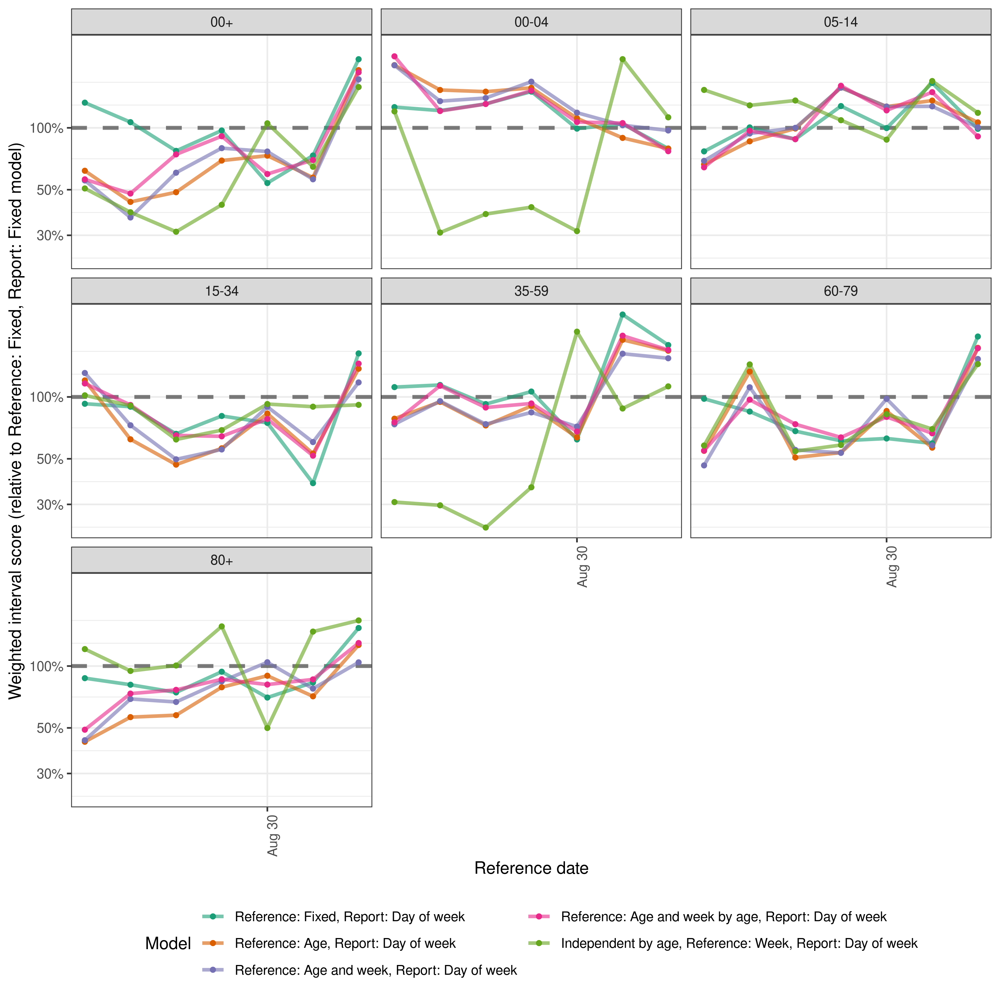

In this vignette we explore using `epinowcast` to estimate COVID-19 hospitalisations by date of positive test in Germany stratified by age using several model specifications with different degrees of flexibility. We then evaluate the resulting nowcasts using visual checks, approximate leave-one-out (LOO) cross-validation using Pareto smoothed importance sampling, and out of sample scoring using the weighted interval score and other scoring measures for the single report date considered here. Before working through this vignette reading the model definition is advised (`vignette("model-definition")`)

# Packages

We use the `epinowcast` package, `data.table` and `purrr` for data manipulation, `ggplot2` for plotting, `knitr` to produce tables of output, `loo` to approximately evaluate out of sample performance and `scoringutils` to evaluate out of sample forecast performance.


```r
library(epinowcast)
library(data.table)
library(purrr)
library(ggplot2)
library(loo)
library(scoringutils)
library(knitr)
```

This vignette includes several models that take upwards of 30 minutes to fit to data on a moderately equipped laptop. To speed up model fitting if more CPUs are available set the number of threads used per chain to half the number of real cores available (here 2 as we are using 2 MCMC chains and have 4 real cores). Note this may cause conflicts with other processes running on your computer and if this is an issue reduce the number of threads used.


```r
threads <- 2
options(mc.cores = 2)
```

# Data

Nowcasting is effectively the estimation of reporting patterns for recently reported data. This requires data on these patterns for previous observations and typically this means the time series of data as reported on multiple consecutive days (in theory non-consecutive days could be used but this is not yet supported in `epinowcast`).

Here we use COVID-19 hospitalisations by date of positive test in Germany stratified by age group available from up to the 1st of September 2020 (with 40 days of data included prior to this) as an example of data available in real-time and hospitalisations by date of positive test available up to 20th of October to represent hospitalisations as finally reported. These data are sourced from the [Robert Koch Institute via the Germany Nowcasting hub](https://github.com/KITmetricslab/hospitalization-nowcast-hub/wiki/Truth-data#role-an-definition-of-the-seven-day-hospitalization-incidence) where they are deconvolved from weekly data and days with negative reported hospitalisations are adjusted.

We first filter out the data that would have been available on the 1st of September for the last 40 days.


```r
nat_germany_hosp <- epinowcast::germany_covid19_hosp[location == "DE"]

retro_nat_germany <- enw_retrospective_data(
  nat_germany_hosp,
  rep_date = as.Date("2021-09-01"), ref_date = as.Date("2021-09-01") - 40
)
retro_nat_germany
#>       reference_date location age_group confirm report_date
#>    1:     2021-07-23       DE       00+      30  2021-07-23
#>    2:     2021-07-24       DE       00+      31  2021-07-24
#>    3:     2021-07-25       DE       00+       8  2021-07-25
#>    4:     2021-07-26       DE       00+       9  2021-07-26
#>    5:     2021-07-27       DE       00+      35  2021-07-27
#>   ---                                                      
#> 6023:     2021-07-23       DE     05-14       1  2021-09-01
#> 6024:     2021-07-23       DE     15-34      21  2021-09-01
#> 6025:     2021-07-23       DE     35-59      39  2021-09-01
#> 6026:     2021-07-23       DE     60-79      21  2021-09-01
#> 6027:     2021-07-23       DE       80+       5  2021-09-01
```

Similarly we then find the data that were available on the 20th of October for these dates which will serve as the target "true" data.


```r
latest_nat_germany <- enw_retrospective_data(
  nat_germany_hosp,
  rep_date = as.Date("2021-10-20"), ref_date = as.Date("2021-09-01") - 40
)
latest_nat_germany <- latest_nat_germany[
  reference_date <= as.Date("2021-09-01")
]
latest_nat_germany <- enw_latest_data(latest_nat_germany)
```

# Data preprocessing

`epinowcast` works by assuming data has been preprocessed into the reporting format it requires coupled with meta data for both reference and report dates. `enw_preprocess_data()` can be used for this though users can also use the internal functions to produce their own custom preprocessing steps. It is at this stage that arbitrary groupings of observations can be defined which will then be propagated throughout all subsequent modelling steps. Here we have data stratified by age and so grouped by age group but in principle this could be any grouping or combination of groups independent of the reference and report date models. Here we also assume a maximum delay required to make the model identifiable. We set this to 40 days due to evidence of long reporting delays in this example data but note that in most cases the majority of right censoring occurs in the first few days and that increasing the maximum delay has a non-linear effect on run-time (i.e a 20 day delay will be much faster to fit a model for than a 40 day delay). Note also that under the current formulation delays longer than the maximum are ignored so that the adjusted estimate is really for data reported after the maximum delay rather than for finally reported data.

Another key modelling choice we make at this stage is to model overall hospitalisations jointly with age groups rather than as an aggregation of age group estimates. This implicitly assumes that aggregated and non-aggregated data are not comparable (which may or may not be the case) but that the reporting process shares some of the same mechanisms. Another way to approach this would be to only model age stratified hospitalisations and then to aggregate the nowcast estimates into total counts after fitting the model.


```r
pobs <- enw_preprocess_data(retro_nat_germany, max_delay = 40, by = "age_group")
pobs
#>                     obs           new_confirm              latest   reporting_triangle       metareference
#> 1: <data.table[6020x9]> <data.table[6020x11]> <data.table[287x8]> <data.table[287x42]> <data.table[287x8]>
#>             metareport time snapshots groups max_delay   max_date
#> 1: <data.table[560x9]>   41       287      7        40 2021-09-01
```

# Models 

Here we explore a range of increasingly complex models using subject area knowledge and posterior predictive checks to motivate modelling choices.

## Shared reporting delay distribution 

We first explore a relatively simple model that assumes that reporting delays are fixed across age groups and time. As this model is the default we simply call `epinowcast`. As we want to make use of `CmdStan`'s support for in-chain parallisation we first compile the default model with this enabled (because of this we also need to pass `threads_per_chain` to `epinowcast`).


```r
multithread_model <- enw_model(threads = TRUE)
```

Note that here we use two chains each using 2 threads as a demonstration but in general using 4 chains is recommended. Also note that warm-up and sampling iterations have been set below default values to reduce compute requirements but this may not be sufficient for many real world use cases. Finally, note that here we have silenced fitting progress and potential warning messages but in general this should not be done.


```r
nowcast <- epinowcast(pobs,
  model = multithread_model,
  save_warmup = FALSE,
  output_loglik = TRUE, pp = TRUE,
  chains = 2, threads_per_chain = threads,
  iter_sampling = 500, iter_warmup = 250,
  show_messages = FALSE, refresh = 0
)
#> Running MCMC with 2 parallel chains, with 2 thread(s) per chain...
#> 
#> Chain 1 finished in 196.8 seconds.
#> Chain 2 finished in 203.8 seconds.
#> 
#> Both chains finished successfully.
#> Mean chain execution time: 200.3 seconds.
#> Total execution time: 203.9 seconds.
```

We first visualise the observations available to the model, the nowcast of final reported hospitalisations and the actual reported observations.


```r
plot(nowcast, latest_obs = latest_nat_germany) +
  facet_wrap(vars(age_group), scales = "free_y")
```


In order to identify areas where the current model is poorly reproducing the data we plot the posterior predictions against the data. This plot is faceted age group and reference data with the y axis showing the number of observations reported on a given day for a given reference day and the x axis showing the report date. We see fairly clearly oscillations in reported cases every 7 days which is expressed in the plot by oscillations in each facet that appear to move from left to right across facets. This indicates that some kind of week day adjustment may be needed.


```r
plot(nowcast, type = "posterior") +
  facet_wrap(vars(age_group, reference_date), scales = "free")
```


## Reporting day of the week effect

As noted using the posterior predictions from the simple model fit above there appears to be a day of the week effect for reported observations. To adjust for this we introduce a random effect for day of the week by date of report using the following helper function which uses the metadata produced by `enw_preprocess_data()`. Note that `epinowcast` uses a sparse design matrix to reduce runtimes so the design matrix shows only unique rows with `index` containing the mapping to the full design matrix.


```r
dow_report_effects <- enw_formula(~ (1 | day_of_week), pobs$metareport)
```

To speed up model fitting we make use of posterior information from the previous model (with inflation) for some parameters. Note that this is not a truly Bayesian approach and in some situations may be problematic. 


```r
priors <- enw_posterior_as_prior(
  nowcast, variables = c("logmean_int", "logsd_int", "sqrt_phi"), scale = 5
)
priors
#>       variable                                             description
#> 1:    eobs_lsd      Standard deviation for expected final observations
#> 2:  logmean_sd     Standard deviation of scaled pooled logmean effects
#> 3:    logsd_sd       Standard deviation of scaled pooled logsd effects
#> 4:   rd_eff_sd Standard deviation of scaled pooled report date effects
#> 5: logmean_int                                                    <NA>
#> 6:   logsd_int                                                    <NA>
#> 7:    sqrt_phi                                                    <NA>
#>             distribution     mean         sd
#> 1: Zero truncated normal 0.000000 1.00000000
#> 2: Zero truncated normal 0.000000 1.00000000
#> 3: Zero truncated normal 0.000000 1.00000000
#> 4: Zero truncated normal 0.000000 1.00000000
#> 5:                  <NA> 1.124867 0.22137497
#> 6:                  <NA> 1.733998 0.24249480
#> 7:                  <NA> 0.128200 0.08118917
```

We now repeat the nowcasting step with the day of the week reporting model included.


```r
dow_nowcast <- epinowcast(pobs,
  model = multithread_model,
  report_effects = dow_report_effects,
  priors = priors,
  save_warmup = FALSE,
  output_loglik = TRUE, pp = TRUE,
  chains = 2, threads_per_chain = threads,
  iter_sampling = 500, iter_warmup = 250,
  show_messages = FALSE, refresh = 0
)
#> Running MCMC with 2 parallel chains, with 2 thread(s) per chain...
#> 
#> Chain 2 finished in 710.2 seconds.
#> Chain 1 finished in 736.3 seconds.
#> 
#> Both chains finished successfully.
#> Mean chain execution time: 723.3 seconds.
#> Total execution time: 736.1 seconds.
```

Nowcast performance looks visually improved but there is notable variation across age groups with the 35-59 year old nowcast appearing quite poor (and as a result the aggregate nowcast also not showing great performance). We could also plot the posterior predictions for this model in the same way as for the previous model.


```r
plot(dow_nowcast, latest_obs = latest_nat_germany) +
  facet_wrap(vars(age_group), scales = "free_y")
```


## Age group variation

It is quite likely that there is some variation in the reporting delay by age and that this may be driving the variation in nowcast performance noted for the last model. Here we model this using a random effect for 5 year age group (as these were the groups supplied in the data).


```r
age_reference_effects <- enw_formula(~ 1 + (1 | age_group), pobs$metareference)
```

We again nowcast this time using both the age adjusted reference date model and the day of the week adjusted report date model.


```r
age_nowcast <- epinowcast(pobs,
  model = multithread_model,
  reference_effects = age_reference_effects,
  report_effects = dow_report_effects,
  priors = priors,
  save_warmup = FALSE,
  output_loglik = TRUE, pp = TRUE,
  chains = 2, threads_per_chain = threads,
  iter_sampling = 500, iter_warmup = 250,
  show_messages = FALSE, refresh = 0
)
#> Running MCMC with 2 parallel chains, with 2 thread(s) per chain...
#> 
#> Chain 2 finished in 675.4 seconds.
#> Chain 1 finished in 677.8 seconds.
#> 
#> Both chains finished successfully.
#> Mean chain execution time: 676.6 seconds.
#> Total execution time: 677.8 seconds.
```

Fit looks slightly better with this adjustment though uncertainty has also increased for all age groups and performance for the final day of data may have reduced compared to the first model.


```r
plot(age_nowcast, latest_obs = latest_nat_germany) +
  facet_wrap(vars(age_group), scales = "free_y")
```


## Variation based on reference date

It could be the case that reporting delays change over time as well as across age groups. One way of modelling this is to assume piecewise constant variation over time modelled with a first order weekly random walk. An attractive property of this approach is that it limits the number of report date distributions that need to be evaluated in the model to the number of weeks of data and as this is an expensive computational step using this approach to introducing a time-varying parameter limits the additional computational overhead.


```r
week_age_reference_effects <- enw_formula(
  ~ 1 + (1 | age_group) + rw(week), pobs$metareference[[1]]
)
```

As before we fit the nowcasting model,


```r
options(mc.cores = 2)
week_nowcast <- epinowcast(pobs,
  model = multithread_model,
  reference_effects = week_age_reference_effects,
  report_effects = dow_report_effects,
  priors = priors,
  save_warmup = FALSE,
  output_loglik = TRUE, pp = TRUE,
  chains = 2, threads_per_chain = threads,
  iter_sampling = 500, iter_warmup = 250,
  show_messages = FALSE, refresh = 0
)
#> Running MCMC with 2 parallel chains, with 2 thread(s) per chain...
#> 
#> Chain 2 finished in 862.5 seconds.
#> Chain 1 finished in 865.7 seconds.
#> 
#> Both chains finished successfully.
#> Mean chain execution time: 864.1 seconds.
#> Total execution time: 865.4 seconds.
```

In comparison to the previous model it looks like the introduction of variation over time has introduce a slight improvement in capturing hospitalisations in some age groups.


```r
plot(week_nowcast, latest_obs = latest_nat_germany) +
  facet_wrap(vars(age_group), scales = "free_y")
```


## Variation based on reference date stratified by age

As a final hierarchical model it makes sense to explore whether there is  evidence that reporting delays vary by week and age group jointly. In this scenario the assumption is that delays may evolve differently over time for each age group but reporting effects and measurement error are still shared across data sets.


```r
week_by_age_reference_effects <- enw_formula(
  ~ 1 + (1 | age_group) + rw(week, age_group), pobs$metareference[[1]]
)
```

We can now fit this model as before (note that this model is quite complex and so may take some time to fit and that we have had to increase the `adapt_delta` setting to 0.95 here to mitigate divergent transitions).


```r
age_week_nowcast <- epinowcast(pobs,
  model = multithread_model,
  reference_effects = week_by_age_reference_effects,
  report_effects = dow_report_effects,
  priors = priors,
  save_warmup = FALSE,
  output_loglik = TRUE, pp = TRUE,
  chains = 2, threads_per_chain = threads,
  adapt_delta = 0.95,
  iter_sampling = 500, iter_warmup = 250,
  show_messages = FALSE, refresh = 0
)
#> Running MCMC with 2 parallel chains, with 2 thread(s) per chain...
#> 
#> Chain 2 finished in 1445.9 seconds.
#> Chain 1 finished in 1456.3 seconds.
#> 
#> Both chains finished successfully.
#> Mean chain execution time: 1451.1 seconds.
#> Total execution time: 1455.7 seconds.
```

In comparison to the previous model it looks like the introduction of variation over time has introduce a slight improvement in capturing hospitalisations in some age groups.


```r
plot(age_week_nowcast, latest_obs = latest_nat_germany) +
  facet_wrap(vars(age_group), scales = "free_y")
```


## Independent models  for each age group.

The obvious question to ask at this stage is if using a model that jointly fits to all age groups at once is actually beneficial. Here we explore this by fitting the same model as previously (a day of week effect for report date and a random walk on the week of the occurrence date stratified by age) to each age group independently.

We could define this model with a single call to `epinowcast` but fitting each dataset independently but in a joint setting would likely lead to long fit times for no real benefit. Instead here we write a small helper function to preprocess our input data, define report and reference date models and then run a nowcast.


```r
independent_epinowcast <- function(obs, max_delay = 40, ...) {
  pobs_ind <- enw_preprocess_data(obs, max_delay = max_delay)

  nowcast <- epinowcast(
    pobs_ind,
    reference_effects = enw_formula(~ rw(week), pobs_ind$metareference[[1]]),
    report_effects = enw_formula(~ (1 | day_of_week), pobs_ind$metareport[[1]]),
     ...
  )

  nowcast_summary <- summary(
    nowcast,
    probs = c(0.025, 0.05, seq(0.1, 0.9, by = 0.1), 0.95, 0.975)
  )
  return(nowcast_summary)
}
```

We can now use this wrapper function on the data available for each age group, summarise the resulting nowcast, and then join these into a single data frame.


```r
options(mc.cores = 2)

independent_nowcast <- map(
  split(retro_nat_germany, by = "age_group"),
  independent_epinowcast,
  model = multithread_model,
  priors = priors,
  save_warmup = FALSE,
  output_loglik = TRUE, pp = TRUE,
  chains = 2, threads_per_chain = threads,
  iter_sampling = 500, iter_warmup = 250,
  show_messages = FALSE, refresh = 0
)
#> Running MCMC with 2 parallel chains, with 2 thread(s) per chain...
#> 
#> Chain 1 finished in 98.2 seconds.
#> Chain 2 finished in 104.5 seconds.
#> 
#> Both chains finished successfully.
#> Mean chain execution time: 101.4 seconds.
#> Total execution time: 105.0 seconds.
#> 
#> Running MCMC with 2 parallel chains, with 2 thread(s) per chain...
#> 
#> Chain 1 finished in 37.6 seconds.
#> Chain 2 finished in 40.2 seconds.
#> 
#> Both chains finished successfully.
#> Mean chain execution time: 38.9 seconds.
#> Total execution time: 40.5 seconds.
#> 
#> Running MCMC with 2 parallel chains, with 2 thread(s) per chain...
#> 
#> Chain 1 finished in 32.4 seconds.
#> Chain 2 finished in 33.7 seconds.
#> 
#> Both chains finished successfully.
#> Mean chain execution time: 33.1 seconds.
#> Total execution time: 34.0 seconds.
#> 
#> Running MCMC with 2 parallel chains, with 2 thread(s) per chain...
#> 
#> Chain 1 finished in 61.9 seconds.
#> Chain 2 finished in 67.1 seconds.
#> 
#> Both chains finished successfully.
#> Mean chain execution time: 64.5 seconds.
#> Total execution time: 67.4 seconds.
#> 
#> Running MCMC with 2 parallel chains, with 2 thread(s) per chain...
#> 
#> Chain 1 finished in 84.5 seconds.
#> Chain 2 finished in 90.1 seconds.
#> 
#> Both chains finished successfully.
#> Mean chain execution time: 87.3 seconds.
#> Total execution time: 90.4 seconds.
#> 
#> Running MCMC with 2 parallel chains, with 2 thread(s) per chain...
#> 
#> Chain 1 finished in 60.0 seconds.
#> Chain 2 finished in 61.5 seconds.
#> 
#> Both chains finished successfully.
#> Mean chain execution time: 60.8 seconds.
#> Total execution time: 61.8 seconds.
#> 
#> Running MCMC with 2 parallel chains, with 2 thread(s) per chain...
#> 
#> Chain 1 finished in 48.6 seconds.
#> Chain 2 finished in 62.2 seconds.
#> 
#> Both chains finished successfully.
#> Mean chain execution time: 55.4 seconds.
#> Total execution time: 62.5 seconds.
independent_nowcast <- rbindlist(independent_nowcast)
```

As we now have the summarised nowcasts rather than an object of class `epinowcast` we need to make use of the underlying plot function ourselves. Doing so we see that performance is generally quite good across the board though the width of credible intervals has also increased. Importantly the 35-59 year old age group is being captured at least as well as in the heirarchical models with only minor reductions in performance in other age groups. This suggests that for this dataset and nowcast date there may be relatively little benefit to jointly modelling age groups.


```r
enw_plot_nowcast_quantiles(
  independent_nowcast, latest_obs = latest_nat_germany) +
  facet_wrap(vars(age_group), scales = "free_y")
```


## Alternative models

In all the models defined above we have assumed that the delay distribution, aside from report day effects, is parametric and has a lognormal distribution. Both of these assumptions may be less than optimal. Alternatives include assuming a different distributional form (such as the gamma distribution which is also supported by `epinowcast`) or assuming that the report delay is fully non-parametric which is not yet supported but will be in future package versions.

There are any number of additional models we could explore within the framework supported by `epinowcast` as well as a large number of alternative parameterisations that are not yet supported. For example, we could explore models with more complex reporting day effects, including holidays (supported in `epinowcast` either as a separate effect or by assuming they have the same reporting hazard as Sundays) and variation over time which would represent reporting delays changing independently of reference date (this would be similar to the time varying model we defined above but with this effect occurring in the report date model rather than in the reference date model). These choices are data dependent and domain knowledge needs to be used to assess the likely censoring mechanisms.

If interested in expanding the functionality of the underlying model to address some of these issues note that `epinowcast` allows users to pass in their own models meaning that alternative parameterisations, for example altering the forecast model used for inferring expected observations, may be easily tested within the package infrastructure. Once this testing has been done alterations that increase the flexibility of the package model and improves its defaults are very welcome as pull requests.

# Evaluation

As we have only nowcast a single date, and we visualised performance as we went, this evaluation is anything but complete or rigorous but we can give some examples of how we might evaluate performance more generally and potentially draw some useful initial conclusions. 

We first list all models and give them informative names,


```r
nowcasts <- list(
  "Reference: Fixed, Report: Fixed" = nowcast,
  "Reference: Fixed, Report: Day of week" = dow_nowcast,
  "Reference: Age, Report: Day of week" = age_nowcast,
  "Reference: Age and week, Report: Day of week" = week_nowcast,
  "Reference: Age and week by age, Report: Day of week" = age_week_nowcast
)
```

and then summarise the nowcast posterior for each model and join into a tidy data frame to make further analysis easier.


```r
summarised_nowcasts <- map(
  nowcasts, summary,
  probs = c(0.025, 0.05, seq(0.1, 0.9, by = 0.1), 0.95, 0.975)
)
summarised_nowcasts$`Independent by age, Reference: Week, Report: Day of week` <- independent_nowcast # nolint

summarised_nowcasts <- rbindlist(summarised_nowcasts, idcol = "model",
                                 use.names = TRUE)
summarised_nowcasts[, `:=`(
  model = factor(
    model,
    levels = c("Reference: Fixed, Report: Fixed",
               "Reference: Fixed, Report: Day of week",
               "Reference: Age, Report: Day of week",
               "Reference: Age and week, Report: Day of week",
               "Reference: Age and week by age, Report: Day of week",
               "Independent by age, Reference: Week, Report: Day of week")),
  age_group = factor(
    age_group,
    levels = c("00+", "00-04", "05-14", "15-34", "35-59", "60-79", "80+"))
)]
```

This allows us to plot nowcasts for each model and age group compared to the latest data. Looking at the plot shows some small differences across models with uncertainty generally decreasing as model complexity increases. Some age groups are clearly better nowcast than others with the 35-59 year old age group in particular having poor nowcast coverage.


```r
enw_plot_nowcast_quantiles(
  summarised_nowcasts, latest_obs = latest_nat_germany) +
  facet_grid(vars(age_group), vars(model), scales = "free_y")
```


As a crude measure of general out of sample performance we can use the leave one out information criterion as supplied by the `loo` package though note this is not typically appropriate for time series data ([where approximate LFO cross validation is likely to perform better](https://cran.r-project.org/web//packages/loo/vignettes/loo2-lfo.html)), the approximation used here to avoid refitting is likely to be poor, and we are not accounting for this by refitting the model as required.


```r
loos <- map(nowcasts, ~ .$fit[[1]]$loo())
loo_compare(loos)
#>                                                     elpd_diff se_diff
#> Reference: Age and week by age, Report: Day of week    0.0       0.0 
#> Reference: Age, Report: Day of week                  -12.7       8.9 
#> Reference: Age and week, Report: Day of week         -14.4       8.3 
#> Reference: Fixed, Report: Day of week                -28.1      10.7 
#> Reference: Fixed, Report: Fixed                     -606.5      47.1
```

We see that the most model which includes day of the week effects for the date of report substantially outperformed the baseline model with no adjustment and that the more complex models that adjusted for variation by age and week for the date of test improved estimated out of sample performance but uncertainty around these estimates was wide.

More rigorously, we can evaluate the nowcasts using proper scoring rules from the `scoringutils` package including the weighted interval score. Here we limit the nowcasts scored to the last 7 days of data to make interpretation easier, transform nowcasts into format required for `scoringutils`, link with the latest available data, and the finally call `scoringutils::eval_forecasts()`. Note that as we are only scoring a single nowcasts it is difficult to generalise our findings as this one day of reporting may have been unusual. To have a more informed view of which model to pick we would ideally nowcast a range of dates and evaluate each of them.

As a first step we score overall performance. Here we see that the baseline model with no variation actually performs very well with only models that include at least day of the week, age groups and variation by week performing comparably. Other performance characteristics are relatively similar across models (with all models being biased towards underprediction for example). 


```r
score <- enw_score_nowcast(
 summarised_nowcasts,
 latest_nat_germany[reference_date > (max(reference_date) - 7)]
)

overall_score <- score |>
  summarise_scores(by = "model") |>
  kable()
```

Stratifying by age group we see that trends in performance are fairly consistent with some small variation in the ordering of which model out performs the others. 


```r
age_score <- score |>
  summarise_scores(by = c("model", "age_group")) |>
  kable()
```

Stratifying by date we find that interestingly the more complex models appear to do better for earlier dates (for which more data is available) with the addition of age group appearing to be the factor that drives this increase in performance. Our finding from the overall summary that the simple model performed comparably appears to be largely driven by performance for the last nowcast target where this model significantly outperformed the others (this underlines the need to evaluate nowcasts from different dates as this single data point may be may anomalous or we may have identified a real trend). 


```r
date_score <- score |>
  summarise_scores(by = c("model", "reference_date")) |>
  kable()
```

Finally we can look across all scores relative to the simple model with no variation. This nicely captures the role of the last data point on performance but also highlights more variation across reference dates and age groups between models. The difference in performance between the hierarchical by age models and the model that treats age groups independently is also very clear with only this model performing well for all days in the 35-59 year age group.


```r
age_date_score <- score |>
  summarise_scores(by = c("model", "reference_date", "age_group"))
fixed_score <- age_date_score[
  model %in% "Reference: Fixed, Report: Fixed",
  .(reference_date, age_group, fixed_is = interval_score)
]
age_date_score <- merge(
  age_date_score, fixed_score, by = c("reference_date", "age_group")
)

age_date_score <- age_date_score[, interval_score := interval_score / fixed_is]
age_date_score <- age_date_score[!model %in% "Reference: Fixed, Report: Fixed"]
plot <- ggplot(age_date_score) +
  aes(x = reference_date, y = interval_score, col = model) +
  geom_hline(yintercept = 1, linetype = 2, size = 1.2, alpha = 0.5) +
  geom_line(size = 1.1, alpha = 0.6) +
  geom_point(size = 1.2) +
  facet_wrap(vars(age_group)) +
  scale_color_brewer(palette = "Dark2") +
  scale_y_log10(labels = scales::percent)

plot <- enw_plot_theme(plot) +
  labs(x = "Reference date",
       y = "Weighted interval score (relative to Reference: Fixed, Report: Fixed model)") + # nolint
  guides(col = guide_legend(title = "Model", ncol = 2))
plot
```



# Summary

In this vignette we showcased using `epinowcast` to nowcast age stratified COVID-19 hospitalisations in Germany by date of test with a series of increasingly complex models motivated by the data. We also showed some simple methods for exploring these nowcasts and evaluating them.

Using the limited information available to us (as we have only nowcast a single date and used performance for this date to motivate new models) it appears that all models performed acceptably and that, aside from the last data point, models with age and day of the week effects likely performed better. It is also fairly clear that performance degrades as the amount of reported data is reduced which intuitively makes sense with performance being particularly sensitive the first day reported data is available (i.e "now"). Our apparent finding that delays evolve fairly independently across age groups motivates choosing a model that is very flexible to this, at least for the date of reference model. 

Despite the independent model and the fixed effect model both doing well overall, for most applications if choosing a model based on this evaluation, I would likely select a relatively flexible model (with day of the week, age group, and age stratified weekly variation) relying on the hierarchical structure to limit overfitting, and excepting a small reduction in performance in some edge cases (with the hope that these are edge cases and not a common feature of the data). However in practice, I would want to explore nowcasting and evaluating more dates and if possible a greater range of model structures (as discussed in the alternative modelling section of this vignette). Note that with the proper scoring approach taken here to understand model performance (and commonly used in the literature) we are ranking models based on absolute errors and so groups with high counts (such as the 35-59 age group) are more important to nowcast correctly than groups with smaller counts (such as those aged 80+). 
