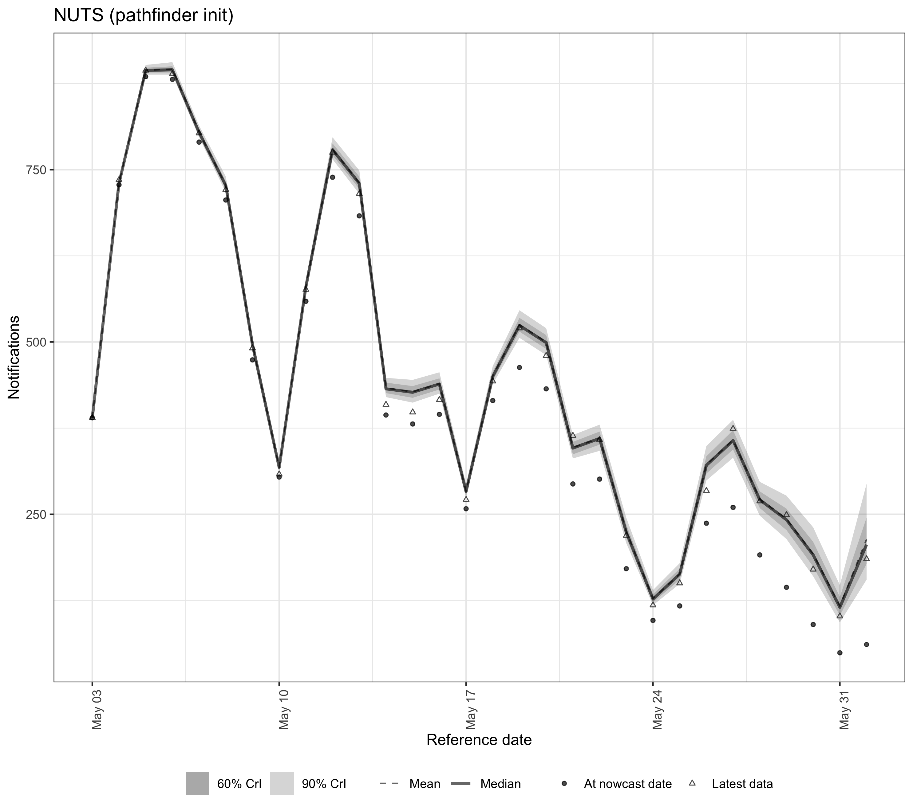
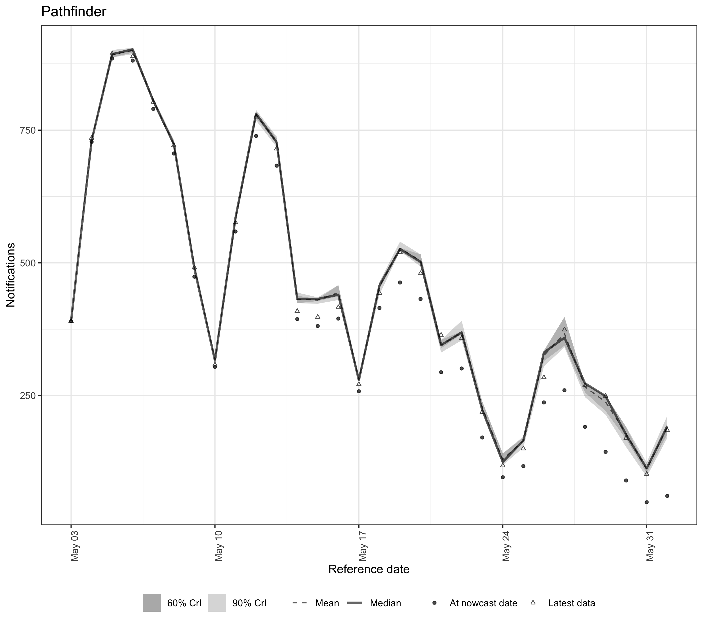
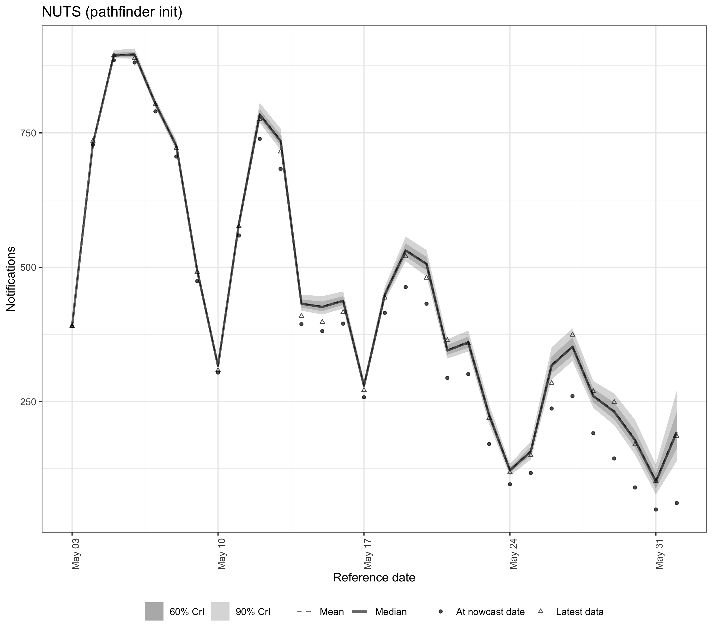
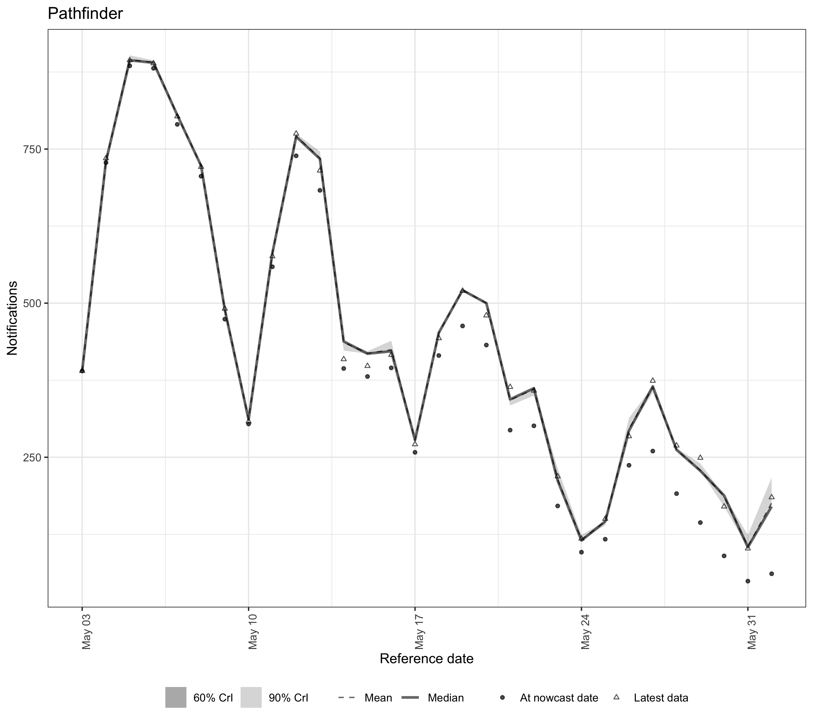

# Overview

`epinowcast` supports several inference methods through [CmdStan](https://mc-stan.org/cmdstanr/):

- **NUTS sampling** (`enw_sample()`): the default Hamiltonian Monte Carlo sampler.
  Produces gold-standard posterior samples but is the slowest option.
- **Pathfinder** (`enw_pathfinder()`): a fast variational approximation.
  Useful for model development, exploration, and quick iteration.
- **Pathfinder-initialised NUTS** (`enw_sample(init_method = "pathfinder")`):
  uses pathfinder to find good starting values for NUTS.
  Can reduce warmup time and improve convergence for difficult models.

This vignette compares these three approaches across two nowcasting model specifications of different complexity, looking at runtime, diagnostics, and the resulting nowcasts.

# Setup


``` r
library(epinowcast)
library(data.table)
library(ggplot2)
library(purrr)
```

We use German COVID-19 hospitalisation data from the package, filtering to a period (up to 1 July 2021) where reporting patterns are well behaved for demonstrating model fit.


``` r
nat_germany_hosp <-
  germany_covid19_hosp[location == "DE"][age_group == "00+"] |>
  enw_filter_report_dates(latest_date = "2021-07-01")

retro_nat_germany <- nat_germany_hosp |>
  enw_filter_report_dates(remove_days = 30) |>
  enw_filter_reference_dates(include_days = 30)

latest_germany_hosp <- nat_germany_hosp |>
  enw_obs_at_delay(max_delay = 30) |>
  enw_filter_reference_dates(remove_days = 30, include_days = 30)

pobs <- enw_preprocess_data(retro_nat_germany, max_delay = 30)
```

Compile the model once.
We disable threading here as the single-group models in this vignette do not benefit from within-chain parallelisation.


``` r
model <- enw_model(threads = FALSE)
```

# Model specifications

We define two nowcasting specifications that share the same expectation (process), report, and observation models but differ in how they handle reporting delays.
Both use a weekly random walk growth rate with day-of-week effects for the expected counts, day-of-week report effects, and negative binomial observations.


``` r
shared_expectation <- enw_expectation(
  ~ 1 + rw(week) + (1 | day_of_week), data = pobs
)
shared_report <- enw_report(~ (1 | day_of_week), data = pobs)
shared_obs <- enw_obs(family = "negbin", data = pobs)
```

**Spec A (static delays):** lognormal delays that are constant over time.
This is a good default when reporting processes are stable.


``` r
ref_a <- enw_reference(
  parametric = ~1, distribution = "lognormal", data = pobs
)
```

**Spec B (time-varying delays):** lognormal delays with a weekly random walk on the mean parameter and day-of-week effects, allowing the delay distribution to change over time and by day of week.
This is useful when reporting processes are evolving, but adds parameters.


``` r
ref_b <- enw_reference(
  parametric = ~ 1 + rw(week) + (1 | day_of_week),
  distribution = "lognormal",
  data = pobs
)
```

We use `purrr::partial()` to create a function factory that fixes the shared settings, so we only need to vary the reference model and fitting options for each run.


``` r
fit_nowcast <- partial(
  epinowcast,
  data = pobs,
  expectation = shared_expectation,
  report = shared_report,
  obs = shared_obs,
  model = model
)
```

# Fitting

We define shared NUTS options tuned for speed rather than production use.


``` r
nuts_args <- list(
  save_warmup = FALSE, pp = TRUE,
  chains = 2,
  iter_sampling = 500, iter_warmup = 500,
  adapt_delta = 0.95, max_depth = 12,
  show_messages = FALSE, refresh = 0
)
```

## NUTS with prior initialisation (default)


``` r
options(mc.cores = 2)

nuts_prior_opts <- do.call(
  enw_fit_opts,
  c(list(sampler = enw_sample), nuts_args)
)

fit_a_nuts <- fit_nowcast(reference = ref_a, fit = nuts_prior_opts)
fit_b_nuts <- fit_nowcast(reference = ref_b, fit = nuts_prior_opts)
```

## NUTS with pathfinder initialisation


``` r
nuts_pf_opts <- do.call(
  enw_fit_opts,
  c(
    list(sampler = enw_sample, init_method = "pathfinder"),
    nuts_args
  )
)

fit_a_nuts_pf <- fit_nowcast(reference = ref_a, fit = nuts_pf_opts)
fit_b_nuts_pf <- fit_nowcast(reference = ref_b, fit = nuts_pf_opts)
```

## Pathfinder (approximate inference)


``` r
pf_opts <- enw_fit_opts(sampler = enw_pathfinder, pp = TRUE)

fit_a_pf <- fit_nowcast(reference = ref_a, fit = pf_opts)
fit_b_pf <- fit_nowcast(reference = ref_b, fit = pf_opts)
```

# Runtime comparison


``` r
fits <- list(
  "A: NUTS (prior init)" = fit_a_nuts,
  "A: NUTS (pathfinder init)" = fit_a_nuts_pf,
  "A: Pathfinder" = fit_a_pf,
  "B: NUTS (prior init)" = fit_b_nuts,
  "B: NUTS (pathfinder init)" = fit_b_nuts_pf,
  "B: Pathfinder" = fit_b_pf
)

runtime_dt <- data.table(
  label = names(fits),
  spec = rep(c("A (static delays)", "B (time-varying delays)"), each = 3),
  method = rep(
    c("NUTS\n(prior init)", "NUTS\n(pathfinder init)", "Pathfinder"),
    2
  ),
  runtime = vapply(fits, function(x) x$run_time, numeric(1))
)

knitr::kable(
  runtime_dt[, .(Spec = spec, Method = method, `Runtime (s)` = runtime)],
  digits = 1,
  caption = "Runtime in seconds for each spec and fitting method."
)
```


Table: Runtime in seconds for each spec and fitting method.

|Spec                    |Method                | Runtime (s)|
|:-----------------------|:---------------------|-----------:|
|A (static delays)       |NUTS
(prior init)      |        56.2|
|A (static delays)       |NUTS
(pathfinder init) |        65.9|
|A (static delays)       |Pathfinder            |         4.7|
|B (time-varying delays) |NUTS
(prior init)      |       119.3|
|B (time-varying delays) |NUTS
(pathfinder init) |       123.7|
|B (time-varying delays) |Pathfinder            |        11.0|


Note that the runtime for pathfinder-initialised NUTS includes both the pathfinder approximation step and the subsequent NUTS sampling.


``` r
ggplot(runtime_dt, aes(x = method, y = runtime, fill = spec)) +
  geom_col(position = "dodge") +
  labs(
    x = "Inference method", y = "Runtime (seconds)",
    fill = "Specification"
  ) +
  theme_bw() +
  theme(legend.position = "bottom")
```

<div class="figure">

<p class="caption">plot of chunk runtime-plot</p>
</div>

Pathfinder is substantially faster than NUTS, completing in a fraction of the time.
The pathfinder initialisation adds overhead to the NUTS run, so pathfinder-initialised NUTS is slower than standard NUTS for these models.
In models where NUTS struggles to converge (e.g. due to complex posteriors or poor default initialisation), the pathfinder initialisation can reduce warmup iterations and overall runtime.

# Diagnostics

## NUTS diagnostics

Standard MCMC diagnostics (Rhat, divergent transitions, tree depth) apply to NUTS fits.


``` r
nuts_fits <- list(
  "A: NUTS (prior init)" = fit_a_nuts,
  "A: NUTS (pathfinder init)" = fit_a_nuts_pf,
  "B: NUTS (prior init)" = fit_b_nuts,
  "B: NUTS (pathfinder init)" = fit_b_nuts_pf
)

diag_dt <- rbindlist(lapply(names(nuts_fits), function(nm) {
  f <- nuts_fits[[nm]]
  data.table(
    Label = nm,
    Samples = f$samples,
    `Max Rhat` = f$max_rhat,
    `Divergent transitions` = f$divergent_transitions,
    `Max tree depth` = f$max_treedepth
  )
}))

knitr::kable(
  diag_dt, digits = 2,
  caption = "MCMC diagnostics for NUTS fits."
)
```


Table: MCMC diagnostics for NUTS fits.

|Label                     | Samples| Max Rhat| Divergent transitions| Max tree depth|
|:-------------------------|-------:|--------:|---------------------:|--------------:|
|A: NUTS (prior init)      |    1000|     1.01|                     1|             10|
|A: NUTS (pathfinder init) |    1000|     1.03|                     0|             10|
|B: NUTS (prior init)      |    1000|     1.02|                     1|              9|
|B: NUTS (pathfinder init) |    1000|     1.03|                     3|             10|


All four NUTS fits converge well: Rhat values are close to 1 (well below the 1.05 threshold), divergent transitions are minimal, and tree depths are within the configured maximum.
Both initialisation methods (prior and pathfinder) produce comparable convergence behaviour for these models.

For production use, aim for Rhat < 1.01, zero divergent transitions, and tree depths well below the maximum.
See the [Stan help vignette](stan-help.html) for guidance on diagnosing and resolving fitting issues.

## Pathfinder diagnostics

Pathfinder is a variational method and does not produce standard MCMC diagnostics.
Instead, it reports Pareto k values from importance resampling.
High Pareto k values (> 0.7) indicate that the importance resampling was unable to correct the variational approximation, suggesting the approximation quality may be poor.
This is common for complex hierarchical models and reinforces the guidance that pathfinder results should be validated against NUTS for final inference.

# Nowcast comparison

We compare the nowcasts from each method using the package's built-in plotting.

## Spec A (static delays)


``` r
spec_a_fits <- fits[grepl("^A:", names(fits))]
for (nm in names(spec_a_fits)) {
  p <- plot(spec_a_fits[[nm]], latest_obs = latest_germany_hosp) +
    ggtitle(gsub("^[AB]: ", "", nm))
  print(p)
}
```

<div class="figure">

<p class="caption">plot of chunk nowcast-comparison-a</p>
</div><div class="figure">

<p class="caption">plot of chunk nowcast-comparison-a</p>
</div><div class="figure">

<p class="caption">plot of chunk nowcast-comparison-a</p>
</div>

## Spec B (time-varying delays)


``` r
spec_b_fits <- fits[grepl("^B:", names(fits))]
for (nm in names(spec_b_fits)) {
  p <- plot(spec_b_fits[[nm]], latest_obs = latest_germany_hosp) +
    ggtitle(gsub("^[AB]: ", "", nm))
  print(p)
}
```

<div class="figure">

<p class="caption">plot of chunk nowcast-comparison-b</p>
</div><div class="figure">

<p class="caption">plot of chunk nowcast-comparison-b</p>
</div><div class="figure">

<p class="caption">plot of chunk nowcast-comparison-b</p>
</div>

For spec A, all three methods produce broadly similar nowcasts with good coverage of the observed data.
For spec B, the additional parameters in the time-varying delay model may lead to greater divergence between pathfinder and NUTS, reflecting the increased difficulty of the approximation.
These results are specific to this model configuration and data; always check agreement between methods for your particular setup.

# Posterior parameter comparison

We compare posterior estimates for key model parameters across methods.
These include the delay distribution intercepts (`refp_mean_int` and `refp_sd_int`) and the negative binomial overdispersion parameter (`sqrt_phi`).


``` r
param_vars <- c("refp_mean_int", "refp_sd_int", "sqrt_phi")

param_summaries <- rbindlist(lapply(names(fits), function(nm) {
  s <- summary(
    fits[[nm]], type = "fit", variables = param_vars
  )
  s[, label := nm]
  s[, spec := fifelse(
    grepl("^A:", nm),
    "A (static delays)",
    "B (time-varying delays)"
  )]
  s[, method := gsub("^[AB]: ", "", nm)]
  s
}))
```


``` r
ggplot(
  param_summaries,
  aes(x = method, y = mean, colour = spec)
) +
  geom_pointrange(
    aes(ymin = q5, ymax = q95),
    position = position_dodge(width = 0.5)
  ) +
  facet_wrap(~variable, scales = "free_y") +
  labs(
    x = "Inference method",
    y = "Posterior estimate (mean and 90% CrI)",
    colour = "Specification"
  ) +
  theme_bw() +
  theme(
    legend.position = "bottom",
    axis.text.x = element_text(angle = 30, hjust = 1)
  )
```

<div class="figure">

<p class="caption">plot of chunk posterior-plot</p>
</div>

Where NUTS and pathfinder posteriors agree closely, pathfinder provides a reliable and much faster approximation.
Substantial disagreement suggests the posterior is complex enough that the variational approximation is insufficient and NUTS should be preferred.
The delay distribution parameters are the most directly interpretable check for agreement, as they are well-identified in the likelihood.
The overdispersion parameter (`sqrt_phi`) provides a complementary check on the observation model.
Results may differ for other model configurations, so it is worth checking agreement for your particular setup.

# Summary

| Method | Speed | Posterior quality | Diagnostics | Best for |
|--------|-------|-------------------|-------------|----------|
| NUTS (prior init) | Slowest | Gold standard | Full MCMC diagnostics | Final inference, publication |
| NUTS (pathfinder init) | Moderate | Gold standard | Full MCMC diagnostics | Difficult models with slow convergence |
| Pathfinder | Fastest | Approximate | Pareto k only | Model development, exploration, quick checks |

**Practical guidance:**

- Start with **pathfinder** during model development to iterate quickly on specification choices.
- Switch to **NUTS** for final inference when results will be reported or used for decisions.
- Use **pathfinder-initialised NUTS** when standard NUTS shows convergence issues (high Rhat, many divergent transitions) or slow warmup.
  When using pathfinder initialisation, you may also be able to reduce `adapt_delta` (e.g. from 0.95 to 0.90) since the sampler starts closer to the typical set, potentially reducing warmup time further.
- Check Pareto k values from pathfinder fits: high values (> 0.7) warn that the approximation may be unreliable.

**Updating workflows:**
A related use case is to fit once with NUTS (for production-quality posteriors) and then use pathfinder with the previous posterior as informative priors for subsequent daily updates.
This can reduce computational cost in real-time surveillance settings where the model is refitted frequently.
Periodic full NUTS refits ensure the posteriors remain well-calibrated.
See `?enw_replace_priors` for how to set custom priors based on previous results.

For more on computational options see the [features summary](features.html).
For help with Stan diagnostics see the [Stan help vignette](stan-help.html).
