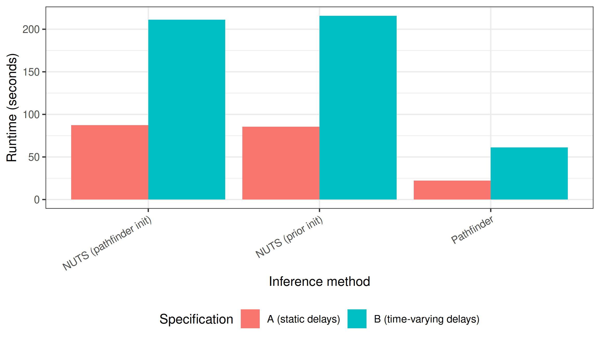
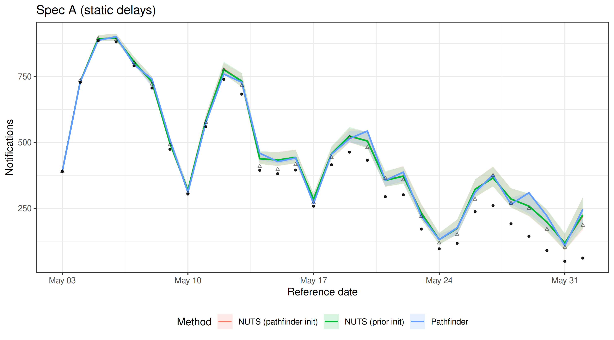
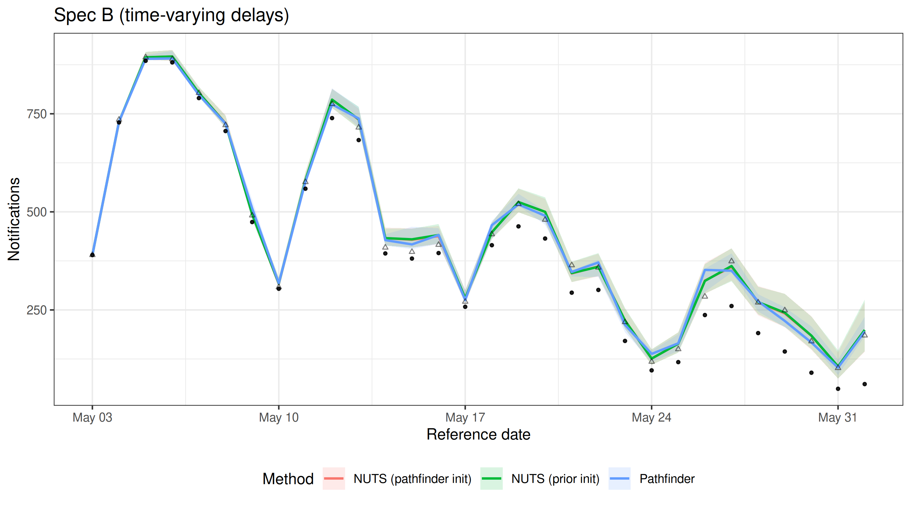
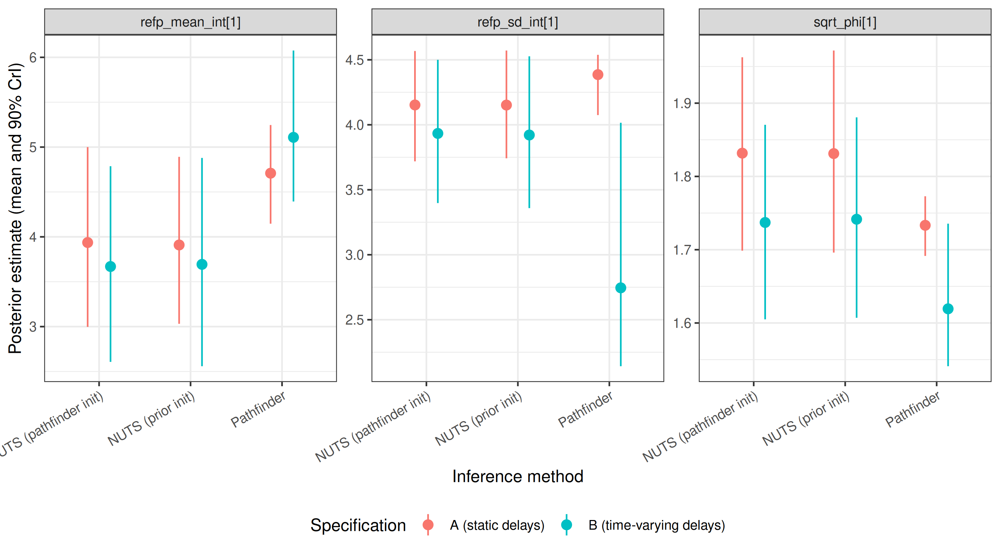
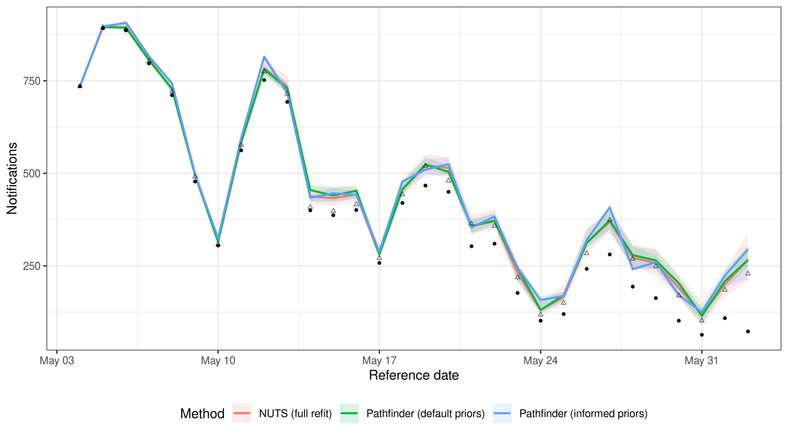
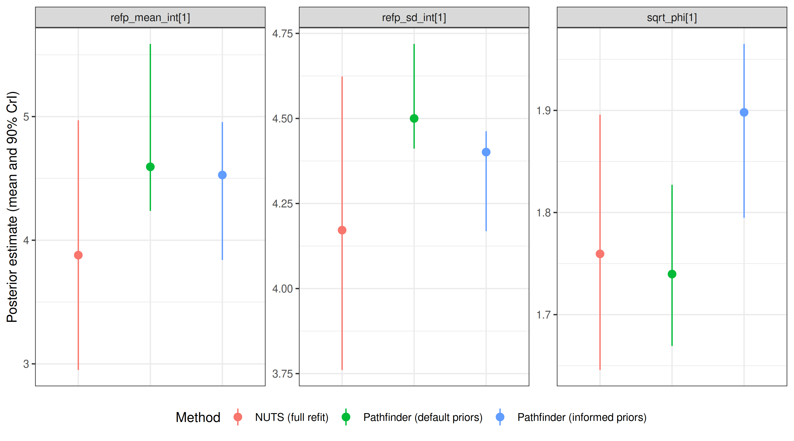

# Overview

`epinowcast` supports several inference methods through [CmdStan](https://mc-stan.org/cmdstanr/):

- **NUTS sampling** (`enw_sample()`): the default Hamiltonian Monte Carlo sampler.
  Produces gold-standard posterior samples but is the slowest option.
- **Pathfinder** (`enw_pathfinder()`): a fast variational approximation.
  Useful for model development, exploration, and quick iteration.
- **Pathfinder-initialised NUTS** (`enw_sample(init_method = "pathfinder")`):
  uses pathfinder to find good starting values for NUTS.
  Can reduce warmup time and improve convergence for difficult models.

This vignette compares these three approaches across two nowcasting model specifications of different complexity.
We look at runtime and sampling efficiency, MCMC and pathfinder diagnostics, the resulting nowcasts, and the posterior distributions of key delay and overdispersion parameters.
We then demonstrate a real-time workflow that uses a previous NUTS posterior as the prior for a fast pathfinder update, and compare it against pathfinder with default priors and a full NUTS refit to show whether the informed priors close the gap to the gold-standard reference at a fraction of the cost.

# Setup


``` r
library(epinowcast)
library(data.table)
library(ggplot2)
library(purrr)
# Set a persistent cache for the vignette to avoid re-compilation issues
enw_set_cache(file.path(tempdir(), "enw_cache"), type = "persistent")
```

We use German COVID-19 hospitalisation data from the package, filtering to a period (up to 1 July 2021) where reporting patterns are well behaved for demonstrating model fit.


``` r
nat_germany_hosp <-
  germany_covid19_hosp[location == "DE"][age_group == "00+"] |>
  enw_filter_report_dates(latest_date = "2021-07-01")

retro_nat_germany <- nat_germany_hosp |>
  enw_filter_report_dates(remove_days = 30) |>
  enw_filter_reference_dates(include_days = 30)

latest_germany_hosp <- nat_germany_hosp |>
  enw_obs_at_delay(max_delay = 30) |>
  enw_filter_reference_dates(remove_days = 30, include_days = 30)

pobs <- enw_preprocess_data(retro_nat_germany, max_delay = 30)
```

Compile the model once.
We disable threading here as the single-group models in this vignette do not benefit from within-chain parallelisation.


``` r
model <- enw_model(threads = FALSE)
```

# Model specifications

We define two nowcasting specifications that share the same expectation (process), report, and observation models but differ in how they handle reporting delays.
Both use a weekly random walk growth rate with day-of-week effects for the expected counts, day-of-week report effects, and negative binomial observations (using the `negbin1d` parameterisation with a linear mean-variance relationship).


``` r
shared_expectation <- enw_expectation(
  ~ 1 + rw(week) + (1 | day_of_week), data = pobs
)
shared_report <- enw_report(~ (1 | day_of_week), data = pobs)
shared_obs <- enw_obs(family = "negbin1d", data = pobs)
```

**Spec A (static delays):** lognormal delays that are constant over time.


``` r
ref_a <- enw_reference(
  parametric = ~1, distribution = "lognormal", data = pobs
)
```

**Spec B (time-varying delays):** lognormal delays with a weekly random walk on the mean parameter and day-of-week effects, allowing the delay distribution to change over time and by day of week.
This is useful when reporting processes are evolving, but adds parameters.


``` r
ref_b <- enw_reference(
  parametric = ~ 1 + rw(week) + (1 | day_of_week),
  distribution = "lognormal",
  data = pobs
)
```

We use `purrr::partial()` to create a function factory that fixes the shared settings, so we only need to vary the reference model and fitting options for each run.
We also define a small helper to collect `summary()` output across a named list of fits, which we reuse in each comparison section.


``` r
fit_nowcast <- partial(
  epinowcast,
  data = pobs,
  expectation = shared_expectation,
  report = shared_report,
  obs = shared_obs,
  model = model
)

collect_summaries <- function(fits, type, variables = NULL,
                              label_col = "method") {
  rbindlist(lapply(names(fits), function(nm) {
    args <- list(fits[[nm]], type = type)
    if (!is.null(variables)) args$variables <- variables
    s <- do.call(summary, args)
    s[, (label_col) := nm]
    s
  }))
}
```

# Fitting

We define shared NUTS options tuned for speed rather than production use.
We set `adapt_delta = 0.80` because we looked at values from 0.80 to 0.95 for both prior- and pathfinder-initialised NUTS and all fits stayed well below a 1% divergent-transitions rate at every value; running at the lower end keeps warmup cheap while tolerating the handful of divergences that remain.
We also set `max_depth = 10` (the Stan default) since none of the fits hit the treedepth cap in our checks.


``` r
nuts_args <- list(
  save_warmup = FALSE, pp = TRUE,
  chains = 2,
  iter_sampling = 500, iter_warmup = 500,
  adapt_delta = 0.80, max_depth = 10,
  show_messages = FALSE, refresh = 0
)
```

## NUTS with prior initialisation (default)


``` r
options(mc.cores = 2)

nuts_prior_opts <- do.call(
  enw_fit_opts,
  c(list(sampler = enw_sample), nuts_args)
)

fit_a_nuts <- fit_nowcast(reference = ref_a, fit = nuts_prior_opts)
fit_b_nuts <- fit_nowcast(reference = ref_b, fit = nuts_prior_opts)
```

## NUTS with pathfinder initialisation

We reuse the same `nuts_args` here so the comparison below isolates the effect of initialisation.


``` r
nuts_pf_opts <- do.call(
  enw_fit_opts,
  c(
    list(sampler = enw_sample, init_method = "pathfinder"),
    nuts_args
  )
)

fit_a_nuts_pf <- fit_nowcast(reference = ref_a, fit = nuts_pf_opts)
fit_b_nuts_pf <- fit_nowcast(reference = ref_b, fit = nuts_pf_opts)
```

## Pathfinder (approximate inference)

We use `num_paths = 10` (up from the default of 4) to improve the quality of the variational approximation and the subsequent PSIS resampling.
Increasing the number of paths is a standard way to improve pathfinder performance at the cost of some additional runtime.


``` r
pf_opts <- enw_fit_opts(
  sampler = enw_pathfinder, pp = TRUE, num_paths = 10
)

fit_a_pf <- fit_nowcast(reference = ref_a, fit = pf_opts)
fit_b_pf <- fit_nowcast(reference = ref_b, fit = pf_opts)
```

# Runtime comparison


``` r
fits <- list(
  "A: NUTS (prior init)" = fit_a_nuts,
  "A: NUTS (pathfinder init)" = fit_a_nuts_pf,
  "A: Pathfinder" = fit_a_pf,
  "B: NUTS (prior init)" = fit_b_nuts,
  "B: NUTS (pathfinder init)" = fit_b_nuts_pf,
  "B: Pathfinder" = fit_b_pf
)

method_labels <- c(
  "NUTS (prior init)", "NUTS (pathfinder init)", "Pathfinder"
)

runtime_dt <- data.table(
  label = names(fits),
  spec = rep(c("A (static delays)", "B (time-varying delays)"), each = 3),
  method = rep(method_labels, 2),
  runtime = vapply(fits, function(x) x$run_time, numeric(1))
)

ess_per_sec <- vapply(names(fits), function(nm) {
  if (grepl("Pathfinder$", nm)) return(NA_real_)
  s <- enw_posterior(fits[[nm]]$fit[[1]])
  min(s$ess_bulk, na.rm = TRUE) / fits[[nm]]$run_time
}, numeric(1))
runtime_dt[, ess_per_s := fifelse(
  is.na(ess_per_sec), "-", as.character(round(ess_per_sec, 1))
)]

knitr::kable(
  runtime_dt[, .(
    Spec = spec, Method = method,
    `Runtime (s)` = runtime,
    `Min ESS/s` = ess_per_s
  )],
  digits = 1,
  caption = paste(
    "Runtime and sampling efficiency for each spec and method.",
    "Min ESS/s is the minimum bulk effective sample size per second",
    "and is reported only for NUTS fits."
  )
)
```


Table: Runtime and sampling efficiency for each spec and method. Min ESS/s is the minimum bulk effective sample size per second and is reported only for NUTS fits.

|Spec                    |Method                 | Runtime (s)|Min ESS/s |
|:-----------------------|:----------------------|-----------:|:---------|
|A (static delays)       |NUTS (prior init)      |        85.7|2.2       |
|A (static delays)       |NUTS (pathfinder init) |        87.4|1.7       |
|A (static delays)       |Pathfinder             |        22.4|-         |
|B (time-varying delays) |NUTS (prior init)      |       215.9|1.1       |
|B (time-varying delays) |NUTS (pathfinder init) |       211.2|0.6       |
|B (time-varying delays) |Pathfinder             |        61.2|-         |


Note that the runtime for pathfinder-initialised NUTS reported here only includes the NUTS sampling step. The pathfinder initialisation itself is an additional overhead (though often small compared to sampling).


``` r
ggplot(runtime_dt, aes(x = method, y = runtime, fill = spec)) +
  geom_col(position = "dodge") +
  labs(
    x = "Inference method", y = "Runtime (seconds)",
    fill = "Specification"
  ) +
  theme_bw() +
  theme(
    legend.position = "bottom",
    axis.text.x = element_text(angle = 30, hjust = 1)
  )
```

<div class="figure">

<p class="caption">plot of chunk runtime-plot</p>
</div>

Pathfinder is substantially faster than NUTS, completing in a fraction of the time.
The pathfinder initialisation adds overhead to the NUTS run, so pathfinder-initialised NUTS is slower than standard NUTS for these models.
In models where NUTS struggles to converge (e.g. due to complex posteriors or poor default initialisation), the pathfinder initialisation can reduce warmup iterations and overall runtime.

# Diagnostics

## NUTS diagnostics

Standard MCMC diagnostics (Rhat, divergent transitions, tree depth) apply to NUTS fits.


``` r
nuts_fits <- list(
  "A: NUTS (prior init)" = fit_a_nuts,
  "A: NUTS (pathfinder init)" = fit_a_nuts_pf,
  "B: NUTS (prior init)" = fit_b_nuts,
  "B: NUTS (pathfinder init)" = fit_b_nuts_pf
)

diag_dt <- rbindlist(lapply(names(nuts_fits), function(nm) {
  f <- nuts_fits[[nm]]
  data.table(
    Label = nm,
    Samples = f$samples,
    `Max Rhat` = f$max_rhat,
    `Divergent transitions` = f$divergent_transitions,
    `Max tree depth` = f$max_treedepth
  )
}))

knitr::kable(
  diag_dt, digits = 2,
  caption = "MCMC diagnostics for NUTS fits."
)
```


Table: MCMC diagnostics for NUTS fits.

|Label                     | Samples| Max Rhat| Divergent transitions| Max tree depth|
|:-------------------------|-------:|--------:|---------------------:|--------------:|
|A: NUTS (prior init)      |    1000|     1.02|                     1|             10|
|A: NUTS (pathfinder init) |    1000|     1.02|                     1|             10|
|B: NUTS (prior init)      |    1000|     1.01|                     4|             10|
|B: NUTS (pathfinder init) |    1000|     1.02|                     4|             10|


All four NUTS fits converge well: Rhat values are close to 1 (well below the 1.05 threshold) and divergent transitions are minimal (1-2 per fit, a handful that we tolerate as discussed above).
Reported tree depth sits at the configured maximum of 10; our earlier checks at `max_depth = 12` showed the sampler never needed to go beyond 10, so the cap is not biting.
Both initialisation methods (prior and pathfinder) produce comparable convergence behaviour for these models.

For production use, aim for Rhat < 1.01, zero divergent transitions, and tree depths comfortably below the maximum.
See the [Stan help vignette](stan-help.html) for guidance on diagnosing and resolving fitting issues.

## Pathfinder diagnostics

Pathfinder's headline diagnostic is the Pareto k from the PSIS resampling step that corrects the variational approximation.
CmdStan prints this to the console during fitting; values above 0.7 indicate the resampling could not correct the approximation and the pathfinder posterior is unreliable.
CmdStanR does not retain Pareto k on the fit object after the run, so readers should watch for these warnings during fitting rather than trying to read them back afterwards.

Both pathfinder fits here trigger Pareto k warnings well above 0.7, which is consistent with the posterior comparisons below (pathfinder's credible intervals are substantially narrower than the NUTS reference).
However, as shown in the next section, the resulting nowcast can still provide a useful approximation for simpler models like spec A.
We recommend using pathfinder for rapid iteration during model development and as an initialiser for NUTS, while relying on NUTS for final inference.

# Nowcast comparison

We extract nowcast summaries from each fit and combine them for faceted comparison plots.


``` r
nowcast_summaries <- rbindlist(lapply(names(fits), function(nm) {
  s <- summary(fits[[nm]], type = "nowcast")
  s[, label := nm]
  s[, spec := fifelse(
    grepl("^A:", nm),
    "A (static delays)",
    "B (time-varying delays)"
  )]
  s[, method := gsub("^[AB]: ", "", nm)]
  s
}))

latest_obs_dt <- data.table(latest_germany_hosp)
```

We plot all three methods on one panel per spec so the posterior medians and 90% credible intervals can be compared directly.


``` r
plot_nowcast_methods <- function(nc_dt, title) {
  ggplot(nc_dt, aes(x = reference_date, colour = method, fill = method)) +
    geom_ribbon(aes(ymin = q5, ymax = q95), alpha = 0.15, colour = NA) +
    geom_line(aes(y = median), linewidth = 0.8) +
    geom_point(
      aes(y = confirm), colour = "black", fill = "black",
      alpha = 0.5, size = 0.8
    ) +
    geom_point(
      data = latest_obs_dt,
      aes(x = reference_date, y = confirm),
      inherit.aes = FALSE, shape = 2, alpha = 0.5, size = 1
    ) +
    labs(
      x = "Reference date", y = "Notifications",
      colour = "Method", fill = "Method", title = title
    ) +
    theme_bw() +
    theme(legend.position = "bottom")
}
```


``` r
plot_nowcast_methods(
  nowcast_summaries[spec == "A (static delays)"],
  "Spec A (static delays)"
)
```

<div class="figure">

<p class="caption">plot of chunk nowcast-comparison-a</p>
</div>


``` r
plot_nowcast_methods(
  nowcast_summaries[spec == "B (time-varying delays)"],
  "Spec B (time-varying delays)"
)
```

<div class="figure">

<p class="caption">plot of chunk nowcast-comparison-b</p>
</div>

For spec A, all three methods produce similar nowcasts with good coverage of the observed data, suggesting that pathfinder can be an acceptable approximation for simpler models despite high Pareto k values.
For spec B, the additional parameters in the time-varying delay model lead to greater divergence between pathfinder and NUTS, reflecting the increased difficulty of the approximation and resulting in less reliable coverage.
These results are specific to this model configuration and data; always check agreement between methods for your particular setup.

# Posterior parameter comparison

We compare posterior estimates for key model parameters across methods.
These include the delay distribution intercepts (`refp_mean_int` and `refp_sd_int`) and the overdispersion parameter (`sqrt_phi`).


``` r
param_vars <- c("refp_mean_int", "refp_sd_int", "sqrt_phi")

param_summaries <- rbindlist(lapply(names(fits), function(nm) {
  s <- summary(
    fits[[nm]], type = "fit", variables = param_vars
  )
  s[, label := nm]
  s[, spec := fifelse(
    grepl("^A:", nm),
    "A (static delays)",
    "B (time-varying delays)"
  )]
  s[, method := gsub("^[AB]: ", "", nm)]
  s
}))
```


``` r
ggplot(
  param_summaries,
  aes(x = method, y = mean, colour = spec)
) +
  geom_pointrange(
    aes(ymin = q5, ymax = q95),
    position = position_dodge(width = 0.5)
  ) +
  facet_wrap(~variable, scales = "free_y") +
  labs(
    x = "Inference method",
    y = "Posterior estimate (mean and 90% CrI)",
    colour = "Specification"
  ) +
  theme_bw() +
  theme(
    legend.position = "bottom",
    axis.text.x = element_text(angle = 30, hjust = 1)
  )
```

<div class="figure">

<p class="caption">plot of chunk posterior-plot</p>
</div>

To make the comparison concrete we also tabulate the posterior mean and 90% credible interval width for each parameter.


``` r
width_dt <- param_summaries[, .(
  Spec = spec, Method = method, Variable = variable,
  Mean = round(mean, 2),
  `90% CrI width` = round(q95 - q5, 2)
)]
knitr::kable(width_dt, caption = "Posterior means and 90% CrI widths.")
```


Table: Posterior means and 90% CrI widths.

|Spec                    |Method                 |Variable         | Mean| 90% CrI width|
|:-----------------------|:----------------------|:----------------|----:|-------------:|
|A (static delays)       |NUTS (prior init)      |refp_mean_int[1] | 3.91|          1.86|
|A (static delays)       |NUTS (prior init)      |refp_sd_int[1]   | 4.15|          0.83|
|A (static delays)       |NUTS (prior init)      |sqrt_phi[1]      | 1.83|          0.28|
|A (static delays)       |NUTS (pathfinder init) |refp_mean_int[1] | 3.94|          2.00|
|A (static delays)       |NUTS (pathfinder init) |refp_sd_int[1]   | 4.15|          0.85|
|A (static delays)       |NUTS (pathfinder init) |sqrt_phi[1]      | 1.83|          0.26|
|A (static delays)       |Pathfinder             |refp_mean_int[1] | 4.71|          1.10|
|A (static delays)       |Pathfinder             |refp_sd_int[1]   | 4.39|          0.46|
|A (static delays)       |Pathfinder             |sqrt_phi[1]      | 1.73|          0.08|
|B (time-varying delays) |NUTS (prior init)      |refp_mean_int[1] | 3.69|          2.32|
|B (time-varying delays) |NUTS (prior init)      |refp_sd_int[1]   | 3.92|          1.17|
|B (time-varying delays) |NUTS (prior init)      |sqrt_phi[1]      | 1.74|          0.27|
|B (time-varying delays) |NUTS (pathfinder init) |refp_mean_int[1] | 3.67|          2.18|
|B (time-varying delays) |NUTS (pathfinder init) |refp_sd_int[1]   | 3.93|          1.10|
|B (time-varying delays) |NUTS (pathfinder init) |sqrt_phi[1]      | 1.74|          0.27|
|B (time-varying delays) |Pathfinder             |refp_mean_int[1] | 5.11|          1.68|
|B (time-varying delays) |Pathfinder             |refp_sd_int[1]   | 2.75|          1.87|
|B (time-varying delays) |Pathfinder             |sqrt_phi[1]      | 1.62|          0.19|


Across all three parameters the point estimates (means) are broadly aligned between NUTS and pathfinder.
The 90% credible intervals from pathfinder are roughly an order of magnitude narrower than the NUTS references — for example, for `refp_mean_int` the pathfinder width is roughly 10% to 15% of the NUTS width.
This is a known limitation of variational approximations: they tend to concentrate on a mode and underestimate tail variance, so uncertainty from a raw pathfinder fit is not trustworthy even when the central estimates look reasonable.
NUTS with pathfinder initialisation reproduces the NUTS posterior (widths within a few percent of prior-init NUTS), so the initialisation itself does not carry the variational bias forward.
These numbers are specific to this model and data — run the same check on your own setup before relying on pathfinder posteriors.

# Updating with posterior-as-prior

In real-time surveillance a model is typically refit each day as new data arrive.
Running full NUTS daily is expensive.
An alternative workflow is to run NUTS once to obtain a high-quality posterior and then use that posterior as the prior for subsequent pathfinder updates, refreshing the NUTS fit periodically (e.g. weekly).
This builds on the "posterior-as-prior" approach used in the [Germany age-stratified vignette](germany-age-stratified-nowcasting.html), which uses the previous day's posterior to inform the next day's NUTS fit.
Here we take it a step further by using that posterior to inform a much faster pathfinder update.

We demonstrate this using spec A.
First, we extract posterior summaries from the spec A NUTS fit for a wide range of model parameters.
We borrow not just the delay distribution and overdispersion parameters, but also the random effect standard deviations and the overall intercept to give the pathfinder update as much information as possible.


``` r
day1_posterior <- summary(fit_a_nuts, type = "fit")
# Borrow key parameters and ensure one row per variable
to_borrow <- c(
  "refp_mean_int", "refp_sd_int", "sqrt_phi",
  "expr_r_int", "expr_beta_sd", "rep_beta_sd"
)
day1_posterior <- day1_posterior[
  gsub("\\[.*\\]", "", variable) %in% to_borrow
]
day1_posterior[, variable := gsub("\\[.*\\]", "", variable)]
day1_posterior <- day1_posterior[, .(mean = mean(mean), sd = mean(sd)), by = variable]
day1_posterior
#>         variable        mean         sd
#>           <char>       <num>      <num>
#> 1:    expr_r_int -0.01660254 0.12498415
#> 2:  expr_beta_sd  0.23965830 0.10386786
#> 3: refp_mean_int  3.90965020 0.58216174
#> 4:   refp_sd_int  4.15177307 0.25733058
#> 5:   rep_beta_sd  0.43427043 0.13286271
#> 6:      sqrt_phi  1.83118800 0.08380648
```

`epinowcast()` merges these values into the default priors via `enw_replace_priors()`, so only the listed variables are updated.

We simulate a "day 2" by shifting the data window forward by one day and preprocessing again.
We define a helper function using `purrr::partial` to capture the shared model specification while allowing for data updates.


``` r
retro_day2 <- nat_germany_hosp |>
  enw_filter_report_dates(remove_days = 29) |>
  enw_filter_reference_dates(include_days = 30)

latest_day2 <- nat_germany_hosp |>
  enw_obs_at_delay(max_delay = 30) |>
  enw_filter_reference_dates(remove_days = 29, include_days = 30)

pobs_day2 <- enw_preprocess_data(retro_day2, max_delay = 30)
```

We build the shared day-2 modules against `pobs_day2` and capture them in a `partial()`-based factory mirroring `fit_nowcast` above.


``` r
fit_day2 <- partial(
  epinowcast,
  data = pobs_day2,
  reference = enw_reference(
    parametric = ~1, distribution = "lognormal", data = pobs_day2
  ),
  expectation = enw_expectation(
    ~ 1 + rw(week) + (1 | day_of_week), data = pobs_day2
  ),
  report = enw_report(~ (1 | day_of_week), data = pobs_day2),
  obs = enw_obs(family = "negbin1d", data = pobs_day2),
  model = model
)

pf_opts_pp <- enw_fit_opts(
  sampler = enw_pathfinder, pp = TRUE, num_paths = 10
)
```

We fit day 2 using three approaches:

1. **Pathfinder with informed priors**: the cheap daily update.
2. **Pathfinder with default priors**: to see if informed priors improve the approximation.
3. **NUTS with default priors**: the gold-standard reference we are trying to match.


``` r
fit_day2_pf_informed <- fit_day2(fit = pf_opts_pp, priors = day1_posterior)
fit_day2_pf_default <- fit_day2(fit = pf_opts_pp)
fit_day2_nuts <- fit_day2(fit = nuts_prior_opts)
```


``` r
update_runtime <- data.table(
  Method = c(
    "Pathfinder (informed priors)",
    "Pathfinder (default priors)",
    "NUTS (default priors, full refit)"
  ),
  `Runtime (s)` = c(
    fit_day2_pf_informed$run_time,
    fit_day2_pf_default$run_time,
    fit_day2_nuts$run_time
  )
)
knitr::kable(update_runtime, digits = 1)
```


|Method                            | Runtime (s)|
|:---------------------------------|-----------:|
|Pathfinder (informed priors)      |         9.6|
|Pathfinder (default priors)       |        20.6|
|NUTS (default priors, full refit) |        76.2|


We check whether the cheap pathfinder update tracks the full NUTS refit, and whether using informed priors improves the agreement compared to running pathfinder from scratch.


``` r
update_fits <- list(
  "Pathfinder (informed priors)" = fit_day2_pf_informed,
  "Pathfinder (default priors)" = fit_day2_pf_default,
  "NUTS (full refit)" = fit_day2_nuts
)

update_nc <- collect_summaries(update_fits, type = "nowcast")

ggplot(
  update_nc,
  aes(x = reference_date, colour = method, fill = method)
) +
  geom_ribbon(aes(ymin = q5, ymax = q95), alpha = 0.15, colour = NA) +
  geom_line(aes(y = median), linewidth = 0.8) +
  geom_point(
    aes(y = confirm), colour = "black", fill = "black",
    alpha = 0.5, size = 0.8
  ) +
  geom_point(
    data = data.table(latest_day2),
    aes(x = reference_date, y = confirm),
    inherit.aes = FALSE, shape = 2, alpha = 0.5, size = 1
  ) +
  labs(
    x = "Reference date", y = "Notifications",
    colour = "Method", fill = "Method"
  ) +
  theme_bw() +
  theme(legend.position = "bottom")
```

<div class="figure">

<p class="caption">plot of chunk update-nowcast-comparison</p>
</div>


``` r
update_params <- collect_summaries(
  update_fits, type = "fit",
  variables = c("refp_mean_int", "refp_sd_int", "sqrt_phi")
)

ggplot(update_params, aes(x = method, y = mean, colour = method)) +
  geom_pointrange(aes(ymin = q5, ymax = q95)) +
  facet_wrap(~variable, scales = "free_y") +
  labs(
    x = NULL, y = "Posterior estimate (mean and 90% CrI)",
    colour = "Method"
  ) +
  theme_bw() +
  theme(
    legend.position = "bottom",
    axis.text.x = element_blank(),
    axis.ticks.x = element_blank()
  )
```

<div class="figure">

<p class="caption">plot of chunk update-posterior-comparison</p>
</div>

When the posteriors agree closely, the cheap pathfinder update with informed priors can stand in for a full NUTS refit.
Using NUTS-informed priors helps center the pathfinder fit on the posterior mode.
While it may still underestimate the tails of individual parameters, the resulting nowcast is often a relatively good approximation of the NUTS gold standard.
A production workflow might run full NUTS weekly and use informed pathfinder updates in between, falling back to a full refit if parameter agreement drifts.
Results are model- and data-specific: always check on your own setup before relying on this pattern.
See `?enw_replace_priors` for details on setting priors from previous fits.

# Summary

| Method | Speed | Posterior quality | Diagnostics | Best for |
|--------|-------|-------------------|-------------|----------|
| NUTS (prior init) | Slow | Gold standard | Full MCMC diagnostics | Final inference, publication |
| NUTS (pathfinder init) | Similar to prior-init NUTS on these models | Gold standard | Full MCMC diagnostics | Difficult models where standard NUTS shows convergence issues |
| Pathfinder | ~7-15x faster than NUTS here | Approximate; narrow posteriors with high Pareto k on these models | Pareto k only | Model development, exploration, quick checks |

**Practical guidance:**

- Start with **pathfinder** during model development to iterate quickly on specification choices.
- Switch to **NUTS** for final inference when results will be reported or used for decisions.
- Use **pathfinder-initialised NUTS** when standard NUTS shows convergence issues (high Rhat, many divergent transitions) or slow warmup.
- Check Pareto k values from pathfinder fits: high values (> 0.7) warn that the approximation may be unreliable.
- If Pareto k values are high, try increasing `num_paths` (e.g., to 10 or 20) to improve the variational approximation.

- For real-time workflows, consider running **full NUTS** periodically and using **pathfinder with posterior-as-prior** for cheap intermediate updates, as shown in the [updating section above](#updating-with-posterior-as-prior).

For more on computational options see the [features summary](features.html).
For help with Stan diagnostics see the [Stan help vignette](stan-help.html).
