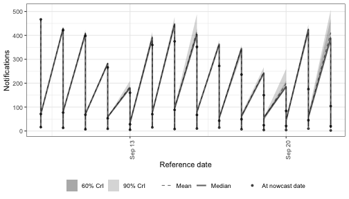
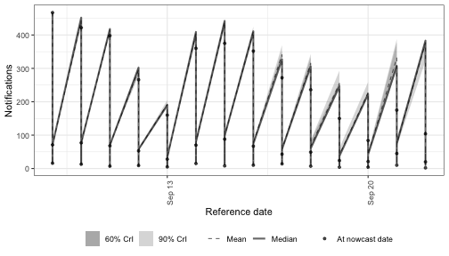
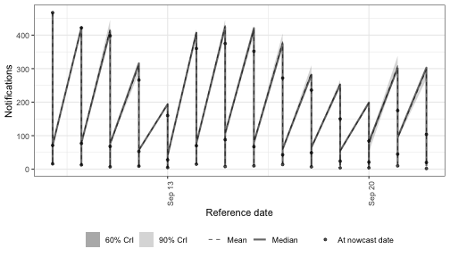
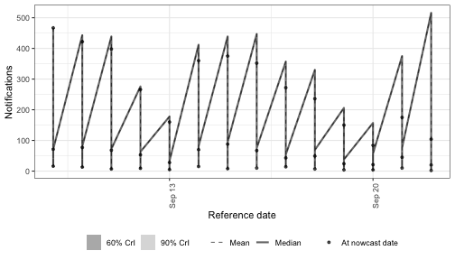
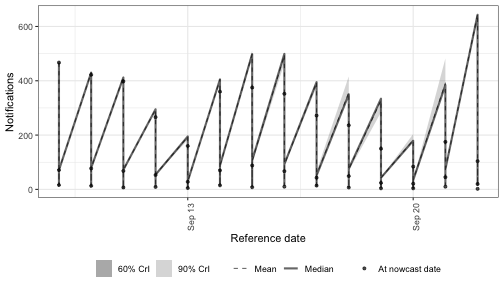

The expectation module's `r` formula controls the latent log growth rate.
Several options exist for giving it structure; each is a different choice for how `r` is allowed to vary over time and across groups.

The choices fall into two families.
The first is **latent time-series structure** — how `r` correlates with itself over time:

- **Random walk on weeks** via `rw(week)`. The growth rate has iid Gaussian increments per week; the cumulative sum of those increments is what enters the linear predictor.
- **Independent per-week-and-group random effects** via `(1 | week:.group)`. Each (week, group) combination has its own random level drawn from a shared Gaussian, with no time-correlation structure across weeks.
- **ARIMA(p, d, q) residuals** via `arima(day, age_group, p, d, q)`. The growth rate is built up through a parameter-dependent kernel applied to unit-normal shocks, supporting arbitrary autoregressive and moving-average orders and integration. When `by` is supplied each group has its own innovation series; the AR/MA parameters and latent standard deviation are currently shared across groups.
- **Pure moving-average residuals** via `ma(day, age_group, q = 6)`. A stationary short-memory variant of the same machinery: a shock at day `t` influences the series at lags `0, 1, ..., q` and then drops out, with no autoregressive feedback. Taking `q = 6` gives a seven-day influence window (one week of moving-average memory).

The second is **periodic / calendar terms** — structure that repeats on a known cycle rather than drifting over time:

- **Day-of-week random effects** via `(1 | day_of_week)`. Each weekday draws its own offset from a shared Gaussian, capturing periodic within-week variation that recurs every week.

Latent and periodic terms compose freely in the same formula.

The fits use `enw_pathfinder()` for fast variational inference so the vignette stays snappy at build time.
For a real analysis switch to NUTS via `enw_sample()`.

# Setup


``` r
library(epinowcast)
library(data.table)
#> Warning: package 'data.table' was built under R version 4.5.2
library(ggplot2) # nolint: unused_import_linter. Required by plot.epinowcast().
#> Warning: package 'ggplot2' was built under R version 4.5.2
library(knitr)
```


``` r
options(mc.cores = 2)
```

We work with three German age strata reported nationally over five weeks of reference dates ending 28 days before the latest available reports.
The same `pobs` is used for every fit so any difference between the resulting nowcasts is down to the latent-process choice rather than the data.


``` r
nat_germany_hosp <- germany_covid19_hosp[
  location == "DE" & age_group %in% c("00+", "00-04", "80+")
]

retro <- nat_germany_hosp |>
  enw_filter_report_dates(remove_days = 28) |>
  enw_filter_reference_dates(include_days = 35)

pobs <- suppressWarnings(
  enw_preprocess_data(retro, by = "age_group", max_delay = 14)
)
```

A common fit configuration is reused across the models.
`enw_pathfinder()` is a fast approximate sampler that suits feature tours and exploration; for production fits use `enw_sample()` instead.


``` r
fit <- enw_fit_opts(
  sampler = enw_pathfinder,
  num_paths = 4, single_path_draws = 50, draws = 200,
  refresh = 0, show_messages = FALSE
)
```

# Random walk on weeks

`rw(week)` adds one Gaussian increment per week; the cumulative sum of those increments is added to `r`.
Mathematically this is equivalent to a (correlated) Gaussian prior over the per-week growth rates with a single shared standard deviation.


``` r
nowcast_rw <- epinowcast(
  pobs,
  expectation = enw_expectation(r = ~ rw(week), data = pobs),
  obs = enw_obs(family = "negbin", data = pobs),
  fit = fit
)
```


``` r
plot(nowcast_rw)
```



# Independent per-(week, group) random effects

`(1 | week:.group)` adds a separate random level for every (week, group) cell, drawn from a shared Gaussian.
Unlike the random walk, there is no time correlation across weeks; each week starts afresh.
This is the natural choice when weekly fluctuations look like noise rather than drift.


``` r
nowcast_re <- epinowcast(
  pobs,
  expectation = enw_expectation(
    r = ~ 1 + (1 | week:.group), data = pobs
  ),
  obs = enw_obs(family = "negbin", data = pobs),
  fit = fit
)
```


``` r
plot(nowcast_re)
```



# ARIMA(p, d, q) residuals

`arima(time, by, p, d, q)` adds a latent ARIMA(p, d, q) residual series to the linear predictor.
Differencing is applied via the cumulative-sum operator and the ARMA part via a parameter-dependent Toeplitz kernel built from the impulse response; both compose with a single matrix multiplication onto unit-normal shocks.
When `by` is supplied each group has its own column of unit-normal shocks; the AR/MA parameters and latent standard deviation are currently shared across groups.

`arima(time, d = 1, p = 0, q = 0)` recovers the same model as `rw(time)`; setting `p > 0` or `q > 0` adds autoregressive or moving-average structure on top.


``` r
nowcast_arima <- epinowcast(
  pobs,
  expectation = enw_expectation(
    r = ~ 1 + arima(day, age_group, p = 1, d = 1),
    data = pobs
  ),
  obs = enw_obs(family = "negbin", data = pobs),
  fit = fit
)
```


``` r
plot(nowcast_arima)
```



The ARIMA-specific posterior summaries:


``` r
arima_pars <- summary(nowcast_arima, type = "fit")[
  grepl("expr_arima_(pacf|sigma)", variable),
  .(variable, mean, q5, q95)
]
kable(arima_pars, digits = 3)
```


|variable            |  mean|    q5|   q95|
|:-------------------|-----:|-----:|-----:|
|expr_arima_pacf[1]  | 0.234| 0.202| 0.243|
|expr_arima_sigma[1] | 0.012| 0.012| 0.013|


# Pure moving-average residuals

`ma(time, by, q)` is the convenience alias for `arima(time, by, p = 0, d = 0, q = q)`.
It is stationary (no integration) and a shock at day `t` influences the series at lags `0, 1, ..., q` — a `q + 1` day window — before dropping out, with no AR feedback.
This is useful when you expect short-range correlated noise around a flat trend rather than persistent drift.
Picking `q = 6` gives a seven-day influence window, so a daily shock can decay across the rest of the week without persisting indefinitely as it would under an AR component.


``` r
nowcast_ma <- epinowcast(
  pobs,
  expectation = enw_expectation(
    r = ~ 1 + ma(day, age_group, q = 6),
    data = pobs
  ),
  obs = enw_obs(family = "negbin", data = pobs),
  fit = fit
)
```


``` r
plot(nowcast_ma)
```



Note that `ma(q = 6)` is *not* a periodic-by-weekday model: it gives correlated noise over a one-week window, not a recurring weekly cycle.
For genuinely periodic within-week variation use a day-of-week term (next section), which is what week-after-week reporting patterns usually look like.

# Periodic terms

Periodic terms repeat on a known cycle rather than drifting freely.
The most common case in surveillance data is day-of-week reporting: weekends look different from weekdays in roughly the same way every week.

## Day-of-week random effects

`(1 | day_of_week)` gives every weekday its own offset drawn from a shared Gaussian.
The same Monday offset enters every Monday, the same Tuesday offset enters every Tuesday, and so on — exactly periodic across weeks.
The shared Gaussian pools information across the seven weekday levels, which is preferable to seven independent fixed effects whenever the dataset is short.
Swap `(1 | day_of_week)` for `day_of_week` if you would rather have unpooled fixed effects.


``` r
nowcast_dow <- epinowcast(
  pobs,
  expectation = enw_expectation(
    r = ~ 1 + (1 | day_of_week), data = pobs
  ),
  obs = enw_obs(family = "negbin", data = pobs),
  fit = fit
)
```


``` r
plot(nowcast_dow)
```



Periodic and latent terms compose: `~ 1 + (1 | day_of_week) + arima(day, p = 1, d = 1)` puts a periodic day-of-week effect alongside an ARIMA(1, 1, 0) residual on the trend.

# When to reach for which

| Option | Family | Formula example | Useful when |
|---|---|---|---|
| Random walk | Latent | `rw(week)` | The growth rate evolves smoothly week-to-week with no preferred direction; the standard non-stationary smoother. |
| Independent week random effects | Latent | `(1 \| week:.group)` | Weekly fluctuations look like noise around a stable mean rather than a drifting trend; no time correlation is imposed. |
| ARIMA | Latent | `arima(day, by, p, d, q)` | You want explicit autocorrelated short-range structure on the residuals, e.g. `arima(p = 1, d = 0)` for stationary AR(1) deviations around a smooth trend, or `arima(p = 1, d = 1)` for AR(1) on the differences. |
| Moving average | Latent | `ma(day, by, q)` | Stationary short-memory noise with finite influence: shocks decay to zero after `q` steps. Pair with a smooth trend for drift-free residuals. |
| Day-of-week random effects | Periodic | `(1 \| day_of_week)` | Within-week variation is structurally periodic — the same weekday offsets recur — and you want pooled rather than fixed weekday effects. |

These options compose within the same formula.
A typical surveillance pattern mixes one latent option for the trend with a periodic term for calendar effects, e.g. `~ 1 + (1 | day_of_week) + arima(day, p = 1, d = 1)`.
The `by` argument on `arima()`, the aliases `ar()` / `ma()` / `arma()`, and `rw()` lets each group draw its own innovation series; the AR/MA parameters and latent standard deviation are currently shared across groups (per-group parameters are a planned extension).
