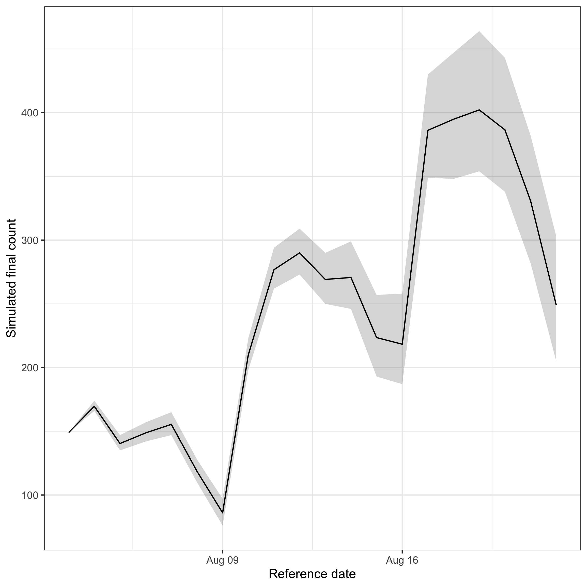
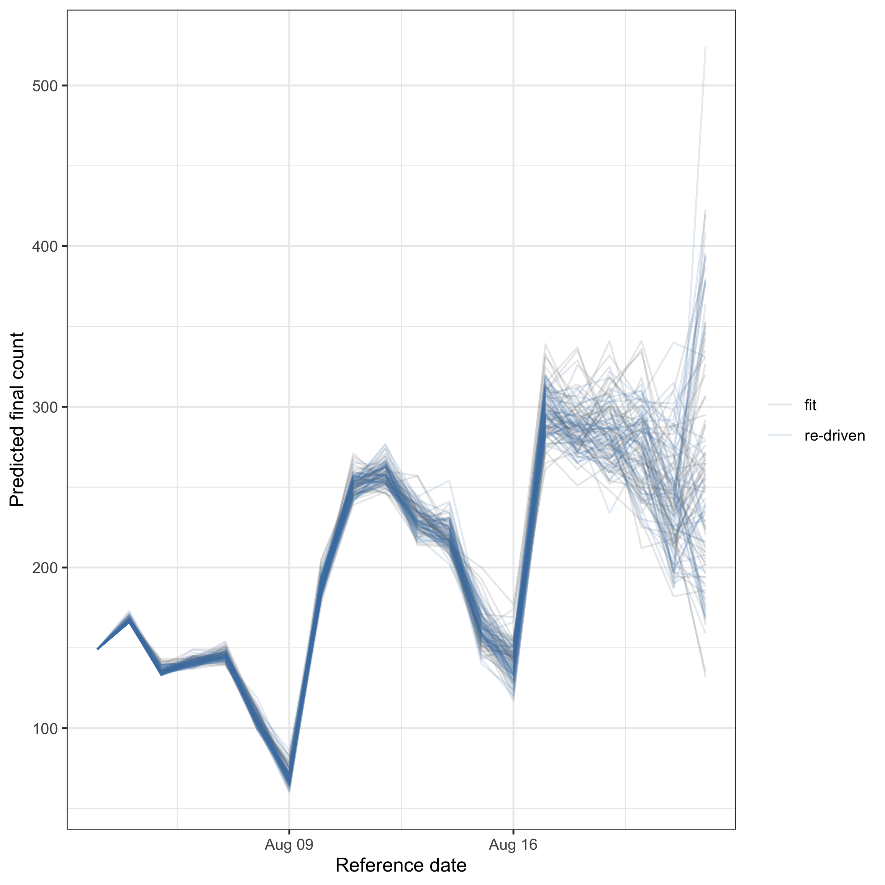
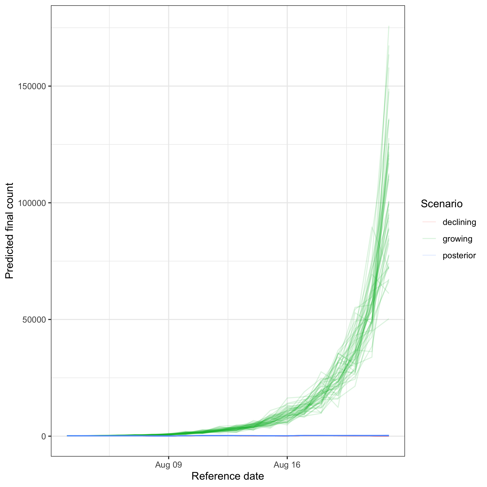

`epinowcast` uses one model for three tasks that are usually kept separate.
[`enw_simulate()`](../reference/enw_simulate.html) forward-generates synthetic data from known parameters.
[`epinowcast()`](../reference/epinowcast.html) fits the model to data.
[`enw_forecast()`](../reference/enw_forecast.html) re-drives a fit, optionally under new latent-process assumptions.
All three share the same generated-quantities code, so their outputs are directly comparable.

This pattern mirrors the separation in `EpiNow2` between [`simulate_infections()`](https://epiforecasts.io/EpiNow2/reference/simulate_infections.html) and [`forecast_infections()`](https://epiforecasts.io/EpiNow2/reference/forecast_infections.html), generalised here so that any model component can be fixed or overridden.


``` r
library(epinowcast)
library(data.table)
library(ggplot2)

enw_set_cache(tempdir())
options(mc.cores = 2)
```

# Simulate from known parameters

We start from a preprocessed data object that defines the dates, groups, and maximum delay to simulate over.
We then forward-generate observations from a known, time-varying growth rate and a known reporting delay.
The growth rate is supplied directly.
Every other component is fixed through `parameters`, which can set any model parameter.
We draw many synthetic replicates with `draws` so the observation-model uncertainty around the fixed expectation is retained.


``` r
pobs <- enw_example("preprocessed")

# A known growth rate that rises and then falls
true_r <- c(rep(0.15, 20), rep(-0.1, 19))

sims <- enw_simulate(
  pobs,
  growth_rate = true_r,
  parameters = list(
    refp_mean_int = 1.6, refp_sd_int = 0.6, sqrt_phi = 0.4
  ),
  reference = enw_reference(~1, data = pobs),
  expectation = enw_expectation(r = ~ 1 + rw(week), data = pobs),
  draws = 500
)
#> Running MCMC with 1 chain, with 1 thread(s) per chain...
#> 
#> Chain 1 Iteration:   1 / 500 [  0%]  (Sampling) 
#> Chain 1 Iteration: 100 / 500 [ 20%]  (Sampling) 
#> Chain 1 Iteration: 200 / 500 [ 40%]  (Sampling) 
#> Chain 1 Iteration: 300 / 500 [ 60%]  (Sampling) 
#> Chain 1 Iteration: 400 / 500 [ 80%]  (Sampling) 
#> Chain 1 Iteration: 500 / 500 [100%]  (Sampling) 
#> Chain 1 finished in 0.2 seconds.
```

The simulated object carries synthetic observations in the same shape as a real fit, so the standard summaries and plots apply.
The simulated final counts follow the rise-and-fall we imposed on the growth rate, with a spread from the negative-binomial observation model.


``` r
simulated_nowcast <- summary(sims, type = "nowcast")

ggplot(simulated_nowcast) +
  aes(x = reference_date, y = mean) +
  geom_ribbon(aes(ymin = q5, ymax = q95), alpha = 0.2) +
  geom_line() +
  labs(x = "Reference date", y = "Simulated final count") +
  theme_bw()
```



# Fit a model

We fit the same model structure to the example data so that we have a posterior to forecast from.


``` r
fit <- epinowcast(
  pobs,
  reference = enw_reference(~1, data = pobs),
  expectation = enw_expectation(r = ~ 1 + rw(week), data = pobs),
  fit = enw_fit_opts(
    pp = TRUE, chains = 2, iter_warmup = 500, iter_sampling = 500,
    show_messages = FALSE, refresh = 0
  )
)
```

# Forecast from the fit

[`enw_forecast()`](../reference/enw_forecast.html) re-runs the generated quantities using the posterior draws.
With no override the growth rate is taken per draw from the posterior, so the forecast reproduces the fitted nowcast up to the observation-model redraw.
We show this by overlaying the re-driven sample trajectories on the fit, rather than comparing point estimates.


``` r
nowcast_samples <- function(object, scenario) {
  s <- as.data.table(summary(object, type = "nowcast_sample"))
  s <- s[, .(reference_date, .draw, sample)]
  s[, scenario := scenario]
  s[.draw %in% sample(unique(.draw), min(50, uniqueN(.draw)))]
}

redriven <- enw_forecast(fit)
#> Running standalone generated quantities after 2 MCMC chains, all chains in parallel , with 1 thread(s) per chain...
#> 
#> Chain 1  Elapsed Time: 0.147 seconds (Generated Quantities) 
#> Chain 2  Elapsed Time: 0.149 seconds (Generated Quantities) 
#> Chain 1 finished in 0.0 seconds.
#> Chain 2 finished in 0.0 seconds.
#> 
#> Both chains finished successfully.
#> Mean chain execution time: 0.0 seconds.
#> Total execution time: 0.2 seconds.

recovery <- rbindlist(list(
  nowcast_samples(fit, "fit"),
  nowcast_samples(redriven, "re-driven")
))

ggplot(recovery) +
  aes(x = reference_date, y = sample, colour = scenario) +
  geom_line(aes(group = interaction(.draw, scenario)), alpha = 0.15) +
  scale_colour_manual(values = c(fit = "grey40", `re-driven` = "steelblue")) +
  labs(x = "Reference date", y = "Predicted final count", colour = NULL) +
  theme_bw()
```



Supplying an override replaces a model component with a new trajectory while the other components keep their posterior uncertainty.
Here we compare a growing and a declining counterfactual growth rate.
We again plot posterior sample trajectories, so the spread between draws is visible.


``` r
growing <- enw_forecast(fit, overrides = list(r = 0.2))
#> Running standalone generated quantities after 2 MCMC chains, all chains in parallel , with 1 thread(s) per chain...
#> 
#> Chain 1  Elapsed Time: 0.168 seconds (Generated Quantities) 
#> Chain 1 finished in 0.0 seconds.
#> Chain 2  Elapsed Time: 0.169 seconds (Generated Quantities) 
#> Chain 2 finished in 0.0 seconds.
#> 
#> Both chains finished successfully.
#> Mean chain execution time: 0.0 seconds.
#> Total execution time: 0.4 seconds.
declining <- enw_forecast(fit, overrides = list(r = -0.2))
#> Running standalone generated quantities after 2 MCMC chains, all chains in parallel , with 1 thread(s) per chain...
#> 
#> Chain 1  Elapsed Time: 0.128 seconds (Generated Quantities) 
#> Chain 2  Elapsed Time: 0.128 seconds (Generated Quantities) 
#> Chain 1 finished in 0.0 seconds.
#> Chain 2 finished in 0.0 seconds.
#> 
#> Both chains finished successfully.
#> Mean chain execution time: 0.0 seconds.
#> Total execution time: 0.2 seconds.

scenarios <- rbindlist(list(
  nowcast_samples(redriven, "posterior"),
  nowcast_samples(growing, "growing"),
  nowcast_samples(declining, "declining")
))

ggplot(scenarios) +
  aes(x = reference_date, y = sample, colour = scenario) +
  geom_line(aes(group = interaction(.draw, scenario)), alpha = 0.15) +
  labs(x = "Reference date", y = "Predicted final count", colour = "Scenario") +
  theme_bw()
```



The growing scenario sits above the re-driven posterior and the declining scenario below it.
The within-scenario spread comes from the retained delay, report, and observation uncertainty.

# Status of forward extension

[`enw_forecast()`](../reference/enw_forecast.html) currently re-drives the fitted window.
Projecting genuinely beyond the last fitted date (a forecast horizon driven by a new growth rate) extends the modelled reference dates and is exposed through the `horizon` argument.
Full support is in development.
Until then, extend the data with future reference dates before fitting to obtain predictions past the latest observation.
