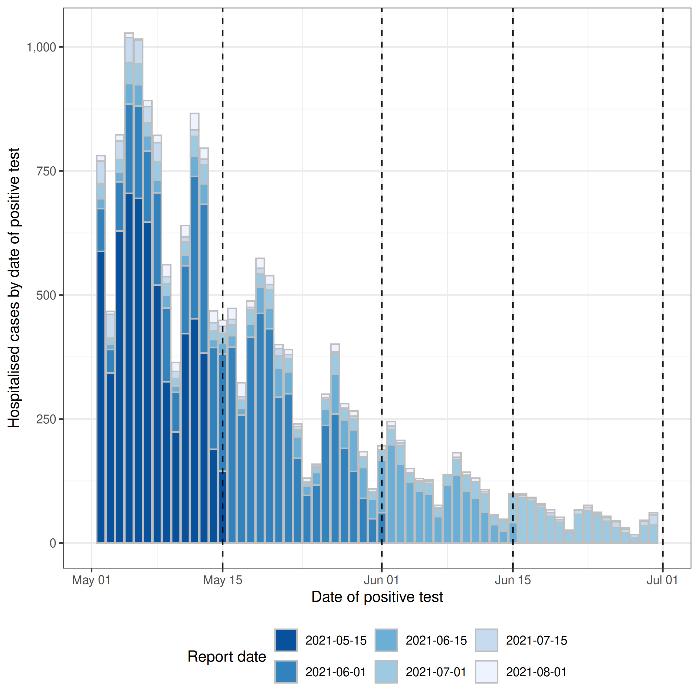
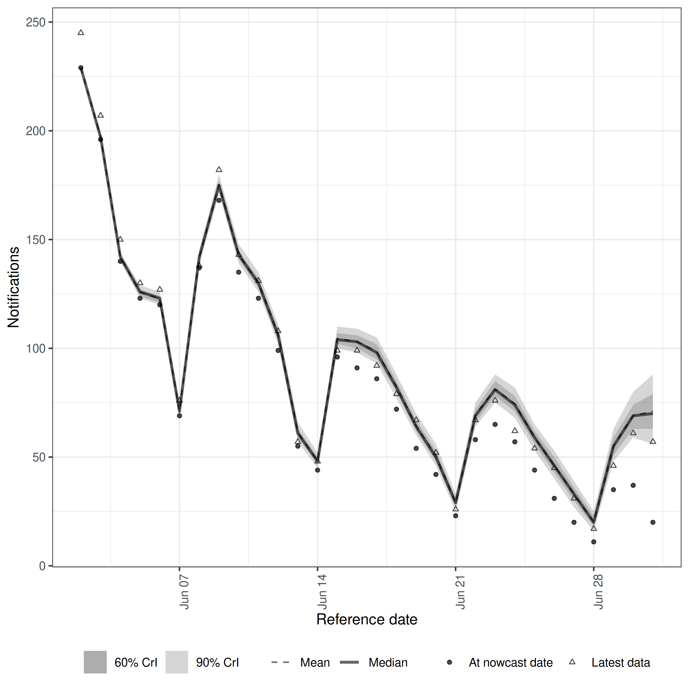
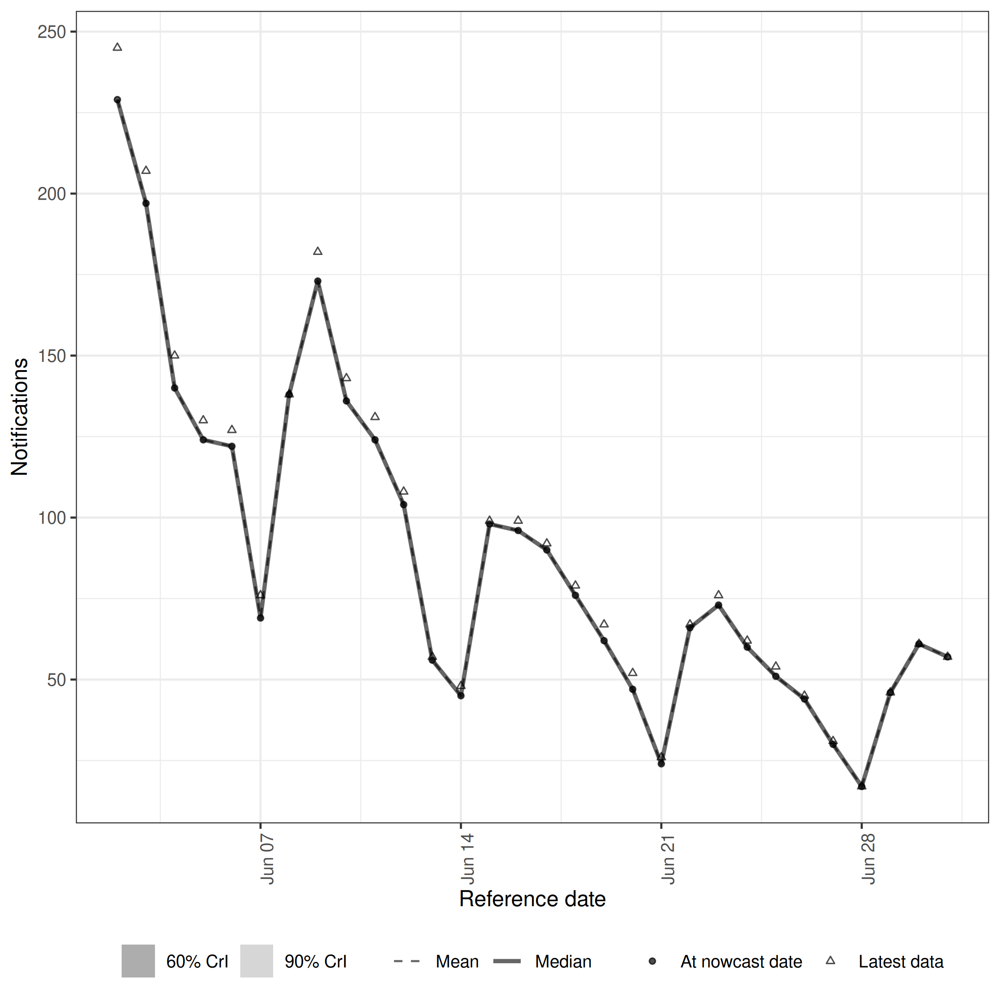
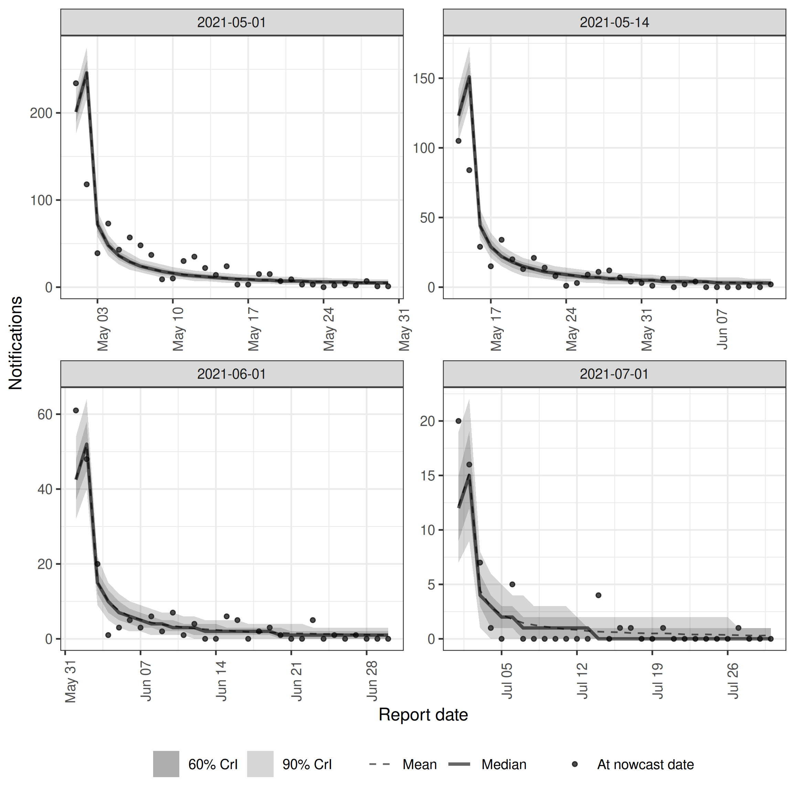
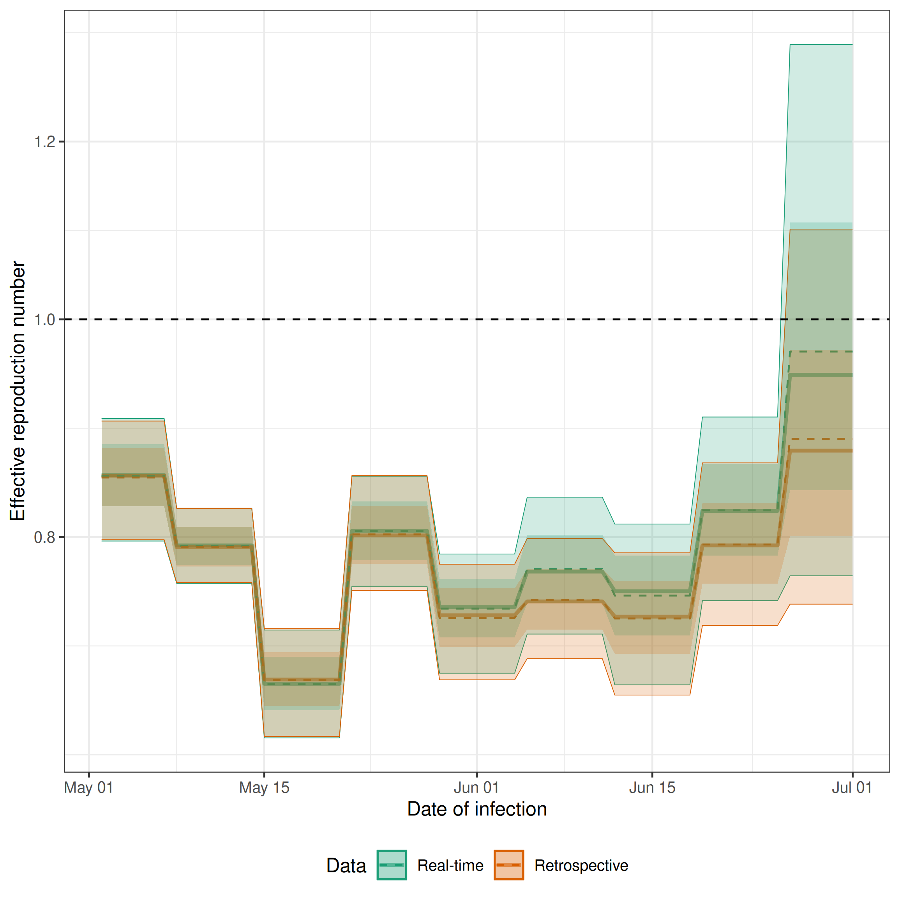
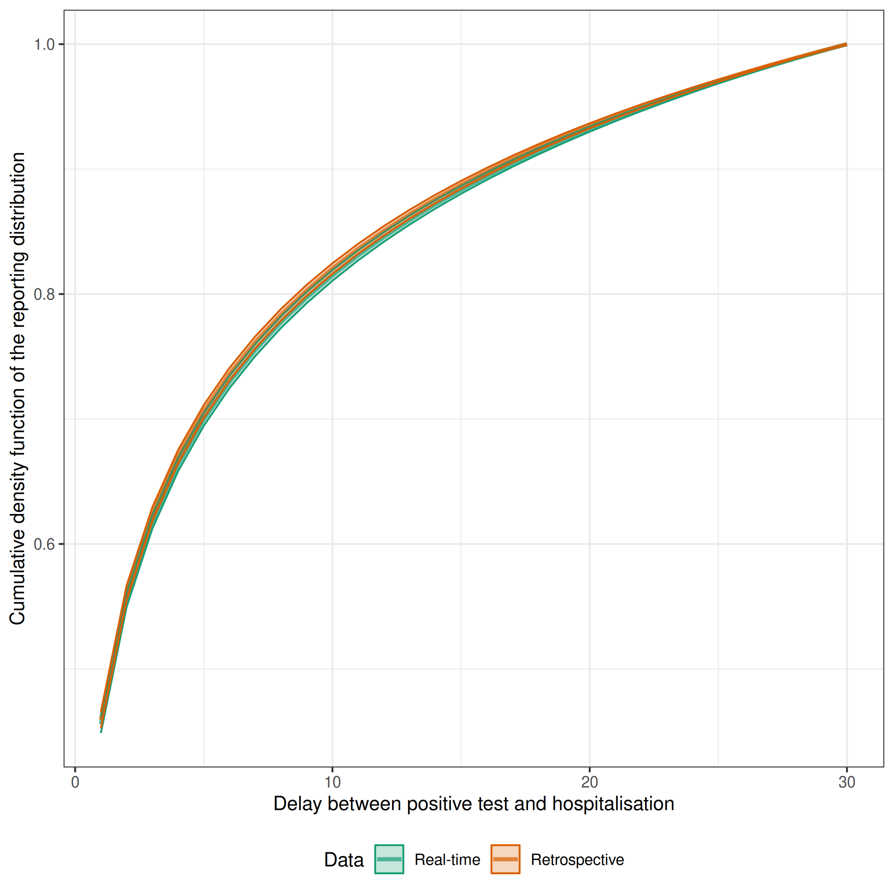
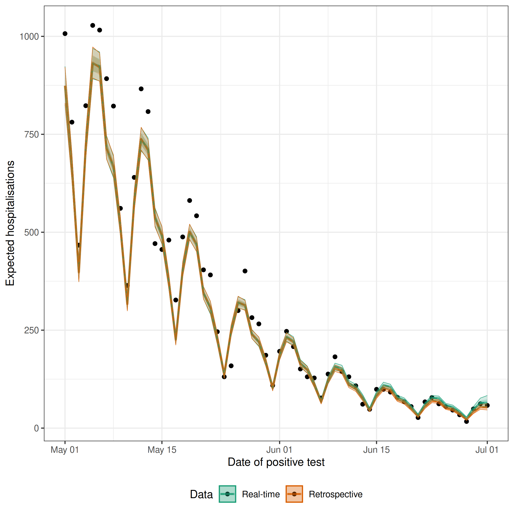

::: {.alert .alert-warning}
This vignette is partly based on this [nowcasting example](https://github.com/epiforecasts/nowcasting.example) by Sebastian Funk and Sam Abbott.
:::

In this case study we walk through a simple approach to jointly estimating the effective reproduction number over time and the delay from a positive test to this test being reported. For more on the `epinowcast` package see the [documentation](https://package.epinowcast.org/).

::: {.alert .alert-primary}
## Use case {-}

An epidemic is in progress. We want to know what the **effective reproduction number is at the current time**. This is the average number of secondary infections caused by a single infected individual at a given point in time and is a measure of the transmissibility of the infection in the population at that time.

Unfortunately, we can't directly observe infections and the data we do observe suffers from reporting delays.

:::

::: {.alert .alert-secondary}

### What we have {-}

1. A linelist of cases with a date of interest (for example test positive date) and a date of report (for example date of hospitalisation report);
2. An estimate of the distribution of times from infection to positive test;
3. An estimate of the generation time distribution, which is the distribution of the time intervals between the infection of a primary case and the infection of secondary cases caused by the primary case.
4. An estimate of the ascertainment rate, which is the proportion of infections that are reported as hospitalisations.
 
### What do we do {-}

1. Visualise and contextualise the data this case study uses (COVID-19 hospitalisations in Germany);
2. Specify a joint model of the effective reproduction number, the delay from infection to hospitalisation and the delay from hospitalisation to report;
3. Fit this model to both the data that would have been available in real-time, and retrospectively;
4. Visualise the nowcast from the real-time data in comparison to the data that was ultimately observed;
5. Compare real-time and retrospective reproduction number estimates and delay distribution estimates;
6. Outline the limitations and strengths of this approach and highlight areas where it can be extended.
 
:::

::: {.alert .alert-warning}
`epinowcast` is still in development and so the following case study has pain points and limitations that we are working on improving. If you have any suggestions or feedback please get in touch via the [issues page](https://github.com/epinowcast/epinowcast/issues). We also welcome contributions via pull requests (see our [contributing guidelines](https://github.com/epinowcast/epinowcast/blob/main/CONTRIBUTING.md).
:::
## Getting setup

See the [package documentation](https://epiforecasts.io/epinowcast/) for guidance on installing the package and getting setup with `cmdstanr` (the backend used here for fitting models). 

As well as the `epinowcast` package we will use the following packages in this vignette.


```r
library(epinowcast)
library(data.table)
library(purrr)
library(ggplot2)
```

::: {.alert .alert-warning}

- Here we make use of `data.table` for simple data transformations but tools from the tidyverse or base R tools could just as easily be used;
- We also use `purrr` to make use of the `partial()` function which allows us to partially specify a function for later reuse. This is useful for specifying the model as we can specify the parts of the model that are common to all models and then specify the parts that are specific to each model when we call the updated function;
- Finally, we use `ggplot2` for plotting.

:::

## Introducing the data: COVID-19 hospitalisations in Germany

### Overview

In this case study, we use data sourced from the [Robert Koch Institute via the Germany Nowcasting hub](https://github.com/KITmetricslab/hospitalization-nowcast-hub/wiki/Truth-data#role-an-definition-of-the-seven-day-hospitalization-incidence). The data represent hospitalisation counts by date of positive test and date of test report in Germany. These data have been used extensively for nowcasting and forecasting COVID-19 hospitalisations in Germany and are described in detail in [Wolffram et al. (2023)](https://doi.org/10.1101/2023.04.17.23288668). We use these data as they are a good example of the type of data that are available in many settings. We first summarise the data,


```r
summary(germany_covid19_hosp)
#>  reference_date          location     
#>  Min.   :2021-04-06   DE     : 90405  
#>  1st Qu.:2021-05-15   DE-BB  : 90405  
#>  Median :2021-06-23   DE-BE  : 90405  
#>  Mean   :2021-06-25   DE-BW  : 90405  
#>  3rd Qu.:2021-08-02   DE-BY  : 90405  
#>  Max.   :2021-10-20   DE-HB  : 90405  
#>                       (Other):994455  
#>  age_group         confirm       
#>  00-04:219555   Min.   :   0.00  
#>  00+  :219555   1st Qu.:   0.00  
#>  05-14:219555   Median :   1.00  
#>  15-34:219555   Mean   :  11.44  
#>  35-59:219555   3rd Qu.:   6.00  
#>  60-79:219555   Max.   :1552.00  
#>  80+  :219555                    
#>   report_date        
#>  Min.   :2021-04-06  
#>  1st Qu.:2021-06-24  
#>  Median :2021-08-03  
#>  Mean   :2021-07-31  
#>  3rd Qu.:2021-09-11  
#>  Max.   :2021-10-20  
#> 
```

In this case study we only consider national level data without stratification by age group. We can filter these data using `data.table` as follows,


```r
germany_hosp <- germany_covid19_hosp[location == "DE"][age_group %in% "00+"]
germany_hosp <- germany_hosp[, .(reference_date, report_date, confirm)]
germany_hosp
#>        reference_date report_date confirm
#>     1:     2021-04-06  2021-04-06     149
#>     2:     2021-04-07  2021-04-07     312
#>     3:     2021-04-08  2021-04-08     424
#>     4:     2021-04-09  2021-04-09     288
#>     5:     2021-04-10  2021-04-10     273
#>    ---                                   
#> 12911:     2021-07-27  2021-10-16      81
#> 12912:     2021-07-28  2021-10-17     159
#> 12913:     2021-07-29  2021-10-18     145
#> 12914:     2021-07-30  2021-10-19     117
#> 12915:     2021-07-31  2021-10-20     132
```

### Data transformations

These data are already in a format that can be used with `epinowcast`, as it contains

- a reference date (column `reference_date`): the date of the observation, in this example the date of a positive test
- a report date (column `report_date`): the date of report for a given set of observations by reference date
- a count (column `confirm`): the total number of hospitalisations by reference date and report date. Note that this is cumulative by report date.

The package also provides a range of tools to convert data from line list, incidence, or other common formats into the required format (see [Data converters](https://package.epinowcast.org/dev/reference/index.html#data-converters)). For example we could convert the data to a individual case linelist,


```r
germany_covid19_hosp_linelist <- germany_covid19_hosp |>
  enw_add_incidence() |>
  enw_incidence_to_linelist()

germany_covid19_hosp_linelist
#>                 id reference_date location
#>        1:        1     2021-04-06       DE
#>        2:        2     2021-04-06       DE
#>        3:        3     2021-04-06       DE
#>        4:        4     2021-04-06       DE
#>        5:        5     2021-04-06       DE
#>       ---                                 
#> 11486202: 11486202     2021-10-20    DE-TH
#> 11486203: 11486203     2021-10-20    DE-TH
#> 11486204: 11486204     2021-10-20    DE-TH
#> 11486205: 11486205     2021-10-20    DE-TH
#> 11486206: 11486206     2021-10-20    DE-TH
#>           age_group report_date delay
#>        1:       00+  2021-04-06     0
#>        2:       00+  2021-04-06     0
#>        3:       00+  2021-04-06     0
#>        4:       00+  2021-04-06     0
#>        5:       00+  2021-04-06     0
#>       ---                            
#> 11486202:     15-34  2021-10-20   115
#> 11486203:     60-79  2021-10-20   117
#> 11486204:     60-79  2021-10-20   117
#> 11486205:     60-79  2021-10-20   117
#> 11486206:     60-79  2021-10-20   117
```

This linelist could then be itself converted into the format `epinowcast` requires using the `enw_linelist_to_incidence()` function,


```r
incidence_from_linelist <- enw_linelist_to_incidence(
  germany_covid19_hosp_linelist,
  reference_date = "reference_date",
  report_date = "report_date",
  by = c("age_group", "location"),
  max_delay = 30
)

incidence_from_linelist
#>          age_group location report_date
#>       1:     00-04    DE-BY  2021-04-06
#>       2:     00-04    DE-BY  2021-04-07
#>       3:     00-04    DE-BY  2021-04-08
#>       4:     00-04    DE-BY  2021-04-09
#>       5:     00-04    DE-BY  2021-04-10
#>      ---                               
#> 2049593:       80+    DE-TH  2021-10-19
#> 2049594:       80+    DE-TH  2021-10-20
#> 2049595:       80+    DE-TH  2021-10-19
#> 2049596:       80+    DE-TH  2021-10-20
#> 2049597:       80+    DE-TH  2021-10-20
#>          reference_date new_confirm confirm
#>       1:           <NA>           0       0
#>       2:           <NA>           0       0
#>       3:           <NA>           0       0
#>       4:           <NA>           0       0
#>       5:           <NA>           0       0
#>      ---                                   
#> 2049593:     2021-10-18           0       0
#> 2049594:     2021-10-18           0       0
#> 2049595:     2021-10-19           1       1
#> 2049596:     2021-10-19           0       1
#> 2049597:     2021-10-20           0       0
#>          delay
#>       1:     0
#>       2:     1
#>       3:     2
#>       4:     3
#>       5:     4
#>      ---      
#> 2049593:     1
#> 2049594:     2
#> 2049595:     0
#> 2049596:     1
#> 2049597:     0
```

::: {.alert .alert-warning}
Here we have specified the `reference_date` and `report_date` columns, the `by` columns (which are used to group the data), and the `max_delay` which is the maximum delay between the reference date and the report date (note that the observed delay is longer than our specified delay and so is used instead). The `enw_linelist_to_incidence()` function will then calculate the incidence by reference date and report date for each group.
:::

### Filtering the data

For this case study we will only consider data from the 1st of March 2020 onwards. As a first step, we filter the data to only include observations from the 1st of May 2021 until the 1st of August 2021. We do this using the `enw_filter_report_dates()` and `enw_filter_reference_dates()` functions,


```r
complete_germany_hosp <- germany_hosp |>
  enw_filter_report_dates(latest_date = "2021-08-01") |>
  enw_filter_reference_dates(earliest_date = "2021-05-01") |>
  enw_complete_dates(missing_reference = FALSE) |>
  enw_add_incidence()
```

Here we have also used `enw_complete_dates()` to make sure that we have complete data for all dates between the earliest and latest dates. We have also used `enw_add_incidence()` to add the incidence column to the data. 

Next we split the data into two parts, the data that was available at the time and that will be used to fit the model (`rt_nat_germany`) and the data that was available retrospectively about the same time period will be used to evaluate the model (`retro_nat_germany`). We again do this using the `enw_filter_report_dates()` and `enw_filter_reference_dates()` functions as follows:  

- Create the real-time dataset (`rt_nat_germany`) by filtering the data to only include reported observations from the 1st of May 2021 until the 1st of July 2021;


```r
rt_germany <- complete_germany_hosp |>
  enw_filter_report_dates(latest_date = "2021-07-01")
rt_germany
#>       report_date reference_date confirm
#>    1:  2021-05-01     2021-05-01     234
#>    2:  2021-05-02     2021-05-01     352
#>    3:  2021-05-03     2021-05-01     391
#>    4:  2021-05-04     2021-05-01     464
#>    5:  2021-05-05     2021-05-01     507
#>   ---                                   
#> 1949:  2021-06-30     2021-06-29      31
#> 1950:  2021-07-01     2021-06-29      35
#> 1951:  2021-06-30     2021-06-30      20
#> 1952:  2021-07-01     2021-06-30      37
#> 1953:  2021-07-01     2021-07-01      20
#>       new_confirm delay
#>    1:         234     0
#>    2:         118     1
#>    3:          39     2
#>    4:          73     3
#>    5:          43     4
#>   ---                  
#> 1949:          11     1
#> 1950:           4     2
#> 1951:          20     0
#> 1952:          17     1
#> 1953:          20     0
```

- Create the retrospective dataset (`retro_germany`) by filtering the data to only include observations with reference dates (i.e. they may have been reported anytime up to the 1st of August 2021) from the 1st of May 2021 until the 1st of July 2021;


```r
retro_germany <- complete_germany_hosp |>
  enw_filter_reference_dates(latest_date = "2021-07-01")
retro_germany
#>       report_date reference_date confirm
#>    1:  2021-05-01     2021-05-01     234
#>    2:  2021-05-02     2021-05-01     352
#>    3:  2021-05-03     2021-05-01     391
#>    4:  2021-05-04     2021-05-01     464
#>    5:  2021-05-05     2021-05-01     507
#>   ---                                   
#> 3871:  2021-07-28     2021-07-01      57
#> 3872:  2021-07-29     2021-07-01      57
#> 3873:  2021-07-30     2021-07-01      57
#> 3874:  2021-07-31     2021-07-01      57
#> 3875:  2021-08-01     2021-07-01      57
#>       new_confirm delay
#>    1:         234     0
#>    2:         118     1
#>    3:          39     2
#>    4:          73     3
#>    5:          43     4
#>   ---                  
#> 3871:           0    27
#> 3872:           0    28
#> 3873:           0    29
#> 3874:           0    30
#> 3875:           0    31
```

Finally we can create a dataset that contains the latest data available for each reference date. We do this using the `enw_latest_data()` function,


```r
latest_germany_hosp <- retro_germany |>
  enw_latest_data()
head(latest_germany_hosp, n = 10)
#>     reference_date report_date confirm
#>  1:     2021-05-01  2021-08-01    1007
#>  2:     2021-05-02  2021-08-01     781
#>  3:     2021-05-03  2021-08-01     467
#>  4:     2021-05-04  2021-08-01     823
#>  5:     2021-05-05  2021-08-01    1028
#>  6:     2021-05-06  2021-08-01    1016
#>  7:     2021-05-07  2021-08-01     892
#>  8:     2021-05-08  2021-08-01     822
#>  9:     2021-05-09  2021-08-01     561
#> 10:     2021-05-10  2021-08-01     364
#>     new_confirm delay
#>  1:           0    92
#>  2:           0    91
#>  3:           0    90
#>  4:           0    89
#>  5:           0    88
#>  6:           0    87
#>  7:           0    86
#>  8:           0    85
#>  9:           0    84
#> 10:           0    83
```

### Visualising the data

Before we define, or fit, a model we should visualise the data to get an idea of the trends in the data and its reporting structure. There is currently no function in `epinowcast` to visualise the data, but we can use the `ggplot2` package to do this manually as follows,


```{.r .fold-hide}
gh_vis_cohorts <- copy(retro_germany)[
  ,
  report_date := fcase(
    report_date <= as.Date("2021-05-15"), as.Date("2021-05-15"),
    report_date <= as.Date("2021-06-01"), as.Date("2021-06-01"),
    report_date <= as.Date("2021-06-15"), as.Date("2021-06-15"),
    report_date <= as.Date("2021-07-01"), as.Date("2021-07-01"),
    report_date <= as.Date("2021-07-15"), as.Date("2021-07-15"),
    report_date <= as.Date("2021-08-01"), as.Date("2021-08-01")
  ) |>
    factor(levels = rev(c(
      "2021-05-15", "2021-06-01", "2021-06-15", "2021-07-01",
      "2021-07-15", "2021-08-01"
    )))
]

gh_vis_cohorts_by_reference <- gh_vis_cohorts[,
  .(confirm = sum(new_confirm)),
  by = .(reference_date)
]

gh_vis_cohorts_by_ref_rep <- gh_vis_cohorts[,
  .(confirm = sum(new_confirm)),
  by = .(reference_date, report_date)
]

gh_vis_cohorts_by_ref_rep |>
  ggplot() +
  aes(
    x = reference_date, y = confirm, fill = report_date, group = report_date
  ) +
  geom_col(position = "stack", alpha = 1, col = "grey") +
  geom_vline(
    aes(xintercept = as.Date(report_date)),
    linetype = 2, alpha = 0.9
  ) +
  scale_y_continuous(labels = \(x)(scales::comma(x, accuracy = 1))) +
  scale_fill_brewer(
    palette = "Blues", aesthetics = c("color", "fill")
  ) +
  theme_bw() +
  labs(
    x = "Date of positive test",
    y = "Hospitalised cases by date of positive test",
    fill = "Report date"
  ) +
  guides(fill = guide_legend(reverse = TRUE)) +
  theme(legend.position = "bottom")
```



## Model

The `epinowcast` package provides a flexible framework for modelling the incidence of infections and subsequent measures such as hospitalisations that are themselves reported with some delay. The framework is based on a generative model that describes the hypothesised process by which the data are generated. The generative model is then used to define a likelihood function that describes the probability of observing the data given the model parameters. The likelihood function is then combined with prior information used to fit the model parameters to the data. In the following sections we describe the generative model for the incidence of infections and hospitalisations. If you would like to know more about the general framework see the [model vignette](https://package.epinowcast.org/articles/model.html).

### Expected hospitalisations

The first part of the generative process we consider is the expected number of hospitalisations by date positive test. This is the number of hospitalisations that we would expect to observe if we had perfect reporting of hospitalisations and there was no unmodelled variance. This part of the model is also decomposed into three parts: the expected number of infections, the delay from infection to positive test, and the probability of hospitalisation given an infection. These three parts are combined to give the expected number of hospitalisations by date positive test. We describe each of these parts in turn.

#### Expected infections

We model expected infections as a function of the effective (instantaneous) reproduction number and previous infections weighted by the generation time using the renewal equation [@Fraser2007; @Cori2013]. This corresponds to the commonly used Susceptible-Exposed-Infected-Recovered (SEIR) model when the appropriate generation time is specified [@champredon].

##### Instantaneous reproduction number

We model the instantaneous reproduction number ($R_t$) on the log scale as a weekly random walk as follows

\begin{align}
  \text{log} (R_{t}) &= r_0 + \sum_{i = 0}^{t \% 7} \epsilon_i \\
  \epsilon_i &\sim \text{Normal}\left(0, \sigma_{\epsilon} \right) \\
  \sigma_{\epsilon} &\sim \text{HalfNormal}\left(0, 1 \right)
\end{align}

where $r_0$ is the intercept, and $\sum_{i = 0}^{t \% 7} \epsilon_i$ is a weekly random walk.

We choose this model because it is flexible, can be used to model a range of different scenarios, and is parsimonious. For example, if we set $\sigma_{\epsilon} = 0$ then the model reduces to a constant reproduction number. If we set $\sigma_{\epsilon} > 0$ then the model allows for changes in the reproduction number over time. Other sensible choices for the model include a random walk with a longer time scale (e.g. monthly) or shorter time scale (e.g. daily), a random walk with a drift term, or a random walk with a drift term and a seasonal component. 

##### Latent infections

We model the expected number of infections/latent notifications ($\lambda^l$) using a renewal process [@Fraser2007; @Cori2013]. This model is a generalisation of the default `epinowcast` model and implies that current infections/notifications are dependent on past infections/notifications based on a kernel. This kernel is defined by the generation time distribution, the probability distribution of the time between infection and subsequent infectiousness, and the previously defined model for the effective reproduction number. The model is defined as follows,

\begin{align}
  \lambda^l_{t} &\sim \text{LogNormal}\left(\mu^{l}, \sigma^{l} \right),\ t \leq P \\
  \lambda^l_{t} &= R_{t} \sum_{p = 1}^{P} g\left(t - p \right)  \lambda^l_{t-p},\ t \gt P  
\end{align}

We assume the generation time ($g$) is a gamma distribution with mean 4 days and a standard deviation of 3 days. To initialise the model we assume that the first $P$ latent notifications are log-normally distributed with mean $\mu^{l}_{g,t}$ and standard deviation $\sigma^{l}_{g,t}$. This is equivalent to assuming that the first $P$ latent notifications are independent and identically distributed. The mean of the log-normal distribution for each group is the log of the latest reported case count for the first reference date for that group scaled by the sum of the latent reporting delay. The standard deviation is assumed to be 1. 

#### Latent reporting delay and ascertainment

In many settings, such as in this case study, there may be additional reporting delays on top of those that are directly observed in the data, and therefore "nowcastable", a common example is the delay from exposure to symptom onset. For these settings we support modelling "latent" reporting delays as a convolution of the underlying expected counts with the potential for these delays to vary over time and by group. This implementation is similar to that implemented in `EpiNow2` and `epidemia` as well as other similar models  [@EpiNow2; @Abbott2020; @Bhatt2020; @Lison2022]. In addition to this, we support modelling ascertainment through the use of improper probability mass functions (i.e. by not enforcing a sum to 1 constraint) and inferring ascertainment where possible (for example day of the week reporting patterns).

Here we assume an infection to hospitalisation ratio of 2% modified by a random effect for the day of the week to account for within week reporting periodicity. We also assume a lognormal reporting delay with a mean of 5 days and a standard deviation of 2 days, representing the delay from infection to positive test. We assume that the reporting delay is the same for all days of the week. This model is defined as follows,

\begin{align}
  \lambda_{t} &= \nu_{t \% 7} \sum_{\tau = 0}^{L - 1} f_{g}\left(t - \tau \right)  \lambda^l_{t - \tau} \\
  \text{log} (\nu_{i}) &\sim \text{Normal}\left(-3.91, \sigma_{\nu} \right) \\
  \sigma_{\nu} &\sim \text{HalfNormal}\left(0, 1 \right) \\
\end{align}

Where $\nu_{i}$ is a random effect for each day of the week which represents reporting periodicity.

#### Specifying the model using `epinowcast::enw_expectation()`

We first need to define the weekly random walk model for the effective reproduction number. We can do this using the formula interface as follows,


```r
rt_formula <- ~ 1 + rw(week)
```

Next we define the generation time distribution. As already discussed, we assume a gamma distribution with mean 4 days and a standard deviation of 3 days. These summary parameters first need to be transformed to the shape and scale parameters used for the gamma distribution. We then need to account for daily censoring and finally normalise the probability mass function (PMF) to account for right truncation.


```r
# first transform mean and sd to shape and scale
gamma_mean <- 4
gamma_sd <- 3
gamma_shape <- gamma_mean^2 / gamma_sd^2
gamma_scale <- gamma_sd^2 / gamma_mean

# then discretise the distribution
gt_pmf <- simulate_double_censored_pmf(
  max = 15, shape = gamma_shape, scale = gamma_scale, fun_dist = rgamma
) |>
# and normalise it to account for right truncation
  (\(x) x / sum(x))()

plot(gt_pmf)
```


::: {.alert .alert-warning}
Here and for other PMFs we set the maximum delay to be 15 days as this gives good coverage of the majority of the distribution and limits the computational burden of fitting the model.
:::

Now we define the latent reporting delay in a similar way remembering we specified a lognormal distribution with a mean of 5 days and a standard deviation of 2 days. We again also need to account for daily censoring and normalise the PMF to account for right truncation.


```r
lgn_mean <- 5
lgn_sd <- 2
meanlog <- log(lgn_mean^2 / sqrt(lgn_sd^2 + lgn_mean^2))
sdlog <- sqrt(log(1 + lgn_sd^2 / lgn_mean^2))

# then discretise the distribution
reporting_pmf <- simulate_double_censored_pmf(
  max = 15, meanlog = meanlog, sdlog = sdlog, fun_dist = rlnorm
) |>
# normalise it to account for right truncation
  (\(x) x / sum(x))() |>
# and scale it by the infection to hospitalisation ration (2%)
  (\(x) x * 0.02)()

plot(reporting_pmf)
```


The last part of the model to define is the remaining part of the ascertainment model for expected hospitalisations. As we have already defined the base ascertainment ratio (i.e. the 2% infection to hospitalisation ratio) we only need to define the day of the week random effect. We can do this using the formula interface as follows,


```r
observation_formula <- ~ 1 + (1 | day_of_week)
```

Finally, we can combine these four parts of the model to define the expected hospitalisations by date of positive test. We do this using the `epinowcast::enw_expectation()` function as follows,


```r
expectation_module <- partial(
  epinowcast::enw_expectation,
  r = rt_formula,
  generation_time = gt_pmf,
  latent_reporting_delay = reporting_pmf,
  observation = observation_formula
)
```

### Delay distribution

#### Defining the delay distribution

Given case counts both by date of reference and by date of report, we can estimate the reporting delay distribution directly and jointly with the underlying process model, rather than relying on external estimates from other sources (though we may want to account for external information in our priors). 

We consider the reporting delay to follow a $\text{LogNormal} \left(\mu^d, \sigma^d \right)$ distribution, with parameters

\begin{align}
  \mu^d &\sim \text{Normal} \left(0, 1 \right) \\
  \sigma^d &\sim \text{Half-Normal} \left(0, 1 \right).
\end{align}

This distribution is discretised into daily probabilities $p_{t,d}$ and adjusted for the maximum delay, see `vignette("distributions")` for details.

#### Specifying the model using `epinowcast::enw_reference()`

We can define the reporting delay distribution using the `epinowcast::enw_reference()` function as follows,


```r
reference_module <- partial(enw_reference, ~1, distribution = "lognormal")
```

### Observation model and nowcast

#### Defining the observation model

Expected notifications by date of positive test ($t$) and reporting date can now be found by multiplying expected final notifications by date of positive test for each $t$ with the probability of reporting for each day of delay ($p_{t,d}$). We assume a Poisson observation model and produce a nowcast of final observed hospitalisations at each reference date by summing posterior estimates for unobserved notification and observed notifications for that reference date.

\begin{align}
  n_{t,d} \mid \lambda_{t},p_{t,d}  &\sim \text{Poisson} \left(\lambda_{t} \times p_{t,d} \right),\ t=1,...,T. \\
  N_{t} &= \sum_{d=0}^{D} n_{t,d}
\end{align}

#### Specifying the model using `epinowcast::enw_obs()`


```r
obs_module <- partial(enw_obs, family = "poisson")
```

## Fitting the model to COVID-19 hospitalisations in Germany

### Preprocess the data

Before fitting the model we have just defined we need to preprocess the data in order for it to be in the correct format to work with `epinowcast` and to produce metadata that describes aspects of the data we use in the model (for example the maximum delay, the number of groups, and the number of observations in each group). We do this using the `enw_preprocess_data()` function as follows for both the real-time and retrospective datasets. Note that we set `max_delay = 30` to constrain the modelled maximum delay to 30 days. This is a pragmatic choice to ensure that the model can be fit in a reasonable amount of time, but we could also set this to be longer if we wanted to and if the data suggested a longer delay was possible.


```r
rt_germany_pobs <- enw_preprocess_data(rt_germany, max_delay = 30)
rt_germany_pobs
#>                     obs          new_confirm
#> 1: <data.table[1425x8]> <data.table[1425x9]>
#>                latest missing_reference
#> 1: <data.table[62x8]> <data.table[0x4]>
#>     reporting_triangle      metareference
#> 1: <data.table[62x32]> <data.table[62x8]>
#>             metareport          metadelay time
#> 1: <data.table[91x10]> <data.table[30x4]>   62
#>    snapshots by groups max_delay   max_date
#> 1:        62         1        30 2021-07-01
#>    timestep
#> 1:      day
```

and do the same for the retrospective data


```r
retro_germany_pobs <- enw_preprocess_data(retro_germany, max_delay = 30)
retro_germany_pobs
#>                     obs          new_confirm
#> 1: <data.table[1860x8]> <data.table[1860x9]>
#>                latest missing_reference
#> 1: <data.table[62x8]> <data.table[0x4]>
#>     reporting_triangle      metareference
#> 1: <data.table[62x32]> <data.table[62x8]>
#>              metareport          metadelay time
#> 1: <data.table[120x10]> <data.table[30x4]>   62
#>    snapshots by groups max_delay   max_date
#> 1:        62         1        30 2021-07-30
#>    timestep
#> 1:      day
```

### Fitting the `epinowcast` model


#### Specifying the fitting options

Before we are ready to fit the model we need to first specify some fitting options for using `cmdstanr` (more information on these options can be found in the `cmdstanr` documentation). We use 2 chains with 2 threads per chain (so using 4 CPU cores in total) 500 warmup samples and 1000 iterations per chain. As this is a complex model we set `adapt_delta` to 0.98 (the default is 0.8) so that the Hamiltonian Monte Carlo sampler can explore the posterior distribution more efficiently. For the same reason, we have also set the `max_treedepth` to 15 (the default is 10). Finally, we set `save_warmup` to `FALSE` to save space (we don't need the warmup samples for this analysis), and `pp` to `TRUE` so that we can use posterior predictive checks to assess the model fit.


```r
fit_module <- partial(enw_fit_opts,
  chains = 2,
  parallel_chains = 2,
  threads_per_chain = 2,
  iter_warmup = 500,
  iter_sampling = 1000,
  adapt_delta = 0.98,
  max_treedepth = 15,
  save_warmup = FALSE,
  pp = TRUE,
  show_messages = FALSE, # set this to TRUE to show fitting messages
  refresh = 0 # remove this to show fitting progress
)
```

::: {.alert .alert-warning}
If you have more than 4 CPU cores available you can increase the number of threads per chain to make use of these additional cores. For example if you have 8 CPU cores available you could set `threads_per_chain = 4` to use all 8 cores (as there are 2 chains).
:::

#### Compiling the model

We also need to compile the model using `cmdstanr` before fitting it (we only have to do this once after installing the package). In order for this line to work you should have followed the installation guide in the [README](https://package.epinowcast.org). This will take around a minute to run when called for the first time.


```r
epinowcast_model <- enw_model(threads = TRUE, profile = FALSE)
```

#### Fitting the model

Now we are ready to bring together all the modules we have specified, combine them with the model we have just compiled, and fit our synthetic data. We first fit to the data that would have been available in real-time,


```r
germany_nowcast <- epinowcast(
  data = rt_germany_pobs,
  expectation = expectation_module(data = rt_germany_pobs),
  reference = reference_module(data = rt_germany_pobs),
  obs = obs_module(data = rt_germany_pobs),
  fit = fit_module(),
  model = epinowcast_model
)
```

::: {.alert .alert-warning}
Fitting this model with the default options will take around 5 minutes to run on a laptop with 4 CPU cores. If you have more CPU cores available you can reduce the time it takes to fit the model by increasing the number of threads per chain (see the [fitting options](#fitting-the-epinowcast-model) section above).
:::

and then on the retrospectively observed data.


```r
retro_germany_nowcast <- epinowcast(
  data = retro_germany_pobs,
  expectation = expectation_module(data = retro_germany_pobs),
  reference = reference_module(data = retro_germany_pobs),
  obs = obs_module(data = retro_germany_pobs),
  fit = fit_module(),
  model = epinowcast_model
)
```

::: {.alert .alert-warning}
You may see a number of warning messages from `cmdstanr` when fitting the model. These generally occur when the model is being initialised and are due to this process not currently being optimised in `epinowcast`. The model should still fit correctly unless these warnings continue into the fitting process (outside of the warmup phase). This is something we are actively working on improving in future versions of `epinowcast`.
:::

### Visualising the Nowcast

#### Plotting the nowcast based on real-time data

We first plot the nowcast based on real-time data. Effectively here we are trying to use our model to estimate the hospitalisations that will ultimately be reported based on the data that is currently available. We can compare this to the most recent observations to see how well the model is doing.

```r
plot(
  germany_nowcast, latest_germany_hosp[reference_date > as.Date("2021-06-01")]
)
```



Internally, this plotting function (see `?plot.epinowcast()`) sums observed data and posterior estimates for unobserved data to produce a nowcast of the number of hospitalisations that will ultimately be reported.

In this instance, the model has done a good job of estimating the number of hospitalisations that will ultimately be reported based on the data that is currently available. This is not always the case, and the model can sometimes over or under estimate the number of hospitalisations that will ultimately be reported. 

::: {.alert .alert-warning}
An important thing to note here is that this model is clearly not perfect with more complete data being less well estimated by the model. This likely indicates some misspecification in the reporting delay model which could be fixed by making it more complex or even by making it entirely non-parametric (vs being based on a LogNormal).
:::

#### Plotting the nowcast based on retrospective data

We can also plot the nowcast based on the retrospective data. As this plot uses observed data where available this is effectively plotting observed data after a 30 day delay (as this was the maximum we specified) compared to data that will ultimately be observed. This can be used to get a feel for how well specified our maximum delay is. Here we see that a small number of hospitalisations will be reported after 30 days. This will impact the performance of even an ideal model as it will not be able to predict these hospitalisations and so should be accounted for in the model evaluation.


```r
plot(
  retro_germany_nowcast,
  latest_germany_hosp[reference_date > as.Date("2021-06-01")]
)
```



### Posterior predictions for cases by date of positive test and report

To better understand the fit of the model to data we can instead plot the posterior predictions for the observed data. This is effectively the same as the plot above but instead of plotting the posterior predictions for the unobserved data we plot the posterior predictions for the observed data. This can be used to get a feel for how well the model is able to predict the observed data. Rather than using the build in plot function (by changing `type = "posterior_prediction"`) we instead use `enw_plot_pp_quantiles()` so we can control the number of references dates we plot (as otherwise the plot will be quite overwhelming!).


```r
plot_select_pp_dates <- function(nowcast, dates) {
  nowcast |>
    summary(type = "posterior_prediction") |>
    (\(x) x[reference_date %in% dates])() |>
    enw_plot_pp_quantiles() +
    facet_wrap(vars(reference_date), scales = "free")
}
plot_select_pp_dates(
  retro_germany_nowcast,
  as.Date(c("2021-05-01", "2021-05-14", "2021-06-01", "2021-07-01"))
)
```



::: {.alert .alert-warning}
It is clear from this plot that for these example dates the model is in the main able to predict the observed data well. However, there are also some aspects of the data that the model is less well able to predict, in particular the apparent periodicity in the reporting delay. This is likely due to the model not being able to account for the day of the week reporting periodicity. This could be fixed by adding a day of the week random effect to the reporting delay model which we demonstrate in the [package README](https://package.epinowcast.org).
:::

### Real-time and retrospective estimates of the effective reproduction number

A key output of the model is the posterior distribution of the effective reproduction number. We can plot this for both the real-time and retrospective data to see how the estimates change as more data becomes available. Ideally, we would hope that the real-time estimates would overlap with the retrospective estimates. This would indicate that our model is able to accurately estimate hospitalisations that will be ultimately reported based on those that have already been reported.


```{.r .fold-hide}
get_rt_posterior <- function(nowcast, expectation = expectation_module) {
  rt <- enw_posterior(nowcast$fit[[1]], variables = "r")
  cols <- c("mean", "median", "q5", "q20", "q80", "q95")
  rt[, (cols) := lapply(.SD, exp), .SDcols = cols]
  rt <- cbind(
    expectation(data = nowcast)$data_raw$r[, .(date)], rt
  )
  return(rt)
}

rt <- rbind(
  get_rt_posterior(germany_nowcast)[, Data := "Real-time"],
  get_rt_posterior(retro_germany_nowcast)[, Data := "Retrospective"]
)

ggplot(rt) +
  aes(x = date, col = Data, fill = Data) +
  geom_line(aes(y = median), linewidth = 1, alpha = 0.6) +
  geom_line(aes(y = mean), linetype = 2) +
  geom_ribbon(aes(ymin = q5, ymax = q95), alpha = 0.2, linewidth = 0.2) +
  geom_ribbon(aes(ymin = q20, ymax = q80, col = NULL), alpha = 0.2) +
  geom_hline(yintercept = 1, linetype = 2) +
  scale_y_continuous(trans = "log") +
  scale_fill_brewer(palette = "Dark2", aesthetics = c("color", "fill")) +
  theme_bw() +
  labs(
    x = "Date of infection",
    y = "Effective reproduction number"
  ) +
  theme(legend.position = "bottom")
```




Here we see good agreement between the real-time and retrospective estimates of the effective reproduction number for dates earlier in time as we would expect given that this data should be near complete in both models. Closer to the date of estimation we see that the real-time model does a good job estimating the trend shown by the retrospective model but has a tendency to overpredict. This could be caused by changes in the reporting delay over time, by the model not being able to account for the day of the week reporting periodicity, or by the model not being able to account for the change in the underlying process over time.

### Estimates of the delay from testing postive to hospitalisation both in real-time and retrospectively

We can also plot the posterior distribution of the delay from testing positive to hospitalisation. This is the delay that is used to estimate the number of hospitalisations that will ultimately be reported based on the number of positive tests that have been reported. We can plot this for both the real-time and retrospective data to see how the estimates change as more data becomes available. Ideally, we would hope that the real-time estimates would overlap with the retrospective estimates. This would indicate that our model is able to accurately estimate hospitalisations that will be ultimately reported based on those that have already been reported.


```{.r .fold-hide}
extract_epinowcast_cdf <- function(nowcast) {
  draws <- nowcast |>
    (\(x)
      x$fit[[1]]$draws(variables = c("refp_mean", "refp_sd"), format = "df")
    )() |>
    as.data.table()

  draws[
    ,
    cdf := purrr::map2(
      `refp_mean[1]`, `refp_sd[1]`,
      ~ data.table(
        delay = 1:30, cdf = plnorm(1:30, .x, .y) / plnorm(30, .x, .y)
      )
    )
  ]
  draws <- draws[, rbindlist(cdf)]
  draws <- draws[,
    .(
      mean = mean(cdf),
      lower_90 = quantile(cdf, probs = 0.05),
      upper_90 = quantile(cdf, probs = 0.95)
    ),
    by = "delay"
  ]
}

nowcast_cdf <- list(
  "Real-time" = germany_nowcast,
  "Retrospective" = retro_germany_nowcast
) |>
  map(extract_epinowcast_cdf) |>
  rbindlist(idcol = "Data")

ggplot(nowcast_cdf) +
  aes(x = delay, y = mean, col = Data, fill = Data) +
  geom_line(size = 1.1, alpha = 0.7) +
  geom_ribbon(
    aes(ymin = lower_90, ymax = upper_90),
    alpha = 0.25
  ) +
  theme_bw() +
  theme(legend.position = "bottom") +
  scale_fill_brewer(palette = "Dark2", aesthetics = c("color", "fill")) +
  guides(
    fill = guide_legend(nrow = 1),
    col = guide_legend(nrow = 1)
  ) +
  labs(
    x = "Delay between positive test and hospitalisation",
    y = "Cumulative density function of the reporting distribution"
  )
```



The estimates are a fairly good match indicating that the delay is being well estimated by the real-time model compared to the retrospective model and that the delay is unlikely to be changing rapidly over time in this example (as otherwise we would expect the estimated delays to diverge over time).

### Estimates of the number of expected hospitalisations both in real-time and retrospectively

We can also plot the posterior predictions for the number of expected hospitalisations. This is the number of hospitalisations that would be reported if there was no observation error. We can compare this to the number of hospitalisations that are ultimately reported to see how well the model is doing. 

Retrospectively, we would expect the model to fit very well to this data with any differences being due to the observation error. If this is not the case it indicates we may need to revisit our expected hospitalisation model specification to make it closer to the generative process of the data we have.

In real-time, we would expect the model to fit less well to this data as it is trying to estimate the number of hospitalisations that will ultimately be reported based on the data that is currently available (i.e. it also has to account for the reporting delay which is now partial unobserved).


```{.r .fold-hide}
get_expected_infections <- function(nowcast, expectation = expectation_module) {
  exp_cases <- enw_posterior(
    nowcast$fit[[1]],
    variables = "exp_lobs"
  )
  cols <- c("mean", "median", "q5", "q20", "q80", "q95")
  exp_cases[, (cols) := lapply(.SD, exp), .SDcols = cols]
  exp_cases <- cbind(
    expectation(data = nowcast)$data_raw$observation,
    exp_cases
  )
  return(exp_cases)
}

exp_cases <- rbind(
  get_expected_infections(germany_nowcast)[, Data := "Real-time"],
  get_expected_infections(retro_germany_nowcast)[, Data := "Retrospective"]
)

exp_cases <- enw_latest_data(germany_hosp)[, date := reference_date][
  exp_cases,
  on = "date"
]

ggplot(exp_cases) +
  aes(x = date, fill = Data, col = Data) +
  geom_point(aes(y = confirm), col = "Black") +
  geom_line(aes(y = median), linewidth = 1, alpha = 0.6) +
  geom_line(aes(y = mean), linetype = 2) +
  geom_ribbon(aes(ymin = q5, ymax = q95), alpha = 0.2, linewidth = 0.2) +
  geom_ribbon(aes(ymin = q20, ymax = q80, col = NULL), alpha = 0.2) +
  theme_bw() +
  labs(
    x = "Date of positive test",
    y = "Expected hospitalisations"
  ) +
  scale_fill_brewer(palette = "Dark2", aesthetics = c("color", "fill")) +
  theme(legend.position = "bottom")
```



As expected the retrospective estimates fit very well to the data. The real-time estimates are slightly less good, but still capture the recent change in trend in the data which would not be possible without a nowcast (as estimates would be biased towards underpredicting due to the delay in reporting leading to right truncation).

## Wrapping up

::: {.alert .alert-primary}
### Summary {-}
In this case study we have shown how to use `epinowcast` to estimate the effective reproduction number and the expected number of latent and reported cases from right truncated data. 

We have also shown how to use the package to perform retrospective and real-time nowcasts which can be a useful way of understanding the real-time
performance of the model.
:::

::: {.alert .alert-secondary}
### Strengths {-}

- We have used a single model to estimate the effective reproduction number and the expected number of latent and reported cases from right truncated data. This means that we have propagated uncertainty from the estimation of the effective reproduction number into the estimation of the expected number of latent and reported cases which would be difficult using a multi-stage approach.
- We have used a flexible model for the effective reproduction number which allows us to estimate the effective reproduction number over time and to incorporate uncertainty in the estimation of the effective reproduction number into the estimation of the expected number of latent and reported cases.
- We have accounted for the delay from infection to hospitalisation and the delay from hospitalisation to reporting in the estimation of the expected number of reported cases. This means that reproduction number estimates
are currently indexed to the date of infection.

### Limitations {-}

- Assumed a known and static generation time distribution and latent reporting delay distribution. In reality these would need to be estimated from data, have uncertainty, and be liable to change over time.
- Used a fixed parametric reporting delay distribution. In reality this would likely vary over time and depend on things like day of the week reporting effects. This could be addressed by using a more flexible reporting delay distribution which is supported by `epinowcast`.
- Used an observation model that does not account for overdispersion in the number of reported cases. This could be addressed by using a more flexible observation model which is supported by `epinowcast`.

### Alternative packages {-}

- [EpiNow2](https://epiforecasts.io/EpiNow2): A precursor to `epinowcast` developed by members of the `epinowcast` community. It is a flexible toolset for real-time analysis of infectious diseases. It is less complex than `epinowcast` with a focus on robust default settings but is also less flexible. Over time its functionality will be incorporated into `epinowcast`.
- [epidemia](https://imperialcollegelondon.github.io/epidemia/index.html): This is another flexible package for estimating the effective reproduction number and forecasting. It is designed to be more flexible than `EpiNow2`, in a similar way to `epinowcast`, but is potentially more difficult to use. It also generally has less functionality for dealing with delays than `epinowcast`. However, as it is an extension of `rstanarm` it comes with a number of useful features and a familiar interface for users of `rstanarm`
- [EpiEstim](https://cran.r-project.org/web/packages/EpiEstim/index.html): This is a more mature package for estimating the effective reproduction number. It exploits a mathematically relationship to fit the renewal equation with uncertainty very quickly but is not currently able to handle reporting delays or other aspects of real-world data that we have discussed in this case study. It is also not able to perform nowcasts. However, it is a useful package for estimating the effective reproduction number in settings where these aspects are not important or where they can be handled by other means.
:::

## References
