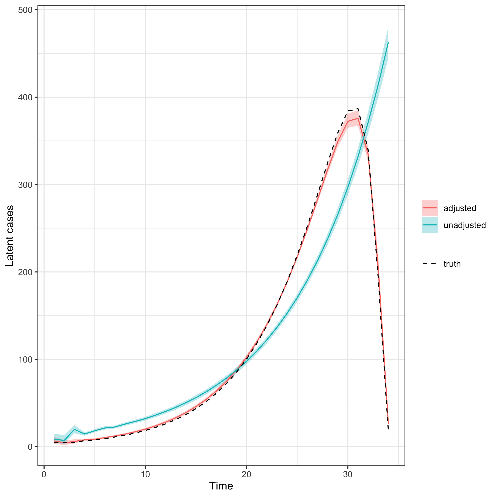
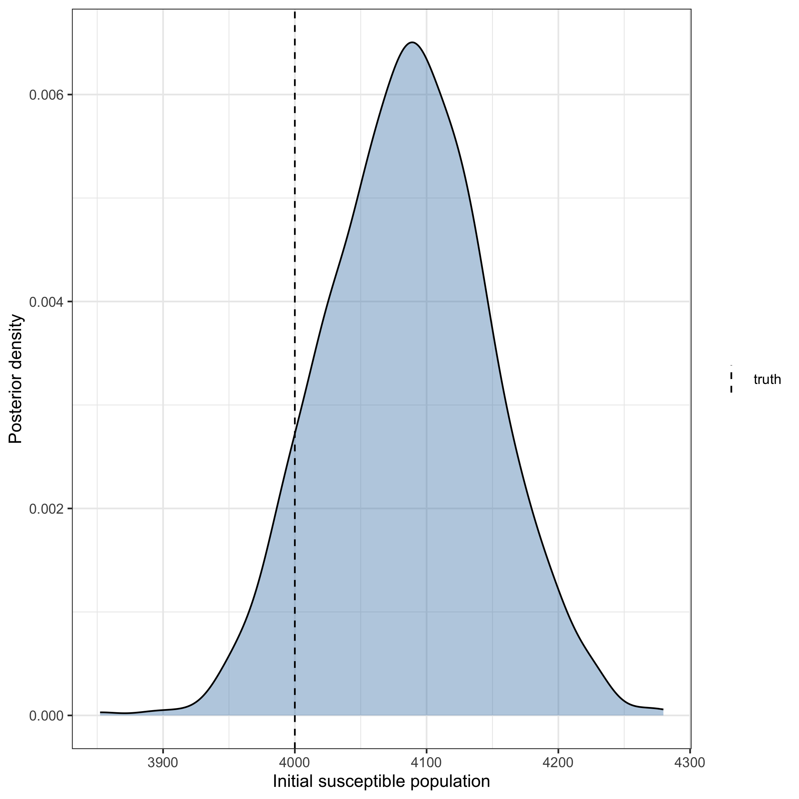

The renewal expectation model in `epinowcast` can optionally account for
susceptible depletion.
Given an initial susceptible population, transmission is scaled by the remaining
susceptible fraction, so the effective reproduction number bends down as the
pool depletes.
This vignette demonstrates the adjustment on simulated data where depletion
plays a clear role, fitting the expectation-only model with and without it.


``` r
library(epinowcast)
library(data.table)
library(ggplot2)

set.seed(2024)
```

## A depleting epidemic on simulated data

We simulate a single well-mixed population of `N = 4000` susceptibles seeded
with a few cases and driven by a renewal process with a fixed generation time
and a constant reproduction number.
Because the population is small, the susceptible pool is depleted over the
epidemic, so the wave peaks and then declines even though transmissibility is
constant.
We observe the wave to near completion, so the realised final size is
informative about the susceptible population.


``` r
simulate_depleting <- function(population, rt, generation_time, n_days,
                                seed_cases = 5) {
  gt_n <- length(generation_time)
  rgt <- rev(generation_time)
  inc <- rep(seed_cases, n_days)
  cum_cases <- sum(inc[seq_len(gt_n)])
  for (i in (gt_n + 1):n_days) {
    infectiousness <- sum(inc[(i - gt_n):(i - 1)] * rgt)
    remaining <- max(0, population - cum_cases)
    inc[i] <- remaining * (1 - exp(-rt * infectiousness / max(1, remaining)))
    cum_cases <- cum_cases + inc[i]
  }
  list(incidence = inc, attack_size = cum_cases)
}

population <- 4000
gt <- c(0.3, 0.4, 0.3)
sim <- simulate_depleting(population, rt = 1.4, generation_time = gt,
                          n_days = 34)

obs <- data.table(
  reference_date = as.Date("2021-01-01") + seq_along(sim$incidence) - 1,
  confirm = rpois(length(sim$incidence), sim$incidence)
)
obs[, report_date := reference_date]
```

The realised attack size consumes almost the whole population, so depletion
drives the dynamics and the wave is not explained by transmissibility alone.

## Preprocessing

We treat the simulated counts as fully reported (no reporting delay) so the
expectation model is the only component being tested.


``` r
pobs <- enw_preprocess_data(
  enw_complete_dates(obs, max_delay = 2), max_delay = 2
)
```

## Fitting with and without susceptible depletion

We fit the same renewal model twice: once with the susceptible-depletion
adjustment (`population = N`) and once without it (the default).
Both use a constant reproduction number (`~1`), matching the data-generating
process, so the only way the unadjusted model can explain the observed slowdown
is by inferring a lower reproduction number than the truth.


``` r
fit_opts <- enw_fit_opts(
  save_warmup = FALSE, pp = FALSE, chains = 2,
  iter_warmup = 500, iter_sampling = 500, adapt_delta = 0.95,
  max_treedepth = 12, show_messages = FALSE, refresh = 0
)

nowcast_adjusted <- epinowcast(
  pobs,
  expectation = enw_expectation(
    r = ~1, generation_time = gt, population = population, data = pobs
  ),
  obs = enw_obs(family = "poisson", data = pobs),
  fit = fit_opts
)

nowcast_unadjusted <- epinowcast(
  pobs,
  expectation = enw_expectation(
    r = ~1, generation_time = gt, data = pobs
  ),
  obs = enw_obs(family = "poisson", data = pobs),
  fit = fit_opts
)
```

## Estimated latent epidemic

We plot the full posterior of latent cases as a 90% credible ribbon rather than
a single point estimate, so the spread of plausible trajectories is visible.
The simulated truth is overlaid for comparison.
The adjusted model recovers the wave by attributing the peak and decline to a
shrinking susceptible pool.
The unadjusted model has a constant reproduction number and no depletion, so it
cannot produce a peak and instead compromises between the growth and the decline,
biasing its reconstruction of the latent epidemic.


``` r
latent_posterior <- function(nowcast, label) {
  draws <- posterior::as_draws_matrix(
    nowcast$fit[[1]]$draws("exp_llatent")
  )
  cases <- exp(draws)
  data.table(
    model = label,
    time = seq_len(ncol(cases)),
    median = apply(cases, 2, median),
    lower = apply(cases, 2, quantile, 0.05),
    upper = apply(cases, 2, quantile, 0.95)
  )
}

latent <- rbind(
  latent_posterior(nowcast_adjusted, "adjusted"),
  latent_posterior(nowcast_unadjusted, "unadjusted")
)
truth <- data.table(
  time = seq_along(sim$incidence), incidence = sim$incidence
)

ggplot(latent, aes(x = time)) +
  geom_ribbon(
    aes(ymin = lower, ymax = upper, fill = model), alpha = 0.3
  ) +
  geom_line(aes(y = median, colour = model)) +
  geom_line(
    data = truth, aes(y = incidence, linetype = "truth"),
    colour = "black"
  ) +
  scale_linetype_manual(values = c(truth = "dashed")) +
  labs(
    x = "Time", y = "Latent cases", colour = NULL, fill = NULL,
    linetype = NULL
  ) +
  theme_bw()
```



## Fitting an uncertain population

When the initial susceptible population is unknown, it can be estimated by
setting `population_uncertain = TRUE`.
`population` then provides the median of a LogNormal prior with coefficient of
variation `population_cv`.


``` r
nowcast_uncertain <- epinowcast(
  pobs,
  expectation = enw_expectation(
    r = ~1, generation_time = gt, population = population,
    population_uncertain = TRUE, population_cv = 0.5, data = pobs
  ),
  obs = enw_obs(family = "poisson", data = pobs),
  fit = fit_opts
)
```

We plot the full posterior of the estimated population against the true value
used to simulate the data.
The posterior concentrates around the truth, showing the population is
recovered from the depletion signal alone.


``` r
pop_draws <- data.table(
  pop_est = as.numeric(
    posterior::as_draws_matrix(
      nowcast_uncertain$fit[[1]]$draws("expr_pop_est")
    )
  )
)

ggplot(pop_draws, aes(x = pop_est)) +
  geom_density(fill = "steelblue", alpha = 0.4) +
  geom_vline(
    aes(xintercept = population, linetype = "truth"), colour = "black"
  ) +
  scale_linetype_manual(values = c(truth = "dashed")) +
  labs(
    x = "Initial susceptible population", y = "Posterior density",
    linetype = NULL
  ) +
  theme_bw()
```



## Assumptions

The adjustment assumes a single well-mixed population per group with no waning
of immunity and no births or deaths, so the susceptible pool is only ever
depleted by modelled latent cases.
It applies only to the renewal path (`length(generation_time) > 1`).
The [model vignette](model.html) describes the adjustment and gives the
references for the susceptible-depletion form it follows.
See `?enw_expectation` for the `population`, `population_floor`,
`population_uncertain`, and `population_cv` arguments.
