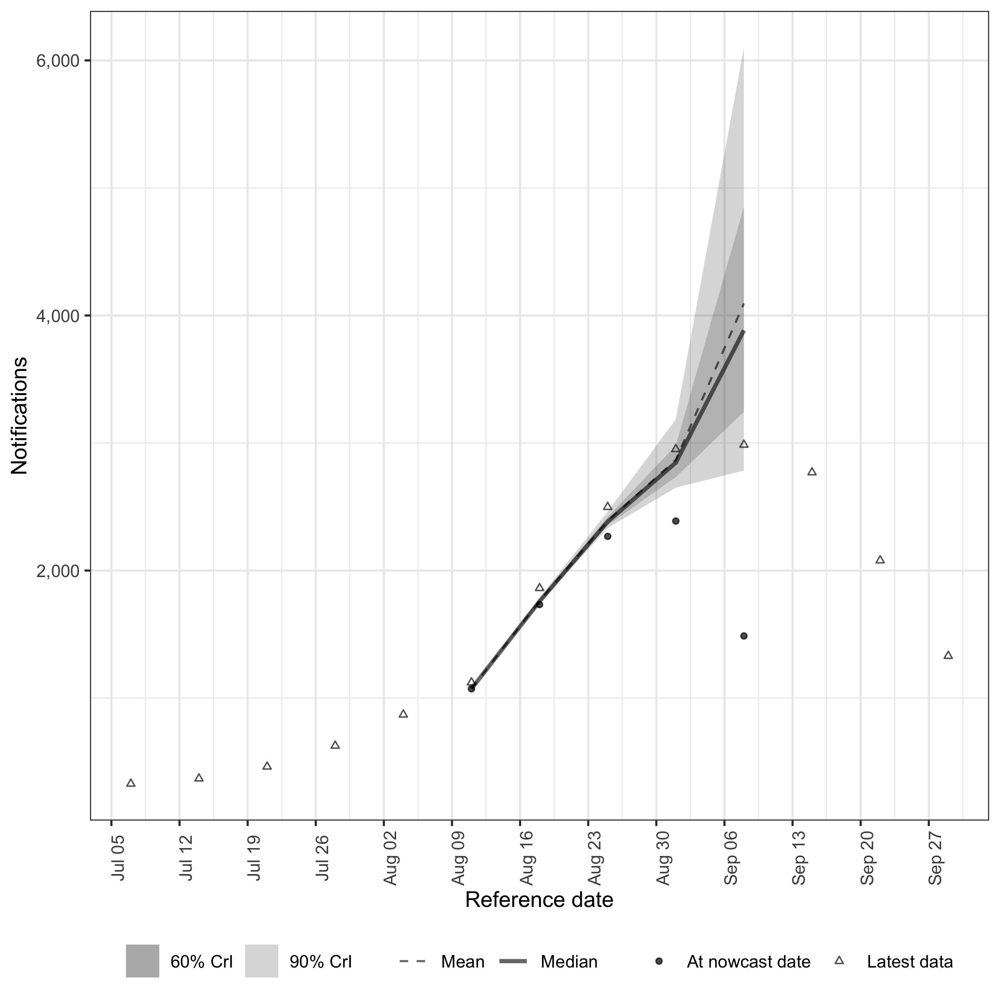
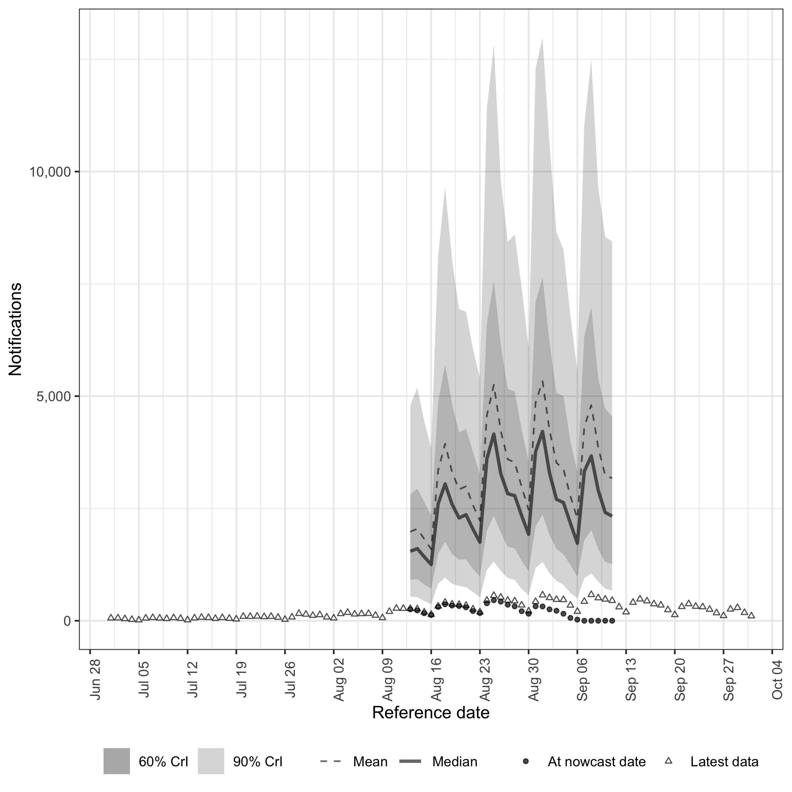
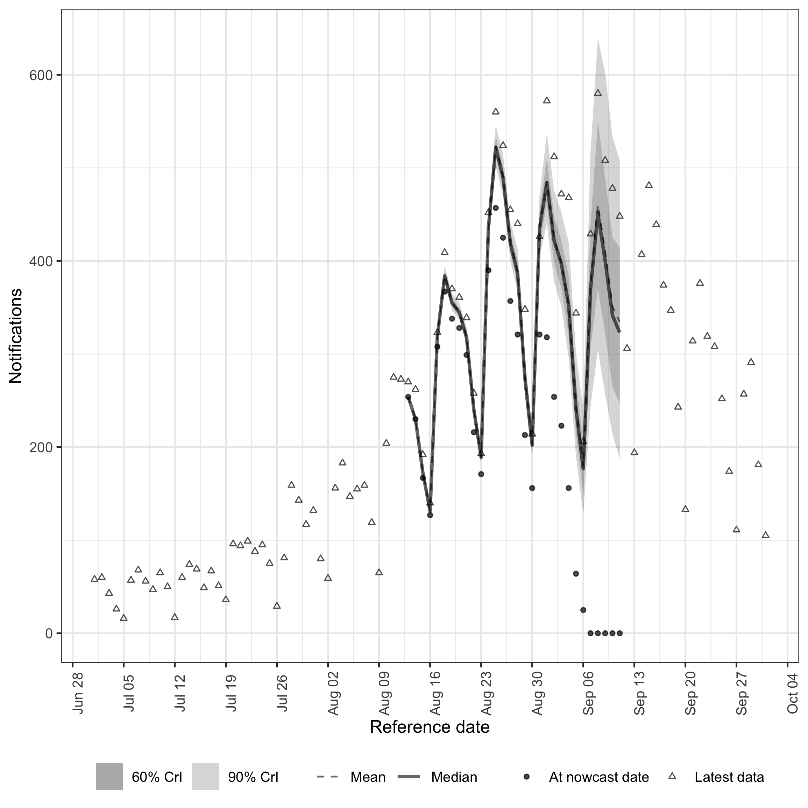
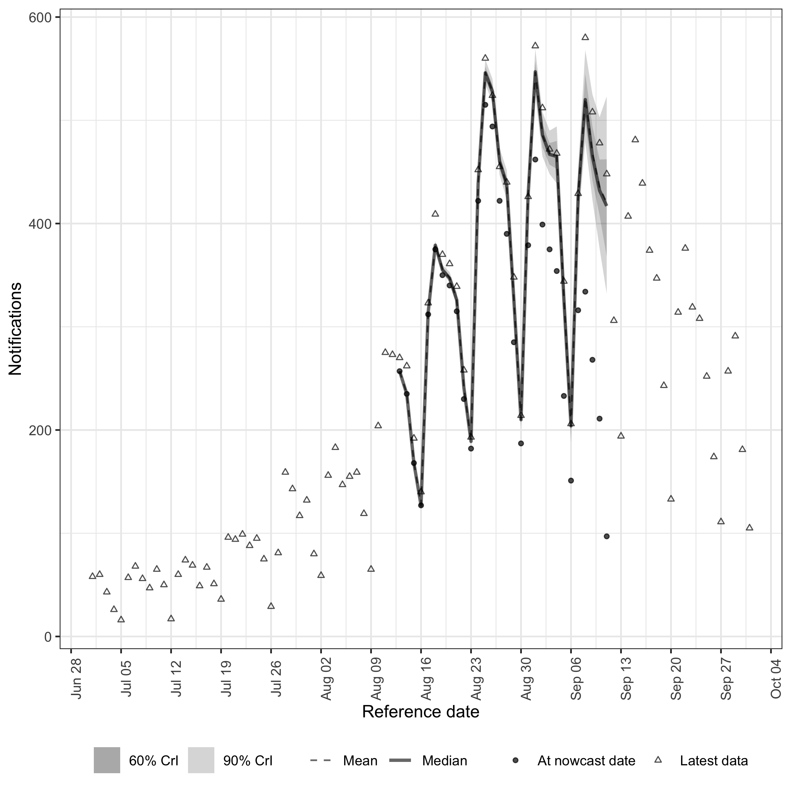

Real-time surveillance data are often reported at a coarser timestep than the process being modelled.
This vignette walks through the three patterns `epinowcast` supports for handling this and compares them on the same series so you can see what is gained or lost at each level of aggregation.

The patterns covered are:

- **Weekly timestep.** Both observations and the underlying process are modelled at a weekly resolution.
- **Daily process with weekly reporting.** Observations only arrive on one day per week but the latent process is daily.
- **Daily timestep.** Both observations and the underlying process are daily.

We fit four models in total, including two variants of the weekly-reporting case (one that fits day-of-week reporting, one that fixes it via a structural assumption), and compare them visually and using the continuous ranked probability score (CRPS) from `scoringutils`.

# Packages


``` r
library(epinowcast)
library(data.table)
library(purrr)
library(ggplot2)
library(scoringutils)
library(knitr)
```


``` r
options(mc.cores = 2)
```

# Data

We use the German COVID-19 hospitalisation data shipped with `epinowcast`, restricted to all-age national counts.
Reference dates are limited to a three-month window so the four models all run in a few minutes each.


``` r
nat_germany_hosp <- germany_covid19_hosp[
  location == "DE" & age_group == "00+"
][, c("location", "age_group") := NULL]

nat_germany_hosp <- enw_filter_report_dates(
  nat_germany_hosp, latest_date = "2021-10-01"
)
nat_germany_hosp <- enw_filter_reference_dates(
  nat_germany_hosp, earliest_date = "2021-07-01"
)
```

We keep two views of the same series.
The daily view is used directly by approaches 2 and 3 (daily process, weekly reporting) and approach 4 (daily benchmark).
The weekly view, produced by `enw_aggregate_cumulative()`, is used by approach 1.


``` r
daily_data <- enw_complete_dates(nat_germany_hosp, timestep = "day")
weekly_data <- enw_aggregate_cumulative(nat_germany_hosp, timestep = "week")
```

Latest observations for each scale are extracted to act as the evaluation target.


``` r
latest_obs_daily <- enw_latest_data(daily_data)
latest_obs_weekly <- enw_latest_data(weekly_data)
```

A common fit configuration is reused across the four models.


``` r
fit <- enw_fit_opts(
  save_warmup = FALSE, pp = TRUE,
  chains = 2, iter_warmup = 250, iter_sampling = 500,
  max_treedepth = 12, init_method = "prior",
  show_messages = interactive(), refresh = 0
)
```

# Approach 1: Weekly timestep

When data are only available aggregated to weeks and a daily process is not required, the simplest approach is to model both observations and process at a weekly resolution.
A maximum delay of five weeks is used and the expected count is given a random walk on the week index.


``` r
pobs_weekly <- weekly_data |>
  enw_complete_dates(timestep = "week") |>
  enw_filter_report_dates(remove_days = 20) |>
  enw_filter_reference_dates(include_days = 90) |>
  enw_preprocess_data(max_delay = 5, timestep = "week")
```


``` r
nowcast_weekly <- epinowcast(
  pobs_weekly,
  expectation = enw_expectation(~ rw(week), data = pobs_weekly),
  obs = enw_obs(family = "negbin", data = pobs_weekly),
  fit = fit
)
```


``` r
plot(nowcast_weekly, latest_obs = latest_obs_weekly)
```

<div class="figure">

<p class="caption">Weekly nowcast on the weekly scale.</p>
</div>

# Approach 2: Daily process, weekly reporting (fitted day-of-week)

A common situation is data that are only updated once per week but where decisions are made at a daily resolution.
Here the underlying process is modelled daily, weekly reporting is encoded by setting all non-Monday confirmed counts to `NA`, and the day of the week is included as a random effect in the report model so reporting can still be learned from the data.

We first build the reporting scaffold.
The cumulative count `confirm` is kept on Mondays and set to `NA` elsewhere, `.observed` is flagged so the likelihood ignores rows without observations, and `enw_impute_na_observations()` carries forward the most recent Monday value so the data has a complete daily grid.


``` r
weekly_rep_data <- copy(daily_data)
weekly_rep_data[, day_of_week := weekdays(report_date)]
weekly_rep_data[
  , confirm := fifelse(day_of_week == "Monday", confirm, NA_real_)
]
weekly_rep_data <- weekly_rep_data |>
  enw_flag_observed_observations() |>
  enw_impute_na_observations() |>
  enw_filter_reference_dates_by_report_start() |>
  enw_add_incidence()
```


``` r
pobs_weekly_rep <- weekly_rep_data |>
  enw_complete_dates(timestep = "day") |>
  enw_filter_report_dates(remove_days = 20) |>
  enw_filter_reference_dates(include_days = 90) |>
  enw_preprocess_data(max_delay = 30, timestep = "day")
```


``` r
exp_weekly_rep <- enw_expectation(
  ~ rw(week) + (1 | day_of_week), data = pobs_weekly_rep
)
nowcast_weekly_rep <- epinowcast(
  pobs_weekly_rep,
  expectation = exp_weekly_rep,
  report = enw_report(~ (1 | day_of_week), data = pobs_weekly_rep),
  obs = enw_obs(
    family = "negbin", observation_indicator = ".observed",
    data = pobs_weekly_rep
  ),
  fit = fit
)
```


``` r
plot(nowcast_weekly_rep, latest_obs = latest_obs_daily)
```

<div class="figure">

<p class="caption">Daily-scale nowcast with weekly reporting where day-of-week reporting is fitted.</p>
</div>

# Approach 3: Daily process, weekly reporting (structural)

The same scaffold can be combined with a structural assumption that all reporting is concentrated on a known day of the week.
This is appropriate when reporting is genuinely deterministic and removes the need to fit a day-of-week effect.
`enw_dayofweek_structural_reporting()` constructs the relevant matrix and `enw_report()` is supplied with `structural` instead of a formula.


``` r
structural <- enw_dayofweek_structural_reporting(
  pobs_weekly_rep, day_of_week = "Monday"
)
nowcast_weekly_rep_structural <- epinowcast(
  pobs_weekly_rep,
  expectation = exp_weekly_rep,
  report = enw_report(structural = structural, data = pobs_weekly_rep),
  obs = enw_obs(
    family = "negbin", observation_indicator = ".observed",
    data = pobs_weekly_rep
  ),
  fit = fit
)
```


``` r
plot(nowcast_weekly_rep_structural, latest_obs = latest_obs_daily)
```

<div class="figure">

<p class="caption">Daily-scale nowcast with weekly reporting where reporting is fixed to Mondays.</p>
</div>

# Approach 4: Daily timestep

For comparison we fit the same process model to the un-aggregated daily data.
Reporting can vary across all seven days of the week and the model is otherwise specified identically to approaches 2 and 3.


``` r
pobs_daily <- daily_data |>
  enw_filter_report_dates(remove_days = 20) |>
  enw_filter_reference_dates(include_days = 90) |>
  enw_preprocess_data(max_delay = 30, timestep = "day")
```


``` r
nowcast_daily <- epinowcast(
  pobs_daily,
  expectation = enw_expectation(
    ~ rw(week) + (1 | day_of_week), data = pobs_daily
  ),
  report = enw_report(~ (1 | day_of_week), data = pobs_daily),
  obs = enw_obs(family = "negbin", data = pobs_daily),
  fit = fit
)
```


``` r
plot(nowcast_daily, latest_obs = latest_obs_daily)
```

<div class="figure">

<p class="caption">Daily benchmark nowcast.</p>
</div>

# Comparison

We score the models in two pairs to keep the comparison apples-to-apples.
The weekly model and the daily benchmark predict at different temporal resolutions but can both be summarised to the Wednesday-ending weekly bins produced by `enw_aggregate_cumulative()`.
The two daily-process / weekly-reporting variants share an identical scaffold and likelihood, so we compare them directly on the Monday observations they fit.


``` r
ceiling_to_weekly_bin <- function(x) {
  x <- as.Date(x)
  weekday <- as.integer(format(x, "%u"))
  x + ((3L - weekday) %% 7L)
}

daily_samples_to_weekly <- function(nowcast) {
  samples <- as.data.table(summary(nowcast, type = "nowcast_samples"))
  samples[, reference_week := ceiling_to_weekly_bin(reference_date)]
  samples[, .(sample = sum(sample)), by = c("reference_week", ".draw")]
}

weekly_truth <- latest_obs_weekly[, .(
  reference_week = as.Date(reference_date), observed = confirm
)]

scored_weekly <- map_dfr(
  list(
    "Weekly timestep" = as.data.table(
      summary(nowcast_weekly, type = "nowcast_samples")
    )[, .(reference_week = as.Date(reference_date), .draw, sample)],
    "Daily benchmark" = daily_samples_to_weekly(nowcast_daily)
  ),
  ~ merge(.x, weekly_truth, by = "reference_week"),
  .id = "model"
) |>
  as_forecast_sample(
    observed = "observed", predicted = "sample", sample_id = ".draw"
  ) |>
  score()
```


``` r
scored_weekly |>
  summarise_scores(by = "model") |>
  summarise_scores(fun = signif, digits = 2, by = "model") |>
  kable()
```


|model           |  bias|  dss| crps| overprediction| underprediction| dispersion| log_score| mad| ae_median| se_mean|
|:---------------|-----:|----:|----:|--------------:|---------------:|----------:|---------:|---:|---------:|-------:|
|Weekly timestep | -0.54|  NaN|  180|             74|              49|       54.0|       Inf| 220|       250|  250000|
|Daily benchmark | -0.87| 2900|  380|              0|             370|        9.3|       Inf|  39|       400|  450000|


For the daily-process / weekly-reporting variants we score the Monday observations they fit against the latest available daily counts.


``` r
monday_truth <- latest_obs_daily[
  weekdays(reference_date) == "Monday",
  .(reference_date = as.Date(reference_date), observed = confirm)
]

monday_samples <- function(nowcast) {
  samples <- as.data.table(summary(nowcast, type = "nowcast_samples"))
  samples[, reference_date := as.Date(reference_date)]
  samples[
    weekdays(reference_date) == "Monday",
    .(reference_date, .draw, sample)
  ]
}

scored_monday <- map_dfr(
  list(
    "Daily process, weekly reporting (fitted)" =
      monday_samples(nowcast_weekly_rep),
    "Daily process, weekly reporting (structural)" =
      monday_samples(nowcast_weekly_rep_structural)
  ),
  ~ merge(.x, monday_truth, by = "reference_date"),
  .id = "model"
) |>
  as_forecast_sample(
    observed = "observed", predicted = "sample", sample_id = ".draw"
  ) |>
  score()
```


``` r
scored_monday |>
  summarise_scores(by = "model") |>
  summarise_scores(fun = signif, digits = 2, by = "model") |>
  kable()
```


|model                                        |  bias| dss|  crps| overprediction| underprediction| dispersion| log_score|   mad| ae_median| se_mean|
|:--------------------------------------------|-----:|---:|-----:|--------------:|---------------:|----------:|---------:|-----:|---------:|-------:|
|Daily process, weekly reporting (fitted)     |  1.00|  23| 19000|          16000|               0|       2800|      14.0| 11000|     24000| 7.3e+08|
|Daily process, weekly reporting (structural) | -0.68|  13|    68|              0|              39|         29|       6.5|   120|       110| 1.6e+04|


The pure weekly model trades resolution for speed and is competitive when only weekly counts matter.
The daily benchmark provides the upper bound on what the data can support when daily data are available.
Among the daily-process / weekly-reporting variants the structural variant is well-calibrated and tracks the Monday observations closely, while the fitted variant struggles to identify a free day-of-week reporting effect from Monday-only observations and ends up much wider and more biased.

# Choosing an approach

- Use the **weekly timestep** when only weekly counts are available or required.
  It is the cheapest option and avoids encoding reporting structure.
- Use a **daily process with weekly reporting** when daily inference is the goal but reporting only happens once a week.
  Pick the structural variant when you can commit to a known reporting day, and the fitted variant otherwise.
- Use the **daily timestep** when daily data are available and daily resolution is required for downstream decisions.

See `vignette("epinowcast")` for the default daily walk-through and `vignette("inference-methods")` for the inference options that apply equally to all four approaches.
